# AutoProjectManagement Package - Comprehensive Documentation

## Overview

AutoProjectManagement is a sophisticated Python-based project management system that automates software project workflows with deep integration into GitHub and Visual Studio Code. This package provides comprehensive project management capabilities including task automation, progress tracking, resource allocation, and real-time reporting.

## System Architecture

### High-Level Architecture Diagram

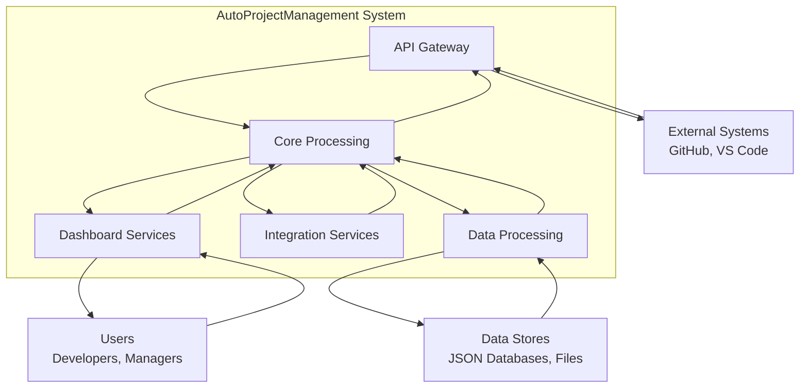

### Core Components

1. **API Gateway**: Handles HTTP, WebSocket, and SSE endpoints with authentication and validation
2. **Core Processing**: Manages project, task, resource, risk, and progress management
3. **Dashboard Services**: Provides real-time UI updates, metrics, alerts, and layout management
4. **Integration Services**: Handles GitHub, VS Code, Wiki, and external API integrations
5. **Data Processing**: Manages data collection, transformation, validation, and storage

## Data Flow Diagrams

### Level 0: Context Diagram

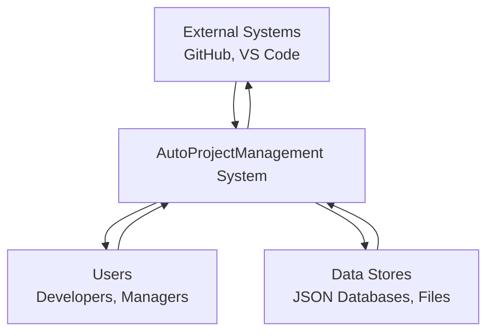

### Level 1: System Overview

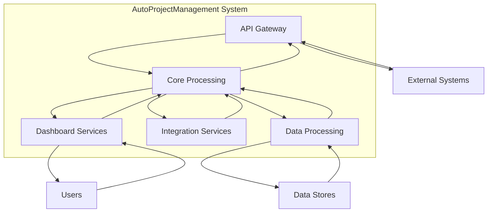

### Level 2: Core Processing Data Flow

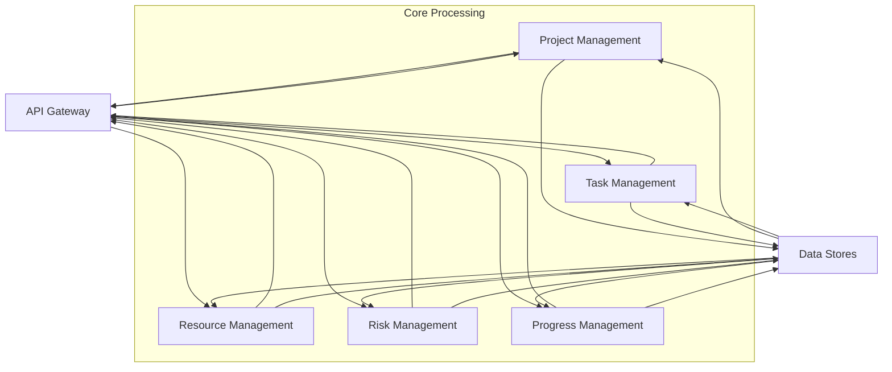

## Business Process Diagrams (BPMN)

### Project Management Process

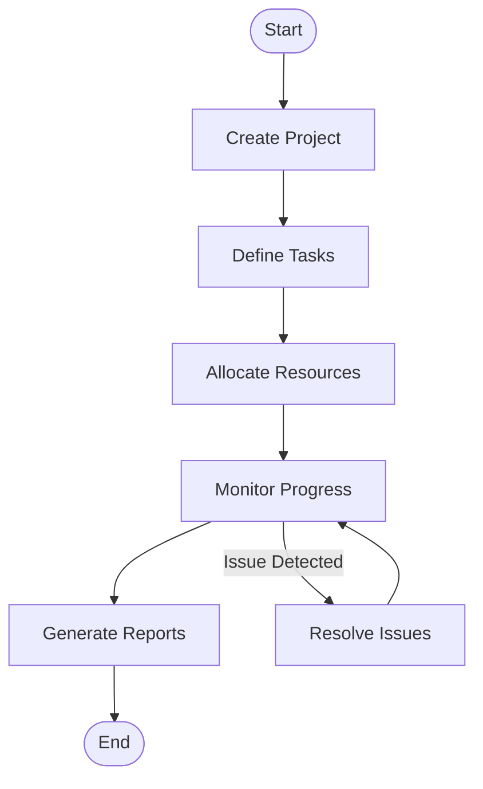

### Task Creation Process

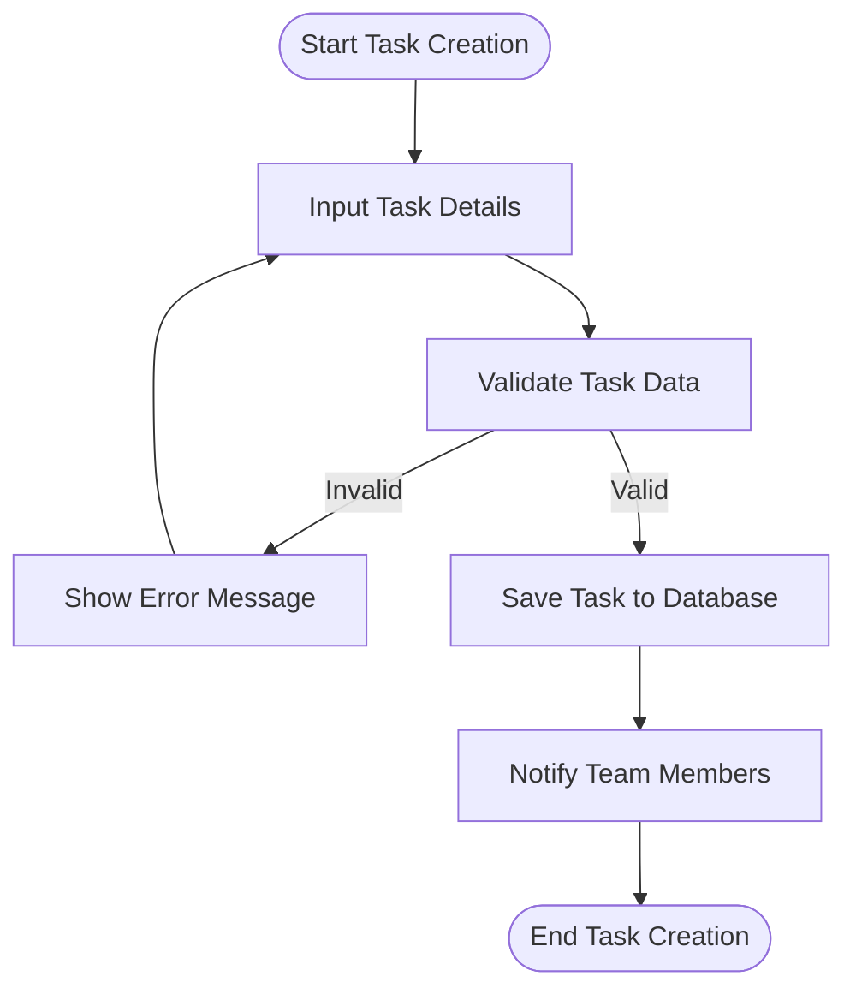

### Resource Allocation Process

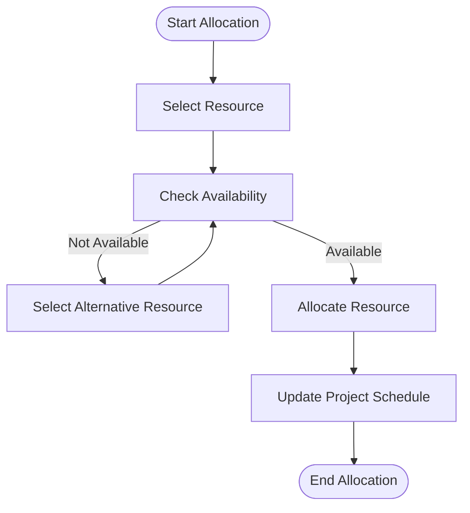

## UML Diagrams

### Class Diagram

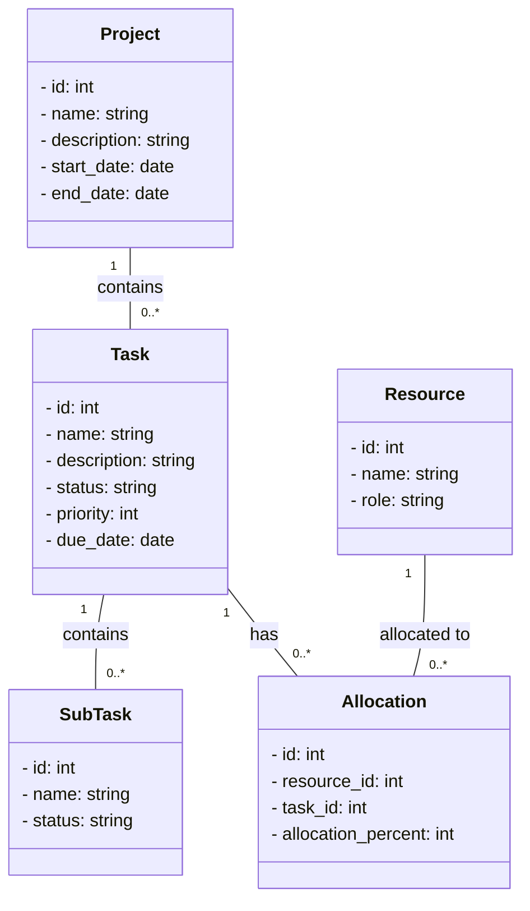

### Sequence Diagram

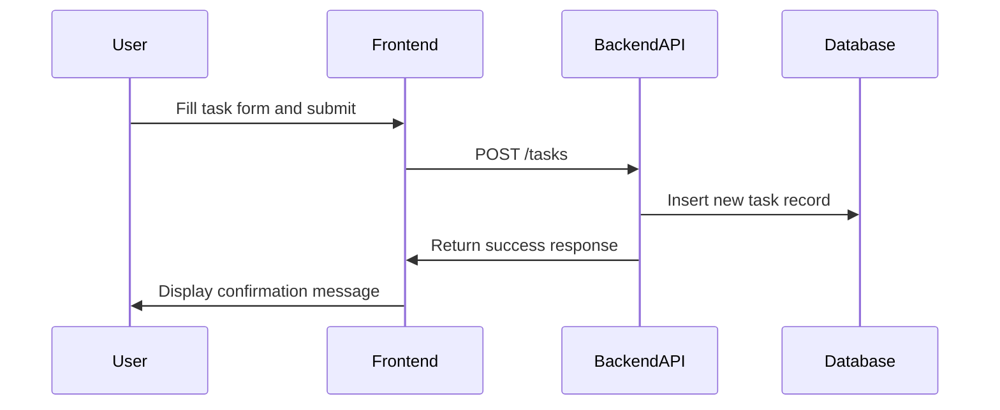

## Integration Services Architecture

### Integration Services Data Flow

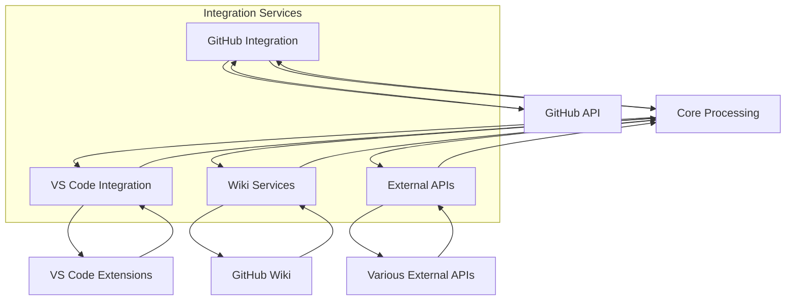

## Real-time Processing Architecture

### Real-time Event Processing

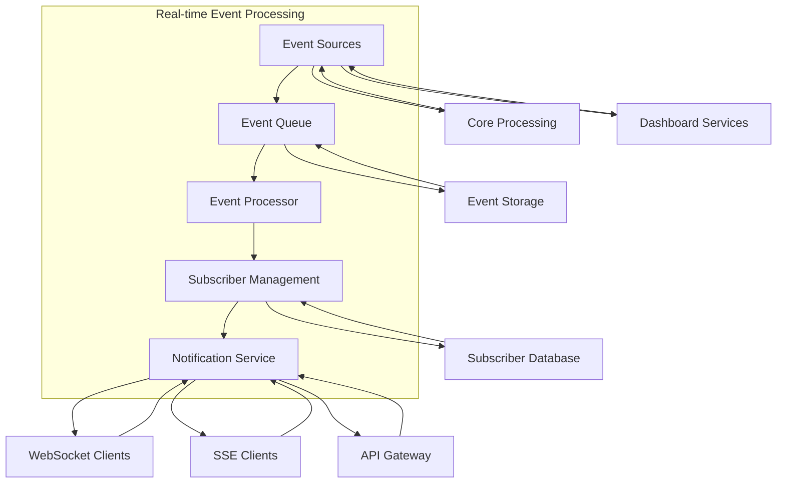

## Data Validation Process

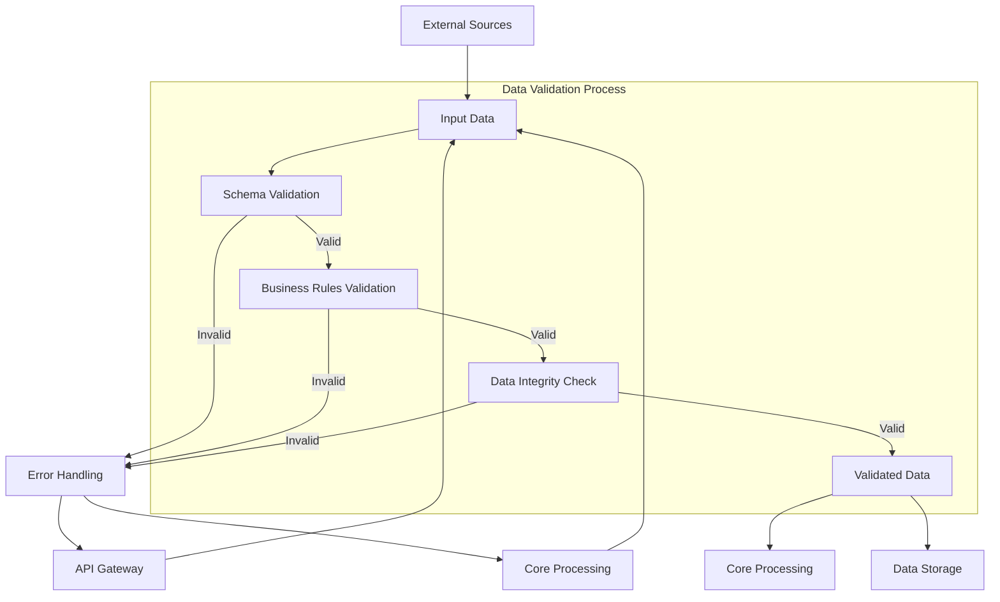

## Data Store Architecture

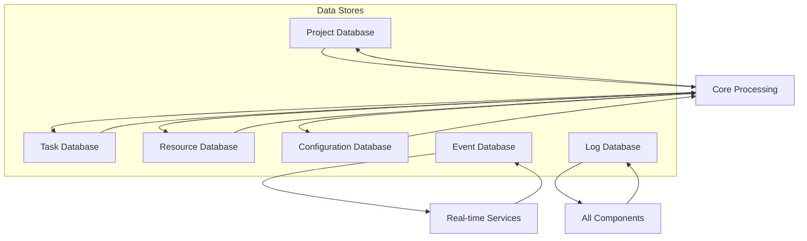

## Key Features and Capabilities

### 1. Automated Project Management
- **Task Automation**: Automatic task creation, assignment, and tracking
- **Progress Tracking**: Real-time progress monitoring based on commit history
- **Resource Management**: Dynamic resource allocation and optimization
- **Risk Management**: Proactive risk identification and mitigation

### 2. GitHub Integration
- **Issue Management**: Automatic issue creation and tracking
- **Pull Request Integration**: PR status synchronization with tasks
- **Wiki Synchronization**: Automated documentation management
- **Actions Automation**: CI/CD pipeline integration

### 3. VS Code Integration
- **Extension Development**: Custom VS Code extension for project management
- **Chat Interface**: Natural language task input and management
- **Real-time Updates**: Live project status and notifications
- **Development Environment**: Automated setup and configuration

### 4. Real-time Dashboard
- **Live Metrics**: Real-time project metrics and analytics
- **Alert System**: Proactive notifications for issues and milestones
- **Custom Layouts**: Configurable dashboard layouts
- **Data Visualization**: Interactive charts and reports

## Technical Specifications

### Programming Languages and Frameworks
- **Python 3.8+**: Core logic and backend services
- **FastAPI**: RESTful API framework
- **Mermaid.js**: Diagram generation and visualization
- **GitHub API**: External integration
- **VS Code Extension API**: Development environment integration

### Data Storage
- **JSON Files**: Primary data storage format
- **GitHub Repositories**: External data synchronization
- **Local Databases**: Project-specific data storage
- **Configuration Files**: System configuration and settings

### Development Standards
- **PEP 8 Compliance**: Python coding standards
- **API Documentation**: Comprehensive endpoint documentation
- **Testing Coverage**: Unit and integration testing
- **Documentation**: Comprehensive user and developer guides

## Installation and Setup

### Prerequisites
- Python 3.8 or higher
- Git for version control
- VS Code for development environment
- GitHub account for integration

### Installation Steps
1. Clone the repository
2. Create virtual environment
3. Install dependencies from requirements.txt
4. Configure environment variables
5. Run setup scripts
6. Start development server

## Usage Workflow

1. **Project Initialization**: Create new project with automated setup
2. **Task Definition**: Define tasks through various input methods
3. **Resource Allocation**: Assign resources to tasks automatically
4. **Progress Monitoring**: Track progress through commit history
5. **Reporting**: Generate automated reports and dashboards
6. **Integration**: Synchronize with GitHub and external systems

## Conclusion

The AutoProjectManagement package represents a comprehensive solution for automated software project management. With its modular architecture, extensive integration capabilities, and real-time features, it provides a robust foundation for managing complex software projects efficiently.

The system's strength lies in its ability to automate repetitive tasks, provide real-time insights, and integrate seamlessly with development tools like GitHub and VS Code, making it an invaluable tool for modern software development teams.
