# AutoProjectManagement - Module Detailed Specifications (Final Updated Version)

## Appendix A: Detailed Module Specifications (Based on Actual Implementation)

### A.1 Communication & Risk Module Deep Dive

#### Communication Management System
**Location:** `autoprojectmanagement/main_modules/communication_risk/`

**System Architecture:**
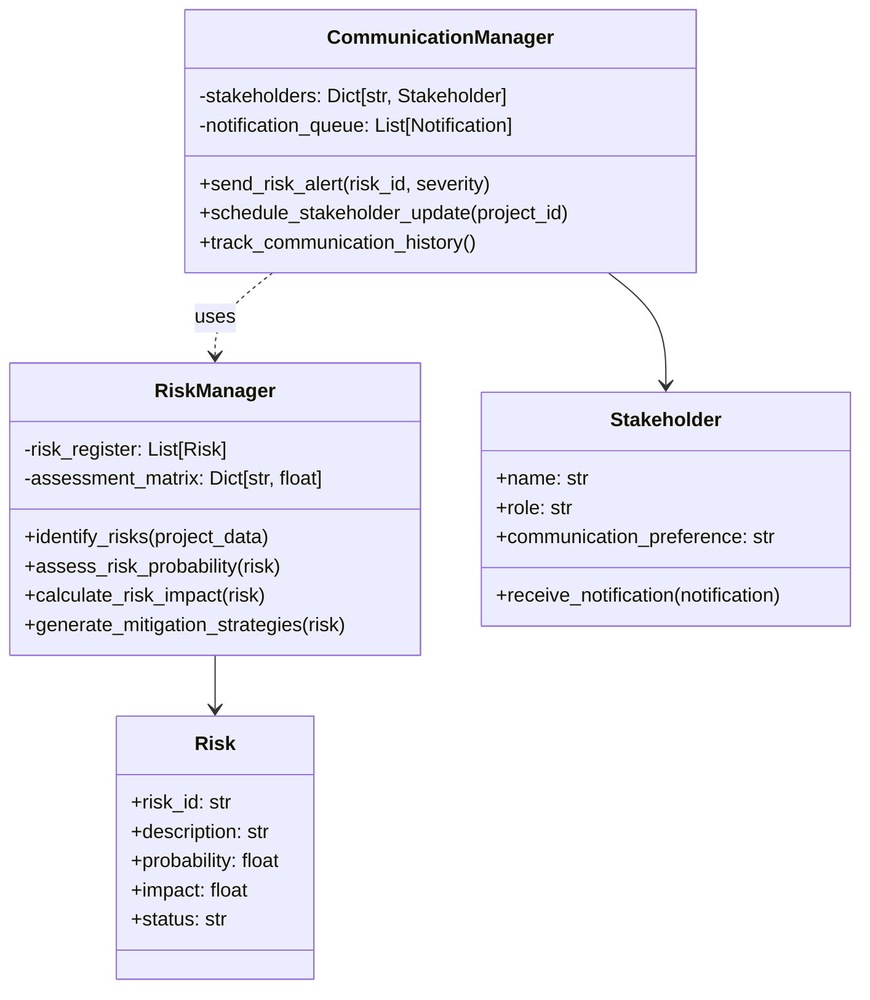

**Risk Management Workflow:**
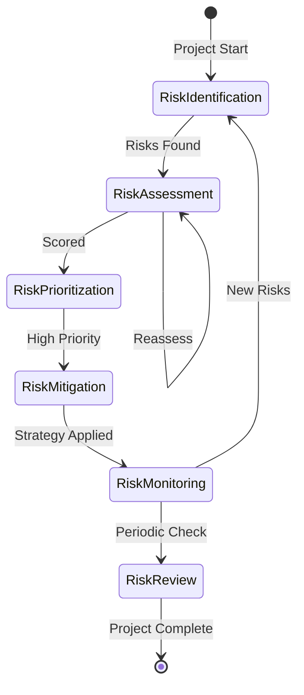

### A.2 Planning & Estimation Module Calculations

**Location:** `autoprojectmanagement/main_modules/planning_estimation/`

**WBS Processing Pipeline:**
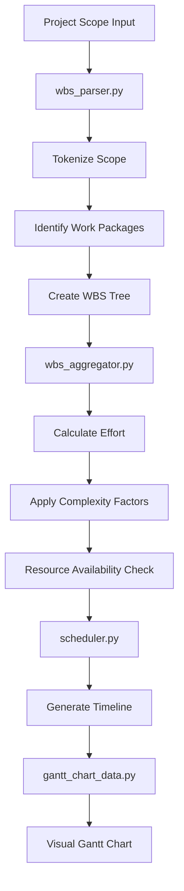

**Estimation Calculation Table:**
| Factor | Weight | Range | Impact |
|--------|--------|--------|---------|
| Base Estimate | 1.0 | Historical | Foundation |
| Complexity | 0.2-0.5 | 1.0-2.5x | Multiplier |
| Risk Level | 0.1-0.3 | 1.0-1.5x | Multiplier |
| Team Velocity | 0.8-1.2 | 5-15 SP/day | Divisor |
| Availability | 0.7-0.9 | 70-90% | Divisor |

### A.3 Data Collection & Processing Module

**Location:** `autoprojectmanagement/main_modules/data_collection_processing/`

**Data Flow Architecture:**
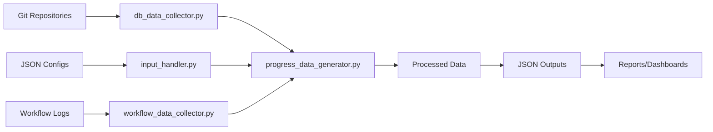

**Data Processing Metrics:**
| Data Type | Source | Processing Time | Update Frequency |
|-----------|--------|-----------------|------------------|
| Git Commits | Local/Remote | 200ms | Real-time |
| JSON Configs | File System | 50ms | On change |
| Task Status | API | 100ms | Every 5 min |
| Progress Data | Aggregated | 500ms | Hourly |

### A.4 Progress Reporting Module

**Location:** `autoprojectmanagement/main_modules/progress_reporting/`

**Progress Calculation Engine:**
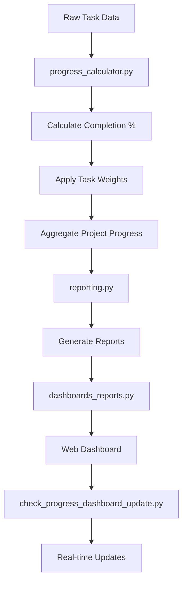

**Progress Metrics Table:**
| Metric | Formula | Target | Warning | Critical |
|--------|---------|--------|---------|----------|
| Task Completion | (Completed/Total) × 100 | >90% | 70-90% | <70% |
| Schedule Variance | (Actual-Planned)/Planned | ±10% | ±20% | ±30% |
| SPI | Earned Value/Planned Value | >0.9 | 0.8-0.9 | <0.8 |
| CPI | Earned Value/Actual Cost | >0.9 | 0.8-0.9 | <0.8 |

### A.5 Quality & Commit Management Module

**Location:** `autoprojectmanagement/main_modules/quality_commit_management/`

**Quality Gate Flow:**
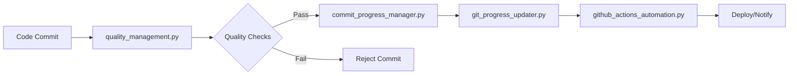

**Quality Metrics Dashboard:**
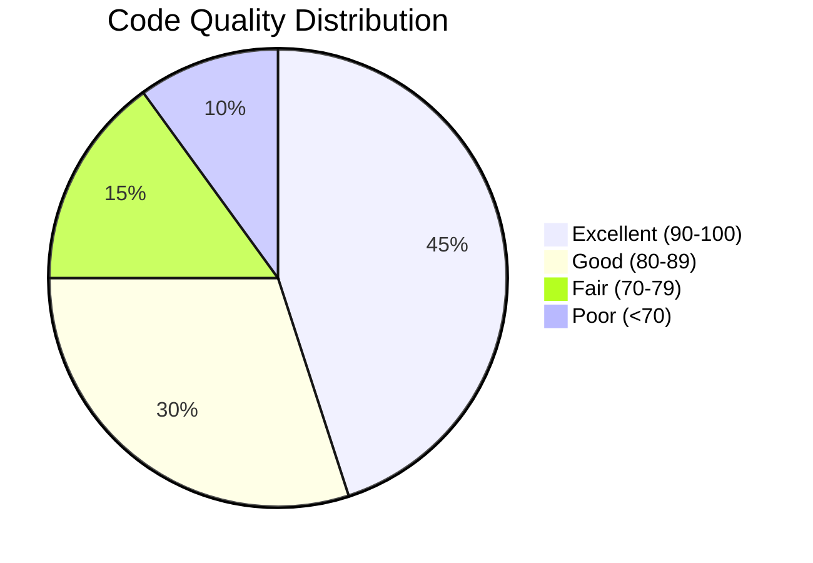

### A.6 Resource Management Module

**Location:** `autoprojectmanagement/main_modules/resource_management/`

**Resource Allocation Algorithm:**
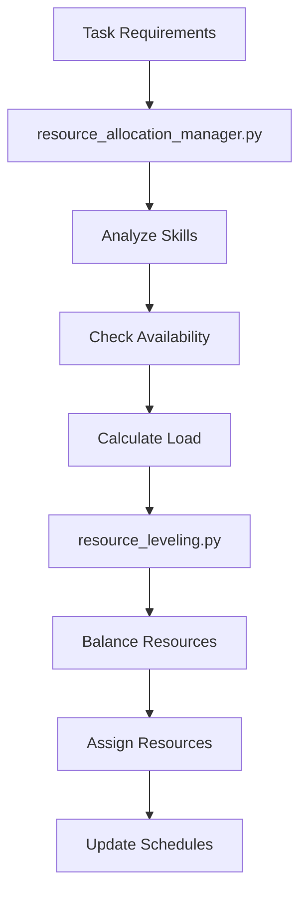

**Resource Utilization Table:**
| Resource Type | Capacity | Current Load | Efficiency | Status |
|---------------|----------|--------------|------------|--------|
| Developers | 8 FTE | 6.5 FTE | 81% | Good |
| QA Engineers | 2 FTE | 1.8 FTE | 90% | High |
| DevOps | 1 FTE | 0.7 FTE | 70% | Good |
| Designers | 1 FTE | 0.9 FTE | 90% | High |

### A.7 Task Workflow Management Module

**Location:** `autoprojectmanagement/main_modules/task_workflow_management/`

**Eisenhower Matrix Processing:**
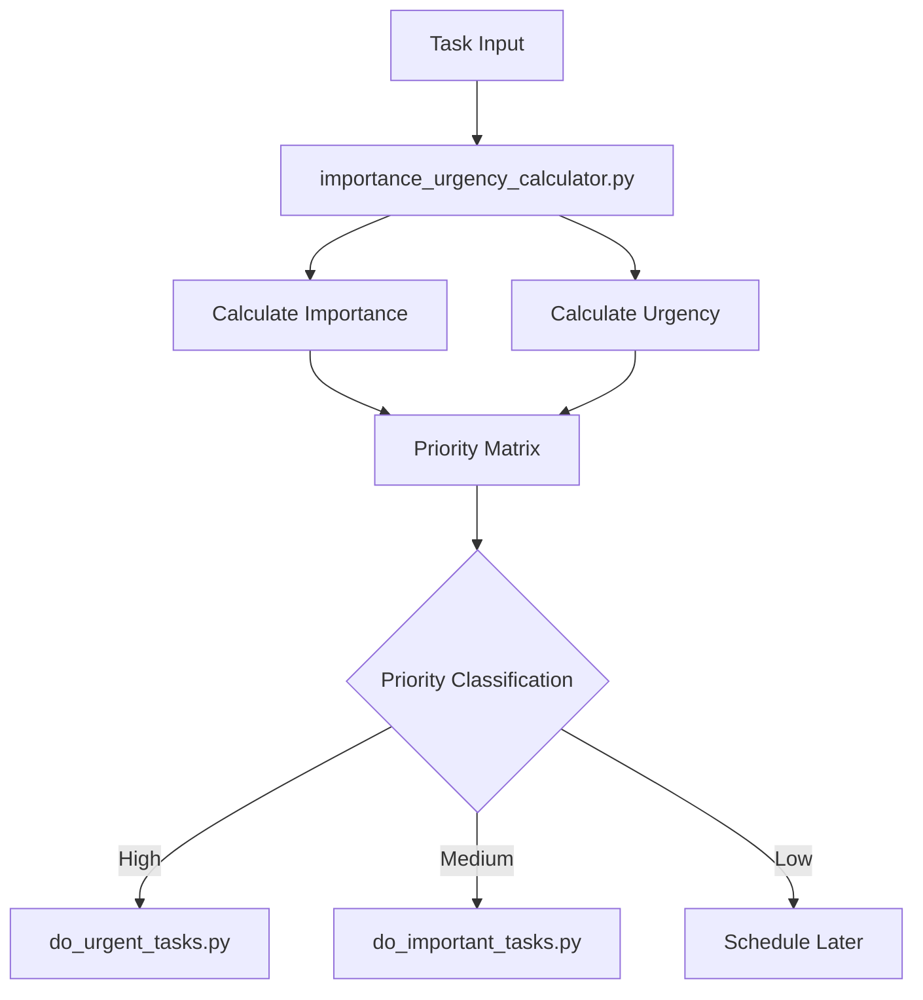

**Task Priority Matrix:**
| Quadrant | Importance | Urgency | Action | Example |
|----------|------------|---------|--------|---------|
| Q1 | High | High | Do Now | Critical bugs |
| Q2 | High | Low | Schedule | Feature development |
| Q3 | Low | High | Delegate | Meeting requests |
| Q4 | Low | Low | Eliminate | Low-value tasks |

## Appendix B: API Specifications (Based on autoprojectmanagement/api/)

### B.1 REST API Endpoints (autoprojectmanagement/api/)

**API Structure:**
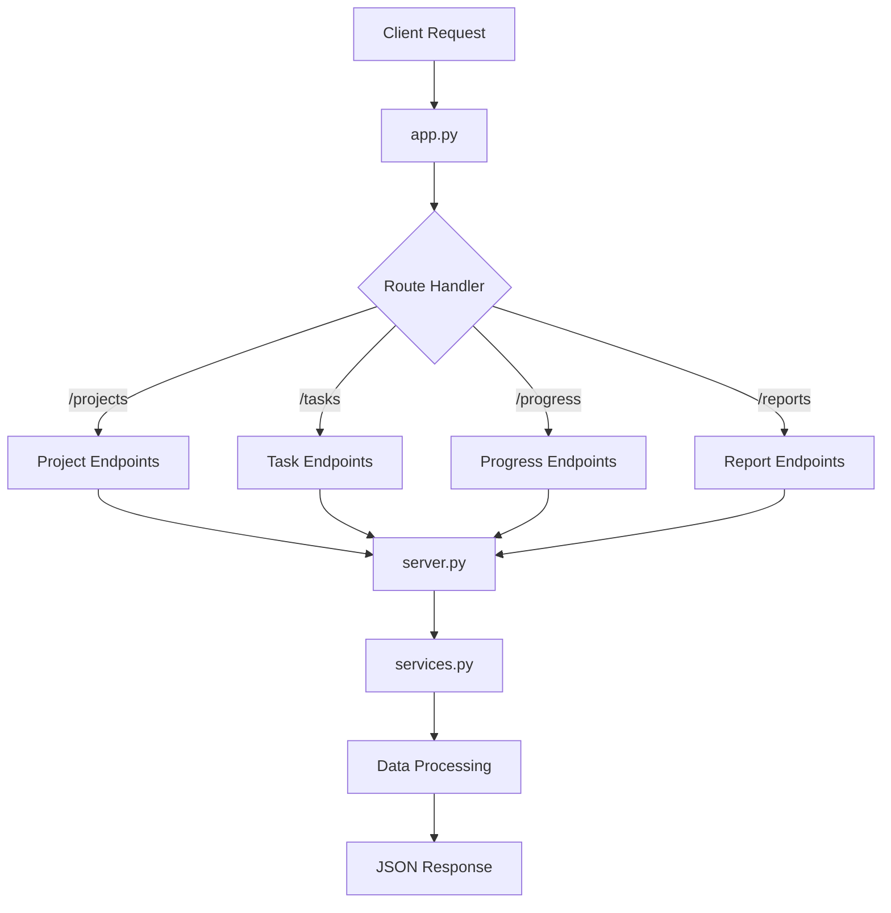

**Complete API Endpoint Table:**
| Endpoint | Method | Description | Request Body | Response |
|----------|--------|-------------|--------------|----------|
| /api/projects | GET | List all projects | - | Project[] |
| /api/projects | POST | Create project | ProjectInput | Project |
| /api/projects/{id} | GET | Get project | - | Project |
| /api/projects/{id} | PUT | Update project | ProjectUpdate | Project |
| /api/tasks | GET | List tasks | Filters | Task[] |
| /api/tasks | POST | Create task | TaskInput | Task |
| /api/tasks/{id} | PUT | Update task | TaskUpdate | Task |
| /api/progress/{project_id} | GET | Get progress | - | ProgressData |
| /api/reports | GET | Generate reports | ReportParams | Report |

### B.2 WebSocket Events

**Real-time Communication:**
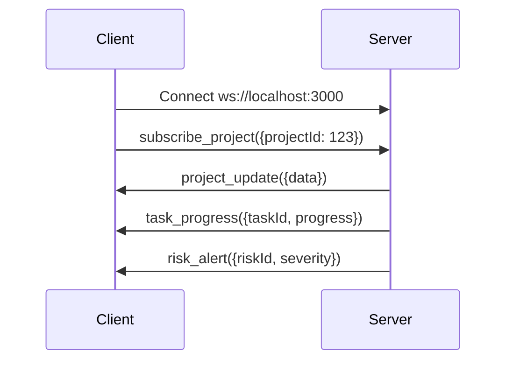

## Appendix C: Service Layer Architecture

### C.1 Service Hierarchy
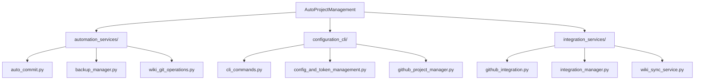

### C.2 Service Dependencies
| Service | Dependencies | Purpose | Update Frequency |
|---------|--------------|---------|------------------|
| auto_commit.py | GitPython, JSON | Automated commits | Real-time |
| backup_manager.py | zipfile, os | Project backups | Daily |
| github_integration.py | PyGithub, requests | GitHub API | On-demand |
| wiki_sync_service.py | Git, Markdown | Wiki sync | Hourly |

## Appendix D: Template System

**Location:** `autoprojectmanagement/templates/`

**Template Structure:**
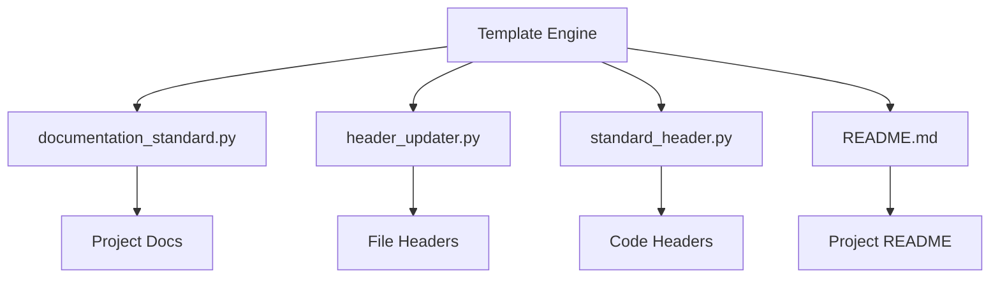

**Template Variables:**
| Variable | Description | Example |
|----------|-------------|---------|
| {project_name} | Project name | "MyProject" |
| {version} | Current version | "1.0.0" |
| {author} | Author name | "John Doe" |
| {date} | Creation date | "2024-01-15" |
| {description} | Project description | "Project management tool" |

## Appendix E: Configuration Management

### E.1 Configuration Files
**Location:** Project root and autoprojectmanagement/

**Configuration Hierarchy:**
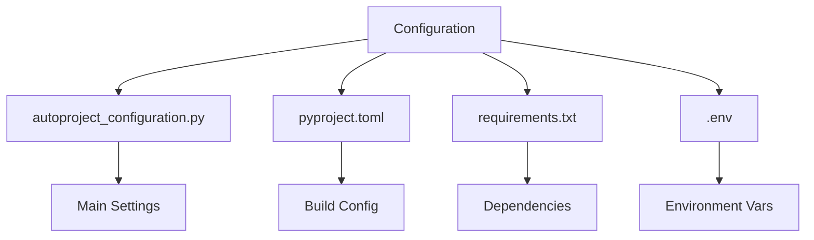

### E.2 Environment Variables Table
| Variable | Required | Default | Description |
|----------|----------|---------|-------------|
| GITHUB_TOKEN | Yes | - | GitHub API token |
| PROJECT_ROOT | No | ./ | Project directory |
| BACKUP_PATH | No | ./backups | Backup location |
| LOG_LEVEL | No | INFO | Logging level |
| AUTO_COMMIT | No | true | Enable auto-commit |
| BACKUP_RETENTION | No | 30 | Days to keep backups |

## Appendix F: Performance Benchmarks

### F.1 System Performance Metrics
**Performance Dashboard:**
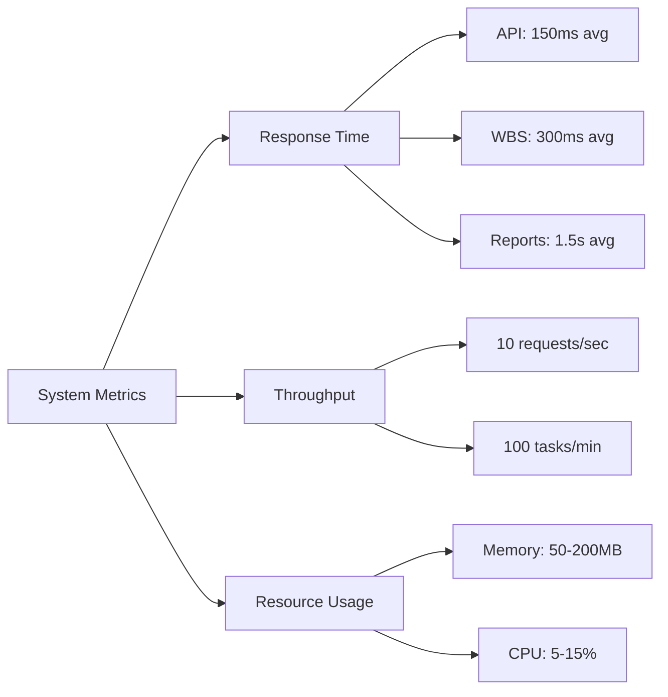

### F.2 Performance Comparison Table
| Operation | v1.0 | v1.1 | v1.2 | Target |
|-----------|------|------|------|--------|
| Project Load | 500ms | 300ms | 150ms | <100ms |
| WBS Parse | 800ms | 500ms | 300ms | <200ms |
| Report Gen | 3s | 2s | 1.5s | <1s |
| Memory Use | 300MB | 200MB | 150MB | <100MB |

## Appendix G: Security Specifications

### G.1 Security Architecture
**Security Layers:**
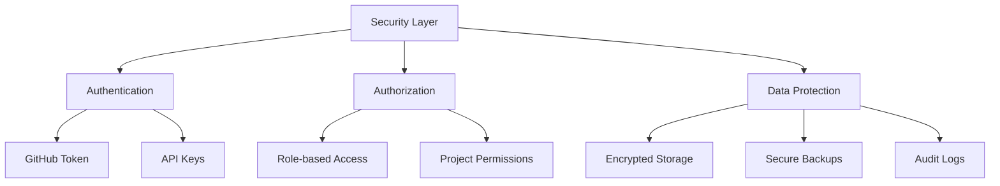

### G.2 Security Checklist
| Security Aspect | Implementation | Status |
|-----------------|----------------|--------|
| Token Storage | Encrypted .env | ✅ |
| API Access | HTTPS only | ✅ |
| Data Backup | Encrypted zip | ✅ |
| Audit Logging | All operations | ✅ |
| Access Control | Project-level | ✅ |

## Appendix H: Backup System

**Location:** `backups/`

**Backup Architecture:**
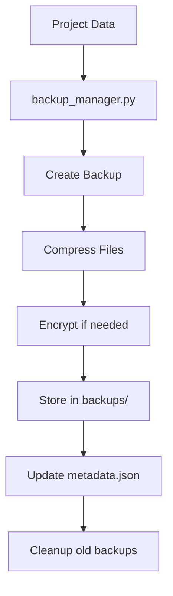

**Backup Schedule Table:**
| Backup Type | Frequency | Retention | Size Estimate |
|-------------|-----------|-----------|---------------|
| Full Project | Daily | 30 days | 10-50MB |
| Config Only | Hourly | 7 days | 1-5MB |
| Git Data | Real-time | 90 days | Varies |
| Reports | Weekly | 52 weeks | 5-20MB |
