# AutoProjectManagement - Root Documentation

## 🎯 Project Overview

**AutoProjectManagement** is an intelligent, AI-driven project management automation system designed to streamline software development workflows through automated task management, intelligent code analysis, and seamless integration with development environments.

### 🏗️ System Architecture at a Glance

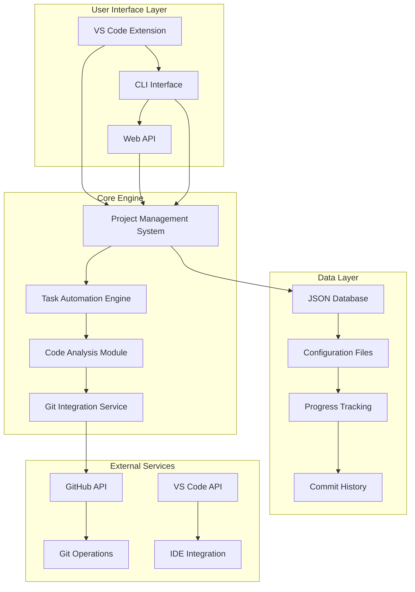

## 📋 Table of Contents

1. [System Architecture](#system-architecture)
2. [Core Components](#core-components)
3. [Module Structure](#module-structure)
4. [Data Flow](#data-flow)
5. [Configuration](#configuration)
6. [API Reference](#api-reference)
7. [Development Workflow](#development-workflow)
8. [Testing Strategy](#testing-strategy)
9. [Deployment Guide](#deployment-guide)
10. [Troubleshooting](#troubleshooting)

## 🏛️ System Architecture

### High-Level Architecture

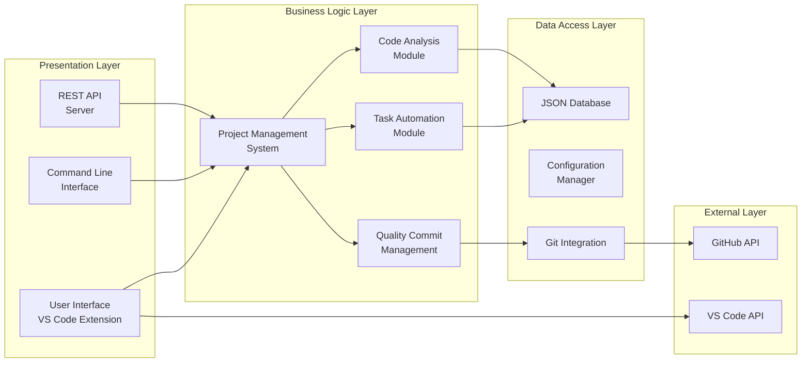

### Component Interaction Diagram

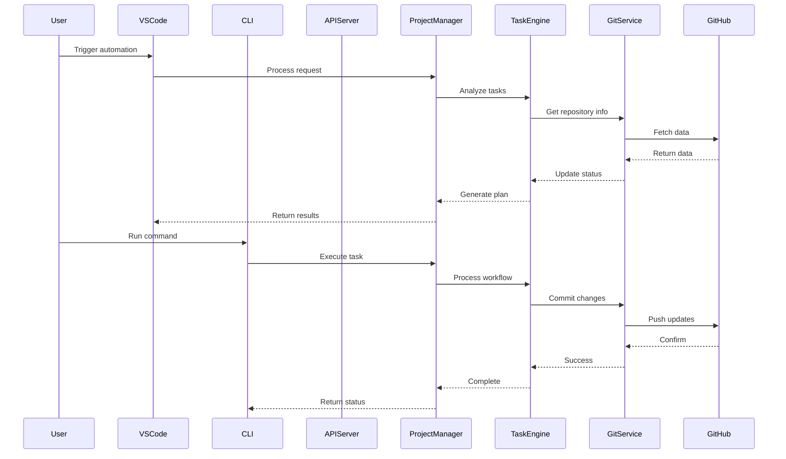

## 🧩 Core Components

### 1. Project Management System (PMS)
- **Location**: `autoprojectmanagement/main_modules/project_management_system.py`
- **Purpose**: Central orchestrator for all project management activities
- **Key Features**:
  - Task lifecycle management
  - Progress tracking
  - Resource allocation
  - Risk assessment

### 2. Task Automation Engine
- **Location**: `autoprojectmanagement/services/automation_services/`
- **Purpose**: Automated task processing and workflow execution
- **Key Features**:
  - Intelligent task prioritization
  - Automated commit generation
  - Progress monitoring

### 3. Code Analysis Module
- **Location**: `autoprojectmanagement/main_modules/`
- **Purpose**: Static code analysis and quality assessment
- **Key Features**:
  - Code quality metrics
  - Security vulnerability detection
  - Performance optimization suggestions

### 4. Git Integration Service
- **Location**: `autoprojectmanagement/services/github_integration.py`
- **Purpose**: Seamless Git and GitHub integration
- **Key Features**:
  - Automated commits
  - Branch management
  - Pull request automation

## 📊 Module Structure

### Directory Tree Overview

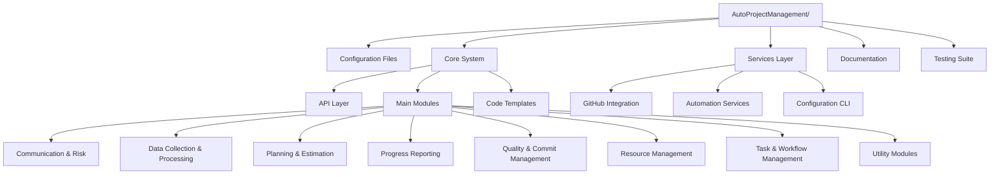

### Module Dependencies

| Module | Dependencies | Purpose | Interface |
|--------|--------------|---------|-----------|
| ProjectManagementSystem | All modules | Central orchestrator | Main API |
| TaskAutomation | GitService, JSONDB | Automated workflows | Task interface |
| CodeAnalysis | FileSystem, Git | Quality assessment | Analysis API |
| GitIntegration | GitHub API, Git CLI | Version control | Git operations |

## 🔄 Data Flow

### Data Processing Pipeline

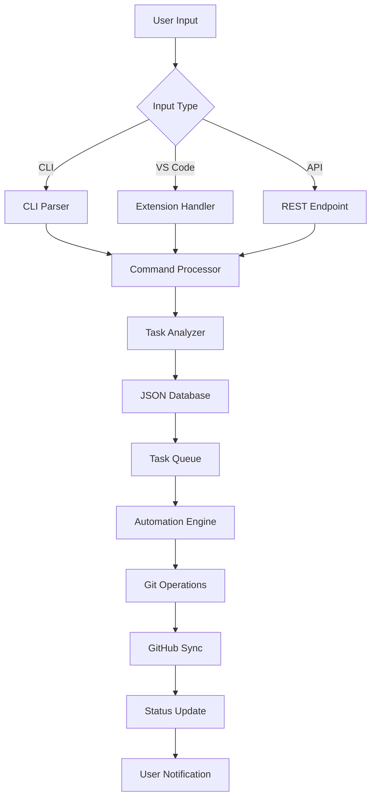

### JSON Data Structure

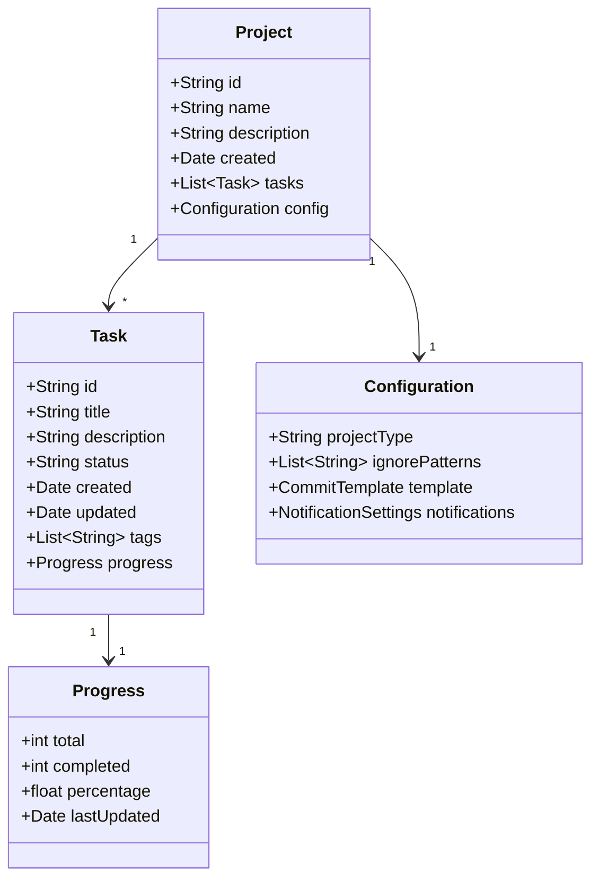

## ⚙️ Configuration

### Configuration Hierarchy

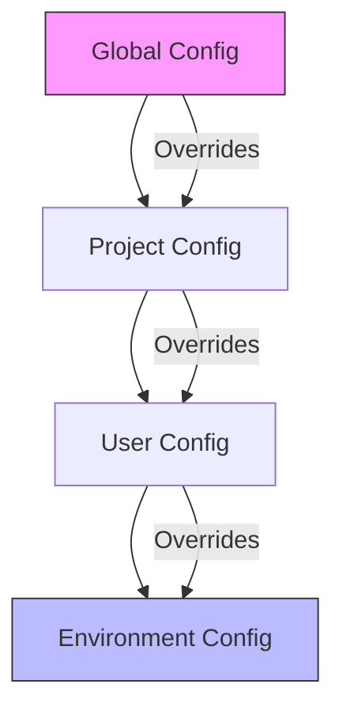

### Key Configuration Files

| File | Purpose | Location |
|------|---------|----------|
| `autoproject_configuration.py` | Main system configuration | Root |
| `setup_env.sh` | Environment setup script | Root |
| `vscode_extension.py` | VS Code extension config | `autoprojectmanagement/` |
| `JSON` files | Project-specific data | `JSonDataBase/` |

## 🔌 API Reference

### REST API Endpoints

```mermaid
graph LR
    subgraph "API Routes"
        GET[/projects] --> Projects[Project List]
        POST[/projects] --> CreateProject[Create Project]
        GET[/projects/:id] --> ProjectDetail[Project Details]
        PUT[/projects/:id] --> UpdateProject[Update Project]
        DELETE[/projects/:id] --> DeleteProject[Delete Project]
        
        GET[/tasks] --> TaskList[Task List]
        POST[/tasks] --> CreateTask[Create Task]
        GET[/tasks/:id] --> TaskDetail[Task Details]
        PUT[/tasks/:id] --> UpdateTask[Update Task]
    end
```

### CLI Commands

| Command | Description | Example |
|---------|-------------|---------|
| `auto-project init` | Initialize new project | `auto-project init my-project` |
| `auto-project status` | Show project status | `auto-project status` |
| `auto-project commit` | Create automated commit | `auto-project commit "Add feature"` |
| `auto-project sync` | Sync with GitHub | `auto-project sync` |
| `auto-project analyze` | Analyze code quality | `auto-project analyze` |

## 🧪 Development Workflow

### Git Workflow Integration

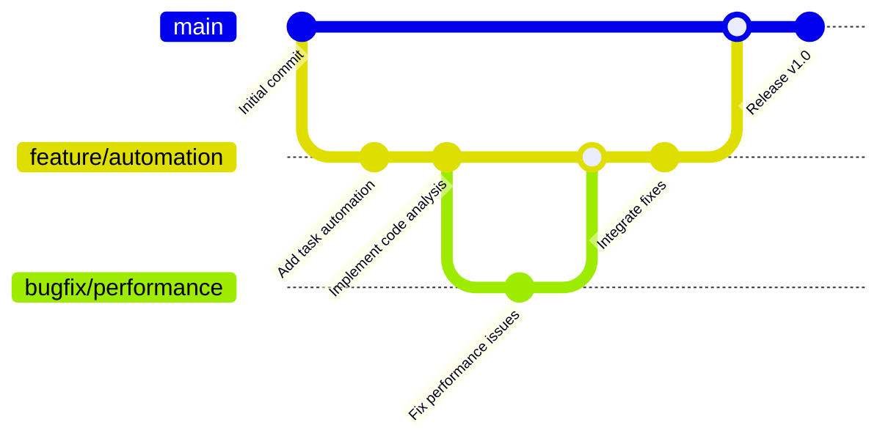

### Development Cycle

1. **Setup**: Run `setup_env.sh` to configure environment
2. **Development**: Use VS Code extension for real-time feedback
3. **Testing**: Run comprehensive test suite
4. **Commit**: Automated commits with intelligent messages
5. **Deploy**: Push to GitHub with automated workflows

## 🧪 Testing Strategy

### Test Pyramid

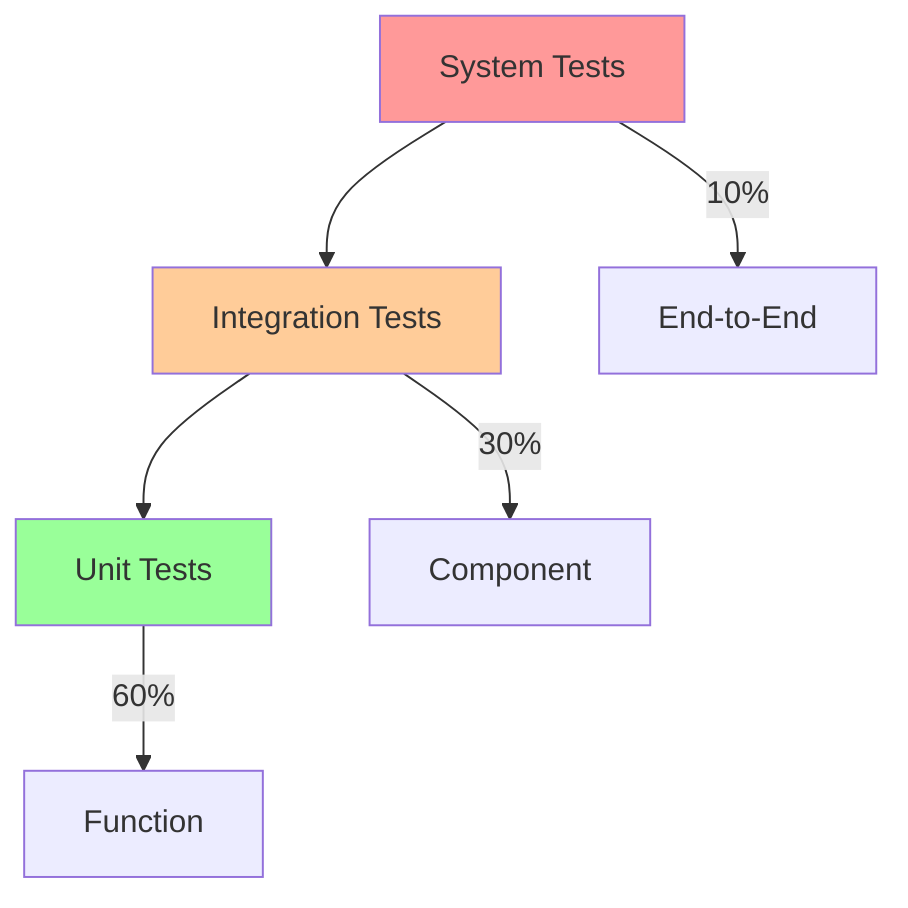

### Test Categories

| Test Type | Coverage | Tools | Location |
|-----------|----------|-------|----------|
| Unit Tests | 80%+ | pytest | `tests/code_tests/01_UnitTests/` |
| Integration | 70%+ | pytest | `tests/code_tests/02_IntegrationTests/` |
| System | 60%+ | pytest | `tests/code_tests/03_SystemTests/` |
| Performance | Custom | pytest-benchmark | `tests/code_tests/04_PerformanceTests/` |

## 🚀 Deployment Guide

### Deployment Architecture

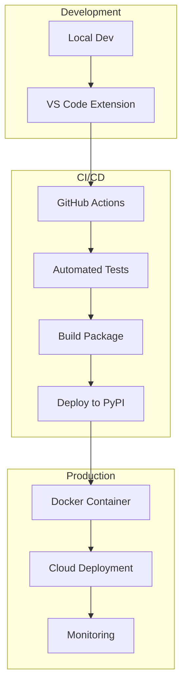

### Deployment Steps

1. **Local Testing**: Run full test suite
2. **Package Build**: Create distribution package
3. **Docker Build**: Create container image
4. **Cloud Deploy**: Deploy to cloud provider
5. **Monitor**: Set up monitoring and alerts

## 🔧 Troubleshooting

### Common Issues and Solutions

| Issue | Symptom | Solution |
|-------|---------|----------|
| Git authentication | Push failures | Check GitHub token |
| JSON parsing errors | Invalid data | Validate JSON schema |
| VS Code extension | Not loading | Restart VS Code |
| Permission errors | File access | Check file permissions |
| Network timeouts | API failures | Check internet connection |

### Debug Mode

Enable debug mode by setting environment variable:
```bash
export AUTO_PROJECT_DEBUG=true
```

### Log Analysis

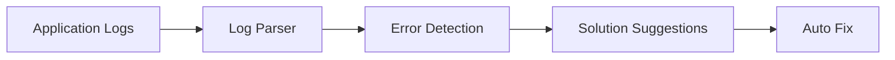

## 📊 Performance Metrics

### Key Performance Indicators

| Metric | Target | Measurement |
|--------|--------|-------------|
| Task completion rate | >95% | Automated tracking |
| Code quality score | >85% | Static analysis |
| Commit frequency | Daily | Git statistics |
| Response time | <2s | API monitoring |
| Error rate | <1% | Error tracking |

### Performance Dashboard

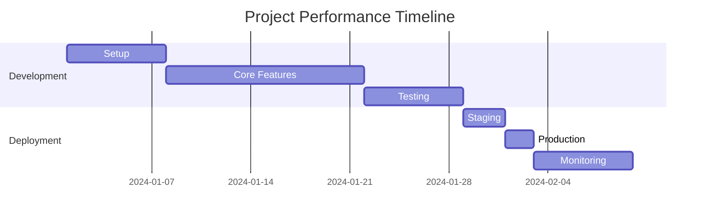

## 🎯 Next Steps

1. **Explore**: Start with the [Quick Start Guide](Quick_Start_Guide.md)
2. **Configure**: Review [Configuration Guide](Configuration_Guide.md)
3. **Develop**: Check [Development Environment](Development_Environment.md)
4. **Deploy**: Follow [Deployment Guide](Deployment/Deployment_Execution.md)

## 📞 Support

- **Documentation**: Check the `Docs/` directory
- **Issues**: Create GitHub issues
- **Discussions**: Use GitHub Discussions
- **Email**: Contact development team

---

*This documentation is automatically updated with each release. For the latest version, check the main repository.*
