# `.gitignore` Structure Documentation

## Table of Contents
1. [Overview](#overview)
2. [Purpose and Importance](#purpose-and-importance)
3. [Current Structure Analysis](#current-structure-analysis)
4. [Category-Based Organization](#category-based-organization)
5. [Pattern Types and Syntax](#pattern-types-and-syntax)
6. [Visual Architecture](#visual-architecture)
7. [Decision Framework](#decision-framework)
8. [Best Practices](#best-practices)
9. [Maintenance Guidelines](#maintenance-guidelines)
10. [Troubleshooting](#troubleshooting)

---

## Overview

The `.gitignore` file serves as a critical configuration file that defines which files and directories should be excluded from version control in the AutoProjectManagement repository. This documentation provides a comprehensive guide to understanding, maintaining, and extending the `.gitignore` configuration.

### File Location
- **Path**: `/.gitignore`
- **Type**: Git configuration file
- **Format**: Plain text with pattern rules

---

## Purpose and Importance

### Primary Objectives
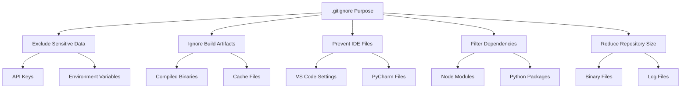

### Impact Analysis
| Aspect | With .gitignore | Without .gitignore |
|--------|----------------|-------------------|
| Repository Size | Optimized | Bloated |
| Security | Protected | Vulnerable |
| Performance | Fast | Slow |
| Collaboration | Clean | Conflicted |
| CI/CD | Reliable | Unstable |

---

## Current Structure Analysis

### File Organization Flow
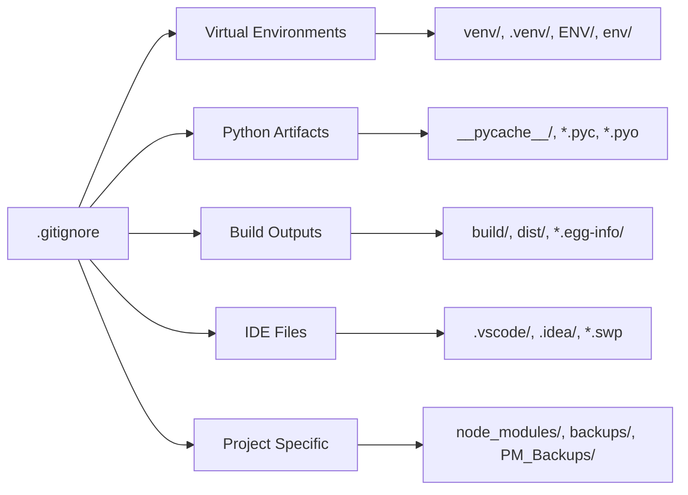

### Detailed Pattern Breakdown

#### 1. Virtual Environment Patterns
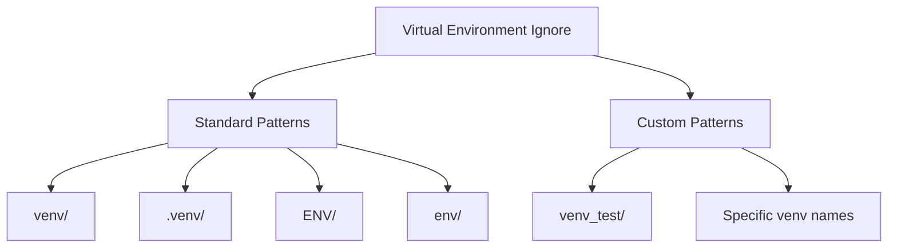

#### 2. Python-Specific Patterns
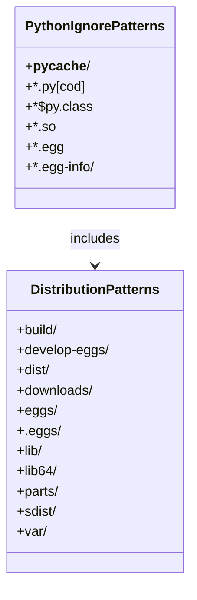

---

## Category-Based Organization

### Pattern Categories Table

| Category | Patterns | Purpose | Examples |
|----------|----------|---------|----------|
| **Virtual Environments** | Directory ignores | Isolate Python environments | `venv/`, `.venv/` |
| **Python Cache** | File extensions | Remove compiled bytecode | `*.pyc`, `*.pyo` |
| **Distribution** | Build artifacts | Exclude generated packages | `dist/`, `build/` |
| **Testing** | Coverage reports | Skip test artifacts | `.coverage`, `htmlcov/` |
| **IDE/Editor** | Configuration files | Prevent IDE conflicts | `.vscode/`, `.idea/` |
| **Environment** | Sensitive data | Protect credentials | `.env`, `.env.local` |
| **Project Specific** | Custom directories | Exclude project artifacts | `node_modules/`, `backups/` |

### Pattern Priority Matrix
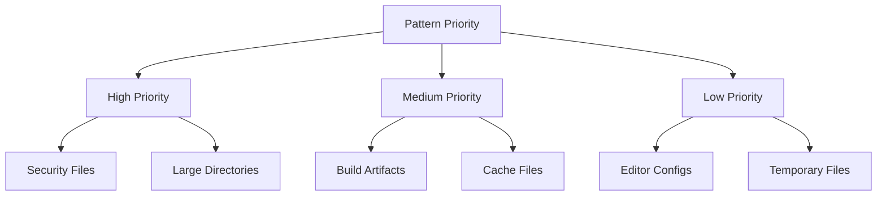

---

## Pattern Types and Syntax

### Gitignore Pattern Syntax

#### 1. Basic Patterns
| Pattern Type | Syntax | Example | Description |
|--------------|--------|---------|-------------|
| **File Extension** | `*.extension` | `*.pyc` | All files with extension |
| **Directory** | `directory/` | `venv/` | Entire directory |
| **Specific File** | `filename` | `.env` | Exact file match |
| **Wildcard** | `?` or `*` | `test*.py` | Single or multiple characters |

#### 2. Advanced Patterns
```mermaid
flowchart LR
    A[Advanced Patterns] --> B[Negation]
    A --> C[Nesting]
    A --> D[Anchoring]
    
    B --> E[!important.file]
    C --> F[subdir/**/temp]
    D --> G[/absolute/path]
```

#### 3. Pattern Examples with Explanations

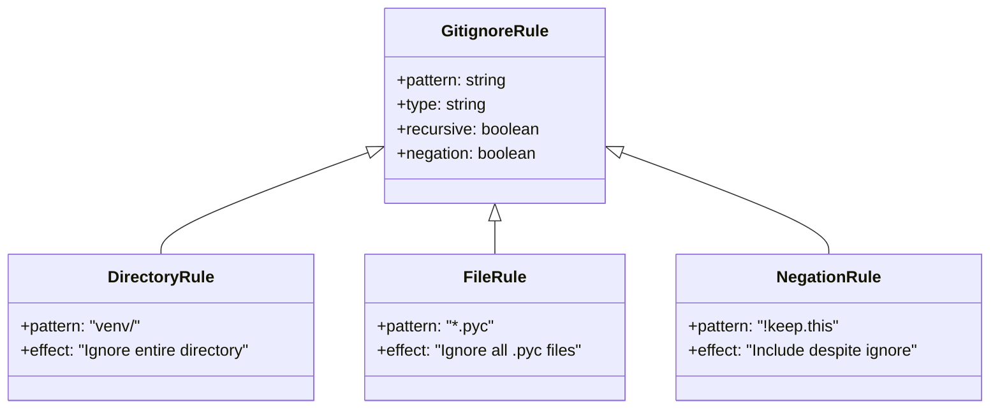

---

## Visual Architecture

### Complete Ignore Structure
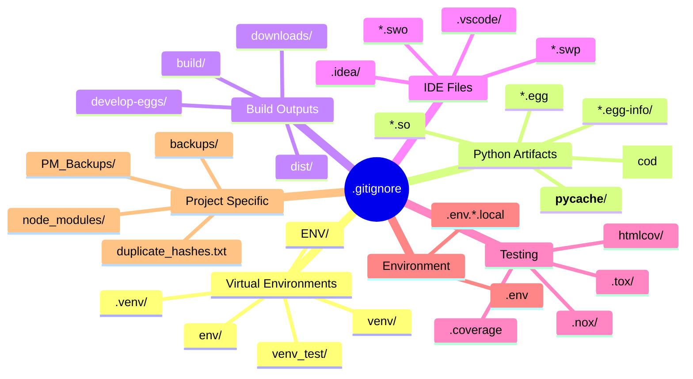

### File Lifecycle with Gitignore
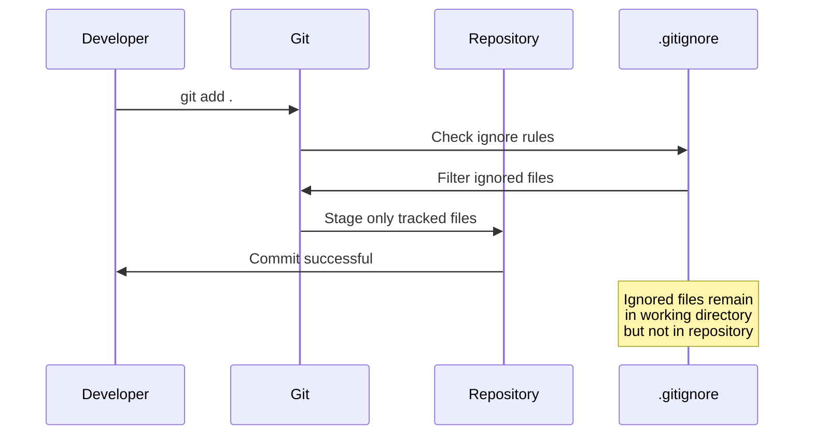

---

## Decision Framework

### Adding New Ignore Rules
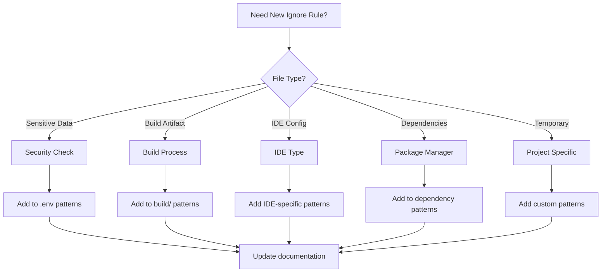

### Rule Validation Checklist
- [ ] **Security**: Does it prevent sensitive data exposure?
- [ ] **Performance**: Does it reduce repository size?
- [ ] **Collaboration**: Does it prevent merge conflicts?
- [ ] **Maintenance**: Is it easy to understand and maintain?
- [ ] **Scope**: Does it apply to all team members?

---

## Best Practices

### 1. Organization Principles
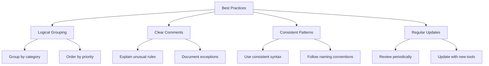

### 2. Pattern Ordering
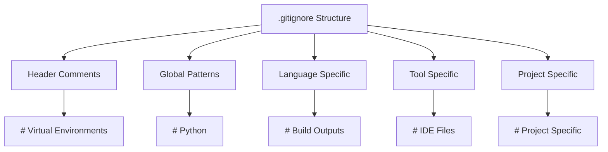

### 3. Common Patterns Reference

| Environment | Patterns | Description |
|-------------|----------|-------------|
| **Python** | `__pycache__/`, `*.pyc`, `*.pyo` | Bytecode and cache |
| **Node.js** | `node_modules/`, `npm-debug.log` | Dependencies and logs |
| **IDE** | `.vscode/`, `.idea/`, `*.swp` | Editor configurations |
| **OS** | `.DS_Store`, `Thumbs.db` | System files |
| **Testing** | `.coverage`, `htmlcov/` | Coverage reports |
| **Build** | `build/`, `dist/`, `*.egg-info/` | Distribution artifacts |

---

## Maintenance Guidelines

### Regular Review Process
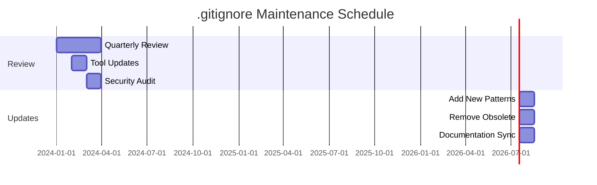

### Maintenance Checklist

#### Monthly Tasks
- [ ] Review new file types in repository
- [ ] Check for accidentally committed sensitive files
- [ ] Update patterns for new tools/dependencies
- [ ] Validate existing patterns still relevant

#### Quarterly Tasks
- [ ] Full pattern audit
- [ ] Team feedback collection
- [ ] Performance impact assessment
- [ ] Security vulnerability review

#### Annual Tasks
- [ ] Complete rewrite consideration
- [ ] Industry best practices review
- [ ] Tool compatibility check
- [ ] Documentation update

### Version Control for .gitignore
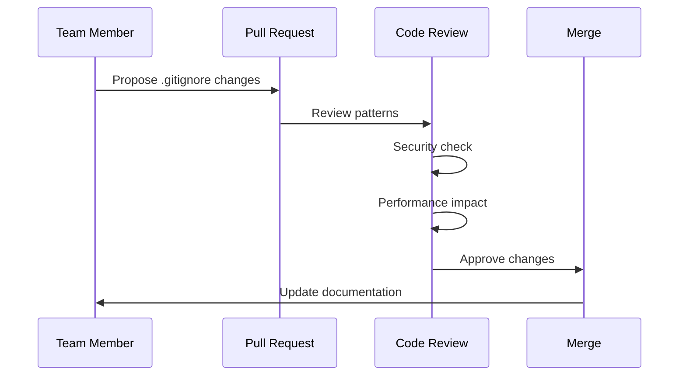

---

## Troubleshooting

### Common Issues and Solutions

#### Issue 1: Files Still Tracked After Adding to .gitignore
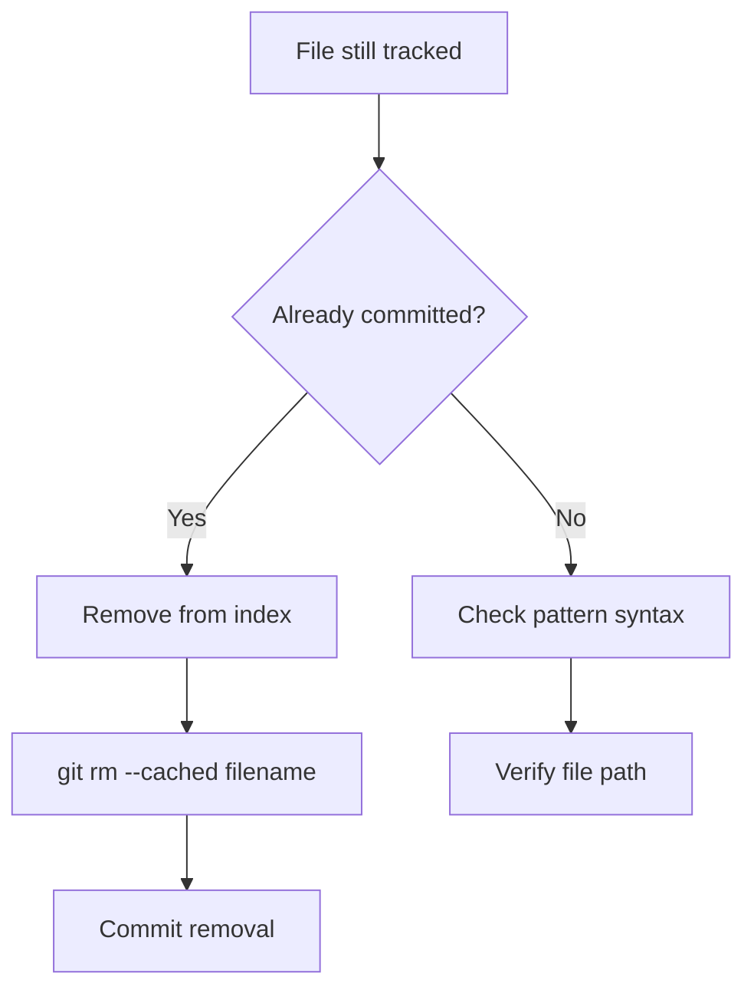

#### Issue 2: Pattern Not Working
| Symptom | Cause | Solution |
|---------|-------|----------|
| Directory not ignored | Missing trailing slash | Add `/` for directories |
| File extension ignored everywhere | Too broad pattern | Use specific paths |
| Negation not working | Wrong order | Place `!` patterns after ignores |

#### Issue 3: Accidentally Committed Sensitive Data
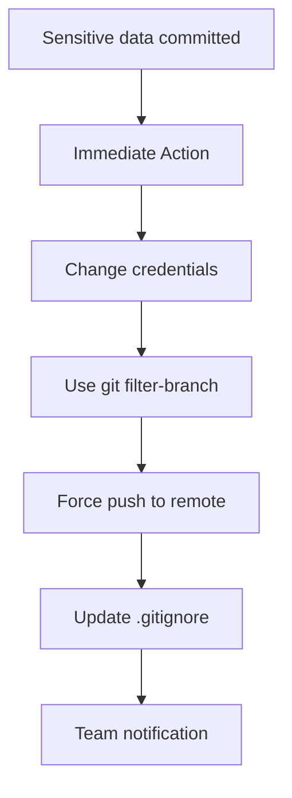

### Debug Commands Reference

| Command | Purpose | Example |
|---------|---------|---------|
| `git check-ignore -v filename` | Check why file is ignored | `git check-ignore -v .env` |
| `git ls-files --ignored` | List all ignored files | `git ls-files --ignored --exclude-standard` |
| `git status --ignored` | Show ignored in status | `git status --ignored` |
| `git clean -Xn` | Preview remove ignored | `git clean -Xn` (dry run) |

---

## Integration with CI/CD

### Automated Validation
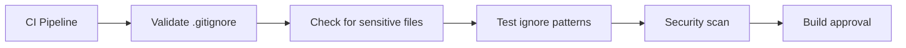

### Pre-commit Hooks
```yaml
# .pre-commit-config.yaml
repos:
  - repo: local
    hooks:
      - id: gitignore-check
        name: Check .gitignore rules
        entry: scripts/validate-gitignore.sh
        language: script
```

---

## Summary

The `.gitignore` file is a crucial component of the AutoProjectManagement repository's security and performance strategy. By following this documentation, teams can maintain a clean, secure, and efficient version control system.

### Key Takeaways
1. **Security First**: Always prioritize sensitive data protection
2. **Performance Focus**: Reduce repository size and improve clone times
3. **Team Collaboration**: Prevent merge conflicts from IDE/Editor files
4. **Maintainability**: Regular reviews and updates ensure continued effectiveness
5. **Documentation**: Keep patterns documented and understood by all team members

### Quick Reference Card
- **File**: `/.gitignore`
- **Purpose**: Exclude files from version control
- **Syntax**: Git pattern matching
- **Update Frequency**: As needed with new tools/dependencies
- **Review Schedule**: Monthly checks, quarterly audits

---

*Last Updated: 2024-01-XX*  
*Next Review: 2024-04-XX*
