# `pyproject.toml` Configuration Guide

## Overview

The `pyproject.toml` file is the central configuration file for the AutoProjectManagement system, following the modern Python packaging standards defined in [PEP 518](https://peps.python.org/pep-0518/) and [PEP 621](https://peps.python.org/pep-0621/). This file defines project metadata, dependencies, build system requirements, and tool configurations.

## Table of Contents

1. [File Structure Overview](#file-structure-overview)
2. [Build System Configuration](#build-system-configuration)
3. [Project Metadata](#project-metadata)
4. [Dependencies Management](#dependencies-management)
5. [Entry Points & Scripts](#entry-points--scripts)
6. [Package Configuration](#package-configuration)
7. [Tool Configurations](#tool-configurations)
8. [Best Practices & Guidelines](#best-practices--guidelines)

---

## File Structure Overview

### Complete Architecture Diagram

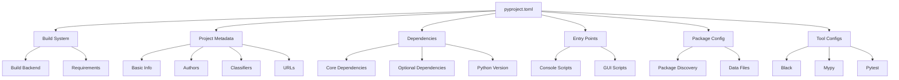

### Section Breakdown Table

| Section | Purpose | Key Elements |
|---------|---------|--------------|
| `[build-system]` | Build configuration | `requires`, `build-backend` |
| `[project]` | Core project metadata | `name`, `version`, `description` |
| `[project.optional-dependencies]` | Optional features | `dev`, `test`, `docs` |
| `[project.scripts]` | CLI entry points | Command mappings |
| `[tool.*]` | Tool-specific configs | `black`, `mypy`, `pytest` |

---

## Build System Configuration

### Build System Architecture

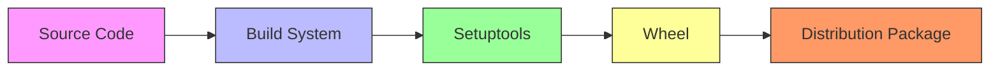

### Build System Specification

```toml
[build-system]
requires = ["setuptools>=61.0", "wheel"]
build-backend = "setuptools.build_meta"
```

#### Build Requirements Table

| Requirement | Version | Purpose |
|-------------|---------|---------|
| setuptools | >=61.0 | Build backend for packaging |
| wheel | Latest | Wheel distribution format support |

#### Build Process Flow

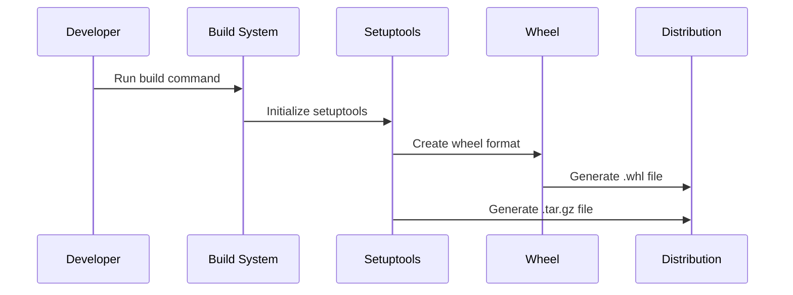

---

## Project Metadata

### Project Information Structure

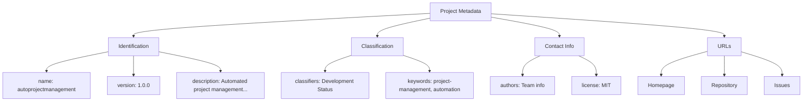

### Core Metadata Table

| Field | Value | Description |
|-------|-------|-------------|
| `name` | `autoprojectmanagement` | Package name on PyPI |
| `version` | `1.0.0` | Semantic versioning |
| `description` | "Automated project management system..." | Short project description |
| `readme` | `README.md` | Long description file |
| `requires-python` | `>=3.8` | Minimum Python version |
| `license` | `MIT` | Open source license |

### Python Version Support Matrix

| Python Version | Support Status | Notes |
|----------------|----------------|--------|
| 3.8 | ✅ Supported | Minimum required |
| 3.9 | ✅ Supported | Recommended |
| 3.10 | ✅ Supported | Fully tested |
| 3.11 | ✅ Supported | Latest stable |
| 3.12 | ✅ Supported | Experimental |

### Classifier Categories

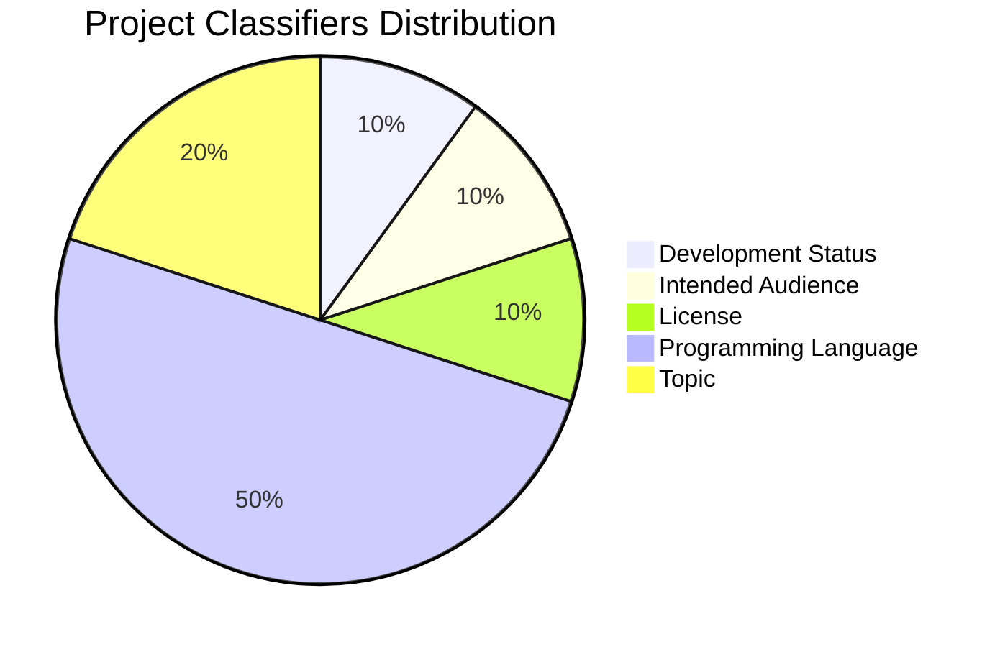

---

## Dependencies Management

### Dependency Categories

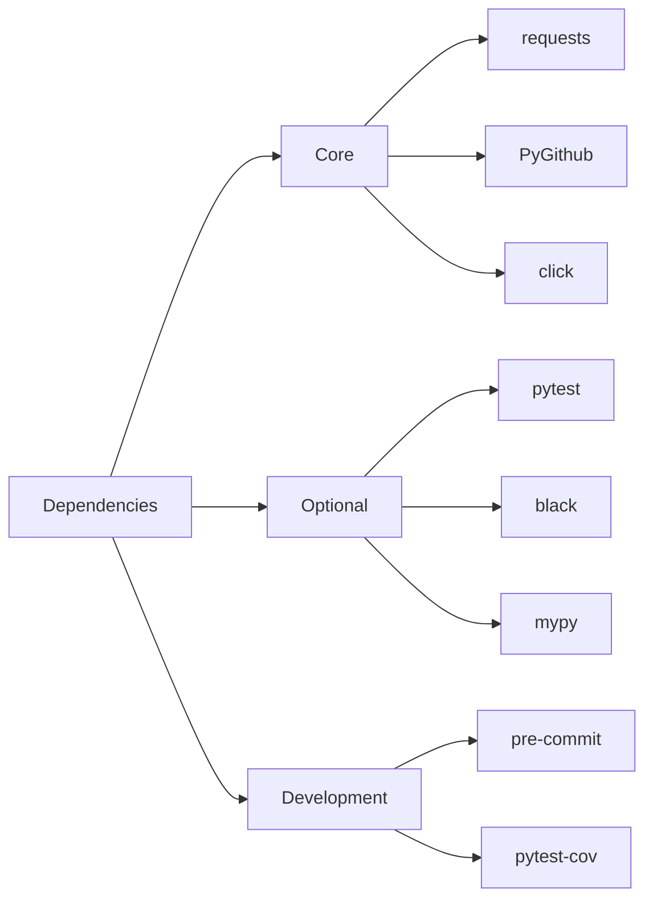

### Core Dependencies Analysis

| Package | Version | Purpose | Category |
|---------|---------|---------|----------|
| `requests` | >=2.25.0 | HTTP client | Network |
| `PyGithub` | >=1.55 | GitHub API wrapper | Integration |
| `click` | >=8.0.0 | CLI framework | Interface |
| `colorama` | >=0.4.4 | Terminal colors | UI |
| `python-dateutil` | >=2.8.0 | Date utilities | Utilities |
| `pytz` | >=2021.1 | Timezone handling | Utilities |
| `typing-extensions` | >=4.0.0 | Type hints | Development |

### Optional Dependencies Structure

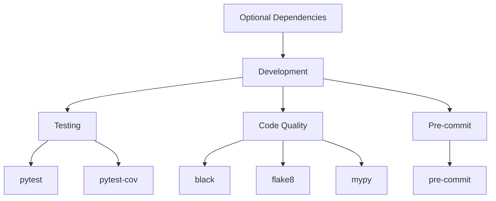

### Installation Commands

```bash
# Core installation
pip install autoprojectmanagement

# With development dependencies
pip install autoprojectmanagement[dev]

# Development installation from source
pip install -e ".[dev]"
```

---

## Entry Points & Scripts

### CLI Architecture

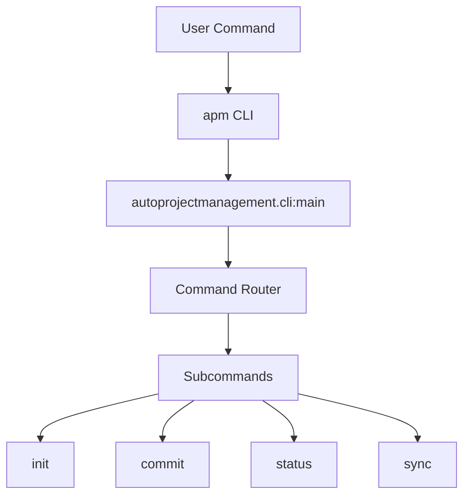

### Entry Point Configuration

```toml
[project.scripts]
apm = "autoprojectmanagement.cli:main"
```

### Script Registration Process

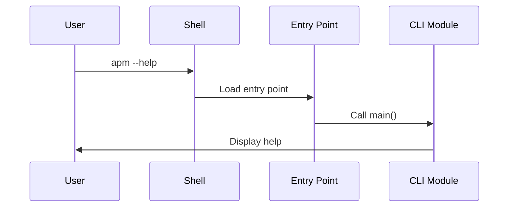

---

## Package Configuration

### Package Discovery Flow

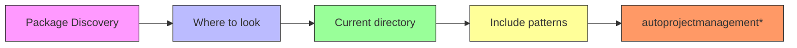

### Package Data Configuration

```toml
[tool.setuptools.package-data]
"autoprojectmanagement" = ["templates/*", "config/*"]
```

### Directory Structure Mapping

```
autoprojectmanagement/
├── __init__.py
├── cli.py
├── api/
│   ├── app.py
│   └── server.py
├── main_modules/
│   ├── __init__.py
│   └── project_management_system.py
├── services/
│   ├── __init__.py
│   └── github_integration.py
└── templates/
    ├── documentation_standard.py
    └── standard_header.py
```

---

## Tool Configurations

### Code Quality Tools Overview

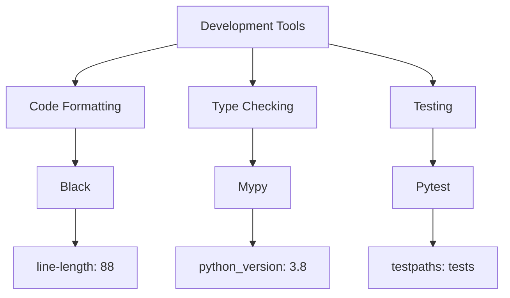

### Black Configuration

```toml
[tool.black]
line-length = 88
target-version = ['py38']
```

#### Black Settings Table

| Setting | Value | Description |
|---------|--------|-------------|
| `line-length` | 88 | Maximum line length |
| `target-version` | ['py38'] | Target Python versions |

### MyPy Configuration

```toml
[tool.mypy]
python_version = "3.8"
warn_return_any = true
warn_unused_configs = true
disallow_untyped_defs = true
```

#### MyPy Settings Matrix

| Setting | Type | Value | Purpose |
|---------|------|--------|---------|
| `python_version` | string | "3.8" | Target Python version |
| `warn_return_any` | boolean | true | Warn on Any returns |
| `warn_unused_configs` | boolean | true | Warn on unused configs |
| `disallow_untyped_defs` | boolean | true | Require type annotations |

### Pytest Configuration

```toml
[tool.pytest.ini_options]
testpaths = ["tests"]
python_files = ["test_*.py"]
python_classes = ["Test*"]
python_functions = ["test_*"]
addopts = "--cov=autoprojectmanagement --cov-report=html --cov-report=term-missing"
```

#### Pytest Configuration Table

| Setting | Value | Description |
|---------|--------|-------------|
| `testpaths` | ["tests"] | Test directory |
| `python_files` | ["test_*.py"] | Test file pattern |
| `python_classes` | ["Test*"] | Test class pattern |
| `python_functions` | ["test_*"] | Test function pattern |
| `addopts` | coverage options | Coverage reporting |

---

## Best Practices & Guidelines

### Configuration Validation Flow

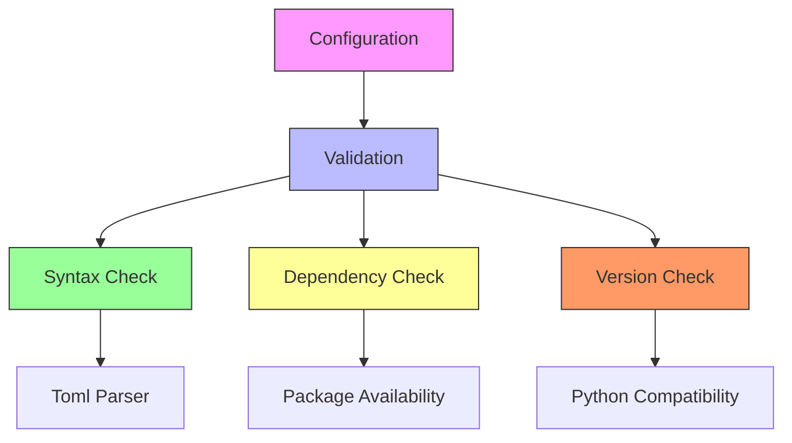

### Maintenance Checklist

| Task | Frequency | Tool | Command |
|------|-----------|------|---------|
| Update dependencies | Monthly | pip | `pip list --outdated` |
| Security audit | Weekly | pip-audit | `pip-audit` |
| Format code | On commit | black | `black .` |
| Type checking | Pre-commit | mypy | `mypy .` |
| Run tests | CI/CD | pytest | `pytest` |

### Version Management Strategy

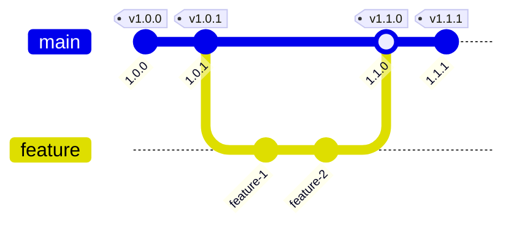

---

## Quick Reference

### Common Commands

```bash
# Install package
pip install -e .

# Install with dev dependencies
pip install -e ".[dev]"

# Run tests
pytest

# Format code
black autoprojectmanagement/

# Type checking
mypy autoprojectmanagement/

# Build package
python -m build
```

### File Validation

```bash
# Check TOML syntax
python -c "import tomllib; tomllib.load(open('pyproject.toml', 'rb'))"

# Check package metadata
python -m setuptools_scm

# Validate dependencies
pip install --dry-run -e .
```

---

## Troubleshooting

### Common Issues and Solutions

| Issue | Symptom | Solution |
|-------|---------|----------|
| Version conflicts | Import errors | Check dependency versions |
| Missing dependencies | ModuleNotFoundError | Install with `pip install -e .` |
| Build failures | Setup errors | Update build tools |
| Type errors | MyPy warnings | Add type annotations |

### Debug Configuration

```toml
# Add to pyproject.toml for debugging
[tool.setuptools]
py-modules = ["autoprojectmanagement"]
```

---

## Summary

The `pyproject.toml` file serves as the single source of truth for the AutoProjectManagement package configuration. It modernizes Python packaging by consolidating multiple configuration files into one standardized format, improving maintainability and compatibility across different tools and environments.

### Key Benefits

1. **Unified Configuration**: Single file for all project settings
2. **Modern Standards**: Follows PEP 518 and PEP 621
3. **Tool Integration**: Supports multiple development tools
4. **Dependency Management**: Clear separation of core and optional dependencies
5. **Entry Points**: Easy CLI integration
6. **Package Discovery**: Automatic package detection

### Migration Path

For projects still using `setup.py` or `setup.cfg`, the migration to `pyproject.toml` provides:

- Better IDE support
- Improved build reproducibility
- Enhanced security through explicit build requirements
- Simplified maintenance

This configuration represents a production-ready, modern Python package setup that balances flexibility with best practices.
