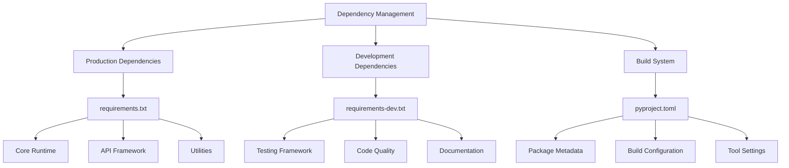
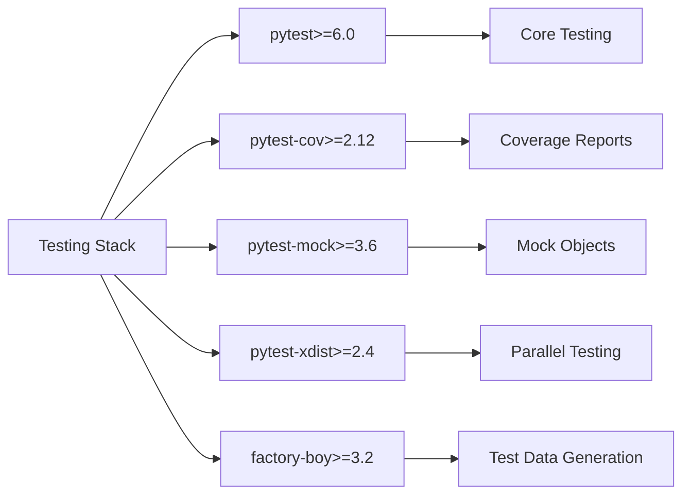
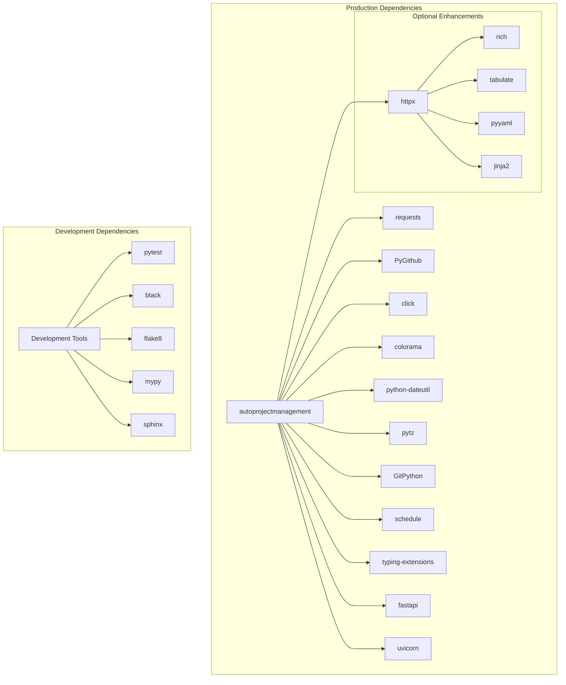
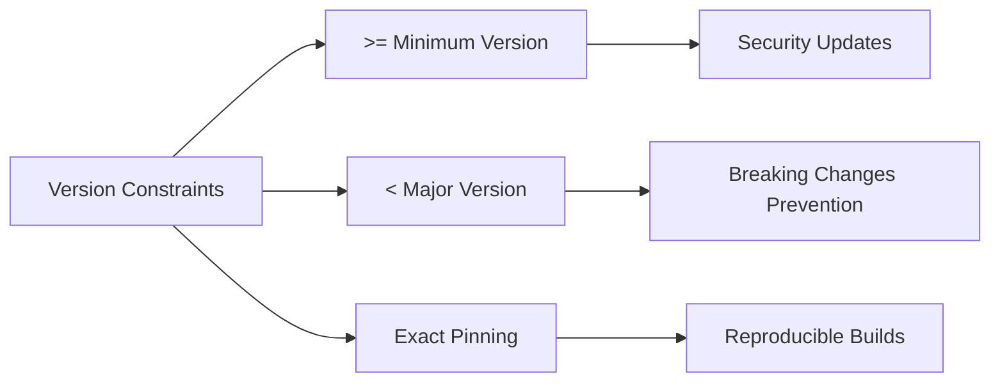
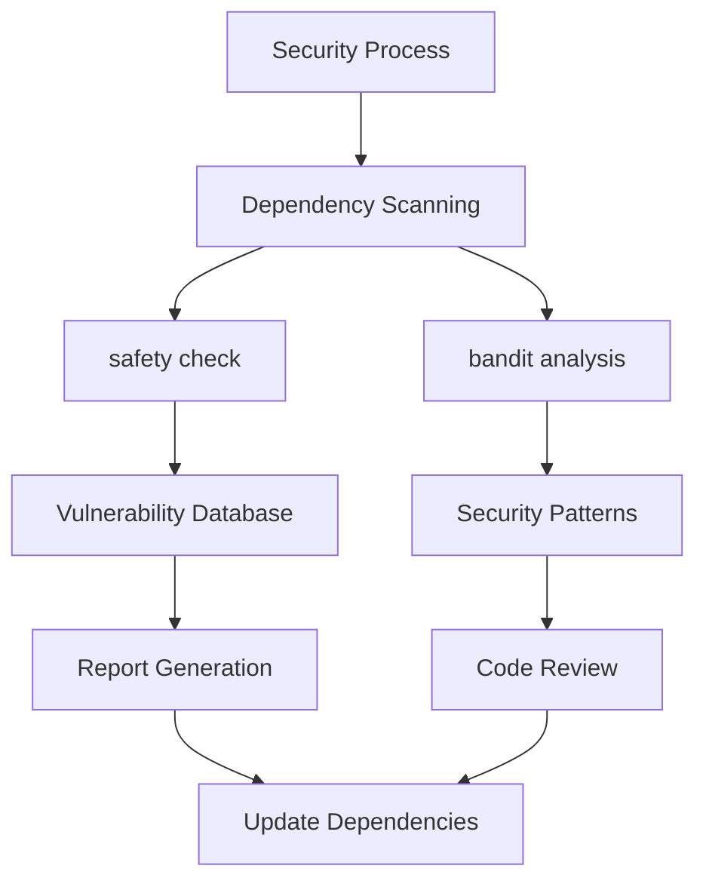
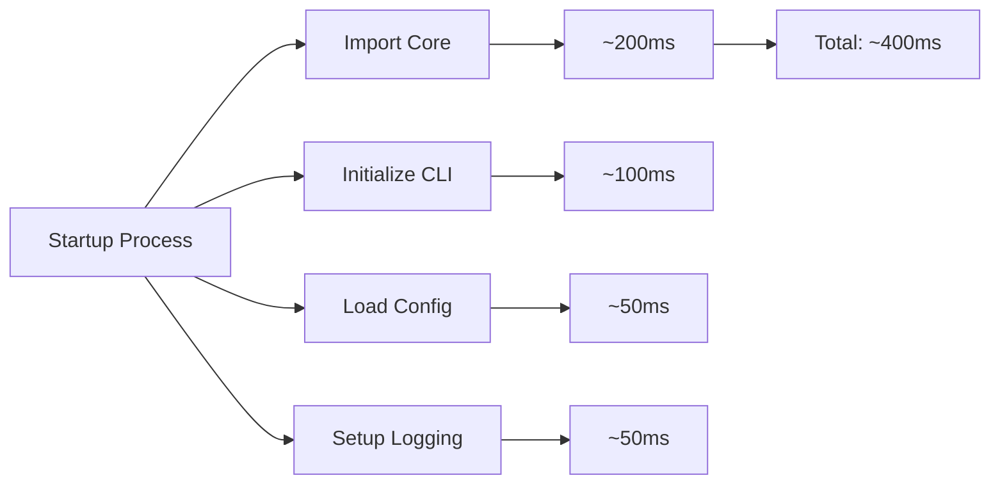
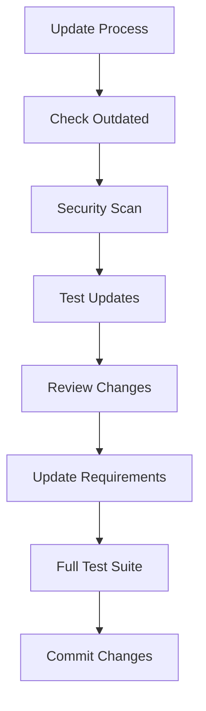

# Requirements.txt Documentation

## Overview

This document provides a comprehensive analysis of the dependency management structure for the AutoProjectManagement system. The project uses a dual-requirements approach with `requirements.txt` for production dependencies and `requirements-dev.txt` for development dependencies, complemented by `pyproject.toml` for modern Python packaging.

## Architecture Overview

### Dependency Management Strategy



## Production Dependencies Analysis

### Core Dependencies (`requirements.txt`)

| Package | Version | Category | Purpose | License |
|---------|---------|----------|---------|---------|
| `requests` | >=2.25.0 | HTTP Client | REST API communication | Apache 2.0 |
| `PyGithub` | >=1.55 | GitHub API | GitHub integration and automation | LGPL |
| `click` | >=8.0.0 | CLI Framework | Command-line interface creation | BSD |
| `colorama` | >=0.4.4 | Terminal Colors | Cross-platform colored terminal output | BSD |
| `python-dateutil` | >=2.8.0 | Date/Time | Advanced date/time manipulation | Apache 2.0 |
| `pytz` | >=2021.1 | Timezones | Timezone database and utilities | MIT |
| `GitPython` | >=3.1.0 | Git Integration | Programmatic Git repository access | BSD |
| `schedule` | >=1.2.0 | Task Scheduling | Background job scheduling | MIT |
| `typing-extensions` | >=4.0.0 | Type Hints | Extended type hinting support | PSF |
| `fastapi` | >=0.100.0 | Web Framework | REST API development | MIT |
| `uvicorn[standard]` | >=0.22.0 | ASGI Server | Production web server | BSD |
| `httpx` | >=0.24.0 | HTTP Client | Async HTTP client for API calls | BSD |

### Optional Dependencies

| Package | Version | Category | Purpose | When Used |
|---------|---------|----------|---------|-----------|
| `rich` | >=10.0.0 | Terminal UI | Rich text and beautiful formatting | Enhanced CLI output |
| `tabulate` | >=0.8.0 | Data Display | Pretty-print tabular data | Report generation |
| `pyyaml` | >=5.4.0 | YAML Parser | YAML configuration file support | Config management |
| `jinja2` | >=3.0.0 | Templating | Template-based file generation | Documentation templates |

## Development Dependencies Analysis

### Testing Framework (`requirements-dev.txt`)



### Code Quality Tools

| Tool | Version | Purpose | Configuration File |
|------|---------|---------|-------------------|
| `black` | >=22.0 | Code formatting | `pyproject.toml` |
| `flake8` | >=4.0 | Linting | `.flake8` |
| `mypy` | >=0.910 | Type checking | `pyproject.toml` |
| `isort` | >=5.10 | Import sorting | `pyproject.toml` |
| `bandit` | >=1.7 | Security linting | `.bandit` |
| `safety` | >=1.10 | Vulnerability scanning | N/A |

### Documentation Tools

| Tool | Version | Purpose | Output Format |
|------|---------|---------|---------------|
| `sphinx` | >=4.0 | Documentation generation | HTML, PDF, ePub |
| `sphinx-rtd-theme` | >=1.0 | Documentation theme | ReadTheDocs style |
| `myst-parser` | >=0.15 | Markdown support | Sphinx integration |

## Dependency Hierarchy Diagram



## Version Constraint Analysis

### Semantic Versioning Strategy



### Risk Assessment Matrix

| Constraint Type | Risk Level | Flexibility | Use Case |
|-----------------|------------|-------------|----------|
| `>=1.0.0` | Medium | High | Non-critical dependencies |
| `>=1.0.0,<2.0.0` | Low | Medium | Most dependencies |
| `==1.0.0` | Very Low | None | Critical dependencies |
| `~=1.0.0` | Low | Medium | Compatible releases |

## Installation Scenarios

### Production Installation

```bash
# Standard installation
pip install -r requirements.txt

# With optional dependencies
pip install -r requirements.txt
pip install rich tabulate pyyaml jinja2

# From PyPI (when published)
pip install autoprojectmanagement
```

### Development Installation

```bash
# Full development setup
pip install -r requirements.txt -r requirements-dev.txt

# With editable install
pip install -e .

# With all extras
pip install -e ".[dev]"
```

### Docker Installation

```dockerfile
FROM python:3.11-slim

WORKDIR /app

COPY requirements.txt requirements-dev.txt ./
RUN pip install --no-cache-dir -r requirements.txt

COPY . .
RUN pip install -e .
```

## Security Considerations

### Dependency Vulnerability Management



### Security Checklist

| Check | Tool | Frequency | Action |
|-------|------|-----------|--------|
| Known vulnerabilities | `safety` | Weekly | Update affected packages |
| Code security issues | `bandit` | Per commit | Fix high-severity issues |
| Dependency freshness | `pip list --outdated` | Monthly | Plan updates |
| License compliance | `pip-licenses` | Quarterly | Review licenses |

## Performance Impact Analysis

### Memory Footprint

| Dependency Category | Approx. Memory | Impact Level |
|-------------------|----------------|--------------|
| Core runtime | ~50MB | Low |
| Web framework | ~30MB | Low |
| Git operations | ~20MB | Low |
| Optional UI libs | ~15MB | Very Low |

### Startup Time Impact



## Compatibility Matrix

### Python Version Support

| Python Version | Status | Test Coverage | Notes |
|----------------|--------|---------------|--------|
| 3.8 | ✅ Supported | Full | Minimum required |
| 3.9 | ✅ Supported | Full | Recommended |
| 3.10 | ✅ Supported | Full | Latest features |
| 3.11 | ✅ Supported | Full | Performance optimized |
| 3.12 | ⚠️ Experimental | Partial | Testing in progress |

### Platform Compatibility

| Platform | Status | Notes |
|----------|--------|--------|
| Linux | ✅ Full support | Primary development platform |
| macOS | ✅ Full support | CI tested |
| Windows | ✅ Full support | Colorama for terminal colors |
| Docker | ✅ Full support | Official images available |

## Maintenance Guidelines

### Update Strategy

1. **Monthly Review**: Check for security updates
2. **Quarterly Updates**: Review and update minor versions
3. **Annual Planning**: Evaluate major version upgrades

### Update Process



### Rollback Plan

| Scenario | Rollback Method | Recovery Time |
|----------|----------------|---------------|
| Breaking change | Pin to previous version | < 5 minutes |
| Security issue | Emergency patch | < 1 hour |
| Performance regression | Profile and optimize | < 1 day |

## Troubleshooting Guide

### Common Issues

| Issue | Symptom | Solution |
|-------|---------|----------|
| Version conflicts | Import errors | Use virtual environment |
| Missing system deps | Build failures | Install system packages |
| Network timeouts | Install failures | Use mirror or cache |
| Permission errors | Install failures | Use `--user` flag or virtualenv |

### Debug Commands

```bash
# Check installed versions
pip list

# Verify requirements
pip check

# Detailed dependency tree
pipdeptree

# Security scan
safety check

# License check
pip-licenses
```

## Best Practices

### Virtual Environment Setup

```bash
# Create isolated environment
python -m venv apm-env
source apm-env/bin/activate  # Linux/macOS
# or
apm-env\Scripts\activate     # Windows

# Install in development mode
pip install -e ".[dev]"
```

### Requirements Management

1. **Pin critical dependencies** with exact versions
2. **Use semantic versioning** for flexibility
3. **Regular security audits** with automated tools
4. **Test updates** in isolated environments
5. **Document breaking changes** in changelog

## Future Considerations

### Planned Additions

| Package | Purpose | Timeline | Impact |
|---------|---------|----------|--------|
| `pydantic` | Data validation | Q2 2024 | Medium |
| `asyncio` | Async operations | Q3 2024 | High |
| `redis` | Caching layer | Q4 2024 | Low |

### Deprecation Schedule

| Package | Replacement | Timeline | Migration Effort |
|---------|-------------|----------|------------------|
| `colorama` | `rich` console | 2025 | Low |
| `tabulate` | `rich.table` | 2025 | Low |

## Conclusion

The AutoProjectManagement dependency structure is designed for stability, security, and maintainability. The dual-requirements approach provides clear separation between production and development needs, while modern tools ensure code quality and security. Regular maintenance and careful version management keep the system reliable and up-to-date.
