# AutoProjectManagement Setup.py Documentation

## Overview

The `setup.py` file is the central configuration script for the AutoProjectManagement package, defining how the package is built, distributed, and installed. This document provides a comprehensive guide to understanding, customizing, and maintaining the setup configuration.

## Table of Contents

1. [File Structure Overview](#file-structure-overview)
2. [Configuration Components](#configuration-components)
3. [Dependencies Management](#dependencies-management)
4. [Entry Points Configuration](#entry-points-configuration)
5. [Package Data Management](#package-data-management)
6. [Classifiers and Metadata](#classifiers-and-metadata)
7. [Installation Process](#installation-process)
8. [Troubleshooting](#troubleshooting)
9. [Best Practices](#best-practices)

## File Structure Overview

### Architecture Diagram

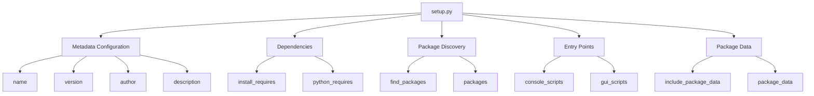

### File Dependencies

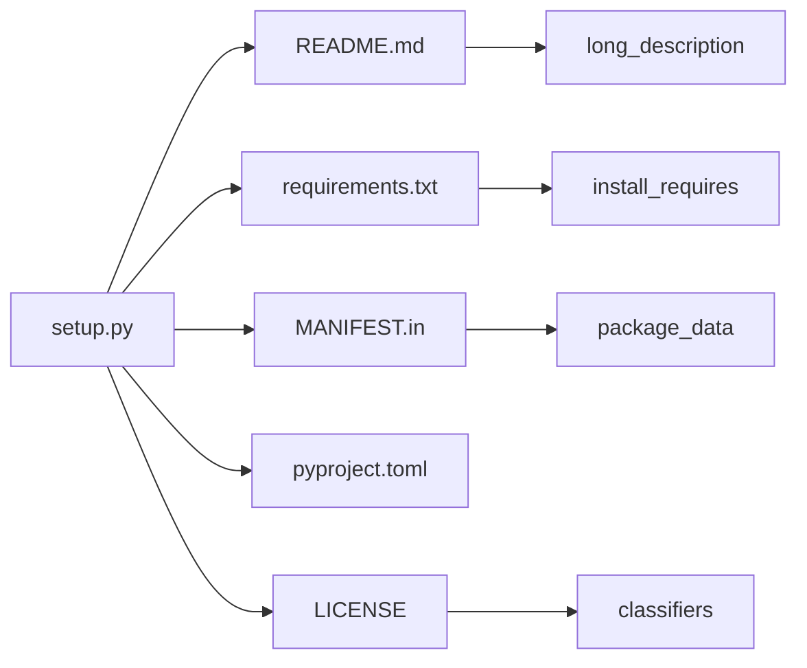

## Configuration Components

### Core Metadata Configuration

| Parameter | Type | Description | Example Value |
|-----------|------|-------------|-----------------|
| `name` | string | Package name on PyPI | `"autoprojectmanagement"` |
| `version` | string | Semantic version | `"1.0.0"` |
| `author` | string | Primary author | `"AutoProjectManagement Team"` |
| `author_email` | string | Contact email | `"team@autoprojectmanagement.com"` |
| `description` | string | Short description | `"Automated project management system..."` |
| `long_description` | string | Detailed description | Content from README.md |
| `url` | string | Project homepage | `"https://github.com/..."` |

### Version Specification

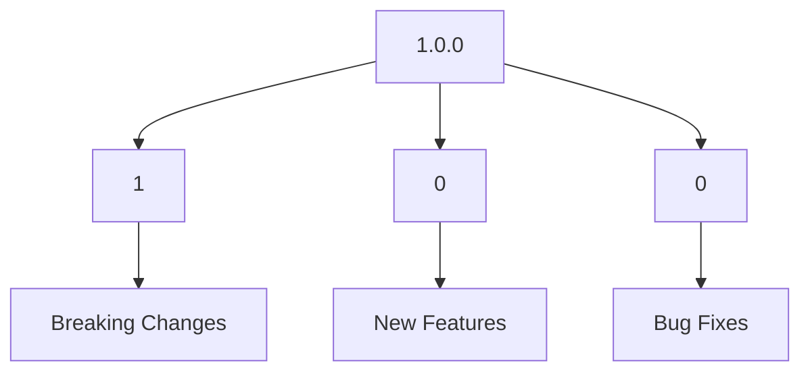

## Dependencies Management

### Requirements Processing Flow

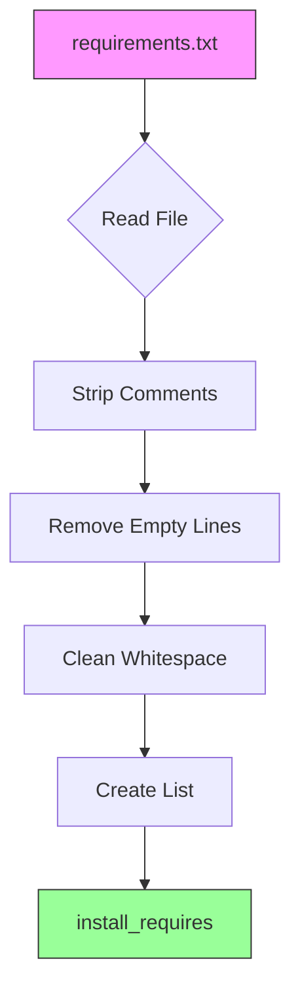

### Dependency Categories

| Category | File | Purpose | Processing |
|----------|------|---------|------------|
| Runtime | requirements.txt | Production dependencies | Direct inclusion |
| Development | requirements-dev.txt | Development tools | Separate file |
| Optional | extras_require | Optional features | Conditional inclusion |

### Python Version Matrix

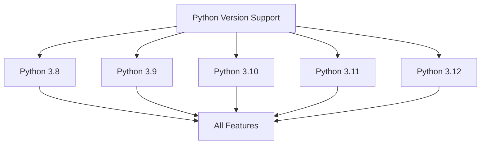

## Entry Points Configuration

### Console Scripts Structure

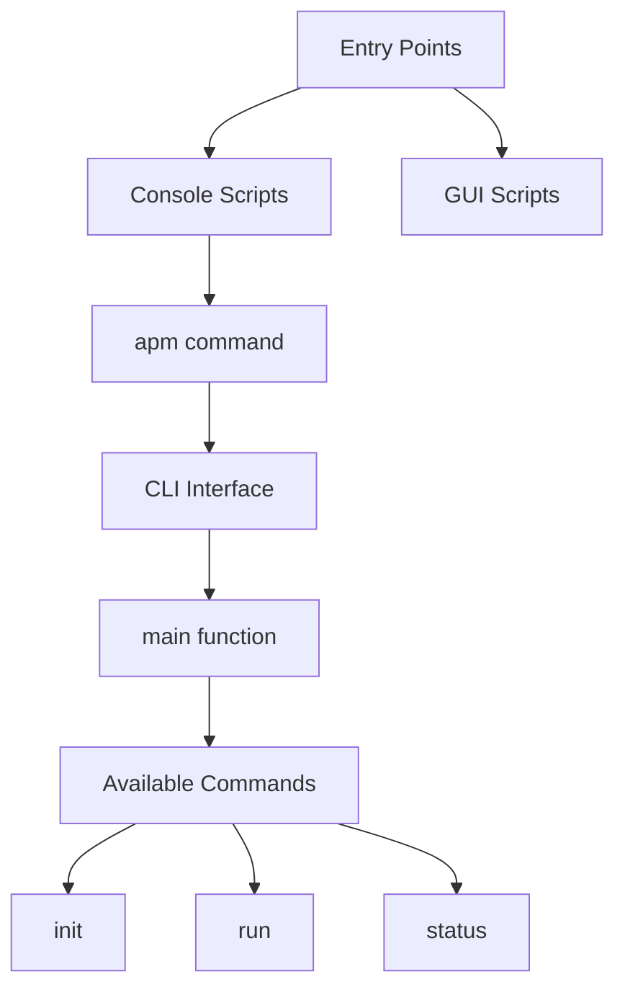

### Entry Points Configuration Table

| Entry Point | Module Path | Function | Command |
|-------------|-------------|----------|---------|
| `apm` | `autoprojectmanagement.cli` | `main` | `apm` |
| Future | `autoprojectmanagement.gui` | `launch` | `apm-gui` |

## Package Data Management

### Package Discovery Process

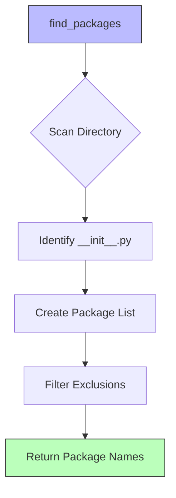

### Package Data Inclusion

| Data Type | Location | Inclusion Method | Purpose |
|-----------|----------|------------------|---------|
| Templates | `templates/` | `package_data` | Jinja2 templates |
| Config | `config/` | `package_data` | Configuration files |
| Static | `static/` | `MANIFEST.in` | CSS, JS, images |
| Docs | `docs/` | `MANIFEST.in` | Documentation files |

### File Pattern Matching

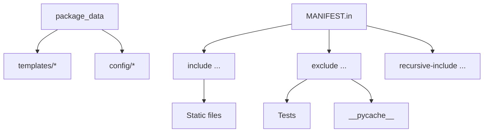

## Classifiers and Metadata

### Trove Classifiers Structure

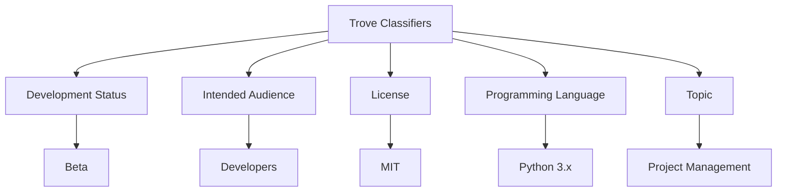

### Classifier Categories

| Category | Value | Description |
|----------|-------|-------------|
| Development Status | `4 - Beta` | Beta quality, usable but may change |
| Intended Audience | `Developers` | Primary target users |
| License | `MIT License` | Open source permissive license |
| Programming Language | `Python :: 3.8` | Minimum Python version |
| Topic | `Software Development :: Project Management` | Primary domain |

## Installation Process

### Installation Workflow

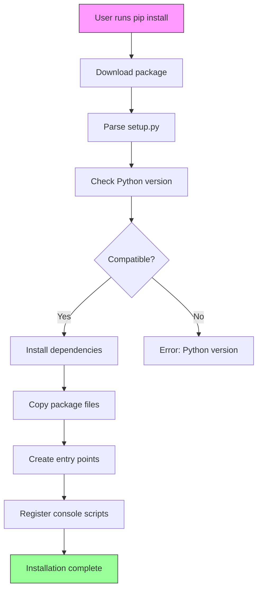

### Installation Commands

| Method | Command | Use Case |
|--------|---------|----------|
| From PyPI | `pip install autoprojectmanagement` | Production use |
| From Source | `pip install -e .` | Development |
| With Extras | `pip install -e .[dev]` | Development with tools |
| User Install | `pip install --user autoprojectmanagement` | User-only install |

## Directory Structure Impact

### Package Layout

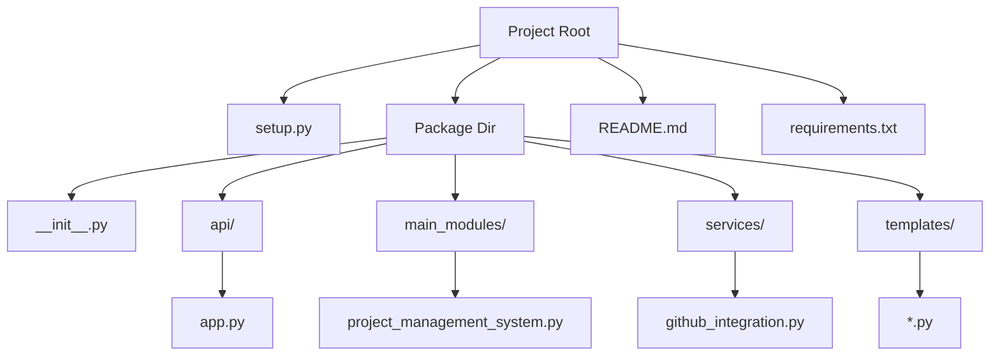

## Configuration Validation

### Validation Checklist

| Check | Description | Status |
|-------|-------------|--------|
| ✅ Name | Valid package name | `autoprojectmanagement` |
| ✅ Version | Semantic versioning | `1.0.0` |
| ✅ Python | Version requirement | `>=3.8` |
| ✅ Author | Contact information | Provided |
| ✅ Description | Clear and concise | Provided |
| ✅ Dependencies | All requirements listed | From requirements.txt |
| ✅ Entry Points | Console scripts defined | `apm` command |
| ✅ Package Data | Templates included | Configured |

## Troubleshooting

### Common Issues and Solutions

| Issue | Symptom | Solution |
|-------|---------|----------|
| Python version mismatch | Installation fails | Upgrade Python to 3.8+ |
| Missing dependencies | Import errors | Run `pip install -r requirements.txt` |
| Package not found | Import errors | Use `pip install -e .` |
| Entry point not working | Command not found | Check PATH and reinstall |

### Debug Installation

```bash
# Check Python version
python --version

# Verify package installation
pip show autoprojectmanagement

# Test entry point
apm --help

# Check package contents
python -c "import autoprojectmanagement; print(autoprojectmanagement.__file__)"
```

## Best Practices

### Maintenance Guidelines

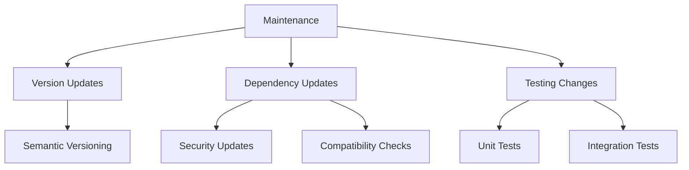

### Version Update Process

1. **Update version** in setup.py
2. **Update CHANGELOG.md** with changes
3. **Test installation** with `pip install -e .`
4. **Run tests** to ensure compatibility
5. **Commit changes** with descriptive message
6. **Tag release** with version number

### Security Considerations

| Aspect | Recommendation |
|--------|----------------|
| Dependencies | Pin versions for production |
| Python | Support latest stable versions |
| Metadata | Keep contact info updated |
| License | Ensure compliance |

## Advanced Configuration

### Optional Features Setup

```python
# Example: Adding optional dependencies
extras_require={
    'dev': ['pytest>=6.0', 'black', 'flake8'],
    'docs': ['sphinx', 'sphinx-rtd-theme'],
    'gui': ['tkinter', 'PyQt5'],
}
```

### Platform-Specific Configuration

```python
# Example: Platform-specific data
platforms=['Linux', 'Windows', 'macOS'],
```

## Integration with Build Tools

### Build Process Integration

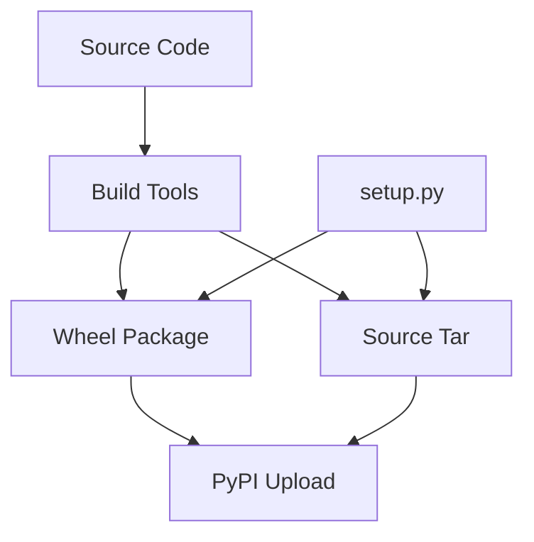

## Summary

The `setup.py` file serves as the central configuration hub for the AutoProjectManagement package, orchestrating package discovery, dependency management, entry point creation, and metadata publication. By following this documentation, developers can effectively maintain, extend, and distribute the package while ensuring compatibility across different Python environments and platforms.

### Key Takeaways

- **Comprehensive Configuration**: All aspects of package distribution are covered
- **Flexible Dependencies**: Support for runtime and development dependencies
- **Entry Point System**: Easy CLI integration with the `apm` command
- **Package Data Management**: Templates and configuration files included
- **Cross-Platform Support**: Works on Python 3.8+ across major platforms
- **Extensible Design**: Easy to add new features and dependencies

For questions or contributions, please refer to the project documentation or create an issue on the GitHub repository.
