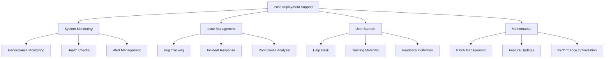
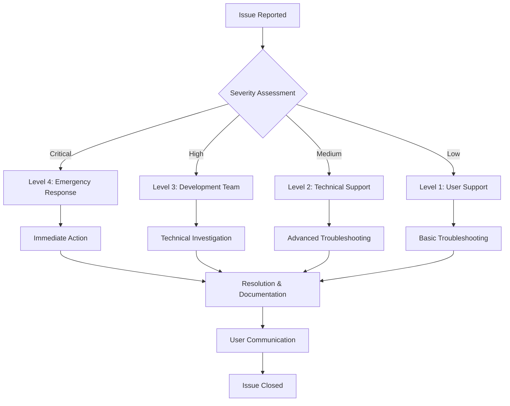
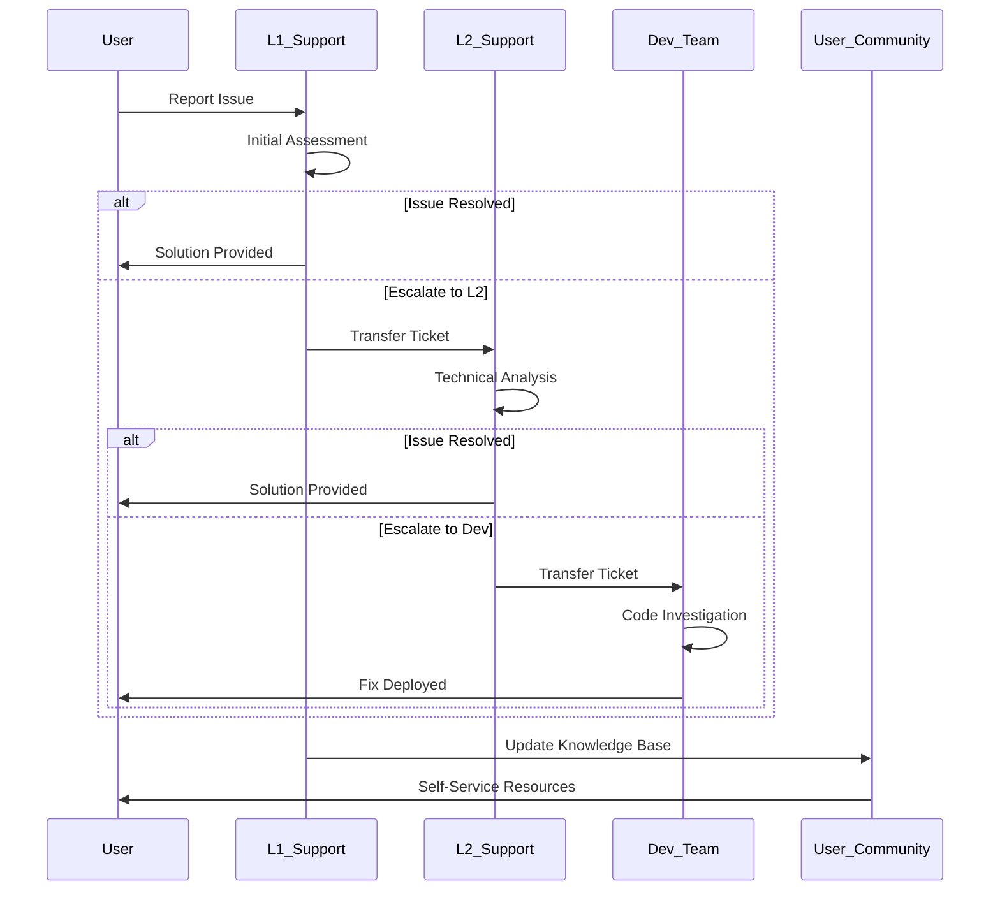
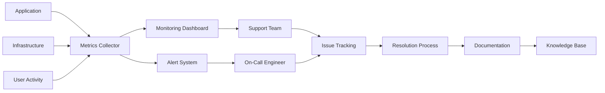
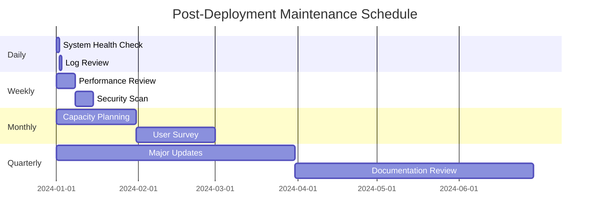

# Post-Deployment Support Guide

This document provides comprehensive guidance for post-deployment support activities in the AutoProjectManagement system. It outlines the standard procedures, tools, and responsibilities for maintaining system stability and user satisfaction after deployment.

---

## Overview

Post-deployment support encompasses all activities required to ensure the smooth operation of the deployed system, address user concerns, and implement necessary updates. This phase begins immediately after successful deployment and continues until the system reaches a stable operational state.

---

## Support Structure

### 1. System Monitoring
- **Performance Monitoring**: Continuous tracking of system metrics including response times, resource utilization, and error rates
- **Health Checks**: Automated monitoring of critical system components
- **Alert Management**: Proactive notification system for potential issues

### 2. Issue Management
- **Bug Tracking**: Systematic logging and prioritization of reported issues
- **Incident Response**: Rapid response procedures for critical system failures
- **Root Cause Analysis**: Investigation and documentation of underlying problems

### 3. User Support Services
- **Help Desk Operations**: First-line support for user inquiries
- **Training Materials**: Updated documentation and user guides
- **Feedback Collection**: Systematic gathering of user feedback for improvements

### 4. Maintenance Activities
- **Patch Management**: Regular security updates and bug fixes
- **Feature Enhancements**: Minor improvements based on user feedback
- **Performance Optimization**: Ongoing system tuning and optimization

---

## Key Responsibilities

### Development Team
- Monitor system logs and performance metrics
- Address critical bugs and security issues
- Implement approved feature enhancements
- Maintain technical documentation

### Operations Team
- Monitor infrastructure health
- Manage deployment environments
- Coordinate with development on issue resolution
- Ensure system availability

### Support Team
- Handle user inquiries and support tickets
- Provide user training and documentation
- Escalate technical issues appropriately
- Track user satisfaction metrics

---

## Support Tools and Resources

### Monitoring Tools
- **System Dashboards**: Real-time visibility into system performance
- **Log Analysis**: Centralized logging with search and alerting capabilities
- **Performance Metrics**: Automated collection of key performance indicators

### Communication Channels
- **Support Ticket System**: Structured issue tracking and resolution
- **User Forums**: Community-based support and knowledge sharing
- **Status Pages**: Public system status and incident communication

---

## Support Procedures

### Issue Escalation Process
1. **Level 1**: Initial user support and basic troubleshooting
2. **Level 2**: Technical support for complex issues
3. **Level 3**: Development team involvement for system-level problems
4. **Level 4**: Emergency response for critical system failures

### Response Time SLAs
- **Critical Issues**: 1 hour response, 4 hour resolution
- **High Priority**: 4 hour response, 24 hour resolution
- **Medium Priority**: 24 hour response, 72 hour resolution
- **Low Priority**: 72 hour response, 1 week resolution

---

## Documentation Requirements

### Technical Documentation
- System architecture and configuration details
- API documentation and integration guides
- Troubleshooting procedures and known issues
- Performance benchmarks and capacity planning

### User Documentation
- User manuals and quick-start guides
- FAQ documents and common issue resolution
- Video tutorials and training materials
- Release notes and change logs

---

## Continuous Improvement

### Feedback Loop
- Regular user satisfaction surveys
- System performance reviews
- Process improvement identification
- Tool and procedure updates

### Metrics and KPIs
- System uptime percentage
- Average response time for support tickets
- User satisfaction scores
- Number of issues resolved per period

---

## Transition Planning

### From Development to Operations
- Knowledge transfer sessions
- Documentation handover
- Support team training
- Escalation procedure establishment

### Long-term Support Strategy
- Regular system health reviews
- Capacity planning and scaling
- Technology refresh planning
- End-of-life planning for system components

---

## Emergency Procedures

### Critical Incident Response
1. Immediate system assessment
2. User communication and status updates
3. Emergency fix implementation
4. Post-incident review and documentation

### Disaster Recovery
- Backup restoration procedures
- System failover processes
- Communication protocols
- Recovery time objectives (RTO) and recovery point objectives (RPO)

---

## Support Workflow Diagrams

### High-Level Support Process

### Issue Escalation Flow

### Support Ticket Lifecycle

### System Monitoring Architecture

### Maintenance Schedule

---

## Conclusion

Effective post-deployment support is crucial for maintaining system reliability and user satisfaction. This guide provides the framework for establishing comprehensive support processes that ensure the long-term success of the deployed system. Regular review and updates of these procedures ensure they remain aligned with evolving system needs and user requirements.

The combination of proactive monitoring, responsive issue management, continuous user support, and systematic maintenance creates a robust support ecosystem that can adapt to changing requirements while maintaining high service quality standards.
