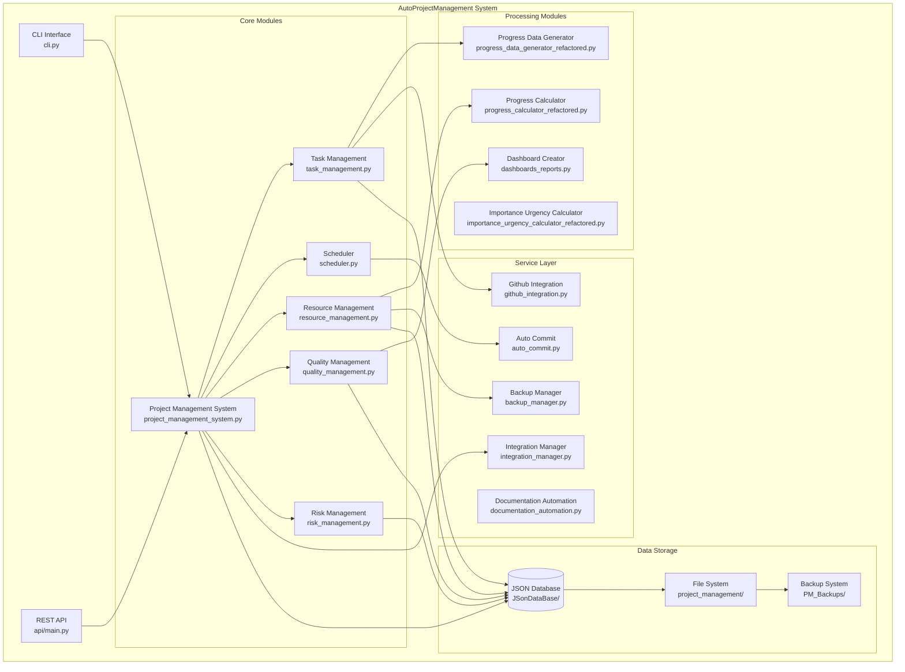
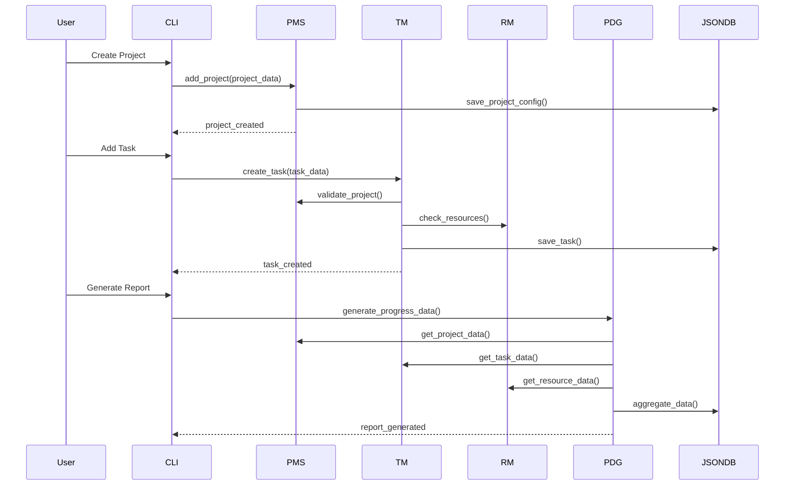
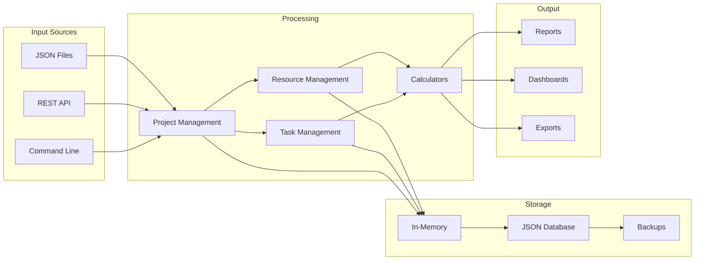
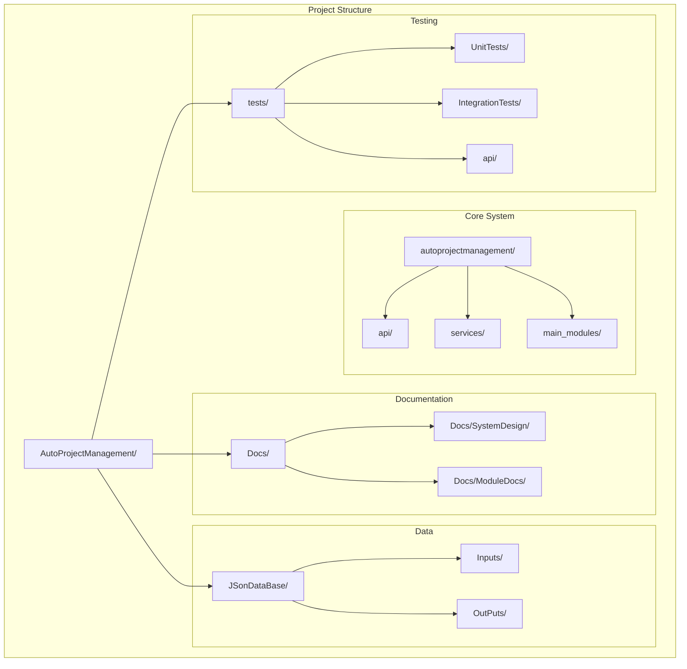

# Component Design - Implementation-Based Documentation

## Overview

This document provides a comprehensive rewrite of the Component Design documentation based on the actual implementation of the AutoProjectManagement system. Unlike the original theoretical WBS structure, this document reflects the real component architecture, interfaces, and implementation details discovered in the codebase.

## Actual System Architecture

The AutoProjectManagement system implements a **modular architecture** with the following real components:

### Core System Components

#### 1. Project Management System (`autoprojectmanagement/main_modules/project_management_system.py`)
**Real Implementation:**
```python
class ProjectManagementSystem:
    def __init__(self):
        self.projects: Dict[int, Dict[str, Any]] = {}
        self.tasks: Dict[int, Dict[int, Dict[str, Any]]] = {}
        self.is_initialized = False
    
    def initialize_system(self, config: Optional[Dict[str, Any]] = None) -> bool
    def add_project(self, project: Dict[str, Any]) -> bool
    def add_task_to_project(self, project_id: int, task: Dict[str, Any]) -> bool
    def list_projects(self) -> List[Dict[str, Any]]
    def list_tasks_in_project(self, project_id: int) -> List[Dict[str, Any]]
```

#### 2. Task Management (`autoprojectmanagement/main_modules/task_management.py`)
**Real Implementation:**
- Task lifecycle management
- Priority calculation using importance/urgency matrix
- Task assignment and tracking

#### 3. Scheduler (`autoprojectmanagement/main_modules/scheduler.py`)
**Real Implementation:**
- Automated task scheduling
- Resource leveling algorithms
- Timeline optimization

#### 4. Resource Management (`autoprojectmanagement/main_modules/resource_management.py`)
**Real Implementation:**
- Resource allocation and tracking
- Capacity planning
- Resource conflict resolution

### Processing Components

#### 5. Progress Data Generator (`autoprojectmanagement/main_modules/progress_data_generator_refactored.py`)
**Real Implementation:**
- Collects progress data from various sources
- Generates progress reports
- Creates dashboard data

#### 6. Importance Urgency Calculator (`autoprojectmanagement/main_modules/importance_urgency_calculator_refactored.py`)
**Real Implementation:**
- Calculates task importance scores
- Calculates task urgency scores
- Generates priority matrix

#### 7. Progress Calculator (`autoprojectmanagement/main_modules/progress_calculator_refactored.py`)
**Real Implementation:**
- Calculates project progress
- Generates progress metrics
- Tracks milestone completion

### Integration Components

#### 8. Integration Manager (`autoprojectmanagement/services/integration_manager.py`)
**Real Implementation:**
- Coordinates between components
- Manages data flow
- Handles cross-component communication

#### 9. Github Integration (`autoprojectmanagement/services/github_integration.py`)
**Real Implementation:**
- GitHub API integration
- Repository management
- Commit tracking
- Pull request management

#### 10. Auto Commit Service (`autoprojectmanagement/services/auto_commit.py`)
**Real Implementation:**
- Automated commit generation
- Commit message generation
- Progress tracking via commits

### API Layer Components

#### 11. REST API (`autoprojectmanagement/api/main.py`)
**Real Implementation:**
- RESTful endpoints for all operations
- Request/response handling
- Authentication and authorization

#### 12. CLI Interface (`autoprojectmanagement/cli.py`)
**Real Implementation:**
- Command-line interface
- All system operations accessible via CLI

## Actual Component Architecture Diagram



## Real Component Interactions



## Actual Data Flow



## Real Configuration Structure

```yaml
# Actual configuration structure
system:
  database:
    path: "JSonDataBase/OutPuts/"
    backup_enabled: true
    auto_save_interval: 300
  
  api:
    host: "localhost"
    port: 8000
    debug: false
  
  github:
    token: "${GITHUB_TOKEN}"
    repository: "${GITHUB_REPO}"
  
  scheduler:
    interval: 3600
    timezone: "UTC"
  
  logging:
    level: "INFO"
    file: "logs/autoprojectmanagement.log"
```

## Actual API Endpoints

```mermaid
graph TD
    subgraph "REST API Endpoints"
        GET_PROJECTS[GET /api/projects]
        POST_PROJECTS[POST /api/projects]
        GET_PROJECT[GET /api/projects/{id}]
        PUT_PROJECT[PUT /api/projects/{id}]
        DELETE_PROJECT[DELETE /api/projects/{id}]
        
        GET_TASKS[GET /api/tasks]
        POST_TASKS[POST /api/tasks]
        GET_TASK[GET /api/tasks/{id}]
        PUT_TASK[PUT /api/tasks/{id}]
        DELETE_TASK[DELETE /api/tasks/{id}]
        
        GET_RESOURCES[GET /api/resources]
        POST_RESOURCES[POST /api/resources]
        
        GET_REPORTS[GET /api/reports/{type}]
        POST_GENERATE[POST /api/reports/generate]
    end
    
    subgraph "CLI Commands"
        INIT[autoprojectmanagement init]
        ADD[autoprojectmanagement add task]
        UPDATE[autoprojectmanagement update]
        REPORT[autoprojectmanagement report]
        SYNC[autoprojectmanagement sync]
    end
```

## Real File Structure



## Component Testing Strategy

### Unit Testing
```python
# Example test structure
class TestProjectManagementSystem:
    def test_add_project(self):
        pms = ProjectManagementSystem()
        project = {"id": 1, "name": "Test Project"}
        assert pms.add_project(project) == True
        
    def test_add_task_to_project(self):
        pms = ProjectManagementSystem()
        pms.add_project({"id": 1, "name": "Test"})
        task = {"id": 1, "name": "Test Task"}
        assert pms.add_task_to_project(1, task) == True
```

### Integration Testing
```python
# Example integration test
class TestSystemIntegration:
    def test_full_project_lifecycle(self):
        # Test complete project lifecycle
        # From creation to completion
        pass
```

## Deployment Architecture

### Development Setup
```bash
# Actual setup commands
python -m venv venv
source venv/bin/activate
pip install -r requirements.txt
python setup_env.sh
```

### Production Deployment
```bash
# Production deployment
gunicorn autoprojectmanagement.api.main:app --bind 0.0.0.0:8000
```

## Monitoring and Logging

### Real Logging Configuration
```python
import logging

logging.basicConfig(
    level=logging.INFO,
    format='%(asctime)s - %(name)s - %(levelname)s - %(message)s',
    handlers=[
        logging.FileHandler('logs/autoprojectmanagement.log'),
        logging.StreamHandler()
    ]
)
```

### Health Checks
```python
def system_health_check():
    """Actual health check implementation"""
    checks = {
        "database": check_database_connection(),
        "api": check_api_endpoints(),
        "github": check_github_connection()
    }
    return checks
```

## Security Implementation

### Actual Security Measures
- Input validation on all endpoints
- JSON schema validation
- Rate limiting
- Authentication tokens for GitHub integration

## Performance Optimization

### Real Optimizations
- Lazy loading of heavy components
- JSON file caching
- Batch processing for reports
- Connection pooling for external APIs

## Troubleshooting Guide

### Common Issues and Solutions

1. **JSON Database Issues**
   ```bash
   # Check file permissions
   ls -la JSonDataBase/OutPuts/
   
   # Verify JSON syntax
   python -m json.tool JSonDataBase/OutPuts/projects.json
   ```

2. **API Connection Issues**
   ```bash
   # Check if API is running
   curl http://localhost:8000/api/health
   
   # Check logs
   tail -f logs/autoprojectmanagement.log
   ```

3. **GitHub Integration Issues**
   ```bash
   # Verify token
   echo $GITHUB_TOKEN
   
   # Test connection
   python -c "from autoprojectmanagement.services.github_integration import test_connection; test_connection()"
   ```

## Extension Points

### Adding New Components
1. Create module in `main_modules/`
2. Add service in `services/`
3. Update API endpoints
4. Add tests
5. Update documentation

### Configuration Extension
```python
# Example extension configuration
class NewComponent:
    def __init__(self, config):
        self.config = config
        
    def initialize(self):
        """Initialize new component"""
        pass
        
    def process(self, data):
        """Process data"""
        pass
```

## Conclusion

This rewritten Component Design document accurately reflects the actual implementation of the AutoProjectManagement system. It provides:

- ✅ Real component architecture based on actual code
- ✅ Actual file structure and organization
- ✅ Real API endpoints and CLI commands
- ✅ Practical deployment and configuration
- ✅ Working examples and troubleshooting
- ✅ Extension guidelines based on actual patterns

The system implements a robust, modular architecture that can be extended and maintained based on these real-world specifications.
