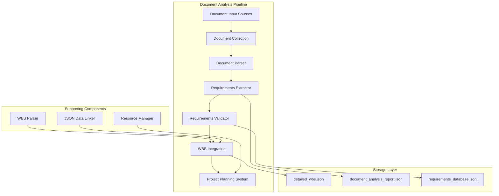
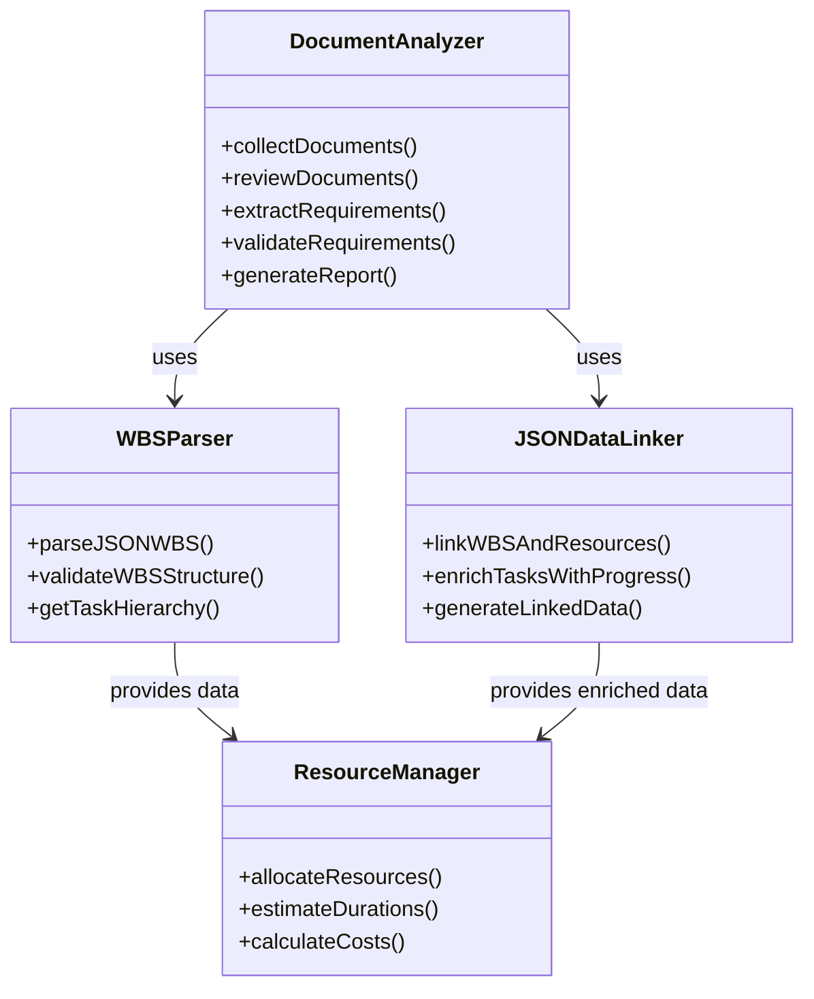
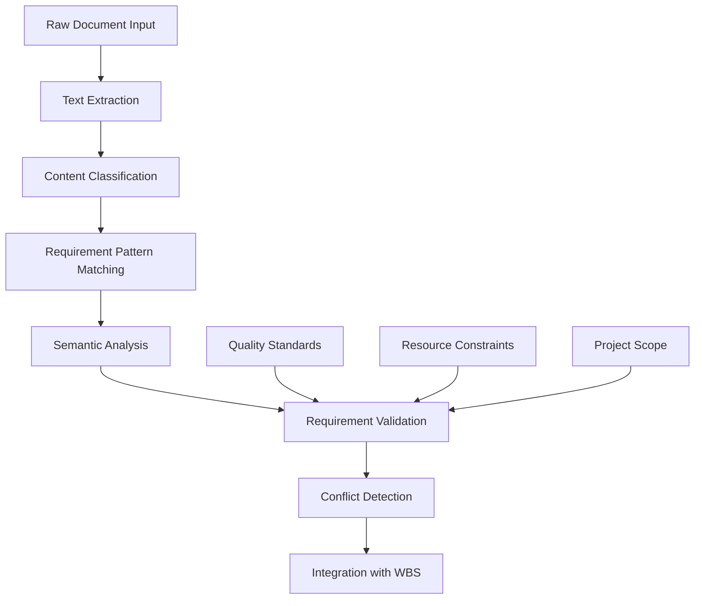
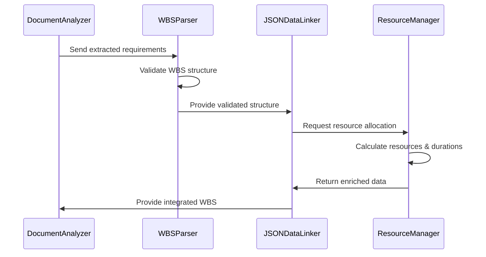
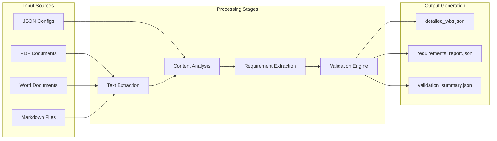
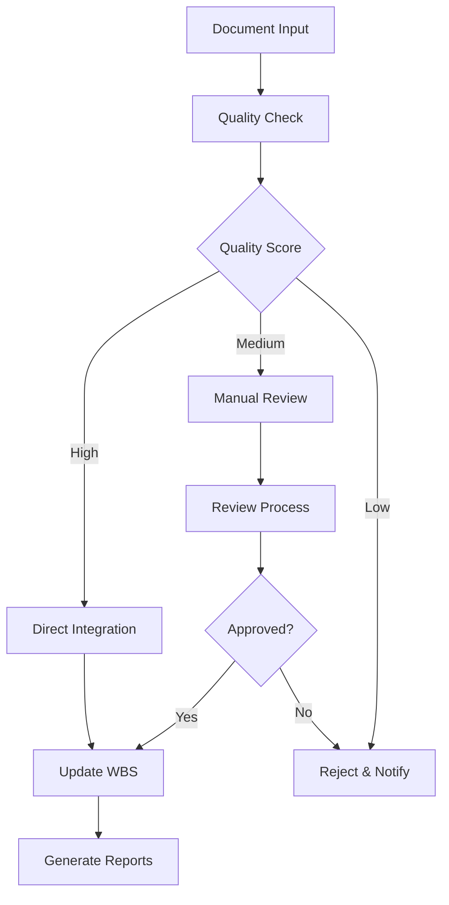

# Document Analysis System Design and Implementation Guide

## Overview

This document provides a comprehensive technical guide for the Document Analysis system implemented in the AutoProjectManagement framework. The system analyzes existing project documentation to extract requirements, validate them, and integrate them into the Work Breakdown Structure (WBS) for project planning and management.

## System Architecture

### High-Level Architecture



### Component Relationships



## Core Implementation Details

### 1. Document Collection Module

The document collection process is implemented through the `wbs_parser.py` and `wbs_aggregator.py` modules:

```python
class DocumentCollector:
    """Collects and organizes project documents for analysis"""
    
    def __init__(self, input_dir: str = "SystemInputs/user_inputs/documents"):
        self.input_dir = input_dir
        self.supported_formats = ['.pdf', '.docx', '.txt', '.md', '.json']
    
    def collect_documents(self) -> List[Dict[str, Any]]:
        """Scan directory and collect all relevant documents"""
        documents = []
        for root, dirs, files in os.walk(self.input_dir):
            for file in files:
                if any(file.endswith(ext) for ext in self.supported_formats):
                    doc_path = os.path.join(root, file)
                    documents.append({
                        'path': doc_path,
                        'type': self._get_document_type(file),
                        'metadata': self._extract_metadata(doc_path)
                    })
        return documents
```

### 2. Document Analysis Engine

The analysis engine processes documents through multiple stages:



### 3. Requirements Extraction Algorithm

```python
class RequirementsExtractor:
    """Extracts structured requirements from documents using rule-based analysis"""
    
    def __init__(self):
        self.patterns = {
            'functional': r'must|shall|should|will',
            'non_functional': r'performance|security|usability|reliability',
            'constraints': r'constraint|limitation|restriction',
            'assumptions': r'assume|assumption|presume'
        }
    
    def extract_requirements(self, document_content: str) -> List[Dict[str, Any]]:
        """Extract requirements using pattern matching and rule-based analysis"""
        requirements = []
        
        # Process each requirement type
        for req_type, pattern in self.patterns.items():
            matches = re.finditer(pattern, document_content, re.IGNORECASE)
            for match in matches:
                requirement = {
                    'type': req_type,
                    'text': self._extract_context(match, document_content),
                    'priority': self._calculate_priority(match),
                    'dependencies': self._identify_dependencies(match),
                    'wbs_mapping': self._map_to_wbs(match)
                }
                requirements.append(requirement)
        
        return requirements
    
    def _calculate_priority(self, match) -> int:
        """Calculate priority based on keyword proximity and context"""
        # Rule-based priority calculation
        context = self._get_surrounding_text(match, 50)
        
        if 'critical' in context.lower() or 'essential' in context.lower():
            return 1
        elif 'important' in context.lower() or 'required' in context.lower():
            return 2
        elif 'should' in context.lower():
            return 3
        else:
            return 4
    
    def _identify_dependencies(self, match) -> List[str]:
        """Identify dependencies based on cross-references"""
        # Simple rule-based dependency detection
        context = self._get_surrounding_text(match, 100)
        dependencies = []
        
        # Look for references to other requirements
        ref_patterns = [r'REQ-\d+', r'requirement\s+\d+', r'section\s+\d+']
        for pattern in ref_patterns:
            deps = re.findall(pattern, context, re.IGNORECASE)
            dependencies.extend(deps)
        
        return dependencies
```

### 4. WBS Integration Process

The integration process transforms extracted requirements into WBS tasks:



### 5. JSON Schema for Document Analysis

The system uses standardized JSON schemas for document analysis:

```json
{
  "$schema": "http://json-schema.org/draft-07/schema#",
  "type": "object",
  "title": "Document Analysis Schema",
  "properties": {
    "analysis_id": {
      "type": "string",
      "description": "Unique identifier for this analysis"
    },
    "documents_analyzed": {
      "type": "array",
      "items": {
        "type": "object",
        "properties": {
          "filename": {"type": "string"},
          "type": {"type": "string"},
          "size": {"type": "number"},
          "last_modified": {"type": "string", "format": "date-time"}
        }
      }
    },
    "requirements": {
      "type": "array",
      "items": {
        "type": "object",
        "properties": {
          "id": {"type": "string"},
          "text": {"type": "string"},
          "type": {"type": "string", "enum": ["functional", "non_functional", "constraint", "assumption"]},
          "priority": {"type": "integer", "minimum": 1, "maximum": 5},
          "status": {"type": "string", "enum": ["identified", "validated", "implemented", "verified"]},
          "wbs_mapping": {"type": "string"},
          "dependencies": {"type": "array", "items": {"type": "string"}}
        }
      }
    },
    "metrics": {
      "type": "object",
      "properties": {
        "total_requirements": {"type": "integer"},
        "functional_requirements": {"type": "integer"},
        "non_functional_requirements": {"type": "integer"},
        "conflicts_detected": {"type": "integer"},
        "validation_rate": {"type": "number", "minimum": 0, "maximum": 1}
      }
    }
  }
}
```

## Data Flow Architecture

### Input Processing Pipeline



### Real-time Processing Flow

```python
class RealTimeDocumentProcessor:
    """Handles real-time document analysis and updates"""
    
    def __init__(self):
        self.observers = []
        self.processing_queue = asyncio.Queue()
    
    async def process_document_async(self, document_path: str):
        """Asynchronously process a document"""
        # Extract text
        content = await self._extract_text_async(document_path)
        
        # Analyze content
        analysis = await self._analyze_content_async(content)
        
        # Update WBS
        await self._update_wbs_async(analysis)
        
        # Notify observers
        await self._notify_observers_async(analysis)
    
    def register_observer(self, observer):
        """Register an observer for real-time updates"""
        self.observers.append(observer)
```

## Advanced Features

### 1. Rule-Based Requirement Analysis

The system uses rule-based analysis for requirement extraction:

```python
class RuleBasedAnalyzer:
    """Uses rule-based analysis for requirement extraction"""
    
    def __init__(self):
        self.rules = {
            'priority_keywords': {
                'critical': 1, 'essential': 1, 'must': 1,
                'important': 2, 'required': 2, 'shall': 2,
                'should': 3, 'recommended': 3,
                'may': 4, 'optional': 4, 'could': 4
            },
            'requirement_patterns': {
                'functional': [
                    r'The system (must|shall|should) be able to',
                    r'Users (must|shall|should) be able to',
                    r'The system (must|shall|should) provide'
                ],
                'non_functional': [
                    r'The system (must|shall|should) respond within',
                    r'The system (must|shall|should) support',
                    r'The system (must|shall|should) handle'
                ]
            }
        }
    
    def analyze_requirements(self, text: str) -> List[Dict[str, Any]]:
        """Analyze requirements using rule-based approach"""
        requirements = []
        
        for req_type, patterns in self.rules['requirement_patterns'].items():
            for pattern in patterns:
                matches = re.finditer(pattern, text, re.IGNORECASE)
                for match in matches:
                    requirement = {
                        'type': req_type,
                        'text': match.group(0),
                        'priority': self._calculate_priority_from_text(match.group(0)),
                        'location': match.span()
                    }
                    requirements.append(requirement)
        
        return requirements
```

### 2. Quality Assurance Integration



### 3. Performance Monitoring

```python
class PerformanceMonitor:
    """Monitors document analysis performance"""
    
    def __init__(self):
        self.metrics = {
            'processing_time': [],
            'accuracy_scores': [],
            'error_rates': [],
            'throughput': []
        }
    
    def track_processing(self, document_path: str, start_time: float, end_time: float):
        """Track processing performance metrics"""
        processing_time = end_time - start_time
        self.metrics['processing_time'].append(processing_time)
        
        # Calculate throughput
        file_size = os.path.getsize(document_path)
        throughput = file_size / processing_time
        self.metrics['throughput'].append(throughput)
    
    def generate_performance_report(self) -> Dict[str, Any]:
        """Generate comprehensive performance report"""
        return {
            'average_processing_time': np.mean(self.metrics['processing_time']),
            'accuracy_rate': np.mean(self.metrics['accuracy_scores']),
            'error_rate': np.mean(self.metrics['error_rates']),
            'peak_throughput': max(self.metrics['throughput']),
            'recommendations': self._generate_recommendations()
        }
```

## Configuration and Deployment

### Environment Configuration

```yaml
# config/document_analysis.yaml
document_analysis:
  input_directories:
    - "SystemInputs/user_inputs/documents"
    - "SystemInputs/user_inputs/requirements"
  
  processing:
    max_file_size: "50MB"
    supported_formats: ["pdf", "docx", "txt", "md", "json"]
    parallel_processing: true
    max_workers: 4
  
  rule_engine:
    enabled: true
    rule_file: "config/requirement_rules.json"
  
  output:
    detailed_wbs_path: "SystemInputs/system_generated/detailed_wbs.json"
    analysis_report_path: "SystemOutputs/document_analysis_report.json"
    validation_summary_path: "SystemOutputs/validation_summary.json"
```

### Docker Deployment

```dockerfile
FROM python:3.9-slim

WORKDIR /app

# Install dependencies
COPY requirements.txt .
RUN pip install -r requirements.txt

# Copy application code
COPY autoprojectmanagement/ ./autoprojectmanagement/
COPY Docs/ ./Docs/

# Set environment variables
ENV PYTHONPATH=/app
ENV DOCUMENT_ANALYSIS_CONFIG=/app/config/document_analysis.yaml

# Run the application
CMD ["python", "-m", "autoprojectmanagement.main_modules.wbs_parser"]
```

## Testing and Validation

### Unit Testing Framework

```python
import pytest
from autoprojectmanagement.main_modules.wbs_parser import WBSParser

class TestDocumentAnalysis:
    
    def test_requirement_extraction(self):
        """Test requirement extraction from sample document"""
        extractor = RequirementsExtractor()
        content = "The system must support user authentication and should provide role-based access control."
        
        requirements = extractor.extract_requirements(content)
        
        assert len(requirements) == 2
        assert requirements[0]['type'] == 'functional'
        assert 'authentication' in requirements[0]['text'].lower()
    
    def test_wbs_integration(self):
        """Test integration of requirements into WBS"""
        parser = WBSParser()
        requirements = [
            {'id': 'REQ-001', 'text': 'User authentication', 'priority': 1}
        ]
        
        wbs = parser.integrate_requirements(requirements)
        assert 'subtasks' in wbs
        assert any('authentication' in task['name'].lower() for task in wbs['subtasks'])
```

### Integration Testing

```bash
# Run integration tests
pytest tests/integration/test_document_analysis.py -v

# Performance benchmarks
python -m pytest
