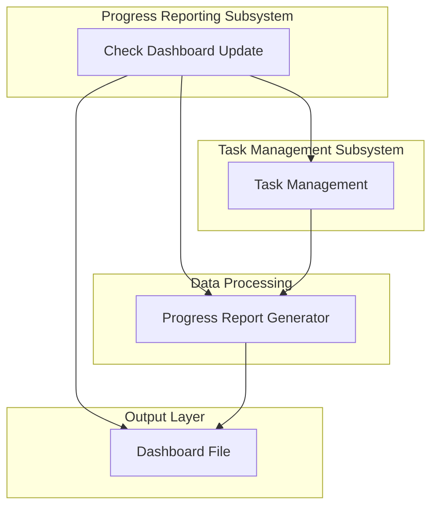
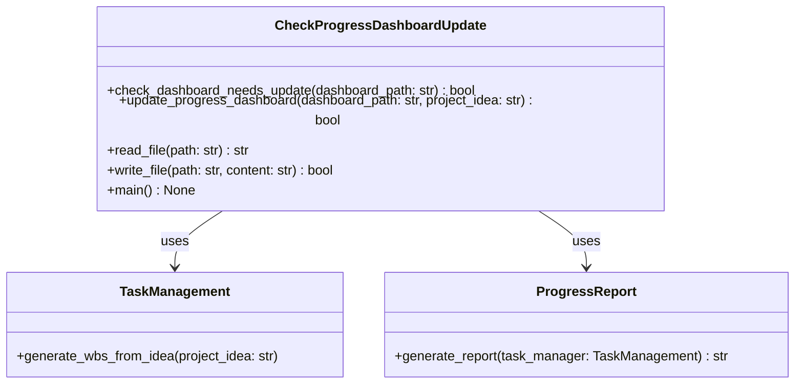
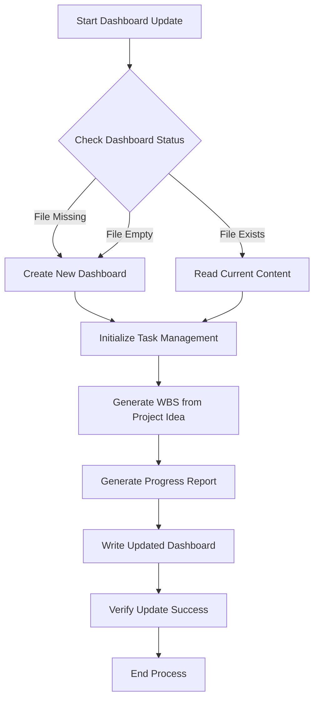

# Progress Dashboard Update Module Documentation

## Level 1: Overview and Purpose

### Module Overview
The `check_progress_dashboard_update.py` module is a core component of the AutoProjectManagement system's progress reporting subsystem. It provides automated functionality for checking, updating, and maintaining project progress dashboards based on real-time project data and task management information.

### Primary Purpose
This module serves as the orchestration layer between task management systems and progress visualization, ensuring that project dashboards remain current and accurately reflect the latest project status, task completions, and overall progress metrics.

### Key Responsibilities
- Monitor dashboard file status and content freshness
- Coordinate with task management systems to gather current project data
- Generate updated progress reports and visualizations
- Maintain dashboard file integrity and version control
- Provide command-line interface for manual dashboard updates

## Level 2: Architecture and Design

### System Architecture Context



### Module Internal Architecture



### Data Flow Diagram



## Level 3: Detailed Implementation and Algorithms

### Core Functions and Methods

#### `check_dashboard_needs_update(dashboard_path: str) → bool`
**Purpose**: Determines if a dashboard file requires updating based on file existence and content analysis.

**Algorithm**:
1. Check if file exists at specified path
2. If file doesn't exist → return True (update needed)
3. If file exists, read content
4. If content is empty or whitespace-only → return True
5. Otherwise → return False (no update needed)

**Complexity**: O(n) where n is file size
**Error Handling**: Handles file not found and permission errors gracefully

#### `update_progress_dashboard(dashboard_path: str, project_idea: str) → bool`
**Purpose**: Orchestrates the complete dashboard update process from data collection to file writing.

**Process Flow**:
1. Read current dashboard state (baseline for comparison)
2. Initialize TaskManagement system
3. Generate Work Breakdown Structure from project idea
4. Generate comprehensive progress report
5. Write updated content to dashboard file
6. Verify update success by comparing before/after content

**Mathematical Model**:
The update success is determined by:
```
Success = (write_operation_success ∧ content_changed ∧ ¬content_corrupted)
```

Where:
- `write_operation_success`: File write operation completed without errors
- `content_changed`: Content length or content itself changed significantly
- `¬content_corrupted`: No data corruption detected during write process

#### `read_file(path: str) → str`
**Purpose**: Safe file reading with comprehensive error handling.

**Error Handling Matrix**:
| Error Type | Handling Strategy | Log Level |
|------------|-------------------|-----------|
| FileNotFoundError | Return empty string | WARNING |
| PermissionError | Re-raise exception | ERROR |
| Other Exceptions | Return empty string | ERROR |

#### `write_file(path: str, content: str) → bool`
**Purpose**: Safe file writing with directory creation and error handling.

**Algorithm**:
1. Create parent directories if they don't exist
2. Open file for writing with UTF-8 encoding
3. Write content
4. Return success status

### Configuration Parameters

| Parameter | Type | Default | Description |
|-----------|------|---------|-------------|
| DEFAULT_DASHBOARD_PATH | str | "docs/project_management/progress_dashboard.md" | Default dashboard file location |
| ENCODING | str | "utf-8" | File encoding standard |
| LOG_FORMAT | str | "%(asctime)s - %(name)s - %(levelname)s - %(message)s" | Log message format |

### Performance Characteristics

**Time Complexity**:
- File operations: O(n) where n is file size
- Dashboard update: O(m + n) where m is project complexity, n is file size
- Memory usage: Linear with file size

**Space Complexity**:
- Primary: O(n) for file content storage
- Secondary: O(m) for task management data

### Integration Points

**Dependencies**:
- `TaskManagement` from `task_workflow_management.task_management`
- `generate_report` from `progress_reporting.progress_report`
- Standard Python libraries: `logging`, `os`, `sys`, `datetime`

**API Contracts**:
- Expects TaskManagement to provide WBS generation capabilities
- Expects ProgressReport to return formatted report strings
- Returns boolean success indicators for all operations

### Usage Examples

**Basic Usage**:
```python
from autoprojectmanagement.main_modules.progress_reporting.check_progress_dashboard_update import update_progress_dashboard

success = update_progress_dashboard(
    dashboard_path="my_project_dashboard.md",
    project_idea="Develop AI-powered task management system"
)
```

**Command Line Interface**:
```bash
# Update default dashboard
python check_progress_dashboard_update.py

# Update custom dashboard with specific project
python check_progress_dashboard_update.py custom_dashboard.md "Build Mobile Application"
```

### Error Scenarios and Handling

| Scenario | Detection Method | Recovery Strategy |
|----------|------------------|------------------|
| File not found | Exception catching | Create new file or use default |
| Permission denied | Exception analysis | Log error and abort operation |
| Invalid project idea | Input validation | Use default project idea |
| Report generation failure | Return value checking | Log error and return failure |
| Write operation failure | Exception catching | Retry or abort with error |

### Testing Strategy

**Unit Tests Should Cover**:
- File existence checking under various conditions
- Content validation logic
- Integration with TaskManagement system
- Error handling scenarios
- Success/failure reporting

**Integration Tests**:
- End-to-end dashboard update process
- File system interaction testing
- Cross-module dependency validation

### Maintenance Considerations

**Version Compatibility**:
- Maintains backward compatibility with existing dashboard formats
- Uses standardized file encoding (UTF-8)
- Follows semantic versioning (current: 2.0.0)

**Monitoring Requirements**:
- Log all update operations with timestamps
- Track success/failure rates
- Monitor file size changes over time

### Security Considerations

- Validates file paths to prevent directory traversal
- Uses safe file handling practices
- Implements proper error handling to avoid information leakage
- Follows principle of least privilege for file operations

This module represents a critical component in the AutoProjectManagement system's reporting infrastructure, providing reliable and automated dashboard maintenance capabilities while maintaining high standards of software engineering excellence.
