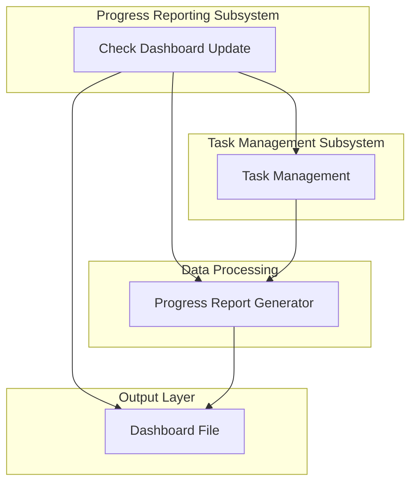
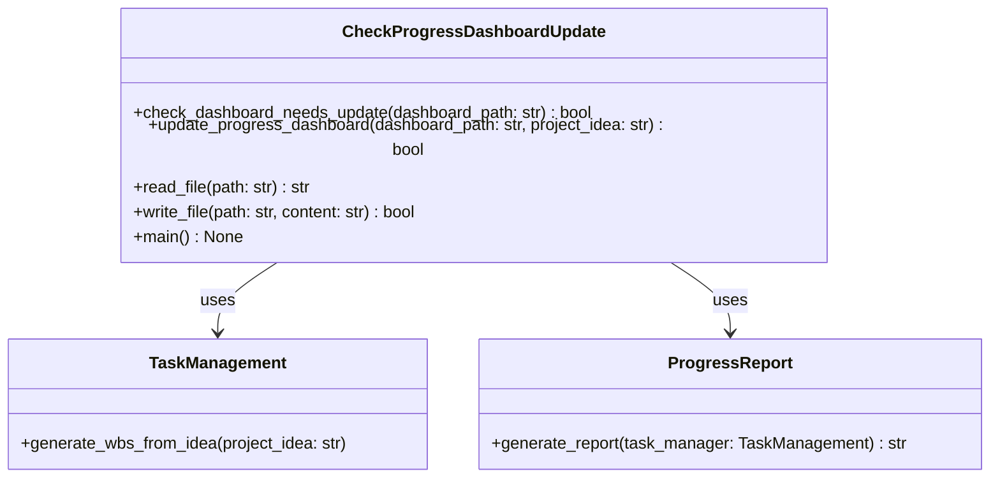
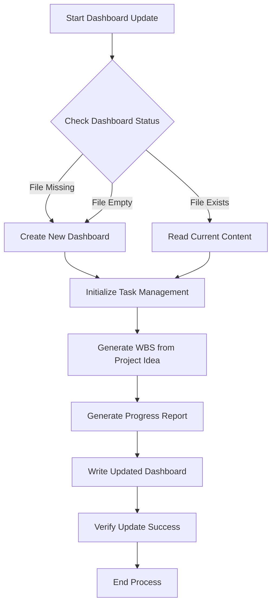

# Progress Dashboard Update Module Documentation

## Level 1: Overview and Purpose

### Module Overview
The `check_progress_dashboard_update.py` module is a core component of the AutoProjectManagement system's progress reporting subsystem. It provides automated functionality for checking, updating, and maintaining project progress dashboards based on real-time project data and task management information.

### Primary Purpose
This module serves as the orchestration layer between task management systems and progress visualization, ensuring that project dashboards remain current and accurately reflect the latest project status, task completions, and overall progress metrics.

### Key Responsibilities
- Monitor dashboard file status and content freshness
- Coordinate with task management systems to gather current project data
- Generate updated progress reports and visualizations
- Maintain dashboard file integrity and version control
- Provide command-line interface for manual dashboard updates

## Level 2: Architecture and Design

### System Architecture Context

### Module Internal Architecture

### Data Flow Diagram

## Level 3: Detailed Implementation and Algorithms

### Core Functions and Methods

#### `check_dashboard_needs_update(dashboard_path: str) → bool`
**Purpose**: Determines if a dashboard file requires updating based on file existence and content analysis.

**Algorithm**:
1. Check if file exists at specified path
2. If file doesn't exist → return True (update needed)
3. If file exists, read content
4. If content is empty or whitespace-only → return True
5. Otherwise → return False (no update needed)

**Complexity**: O(n) where n is file size
**Error Handling**: Handles file not found and permission errors gracefully

#### `update_progress_dashboard(dashboard_path: str, project_idea: str) → bool`
**Purpose**: Orchestrates the complete dashboard update process from data collection to file writing.

**Process Flow**:
1. Read current dashboard state (baseline for comparison)
2. Initialize TaskManagement system
3. Generate Work Breakdown Structure from project idea
4. Generate comprehensive progress report
5. Write updated content to dashboard file
