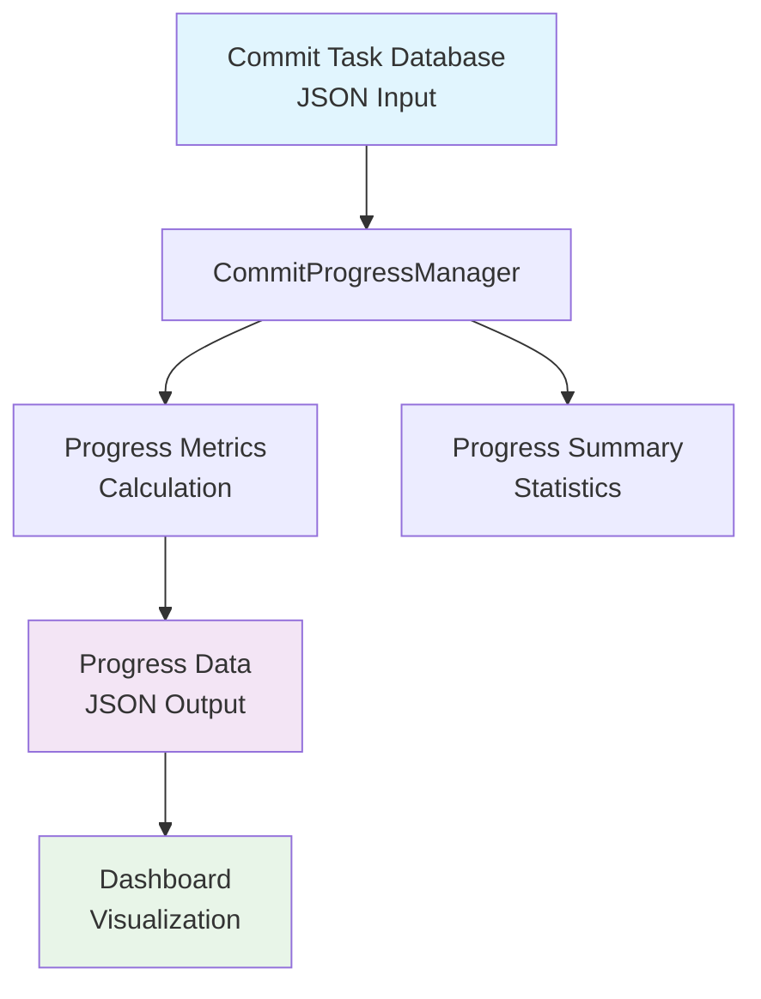
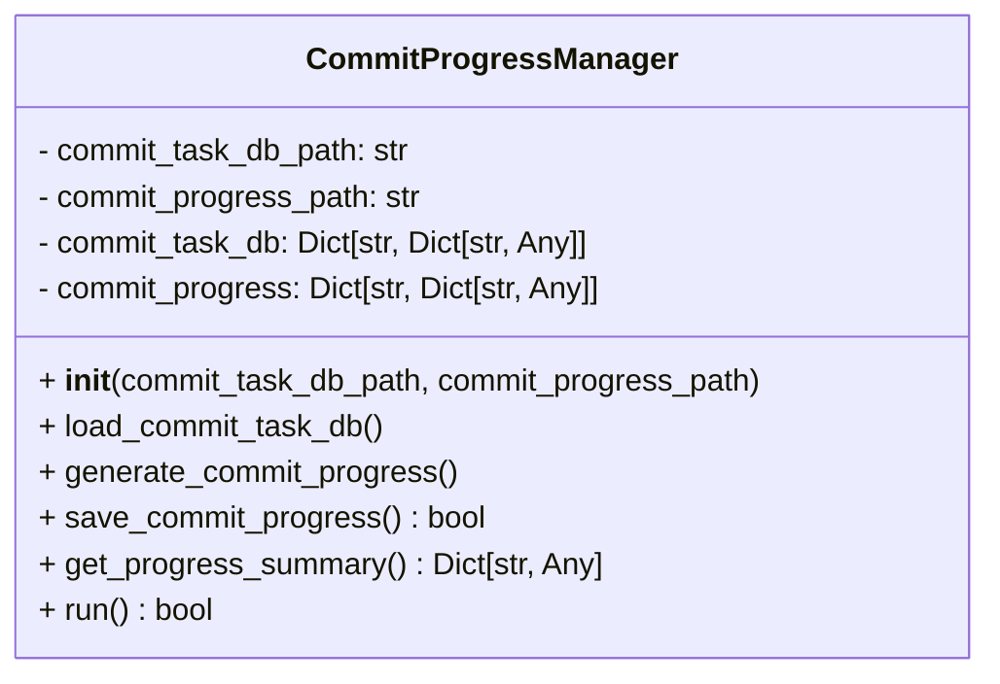
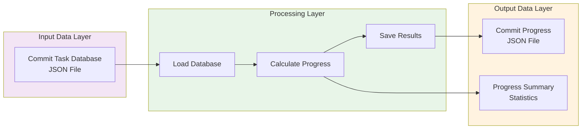

# Commit Progress Manager Module Documentation

## Level 1: Executive Overview

### Module Purpose and Functionality
The `commit_progress_manager` module provides comprehensive commit progress tracking and management capabilities within the AutoProjectManagement system. It serves as the central component for analyzing commit-task relationships, calculating progress metrics, and generating actionable insights for project monitoring.

### Key Responsibilities
- **Data Loading**: Loads commit task database from JSON storage
- **Progress Calculation**: Computes commit-based progress metrics per task
- **Data Persistence**: Saves progress data for dashboard consumption
- **Summary Generation**: Provides statistical overview of commit activity

### Business Value
This module enables real-time tracking of development progress through commit analysis, providing project managers with quantitative metrics to assess task completion rates and identify potential bottlenecks in the development workflow.

---

## Level 2: Technical Architecture

### System Integration


### Class Structure


### Data Flow Architecture


---

## Level 3: Detailed Implementation

### Core Algorithm: Progress Calculation

#### Mathematical Model
The progress calculation follows a linear progression model:

```
Progress Percentage = min(Commit Count × Progress Multiplier, Maximum Progress)
```

Where:
- **Progress Multiplier** = 10 (configurable constant)
- **Maximum Progress** = 100% (upper bound)

#### Formula Implementation
```python
progress_percent = min(
    commit_count * COMMIT_PROGRESS_MULTIPLIER,
    MAX_PROGRESS_PERCENTAGE
)
```

### Data Structures

#### Commit Task Database Schema
```json
{
  "commit_hash": {
    "task_id": "string",
    "commit_date": "YYYY-MM-DDTHH:MM:SS"
  }
}
```

#### Progress Data Schema
```json
{
  "task_id": {
    "commit_count": integer,
    "last_commit_date": "ISO8601 timestamp",
    "progress_percent": float
  }
}
```

### Method Specifications

#### `load_commit_task_db()`
**Purpose**: Load commit task database from JSON file
**Error Handling**: 
- Handles file not found scenarios gracefully
- Manages JSON parsing errors with appropriate logging
- Returns empty dictionary on failure

#### `generate_commit_progress()`
**Algorithm Complexity**: O(n) where n is number of commits
**Data Processing**:
1. Iterates through all commits in database
2. Groups commits by task ID
3. Calculates commit counts and latest dates
4. Computes progress percentages

#### `save_commit_progress()`
**File Operations**: 
- Creates directory structure if needed
- Writes JSON with proper indentation and encoding
- Returns boolean success status

#### `get_progress_summary()`
**Statistical Calculations**:
- Total tasks with commits
- Total commits across all tasks
- Average progress percentage
- Detailed task progress list

### Configuration Constants

| Constant | Value | Description |
|----------|-------|-------------|
| `DEFAULT_COMMIT_TASK_DB_PATH` | `'JSonDataBase/OutPuts/commit_task_database.json'` | Default input file path |
