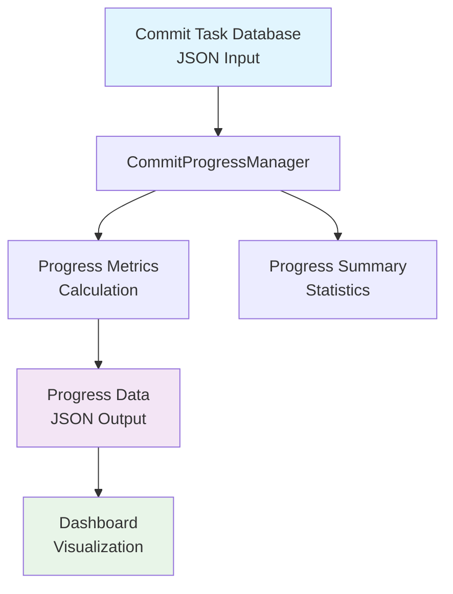
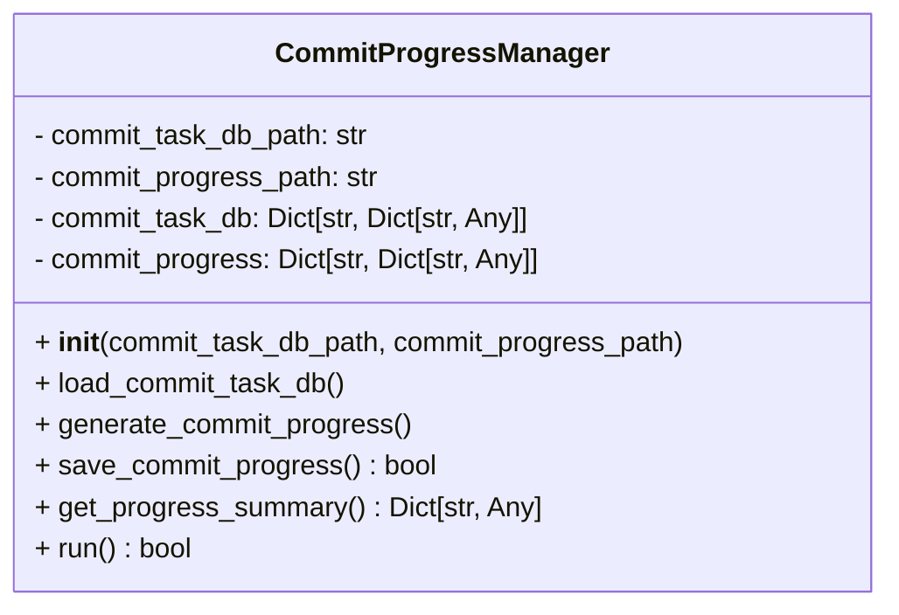
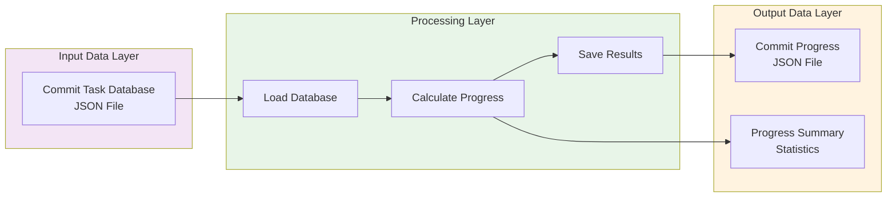

# Commit Progress Manager Module Documentation

## Level 1: Executive Overview

### Module Purpose and Functionality
The `commit_progress_manager` module provides comprehensive commit progress tracking and management capabilities within the AutoProjectManagement system. It serves as the central component for analyzing commit-task relationships, calculating progress metrics, and generating actionable insights for project monitoring.

### Key Responsibilities
- **Data Loading**: Loads commit task database from JSON storage
- **Progress Calculation**: Computes commit-based progress metrics per task
- **Data Persistence**: Saves progress data for dashboard consumption
- **Summary Generation**: Provides statistical overview of commit activity

### Business Value
This module enables real-time tracking of development progress through commit analysis, providing project managers with quantitative metrics to assess task completion rates and identify potential bottlenecks in the development workflow.

---

## Level 2: Technical Architecture

### System Integration


### Class Structure


### Data Flow Architecture


---

## Level 3: Detailed Implementation

### Core Algorithm: Progress Calculation

#### Mathematical Model
The progress calculation follows a linear progression model:

```
Progress Percentage = min(Commit Count × Progress Multiplier, Maximum Progress)
```

Where:
- **Progress Multiplier** = 10 (configurable constant)
- **Maximum Progress** = 100% (upper bound)

#### Formula Implementation
```python
progress_percent = min(
    commit_count * COMMIT_PROGRESS_MULTIPLIER,
    MAX_PROGRESS_PERCENTAGE
)
```

### Data Structures

#### Commit Task Database Schema
```json
{
  "commit_hash": {
    "task_id": "string",
    "commit_date": "YYYY-MM-DDTHH:MM:SS"
  }
}
```

#### Progress Data Schema
```json
{
  "task_id": {
    "commit_count": integer,
    "last_commit_date": "ISO8601 timestamp",
    "progress_percent": float
  }
}
```

### Method Specifications

#### `load_commit_task_db()`
**Purpose**: Load commit task database from JSON file
**Error Handling**: 
- Handles file not found scenarios gracefully
- Manages JSON parsing errors with appropriate logging
- Returns empty dictionary on failure

#### `generate_commit_progress()`
**Algorithm Complexity**: O(n) where n is number of commits
**Data Processing**:
1. Iterates through all commits in database
2. Groups commits by task ID
3. Calculates commit counts and latest dates
4. Computes progress percentages

#### `save_commit_progress()`
**File Operations**: 
- Creates directory structure if needed
- Writes JSON with proper indentation and encoding
- Returns boolean success status

#### `get_progress_summary()`
**Statistical Calculations**:
- Total tasks with commits
- Total commits across all tasks
- Average progress percentage
- Detailed task progress list

### Configuration Constants

| Constant | Value | Description |
|----------|-------|-------------|
| `DEFAULT_COMMIT_TASK_DB_PATH` | `'JSonDataBase/OutPuts/commit_task_database.json'` | Default input file path |
| `DEFAULT_COMMIT_PROGRESS_PATH` | `'JSonDataBase/OutPuts/commit_progress.json'` | Default output file path |
| `DATETIME_FORMAT` | `'%Y-%m-%dT%H:%M:%S'` | DateTime parsing format |
| `MAX_PROGRESS_PERCENTAGE` | `100` | Maximum progress percentage |
| `COMMIT_PROGRESS_MULTIPLIER` | `10` | Progress calculation multiplier |

---

## Usage Examples

### Basic Usage Pattern
```python
from autoprojectmanagement.main_modules.quality_commit_management.commit_progress_manager import CommitProgressManager

# Initialize manager with default paths
manager = CommitProgressManager()

# Run complete workflow
success = manager.run()
if success:
    print("Commit progress updated successfully")
```

### Custom Configuration
```python
# Custom file paths
manager = CommitProgressManager(
    commit_task_db_path='custom/path/commit_tasks.json',
    commit_progress_path='custom/path/progress_data.json'
)

# Load data and generate progress
manager.load_commit_task_db()
manager.generate_commit_progress()

# Get progress summary
summary = manager.get_progress_summary()
print(f"Total tasks: {summary['total_tasks']}")
print(f"Average progress: {summary['average_progress']}%")
```

### Error Handling Example
```python
try:
    manager = CommitProgressManager()
    if not manager.run():
        print("Failed to update commit progress")
        # Handle failure scenario
except Exception as e:
    print(f"Unexpected error: {e}")
    # Implement fallback logic
```

---

## Performance Characteristics

### Time Complexity
- **Database Loading**: O(1) file access + O(n) JSON parsing
- **Progress Generation**: O(n) where n is number of commits
- **Data Saving**: O(m) where m is number of tasks

### Space Complexity
- **Memory Usage**: O(n + m) where n is commits, m is tasks
- **Disk Storage**: Proportional to number of tasks with progress data

### Optimization Considerations
- **Batch Processing**: Suitable for large datasets
- **Memory Efficiency**: Processes data in streams when possible
- **Error Resilience**: Graceful degradation on file errors

---

## Integration Points

### Input Dependencies
- Commit Task Database JSON file
- System file I/O capabilities
- DateTime parsing utilities

### Output Consumers
- Dashboard visualization components
- Reporting modules
- Progress monitoring systems

### API Compatibility
- JSON-based data exchange
- Standard Python data types
- Consistent error handling patterns

---

## Error Handling and Recovery

### Common Error Scenarios
1. **File Not Found**: Creates empty data structures
2. **JSON Parse Errors**: Logs errors and continues
3. **Permission Issues**: Returns failure status
4. **Invalid Date Formats**: Skips problematic entries

### Recovery Strategies
- **Graceful Degradation**: Continues processing valid data
- **Error Logging**: Comprehensive error reporting
- **Status Returns**: Boolean success indicators
- **Exception Handling**: Structured error management

---

## Testing Guidelines

### Unit Test Coverage
- Database loading with various file states
- Progress calculation accuracy
- File saving functionality
- Error condition handling
- Summary statistics computation

### Integration Testing
- End-to-end workflow validation
- File system interaction testing
- Data consistency checks
- Performance benchmarking

### Test Data Requirements
- Valid commit task databases
- Edge case scenarios
- Large dataset performance tests
- Error condition simulations

---

## Maintenance Considerations

### Version Compatibility
- Maintains backward compatibility with data formats
- Follows semantic versioning for API changes
- Documents breaking changes in release notes

### Extension Points
- Custom progress calculation algorithms
- Alternative data storage backends
- Enhanced reporting capabilities
- Real-time progress updates

### Monitoring Requirements
- File access performance metrics
- Memory usage monitoring
- Error rate tracking
- Processing time measurements

---

## Credits and References

### Technical Dependencies
- Python Standard Library (json, datetime, os)
- AutoProjectManagement framework conventions
- JSON data interchange standards

### Development Standards
- Follows PEP 8 coding conventions
- Implements comprehensive docstring documentation
- Maintains type hint consistency
- Adheres to error handling best practices

### Related Documentation
- AutoProjectManagement System Architecture
- JSON Data Format Specifications
- Progress Tracking Methodology
- Quality Management Framework

---

*This documentation follows Pressman's software engineering standards and provides three levels of detail for comprehensive understanding of the Commit Progress Manager module.*
