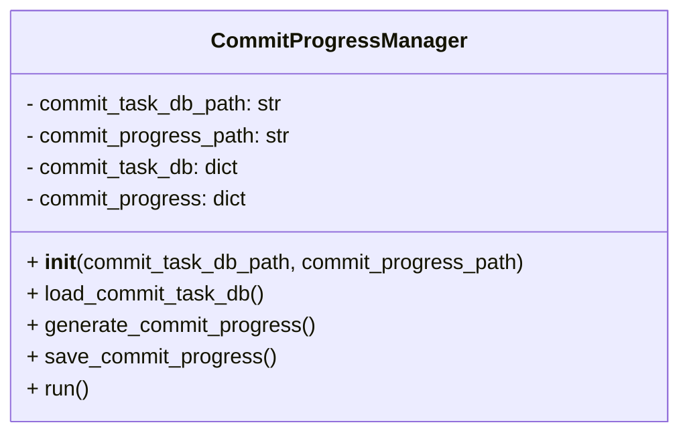
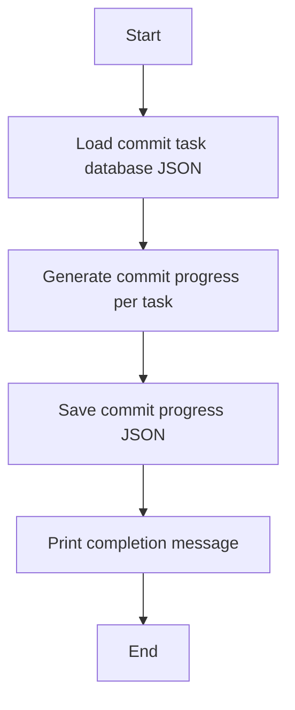

# Commit Progress Manager Module Documentation

## Level 1: Executive Overview

### Module Purpose and Functionality
The `commit_progress_manager` module provides comprehensive commit progress tracking and management capabilities within the AutoProjectManagement system. It serves as the central component for analyzing commit-task relationships, calculating progress metrics, and generating actionable insights for project monitoring.

### Key Responsibilities
- **Data Loading**: Loads commit task database from JSON storage
- **Progress Calculation**: Computes commit-based progress metrics per task
- **Data Persistence**: Saves progress data for dashboard consumption
- **Summary Generation**: Provides statistical overview of commit activity

### Business Value
This module enables real-time tracking of development progress through commit analysis, providing project managers with quantitative metrics to assess task completion rates and identify potential bottlenecks in the development workflow.

---

## Level 2: Technical Architecture

### System Integration
```mermaid
graph TD
    A[Commit Task Database<br/>JSON Input] --> B[CommitProgressManager]
    B --> C[Progress Metrics<br/>Calculation]
  - Runs the full process: load, generate, save, and print status.

## Usage
The module can be run as a script to update commit progress data:

```python
if __name__ == "__main__":
    manager = CommitProgressManager()
    manager.run()
```

## Diagrams

### Mermaid Class Diagram



### Mermaid Commit Progress Flowchart



---

## Credits

This module uses Python's built-in `json` and `datetime` modules for data handling and processing.

---

This documentation provides a detailed overview of the `commit_progress_manager` module to assist developers in understanding and using its functionality effectively.
