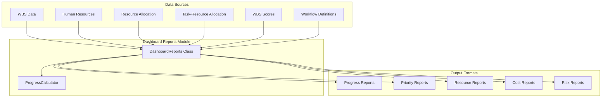
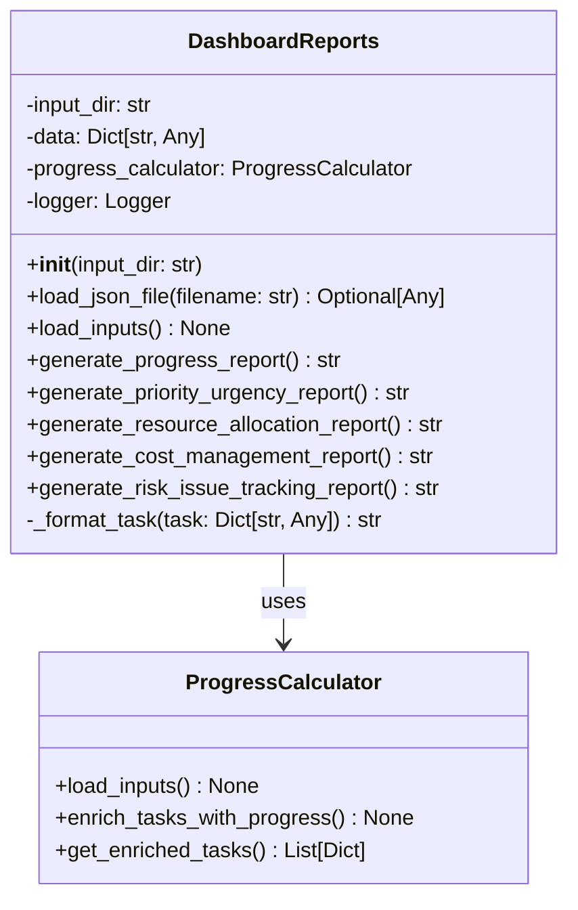
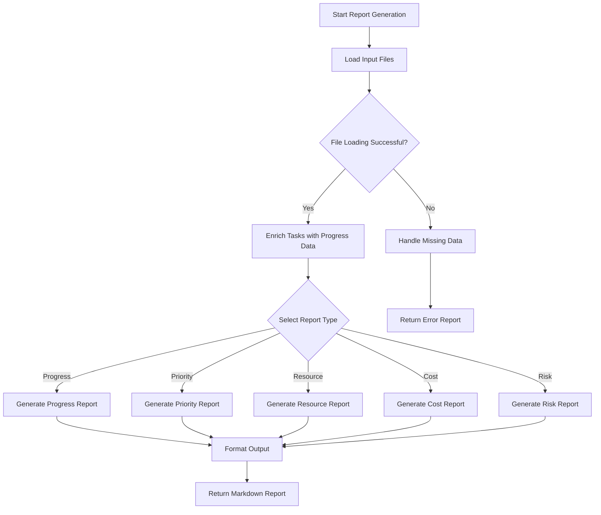

# Dashboard Reports Module Documentation

## Level 1: Overview and Purpose

### Module Overview
The `dashboards_reports.py` module serves as the central reporting engine for the AutoProjectManagement system. It provides comprehensive dashboard generation capabilities across multiple project management domains including progress tracking, resource allocation, cost management, and risk analysis.

### Primary Purpose
This module transforms raw project data into actionable insights through structured, markdown-formatted reports. It acts as the bridge between data collection systems and human-readable project dashboards, enabling stakeholders to make informed decisions based on real-time project metrics.

### Key Responsibilities
- Generate comprehensive progress reports with task statistics
- Create priority and urgency analysis using Eisenhower matrix methodology
- Produce resource allocation and management reports
- Generate cost management and budget tracking reports
- Create risk and issue tracking dashboards
- Handle data loading and validation from multiple JSON sources

## Level 2: Architecture and Design

### System Architecture Context



### Module Internal Architecture



### Data Flow Diagram



## Level 3: Detailed Implementation and Algorithms

### Core Classes and Methods

#### `DashboardReports` Class
**Purpose**: Main orchestrator class for all dashboard reporting functionality.

**Key Attributes**:
- `input_dir`: Directory path for JSON input files
- `data`: Dictionary containing all loaded project data
- `progress_calculator`: Instance for progress calculations
- `logger`: Logging instance for error tracking

#### `load_json_file(filename: str) → Optional[Any]`
**Purpose**: Safe JSON file loading with comprehensive error handling.

**Algorithm**:
1. Handle special case for `wbs_scores.json` with fixed path
2. Construct full file path from input directory
3. Check file existence
4. Load and parse JSON content with UTF-8 encoding
5. Handle JSON decoding errors and other exceptions

**Error Handling Matrix**:
| Error Type | Handling Strategy | Log Level |
|------------|-------------------|-----------|
| FileNotFoundError | Return None | WARNING |
| JSONDecodeError | Return None | ERROR |
| Other Exceptions | Return None | ERROR |

#### `load_inputs() → None`
**Purpose**: Load all required input files and initialize data structures.

**Files Loaded**:
- `detailed_wbs.json`: Work breakdown structure
- `human_resources.json`: Resource information  
- `resource_allocation.json`: Resource assignments
- `task_resource_allocation.json`: Task-resource mappings
- `wbs_scores.json`: WBS scoring data
- `workflow_definition.json`: Workflow definitions

**Process**:
1. Iterate through required file list
2. Load each file using `load_json_file`
3. Store data in class `data` dictionary
4. Enrich tasks with progress information

#### Report Generation Methods

##### `generate_progress_report() → str`
**Purpose**: Create comprehensive progress dashboard with task statistics.

**Metrics Calculated**:
- Total task count
- Completed tasks count
- In-progress tasks count  
- Pending tasks count
- Overall progress percentage
- Individual task details with status and progress

**Mathematical Model**:
```
Progress Percentage = (Completed Tasks / Total Tasks) × 100
```

##### `generate_priority_urgency_report() → str`
**Purpose**: Generate priority analysis using Eisenhower matrix methodology.

**Algorithm**:
1. Sort tasks by importance and urgency
2. Identify top important and urgent tasks
3. Categorize tasks into Eisenhower quadrants:
   - Urgent & Important
   - Urgent & Not Important  
   - Not Urgent & Important
   - Not Urgent & Not Important

**Scoring Formula**:
```
Task Score = (Importance × 0.6) + (Urgency × 0.4)
```

##### `generate_resource_allocation_report() → str`
**Purpose**: Analyze and report on resource allocation across tasks.

**Calculations**:
- Total allocation percentage per resource
- Resource utilization summary
- Allocation distribution analysis

##### `generate_cost_management_report() → str`
**Purpose**: Generate cost analysis based on WBS scores.

**Metrics**:
- Total project cost
- Individual WBS item costs
- Cost distribution analysis

##### `generate_risk_issue_tracking_report() → str`
**Purpose**: Identify and report risks and issues from workflow definitions.

**Analysis**:
- Risk identification and categorization
- Issue tracking and prioritization
- Workflow anomaly detection

### Configuration Parameters

| Parameter | Type | Default | Description |
|-----------|------|---------|-------------|
| DEFAULT_INPUT_DIR | str | 'JSonDataBase/Inputs/UserInputs' | Default input directory |
| MAX_IMPORTANT_TASKS | int | 10 | Maximum important tasks to display |
| MAX_URGENT_TASKS | int | 10 | Maximum urgent tasks to display |
| PROGRESS_THRESHOLD | float | 0.5 | Threshold for urgency/importance categorization |
| IMPORTANCE_WEIGHT | float | 0.6 | Weight for importance in scoring |
| URGENCY_WEIGHT | float | 0.4 | Weight for urgency in scoring |
| SCORE_PRECISION | int | 2 | Decimal precision for scores |
| PERCENTAGE_PRECISION | int | 1 | Decimal precision for percentages |

