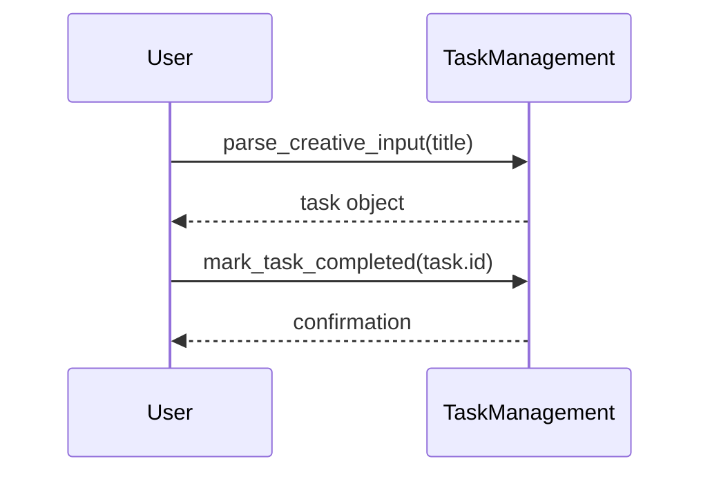

# Important Tasks Module Documentation

## Level 1: Executive Overview

### Module Purpose and Functionality
The `do_important_tasks` module provides a comprehensive system for managing and prioritizing important tasks within the AutoProjectManagement framework. It focuses on strategic task management, prioritization algorithms, and advanced scheduling capabilities for high-value activities.

### Business Value
This module enables organizations to effectively identify, prioritize, and execute important tasks that deliver maximum strategic value. By providing sophisticated prioritization and scheduling capabilities, it helps teams focus on high-impact activities and optimize resource allocation for critical work.

---

## Level 2: Technical Architecture

### System Integration Architecture
```mermaid
graph TB
    subgraph InputLayer [Input Sources]
        A[Task Configuration]
        B[Priority Settings]
        C[Strategic Objectives]
    end
    
    subgraph ProcessingLayer [Processing Engine]
        D[ImportantTaskManager<br/>Core Engine]
        E[Task Prioritization<br/>Strategic Value Analysis]
```mermaid
flowchart TD
    Start --> CreateTM[Create TaskManagement instance]
    CreateTM --> DefineTasks[Define 15 important task titles]
    DefineTasks --> ParseTasks[Parse titles into tasks]
    ParseTasks --> CompleteTasks[Mark tasks as completed]
    CompleteTasks --> PrintSummary[Print summary of completed tasks]
    PrintSummary --> End
```

### Mermaid Task Completion Sequence Diagram



---

## Credits

This module depends on the `TaskManagement` class for task parsing and status management.

---

This documentation provides a detailed overview of the `do_important_tasks` module to assist developers in understanding and using its functionality effectively.
