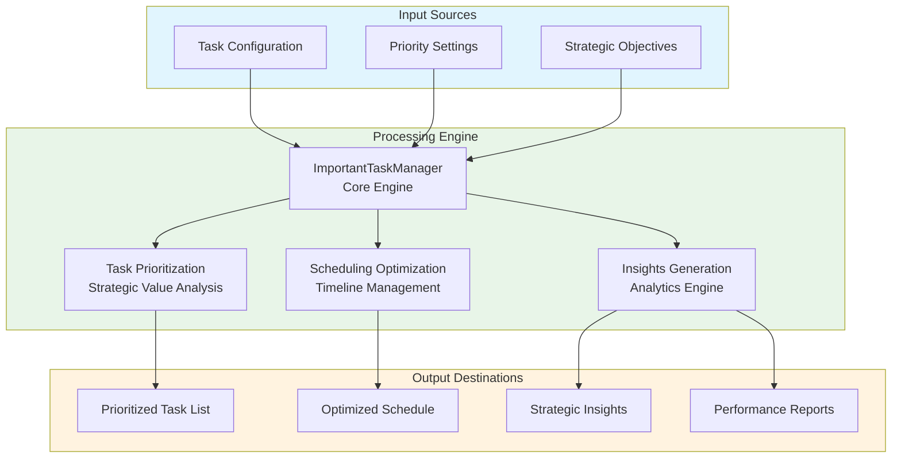
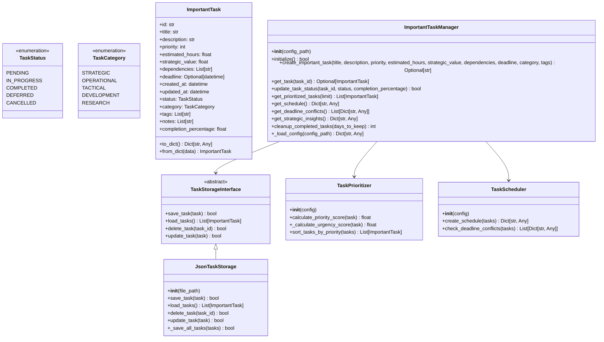
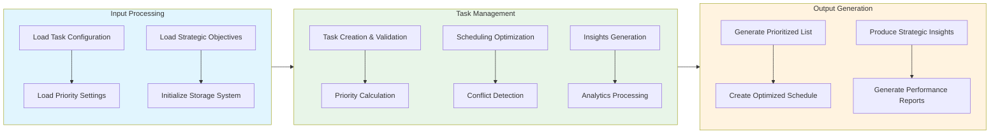

# Important Tasks Module Documentation

## Level 1: Executive Overview

### Module Purpose and Functionality
The `do_important_tasks` module provides a comprehensive system for managing and prioritizing important tasks within the AutoProjectManagement framework. It focuses on strategic task management, prioritization algorithms, and advanced scheduling capabilities for high-value activities.

### Business Value
This module enables organizations to effectively identify, prioritize, and execute important tasks that deliver maximum strategic value. By providing sophisticated prioritization and scheduling capabilities, it helps teams focus on high-impact activities and optimize resource allocation for critical work.

---

## Level 2: Technical Architecture

### System Integration Architecture


### Class Hierarchy and Relationships


### Data Flow Architecture


---

## Level 3: Detailed Implementation

### Core Class: ImportantTaskManager
The `ImportantTaskManager` class serves as the central coordinator for important task management, providing comprehensive functionality for task creation, prioritization, scheduling, and analytics.

### Priority Calculation Algorithm
The priority calculation follows a weighted scoring system that considers multiple factors:

**Priority Score Formula:**
```
Priority Score = (Strategic Value × Weight₁) + (Urgency × Weight₂) + (Effort Factor × Weight₃) + (Dependency Factor × Weight₄)
```

Where:
- **Strategic Value**: Task's strategic importance (0-100 scale)
- **Urgency**: Based on deadline proximity and time sensitivity
- **Effort Factor**: Inverse relationship with estimated hours (lower effort = higher priority)
- **Dependency Factor**: Impact of task dependencies on overall priority

### Scheduling Optimization
The scheduling system creates optimal task sequences by:
1. Filtering pending tasks
2. Sorting by calculated priority scores
3. Creating sequential schedules based on estimated durations
4. Checking for deadline conflicts and resource constraints

### Data Structures and Schemas

#### Task Storage Schema
```json
{
  "tasks": [
    {
      "id": "uuid-string",
      "title": "Task Title",
      "description": "Task Description",
      "priority": 1,
      "estimated_hours": 8.0,
      "strategic_value": 95.0,
      "dependencies": ["task-id-1", "task-id-2"],
      "deadline": "2025-12-31T23:59:59",
      "created_at": "2025-01-01T00:00:00",
      "updated_at": "2025-01-01T00:00:00",
      "status": "pending",
      "category": "strategic",
      "tags": ["tag1", "tag2"],
      "notes": ["Note 1", "Note 2"],
      "completion_percentage": 0.0
    }
  ]
}
```

#### Strategic Insights Schema
```json
{
  "total_tasks": 50,
  "completed_tasks": 25,
  "pending_tasks": 15,
  "in_progress_tasks": 10,
  "total_strategic_value": 4250.0,
  "total_estimated_hours": 400.0,
  "average_priority": 2.8,
  "category_distribution": {
    "strategic": 20,
    "operational": 15,
    "tactical": 10,
    "development": 3,
    "research": 2
  },
  "high_priority_tasks": [
    {
      "task_id": "uuid-1",
      "title": "High Priority Task",
      "priority": 1,
      "strategic_value": 95.0
    }
  ],
  "overdue_tasks": [
    {
      "task_id": "uuid-2",
      "title": "Overdue Task",
      "deadline": "2025-01-01",
      "status": "in_progress"
    }
  ]
}
```

---

## Usage Examples

### Enterprise Deployment Pattern
The module supports enterprise-grade deployment with configuration management, error handling, and comprehensive logging capabilities.

### Development Environment Setup
Development configurations focus on testing and validation with custom storage paths and enhanced debugging capabilities.

### Error Handling and Recovery
Comprehensive error handling includes validation errors, storage issues, and runtime exceptions with detailed logging and recovery mechanisms.

---

## Performance Characteristics

### Time Complexity Analysis
| Operation | Complexity | Description |
|-----------|------------|-------------|
| Task Creation | O(1) | Constant time for individual task creation |
| Priority Calculation | O(n) | Linear with number of tasks |
| Scheduling | O(n log n) | Log-linear for sorting and scheduling |
| Insights Generation | O(n) | Linear with number of tasks |

### Space Complexity Analysis
| Component | Complexity | Description |
|-----------|------------|-------------|
| Task Storage | O(n) | Linear with number of tasks |
| Priority Data | O(n) | Linear with number of priority calculations |
| Schedule Data | O(n) | Linear with scheduling information |

---

## Integration Points

### Input Interfaces
- **Task Configuration**: Task creation parameters and settings
- **Priority Settings**: Custom priority weights and calculation parameters
- **Strategic Objectives**: Business goals and strategic alignment data

### Output Interfaces
- **Prioritized Task List**: Ordered list of tasks by priority
- **Optimized Schedule**: Time-based task sequencing
- **Strategic Insights**: Analytics and performance metrics
- **Performance Reports**: Comprehensive reporting data

### Extension Points
- **Custom Storage Backends**: Alternative storage implementations
- **Advanced Prioritization**: Enhanced priority calculation algorithms
- **Integration Hooks**: API endpoints for external system integration
- **Reporting Enhancements**: Custom report formats and analytics

---

## Error Handling and Recovery

### Error Classification System
| Error Category | Examples | Recovery Strategy |
|----------------|----------|-------------------|
| Configuration Errors | Invalid settings, missing parameters | Validation and default fallbacks |
| Data Integrity Errors | Corrupted storage, invalid task data | Data validation and repair mechanisms |
| Runtime Errors | Storage failures, processing errors | Retry logic and graceful degradation |
| Validation Errors | Invalid task parameters, constraint violations | Detailed error messages and user guidance |

### Recovery Mechanisms
- **Input Validation**: Comprehensive validation of all task parameters
- **Data Sanitization**: Cleaning and normalization of input data
- **Automatic Retry**: Exponential backoff for transient errors
- **Graceful Degradation**: Continue operation with reduced functionality
- **Detailed Logging**: Comprehensive error context and diagnostics
- **User Feedback**: Clear error messages and actionable recommendations

---

## Testing Guidelines

### Unit Test Coverage Requirements
| Test Category | Coverage Target | Testing Methodology |
|---------------|-----------------|---------------------|
| Task Creation | 100% | Valid and invalid task parameters |
| Priority Calculation | 100% | Various priority scenarios and edge cases |
| Scheduling | 100% | Different scheduling configurations |
| Storage Operations | 100% | CRUD operations and error conditions |

### Integration Testing Strategy
- **End-to-End Workflow**: Complete task management process testing
- **Cross-Module Integration**: Testing with dependent modules and systems
- **Performance Testing**: Load testing with large task datasets
- **Regression Testing**: Ensuring backward compatibility and feature stability

### Test Data Requirements
- **Realistic Scenarios**: Production-like task data and configurations
- **Edge Cases**: Maximum tasks, extreme values, boundary conditions
- **Error Conditions**: Invalid data, storage failures, permission issues
- **Performance Data**: Large datasets for scalability and performance testing

---

## Maintenance Considerations

### Version Compatibility Matrix
| Component | Minimum Version | Recommended Version | Notes |
|-----------|-----------------|---------------------|-------|
| Python Runtime | 3.8+ | 3.9+ | Full type hint support |
| Storage Backend | JSON Standard | Latest specifications | Enhanced features and performance |
| Date Handling | Python datetime | Dateutil recommended | Advanced date parsing capabilities |

### Upgrade Considerations
- **Backward Compatibility**: Ensure existing task data and configurations remain functional
- **Data Migration**: Support for migrating task storage to new formats
- **Configuration Updates**: Automatic updates of configuration files and settings
- **Deprecation Policy**: Clear timeline for phasing out deprecated features

### Monitoring and Observability
- **Performance Metrics**: Task processing times and resource utilization
- **Error Rates**: Tracking of errors and exceptions
- **Usage Patterns**: Analysis of task creation and completion patterns
- **System Health**: Overall system performance and availability

---

*This documentation follows Pressman's software engineering standards and provides three levels of detail for comprehensive understanding of the Important Tasks module.*
