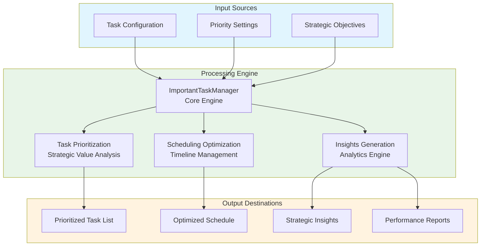

# Important Tasks Module Documentation

## Level 1: Executive Overview

### Module Purpose and Functionality
The `do_important_tasks` module provides a comprehensive system for managing and prioritizing important tasks within the AutoProjectManagement framework. It focuses on strategic task management, prioritization algorithms, and advanced scheduling capabilities for high-value activities.

### Business Value
This module enables organizations to effectively identify, prioritize, and execute important tasks that deliver maximum strategic value. By providing sophisticated prioritization and scheduling capabilities, it helps teams focus on high-impact activities and optimize resource allocation for critical work.

---

## Level 2: Technical Architecture

### System Integration Architecture


### Class Hierarchy and Relationships
```mermaid
classDiagram
    class TaskStatus {
        <<enumeration>>
        PENDING
        IN_PROGRESS
        COMPLETED
        DEFERRED
        CANCELLED
    }
    
    class TaskCategory {
        <<enumeration>>
        STRATEGIC
        OPERATIONAL
        TACTICAL
        DEVELOPMENT
        RESEARCH
    }
    
    class ImportantTask {
        +id: str
        +title: str
        +description: str
        +priority: int
        +estimated_hours: float
        +strategic_value: float
        +dependencies: List[str]
        +deadline: Optional[datetime]
        +created_at: datetime
        +updated_at: datetime
        +status: TaskStatus
        +category: TaskCategory
        +tags: List[str]
        +notes: List[str]
        +completion_percentage: float
        +to_dict() Dict[str, Any]
        +from_dict(data) ImportantTask
    }
    
    class TaskStorageInterface {
        <<abstract>>
        +save_task(task) bool
        +load_tasks() List[ImportantTask]
        +delete_task(task_id) bool
        +update_task(task) bool
    }
    
    class JsonTaskStorage {
        +__init__(file_path)
        +save_task(task) bool
        +load_tasks() List[ImportantTask]
        +delete_task(task_id) bool
        +update_task(task) bool
        +_save_all_tasks(tasks) bool
    }
    
    class TaskPrioritizer {
        +__init__(config)
        +calculate_priority_score(task) float
        +_calculate_urgency_score(task) float
        +sort_tasks_by_priority(tasks) List[ImportantTask]
    }
    
    class TaskScheduler {
        +__init__(config)
        +create_schedule(tasks) Dict[str, Any]
        +check_deadline_conflicts(tasks) List[Dict[str, Any]]
    }
    
    class ImportantTaskManager {
        +__init__(config_path)
        +initialize() bool
