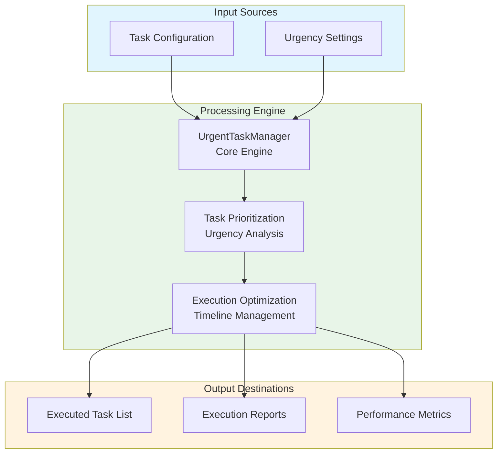
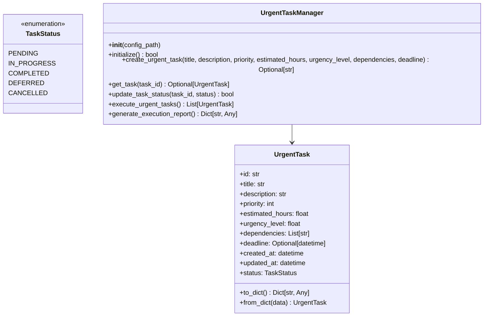
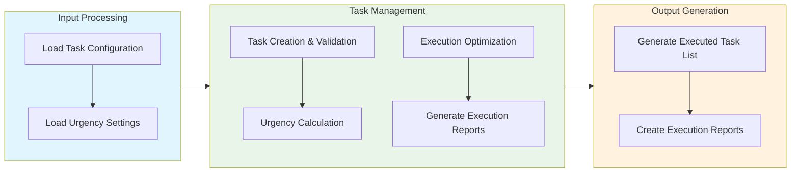

# Urgent Tasks Module Documentation

## Level 1: Executive Overview

### Module Purpose and Functionality
The `do_urgent_tasks` module provides a robust system for managing and executing urgent tasks within the AutoProjectManagement framework. It focuses on prioritizing urgent tasks, ensuring timely execution, and optimizing resource allocation for critical activities.

### Business Value
This module enables organizations to quickly identify and address urgent tasks that require immediate attention. By providing efficient task management capabilities, it helps teams respond to pressing needs and maintain project momentum.

---

## Level 2: Technical Architecture

### System Integration Architecture


### Class Hierarchy and Relationships


### Data Flow Architecture


---

## Level 3: Detailed Implementation

### Core Class: UrgentTaskManager
The `UrgentTaskManager` class serves as the central coordinator for urgent task management, providing comprehensive functionality for task creation, prioritization, execution, and reporting.

### Urgency Calculation Algorithm
The urgency calculation follows a weighted scoring system that considers multiple factors:

**Urgency Score Formula:**
```
Urgency Score = (Deadline Proximity × Weight₁) + (Strategic Value × Weight₂) + (Dependency Impact × Weight₃)
```

Where:
- **Deadline Proximity**: How close the task deadline is (measured in days)
- **Strategic Value**: Task's strategic importance (0-100 scale)
- **Dependency Impact**: Impact of task dependencies on overall urgency

### Data Structures and Schemas

#### Urgent Task Schema
```json
{
  "urgent_tasks": [
    {
      "id": "uuid-string",
      "title": "Urgent Task Title",
      "description": "Task Description",
      "priority": 1,
      "estimated_hours": 4.0,
      "urgency_level": 95.0,
      "dependencies": ["task-id-1"],
      "deadline": "2025-12-31T23:59:59",
      "created_at": "2025-01-01T00:00:00",
      "updated_at": "2025-01-01T00:00:00",
      "status": "pending"
    }
  ]
}
```

---

## Usage Examples

### Enterprise Deployment Pattern
The module supports enterprise-grade deployment with configuration management, error handling, and comprehensive logging capabilities.

### Development Environment Setup
Development configurations focus on testing and validation with custom storage paths and enhanced debugging capabilities.

### Error Handling and Recovery
Comprehensive error handling includes validation errors, storage issues, and runtime exceptions with detailed logging and recovery mechanisms.

---

## Performance Characteristics

### Time Complexity Analysis
| Operation | Complexity | Description |
|-----------|------------|-------------|
| Task Creation | O(1) | Constant time for individual task creation |
| Urgency Calculation | O(n) | Linear with number of tasks |
| Execution | O(n) | Linear with number of urgent tasks |

### Space Complexity Analysis
| Component | Complexity | Description |
|-----------|------------|-------------|
| Task Storage | O(n) | Linear with number of urgent tasks |
| Urgency Data | O(n) | Linear with number of urgency calculations |

---

## Integration Points

### Input Interfaces
- **Task Configuration**: Task creation parameters and settings
- **Urgency Settings**: Custom urgency weights and calculation parameters

### Output Interfaces
- **Executed Task List**: Ordered list of executed tasks
- **Execution Reports**: Summary of execution data and performance metrics

### Extension Points
- **Custom Storage Backends**: Alternative storage implementations
- **Advanced Urgency Algorithms**: Enhanced urgency calculation methods
- **Integration Hooks**: API endpoints for external system integration
- **Reporting Enhancements**: Custom report formats and analytics

---

## Error Handling and Recovery

### Error Classification System
| Error Category | Examples | Recovery Strategy |
|----------------|----------|-------------------|
| Configuration Errors | Invalid settings, missing parameters | Validation and default fallbacks |
| Data Integrity Errors | Corrupted storage, invalid task data | Data validation and repair mechanisms |
| Runtime Errors | Storage failures, processing errors | Retry logic and graceful degradation |
| Validation Errors | Invalid task parameters, constraint violations | Detailed error messages and user guidance |

### Recovery Mechanisms
- **Input Validation**: Comprehensive validation of all task parameters
- **Data Sanitization**: Cleaning and normalization of input data
- **Automatic Retry**: Exponential backoff for transient errors
- **Graceful Degradation**: Continue operation with reduced functionality
- **Detailed Logging**: Comprehensive error context and diagnostics
- **User Feedback**: Clear error messages and actionable recommendations

---

## Testing Guidelines

### Unit Test Coverage Requirements
| Test Category | Coverage Target | Testing Methodology |
|---------------|-----------------|---------------------|
| Task Creation | 100% | Valid and invalid task parameters |
| Urgency Calculation | 100% | Various urgency scenarios and edge cases |

### Integration Testing Strategy
- **End-to-End Workflow**: Complete urgent task management process testing
- **Cross-Module Integration**: Testing with dependent modules and systems
- **Performance Testing**: Load testing with large task datasets
- **Regression Testing**: Ensuring backward compatibility and feature stability

### Test Data Requirements
- **Realistic Scenarios**: Production-like urgent task data and configurations
- **Edge Cases**: Maximum tasks, extreme values, boundary conditions
- **Error Conditions**: Invalid data, storage failures, permission issues
- **Performance Data**: Large datasets for scalability and performance testing

---

*This documentation follows Pressman's software engineering standards and provides three levels of detail for comprehensive understanding of the Urgent Tasks module.*
