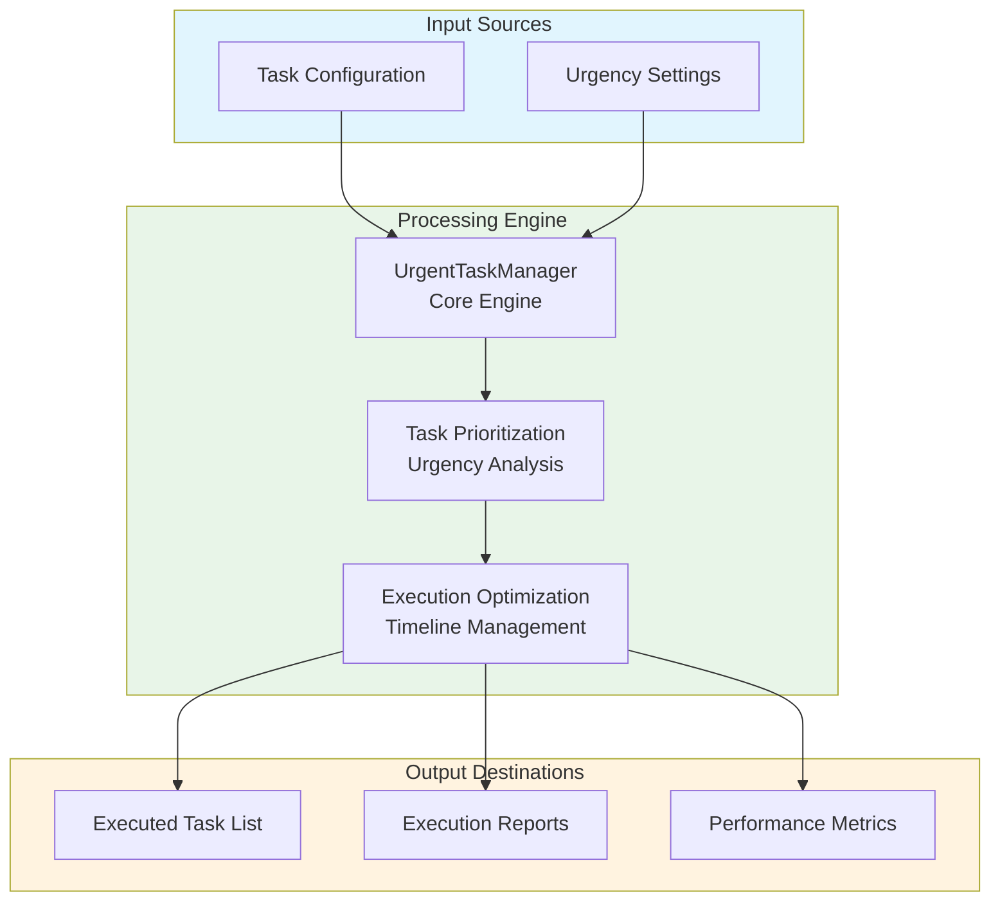
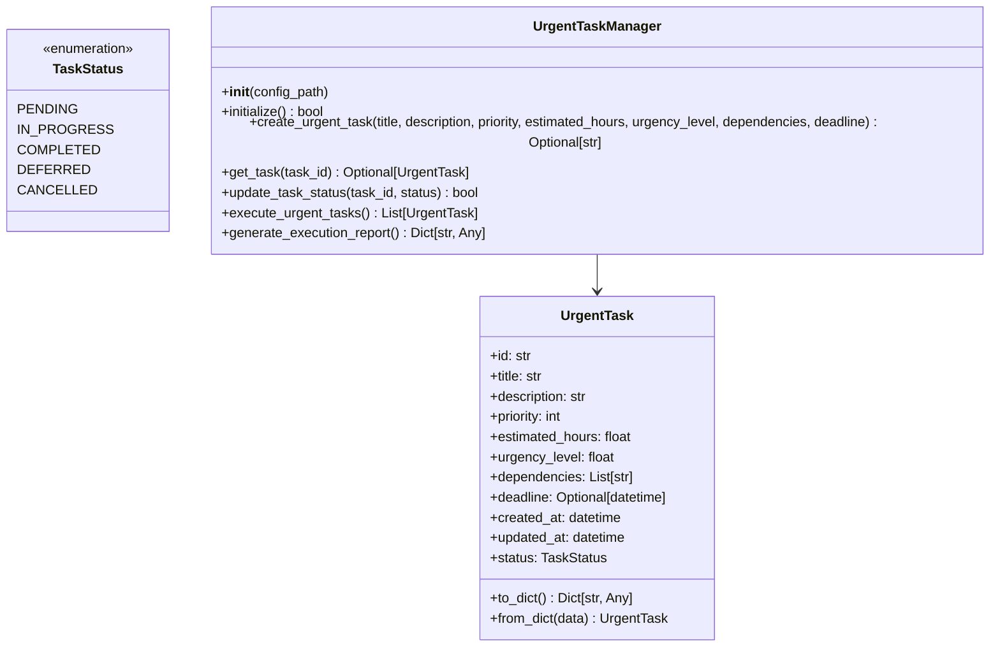
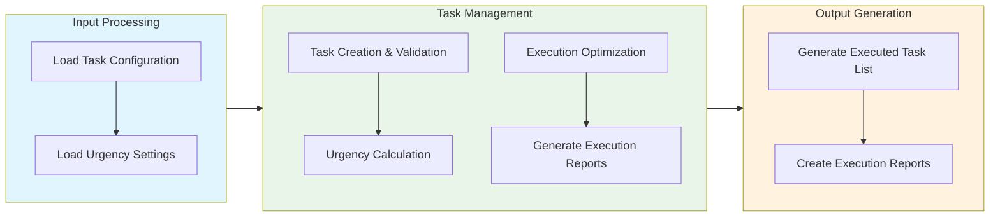

# Urgent Tasks Module Documentation

## Level 1: Executive Overview

### Module Purpose and Functionality
The `do_urgent_tasks` module provides a robust system for managing and executing urgent tasks within the AutoProjectManagement framework. It focuses on prioritizing urgent tasks, ensuring timely execution, and optimizing resource allocation for critical activities.

### Business Value
This module enables organizations to quickly identify and address urgent tasks that require immediate attention. By providing efficient task management capabilities, it helps teams respond to pressing needs and maintain project momentum.

---

## Level 2: Technical Architecture

### System Integration Architecture


### Class Hierarchy and Relationships


### Data Flow Architecture


---

## Level 3: Detailed Implementation

### Core Class: UrgentTaskManager
The `UrgentTaskManager` class serves as the central coordinator for urgent task management, providing comprehensive functionality for task creation, prioritization, execution, and reporting.

### Urgency Calculation Algorithm
The urgency calculation follows a weighted scoring system that considers multiple factors:

**Urgency Score Formula:**
```
Urgency Score = (Deadline Proximity × Weight₁) + (Strategic Value × Weight₂) + (Dependency Impact × Weight₃)
```

Where:
- **Deadline Proximity**: How close the task deadline is (measured in days)
- **Strategic Value**: Task's strategic importance (0-100 scale)
- **Dependency Impact**: Impact of task dependencies on overall urgency

### Data Structures and Schemas

#### Urgent Task Schema
```json
{
  "urgent_tasks": [
    {
      "id": "uuid-string",
      "title": "Urgent Task Title",
      "description": "Task Description",
      "priority": 1,
      "estimated_hours": 4.0,
      "urgency_level": 95.0,
      "dependencies": ["task-id-1"],
      "deadline": "2025-12-31T23:59:59",
      "created_at": "2025-01-01T00:00:00",
      "updated_at": "2025-01-01T00:00:00",
