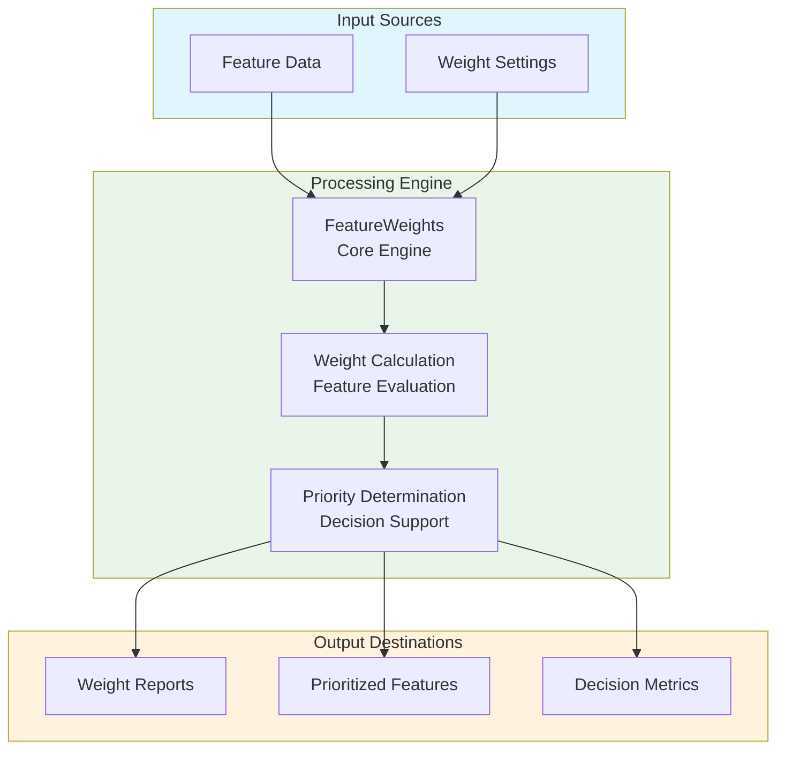
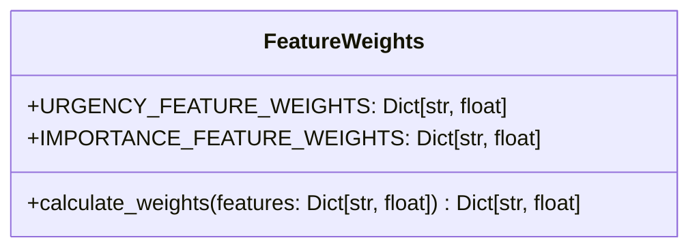
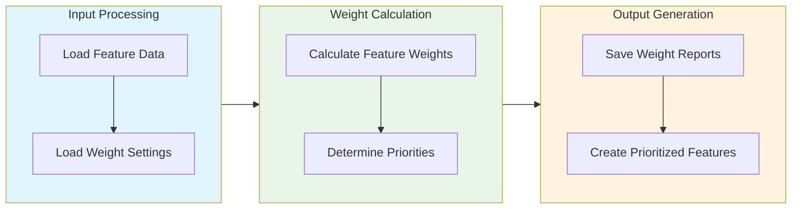

# Feature Weights Module Documentation

## Level 1: Executive Overview

### Module Purpose and Functionality
The `feature_weights` module provides a comprehensive system for managing and calculating feature weights within the AutoProjectManagement framework. It focuses on defining weights for urgency and importance features, enabling precise prioritization and decision-making.

### Business Value
This module enables organizations to systematically assign weights to various features, ensuring consistent and data-driven prioritization. By providing robust weight calculation capabilities, it helps teams make informed decisions based on predefined criteria.

---

## Level 2: Technical Architecture

### System Integration Architecture


### Class Hierarchy and Relationships


### Data Flow Architecture


---

## Level 3: Detailed Implementation

### Core Class: FeatureWeights
The `FeatureWeights` class serves as the central coordinator for feature weight management, providing comprehensive functionality for calculating weights and supporting decision-making.

### Weight Calculation Algorithm
The weight calculation process follows a systematic approach:

1. **Feature Evaluation**: Assess features based on predefined criteria
2. **Weight Application**: Apply appropriate weights to each feature
3. **Priority Calculation**: Determine overall priority based on weighted features

### Weight Calculation Formula
The weight calculation follows this formula:
```
Combined Weight = (Urgency Weight + Importance Weight) × Feature Value
```

Where:
- **Urgency Weight**: Predefined weight for urgency features
