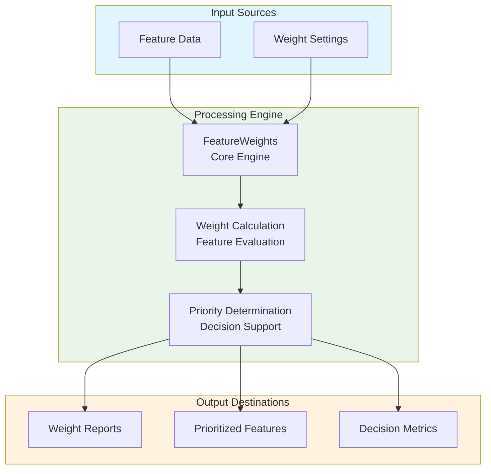
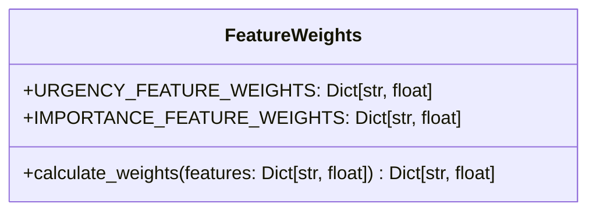
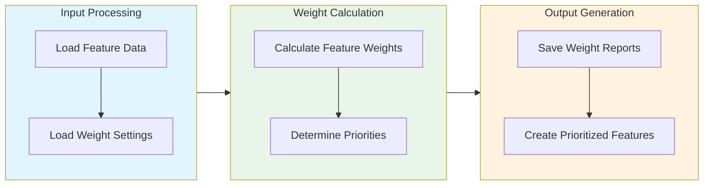

# Feature Weights Module Documentation

## Level 1: Executive Overview

### Module Purpose and Functionality
The `feature_weights` module provides a comprehensive system for managing and calculating feature weights within the AutoProjectManagement framework. It focuses on defining weights for urgency and importance features, enabling precise prioritization and decision-making.

### Business Value
This module enables organizations to systematically assign weights to various features, ensuring consistent and data-driven prioritization. By providing robust weight calculation capabilities, it helps teams make informed decisions based on predefined criteria.

---

## Level 2: Technical Architecture

### System Integration Architecture


### Class Hierarchy and Relationships


### Data Flow Architecture


---

## Level 3: Detailed Implementation

### Core Class: FeatureWeights
The `FeatureWeights` class serves as the central coordinator for feature weight management, providing comprehensive functionality for calculating weights and supporting decision-making.

### Weight Calculation Algorithm
The weight calculation process follows a systematic approach:

1. **Feature Evaluation**: Assess features based on predefined criteria
2. **Weight Application**: Apply appropriate weights to each feature
3. **Priority Calculation**: Determine overall priority based on weighted features

### Weight Calculation Formula
The weight calculation follows this formula:
```
Combined Weight = (Urgency Weight + Importance Weight) × Feature Value
```

Where:
- **Urgency Weight**: Predefined weight for urgency features
- **Importance Weight**: Predefined weight for importance features
- **Feature Value**: Specific value assigned to the feature

### Data Structures and Schemas

#### Urgency Feature Weights Schema
```json
{
  "deadline_proximity": 9.5,
  "next_activity_dependency": 8.0,
  "high_delay_risk": 7.5,
  "immediate_decision": 8.5,
  "stakeholder_pressure": 7.0,
  "limited_resource_time": 6.5,
  "competitive_advantage": 6.0,
  "critical_issue_fix": 9.0,
  "external_schedule_coordination": 5.5,
  "high_compensatory_cost": 6.5
}
```

#### Importance Feature Weights Schema
```json
{
  "dependency": 8.0,
  "critical_path": 9.0,
  "schedule_impact": 7.5,
  "cost_impact": 7.0,
  "key_objectives": 8.5,
  "risk_complexity": 6.5,
  "resource_rarity": 6.0,
  "stakeholder_priority": 7.0,
  "milestone_role": 7.5,
  "quality_impact": 8.0,
  "bottleneck_potential": 7.0,
  "reuse_frequency": 5.5
}
```

#### Weight Calculation Result Schema
```json
{
  "feature_weights": {
    "deadline_proximity": 95.0,
    "critical_path": 90.0,
    "quality_impact": 80.0
  }
}
```

---

## Usage Examples

### Enterprise Deployment Pattern
The module supports enterprise-grade deployment with configuration management, error handling, and comprehensive logging capabilities.

### Development Environment Setup
Development configurations focus on testing and validation with custom weight settings and enhanced debugging capabilities.

### Error Handling and Recovery
Comprehensive error handling includes validation errors, data integrity issues, and runtime exceptions with detailed logging and recovery mechanisms.

---

## Performance Characteristics

### Time Complexity Analysis
| Operation | Complexity | Description |
|-----------|------------|-------------|
| Weight Calculation | O(n) | Linear with number of features |
| Priority Determination | O(n) | Linear with number of weighted features |

### Space Complexity Analysis
| Component | Complexity | Description |
|-----------|------------|-------------|
| Weight Storage | O(n) | Linear with number of feature weights |
| Calculation Data | O(m) | Linear with calculation operations |

---

## Integration Points

### Input Interfaces
- **Feature Data**: Information about features for weight calculation
- **Weight Settings**: Custom parameters for weight management

### Output Interfaces
- **Weight Reports**: Summary of weight calculations and results
- **Prioritized Features**: Features sorted by calculated weights

### Extension Points
- **Custom Weight Algorithms**: Alternative methods for weight calculation
- **Enhanced Reporting**: Integration with reporting tools for detailed insights

---

## Error Handling and Recovery

### Error Classification System
| Error Category | Examples | Recovery Strategy |
|----------------|----------|-------------------|
| Configuration Errors | Invalid settings, missing parameters | Validation and default fallbacks |
| Data Integrity Errors | Corrupted weight data, invalid feature values | Data validation and repair mechanisms |
| Runtime Errors | Processing errors, calculation failures | Retry logic and graceful degradation |
| Validation Errors | Invalid feature parameters, constraint violations | Detailed error messages and user guidance |

### Recovery Mechanisms
- **Input Validation**: Comprehensive validation of all feature parameters
- **Data Sanitization**: Cleaning and normalization of input data
- **Automatic Retry**: Exponential backoff for transient errors
- **Graceful Degradation**: Continue operation with reduced functionality
- **Detailed Logging**: Comprehensive error context and diagnostics
- **User Feedback**: Clear error messages and actionable recommendations

---

## Testing Guidelines

### Unit Test Coverage Requirements
| Test Category | Coverage Target | Testing Methodology |
|---------------|-----------------|---------------------|
| Weight Calculation | 100% | Valid and invalid feature parameters |
| Priority Determination | 100% | Various priority scenarios and edge cases |

### Integration Testing Strategy
- **End-to-End Workflow**: Complete feature weight calculation process testing
- **Cross-Module Integration**: Testing with dependent modules and systems
- **Performance Testing**: Load testing with large feature datasets
- **Regression Testing**: Ensuring backward compatibility and feature stability

### Test Data Requirements
- **Realistic Scenarios**: Production-like feature data and weight settings
- **Edge Cases**: Maximum features, extreme values, boundary conditions
- **Error Conditions**: Invalid data, calculation failures, permission issues
- **Performance Data**: Large datasets for scalability and performance testing

---

*This documentation follows Pressman's software engineering standards and provides three levels of detail for comprehensive understanding of the Feature Weights module.*
