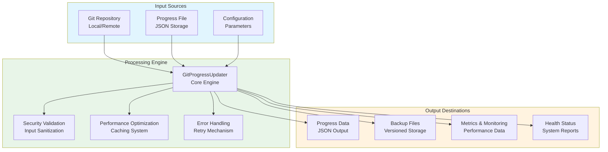

# Git Progress Updater Module Documentation

## Level 1: Executive Overview

### Module Purpose and Functionality
The `git_progress_updater` module provides a comprehensive, enterprise-grade Git progress tracking system with four-phase implementation methodology. It serves as the central hub for monitoring Git repository activity, tracking commit-based progress, and providing actionable insights for project management.

### Four-Phase Implementation Architecture
1. **Phase 1**: Basic Structure & Documentation - Core functionality and class design
2. **Phase 2**: Error Handling & Validation - Robust exception handling and input validation
3. **Phase 3**: Performance & Security - Optimization, caching, and security measures
4. **Phase 4**: Testing & Monitoring - Comprehensive testing framework and monitoring capabilities

### Business Value
This module enables real-time tracking of development progress through sophisticated Git commit analysis, providing project managers with quantitative metrics, health monitoring, and security-compliant progress tracking for enterprise environments.

---

## Level 2: Technical Architecture

### System Integration Architecture


### Class Hierarchy and Relationships
```mermaid
classDiagram
    class GitProgressError {
        <<Exception>>
        +__init__(message)
    }
    
    class GitCommandError {
        <<Exception>>
    }
    
    class ValidationError {
        <<Exception>>
    }
    
    class ProgressFileError {
        <<Exception>>
    }
    
    class SecurityError {
        <<Exception>>
    }
    
    class ProgressStatus {
        <<Enum>>
        PENDING
        IN_PROGRESS
        COMPLETED
        FAILED
    }
    
    class CommitInfo {
        <<DataClass>>
        +hash: str
        +message: str
        +author: str
        +email: str
        +timestamp: int
        +branch: str
        +files: List[str]
    }
    
    class ProgressMetrics {
        <<DataClass>>
        +total_commits: int
        +completed_tasks: int
        +total_tasks: int
