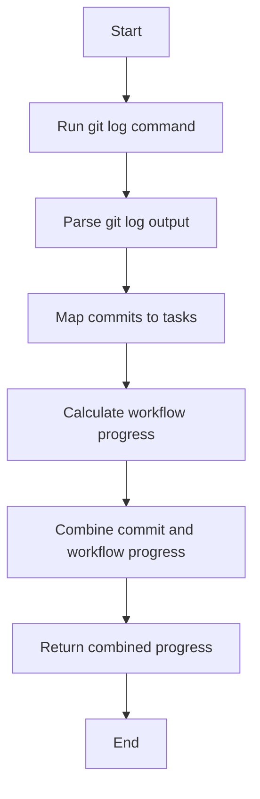

# Git Progress Updater Module Documentation

## Level 1: Executive Overview

### Module Purpose and Functionality
The `git_progress_updater` module provides a comprehensive, enterprise-grade Git progress tracking system with four-phase implementation methodology. It serves as the central hub for monitoring Git repository activity, tracking commit-based progress, and providing actionable insights for project management.

### Four-Phase Implementation Architecture
1. **Phase 1**: Basic Structure & Documentation - Core functionality and class design
2. **Phase 2**: Error Handling & Validation - Robust exception handling and input validation
3. **Phase 3**: Performance & Security - Optimization, caching, and security measures
4. **Phase 4**: Testing & Monitoring - Comprehensive testing framework and monitoring capabilities

### Business Value
This module enables real-time tracking of development progress through sophisticated Git commit analysis, providing project managers with quantitative metrics, health monitoring, and security-compliant progress tracking for enterprise environments.

---

## Level 2: Technical Architecture

### System Integration Architecture
```mermaid
graph TB
    subgraph InputLayer [Input Sources]
- `calculate_workflow_progress(self)`
  - Placeholder method for workflow step completion tracking.

- `combine_progress(self, commit_progress, workflow_progress)`
  - Combines commit-based and workflow-based progress into a single progress dictionary.

- `update_progress(self)`
  - Orchestrates the process: runs git log, parses commits, maps to tasks, calculates and combines progress, and returns combined progress.

## Usage
The class can be used to update task progress based on git commit history and workflow data.

## Diagrams

### Mermaid Class Diagram

```mermaid
classDiagram
    class GitProgressUpdater {
        - workflow_definition: List~Dict~
        - task_progress: defaultdict~float~
        + __init__(workflow_definition)
        + run_git_log()
        + parse_git_log(log_text)
        + map_commits_to_tasks(commits)
        + calculate_workflow_progress()
        + combine_progress(commit_progress, workflow_progress)
        + update_progress()
    }
```

### Mermaid Process Flowchart



---

## Credits

This module uses Python's `subprocess`, `re`, and `collections` modules to interact with git and process commit data.

---

This documentation provides a detailed overview of the `git_progress_updater` module to assist developers in understanding and using its functionality effectively.
