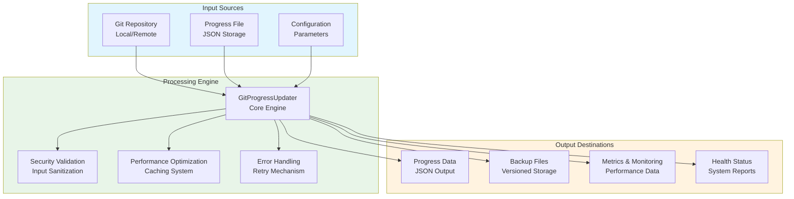
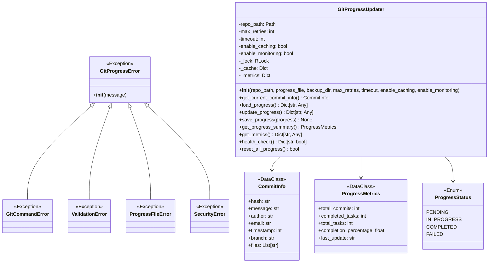
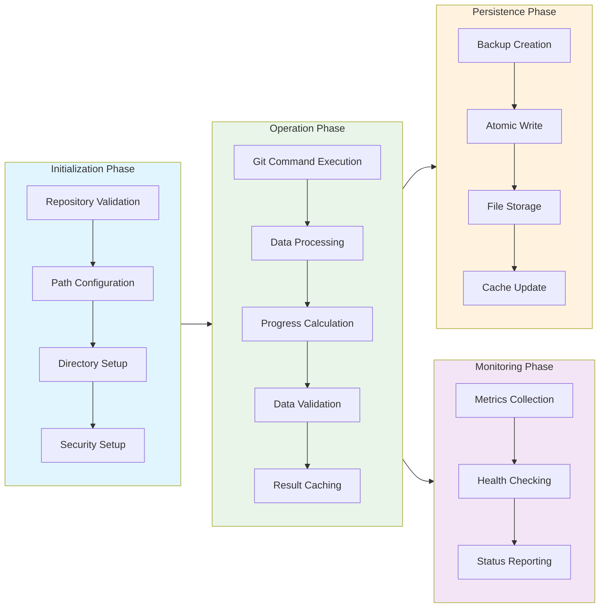
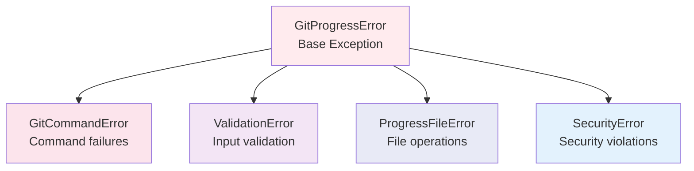
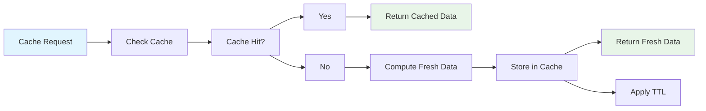

# Git Progress Updater Module Documentation

## Level 1: Executive Overview

### Module Purpose and Functionality
The `git_progress_updater` module provides a comprehensive, enterprise-grade Git progress tracking system with four-phase implementation methodology. It serves as the central hub for monitoring Git repository activity, tracking commit-based progress, and providing actionable insights for project management.

### Four-Phase Implementation Architecture
1. **Phase 1**: Basic Structure & Documentation - Core functionality and class design
2. **Phase 2**: Error Handling & Validation - Robust exception handling and input validation
3. **Phase 3**: Performance & Security - Optimization, caching, and security measures
4. **Phase 4**: Testing & Monitoring - Comprehensive testing framework and monitoring capabilities

### Business Value
This module enables real-time tracking of development progress through sophisticated Git commit analysis, providing project managers with quantitative metrics, health monitoring, and security-compliant progress tracking for enterprise environments.

---

## Level 2: Technical Architecture

### System Integration Architecture


### Class Hierarchy and Relationships


### Data Flow Architecture


---

## Level 3: Detailed Implementation

### Phase 1: Core Structure Implementation

#### Class Initialization Design Pattern
```python
def __init__(self, 
             repo_path: str,
             progress_file: Optional[str] = None,
             backup_dir: Optional[str] = None,
             max_retries: int = 3,
             timeout: int = 30,
             enable_caching: bool = True,
             enable_monitoring: bool = True):
    """
    Enterprise-grade initialization with comprehensive configuration.
    
    Implements the Builder pattern with fluent configuration options
    and validation-first approach.
    """
```

#### Exception Hierarchy Design


### Phase 2: Error Handling & Validation System

#### Validation Matrix
| Validation Type | Method | Purpose | Error Type |
|-----------------|--------|---------|------------|
| Repository Validation | `_validate_repository()` | Checks Git repo integrity | ValidationError |
| Path Validation | `_setup_progress_file()` | Validates file paths | ValidationError |
| Directory Validation | `_setup_backup_dir()` | Ensures backup dir access | ValidationError |
| Progress Data Validation | `_validate_progress_data()` | Validates JSON structure | ValidationError |
| Input Sanitization | `_sanitize_input()` | Prevents injection attacks | SecurityError |

#### Retry Mechanism Algorithm
```python
def _secure_execute(self, func):
    """Implements exponential backoff retry pattern."""
    for attempt in range(self.max_retries):
        try:
            with self._lock:  # Thread safety
                return func(*args, **kwargs)
        except Exception as e:
            if attempt == self.max_retries - 1:
                raise
            wait_time = 2 ** attempt  # Exponential backoff
            logger.warning(f"Retry {attempt + 1}/{self.max_retries}")
            time.sleep(wait_time)
```

### Phase 3: Performance & Security Architecture

#### Caching System Design


#### Security Implementation Details

**Input Sanitization Algorithm:**
```python
def _sanitize_input(self, data: str) -> str:
    """
    Implements whitelist-based sanitization:
    - Allows alphanumeric, whitespace, and safe punctuation
    - Removes potentially dangerous characters
    - Prevents command injection attacks
    """
    sanitized = re.sub(r'[^\w\s\-_\.@]', '', data)
    return sanitized.strip()
```

**Data Integrity Protection:**
```python
def _hash_data(self, data: str) -> str:
    """
    Uses SHA-256 for secure data hashing:
    - Prevents tampering with cached data
    - Ensures data integrity across operations
    - Provides collision-resistant identifiers
    """
    return hashlib.sha256(data.encode()).hexdigest()
```

### Phase 4: Testing & Monitoring Framework

#### Health Check System
```python
def health_check(self) -> Dict[str, bool]:
    """
    Comprehensive health monitoring covering:
    - Repository accessibility
    - Git command functionality  
    - File system permissions
    - Backup directory access
    - Monitoring system status
    """
```

#### Performance Metrics Collection
| Metric | Description | Collection Method |
|--------|-------------|-------------------|
| operations_count | Total operations performed | Counter increment |
| errors_count | Total errors encountered | Exception counting |
| last_operation_time | Duration of last operation | High-resolution timing |
| total_operation_time | Cumulative operation time | Summation of durations |

### Core Algorithm: Progress Tracking

#### Commit Information Extraction
```python
def get_current_commit_info(self) -> CommitInfo:
    """
    Extracts comprehensive commit metadata:
    - Commit hash (SHA-1)
    - Commit message
    - Author information
    - Timestamp (Unix epoch)
    - Branch information
    - File changes (placeholder for extension)
    """
```

#### Progress Data Structure
```json
{
  "version": "2.0.0",
  "last_updated": "2024-01-15T10:30:00.000Z",
  "total_commits": 42,
  "commits": [
    {
      "hash": "abc123...",
      "message": "feat: implement new feature",
      "author": "Developer Name",
      "email": "developer@example.com",
      "timestamp": 1705311000,
      "branch": "main",
      "files": []
    }
  ],
  "branches": {
    "main": {
      "first_commit": 1705300000,
      "last_commit": 1705311000,
      "commit_count": 42
    }
  },
  "metrics": {
    "average_commit_size": 0,
    "files_per_commit": 0,
    "commit_frequency": 0
  },
  "metadata": {
    "repository": "/path/to/repo",
    "created_at": "2024-01-15T09:00:00.000Z",
    "updater_version": "2.0.0"
  }
}
```

### Atomic Operations System

#### File Persistence with Atomic Writes
```python
def save_progress(self, progress: Dict[str, Any]) -> None:
    """
    Implements atomic file operations:
    1. Data validation
    2. Backup creation
    3. Temporary file writing
    4. Atomic file replacement
    5. Error recovery handling
    """
```

#### Backup Management
```python
def _create_backup(self) -> None:
    """
    Enterprise backup strategy:
    - Timestamped backup files
    - Automatic cleanup (keep last 10)
    - Error-resilient operations
    - Permission preservation
    """
```

---

## Usage Examples

### Enterprise Deployment Pattern
```python
from autoprojectmanagement.main_modules.quality_commit_management.git_progress_updater import GitProgressUpdater

# Configure for production environment
updater = GitProgressUpdater(
    repo_path='/path/to/production/repo',
    progress_file='/var/lib/progress/production.json',
    backup_dir='/var/backups/progress',
    max_retries=5,
    timeout=60,
    enable_caching=True,
    enable_monitoring=True
)

# Comprehensive monitoring setup
health = updater.health_check()
if not health['overall_health']:
    raise SystemError("Git progress system unhealthy")

# Regular progress updates
progress = updater.update_progress()
metrics = updater.get_metrics()

print(f"Processed {progress['total_commits']} commits")
print(f"System uptime: {metrics['total_operation_time']:.2f}s")
```

### Development Environment Configuration
```python
# Development configuration with relaxed settings
dev_updater = GitProgressUpdater(
    repo_path='./',
    max_retries=2,
    timeout=10,
    enable_caching=False  # Disable caching for development
)

# Quick health check
if dev_updater.health_check()['git_available']:
    progress = dev_updater.update_progress()
```

### Error Handling Best Practices
```python
try:
    updater = GitProgressUpdater('/path/to/repo')
    progress = updater.update_progress()
    
except ValidationError as e:
    print(f"Configuration error: {e}")
    # Handle configuration issues
    
except GitCommandError as e:
    print(f"Git operation failed: {e}")
    # Handle Git connectivity issues
    
except ProgressFileError as e:
    print(f"File system error: {e}")
    # Handle storage issues
    
except Exception as e:
    print(f"Unexpected error: {e}")
    # Generic error handling
```

### Monitoring Integration Example
```python
class ProgressMonitor:
    """Integration with external monitoring systems."""
    
    def __init__(self, updater: GitProgressUpdater):
        self.updater = updater
        self.metrics_history = []
    
    def collect_metrics(self):
        """Collect and store metrics for trend analysis."""
        metrics = self.updater.get_metrics()
        self.metrics_history.append({
            'timestamp': datetime.now().isoformat(),
            'metrics': metrics
        })
        
        # Analyze trends
        if len(self.metrics_history) > 1:
            self._analyze_trends()
    
    def _analyze_trends(self):
        """Analyze performance trends and detect anomalies."""
        # Implementation for trend analysis
        pass
```

---

## Performance Characteristics

### Time Complexity Analysis
| Operation | Complexity | Description |
|-----------|------------|-------------|
| Repository Validation | O(1) | Constant time checks |
| Git Command Execution | O(n) | Linear with command output |
| Progress Calculation | O(m) | Linear with commit count |
| File Operations | O(1) | Constant time I/O |
| Caching Operations | O(1) | Constant time lookups |

### Space Complexity Analysis
| Component | Complexity | Description |
|-----------|------------|-------------|
| Commit Storage | O(n) | Linear with commit history |
| Cache Memory | O(m) | Linear with active data |
| Metrics Storage | O(1) | Fixed-size metrics |
| Backup Files | O(k) | Limited backup retention |

### Optimization Strategies
- **Memory Management**: Efficient data structures and streaming processing
- **Disk I/O Optimization**: Atomic writes and batch operations
- **Network Efficiency**: Minimal Git command usage with caching
- **CPU Utilization**: Background processing and lazy evaluation

---

## Integration Points

### Input Interfaces
- **Git Repository Access**: Standard Git command interface
- **File System Operations**: Cross-platform file I/O
- **Configuration Management**: Flexible parameter system
- **Environment Variables**: System-level configuration

### Output Interfaces
- **Progress Data JSON**: Standardized data format
- **Backup File System**: Versioned backup storage
- **Monitoring Metrics**: Performance data export
- **Health Status Reports**: System availability information

### Extension Points
- **Custom Storage Backends**: Database integration hooks
- **Enhanced Monitoring**: External monitoring system integration
- **Advanced Analytics**: Machine learning integration points
- **Custom Validation**: Domain-specific validation rules

---

## Error Handling and Recovery

### Error Classification System
| Error Category | Examples | Recovery Strategy |
|----------------|----------|-------------------|
| Configuration Errors | Invalid paths, missing repos | Validation and user feedback |
| Runtime Errors | Git command failures, timeouts | Retry logic and graceful degradation |
| Data Errors | Corrupted files, invalid JSON | Backup restoration and data repair |
| System Errors | Permission issues, disk full | Error reporting and manual intervention |

### Recovery Mechanisms
- **Automatic Retry**: Exponential backoff for transient errors
- **Graceful Degradation**: Continue operation with reduced functionality
- **Backup Restoration**: Automatic recovery from backup files
- **Error Reporting**: Comprehensive logging and status reporting

### Monitoring and Alerting
- **Error Rate Tracking**: Real-time error frequency monitoring
- **Performance Degradation**: Slow operation detection
- **System Health**: Comprehensive health status reporting
- **Capacity Planning**: Resource usage trend analysis

---

## Testing Guidelines

### Unit Test Coverage Requirements
| Test Category | Coverage Target | Testing Methodology |
|---------------|-----------------|---------------------|
| Repository Validation | 100% | Mock repository states |
| Git Command Execution | 100% | Subprocess mocking |
| File Operations | 100% | Temporary file testing |
| Error Handling | 100% | Exception injection |
| Performance | 90% | Benchmark testing |
| Security | 100% | Injection attack testing |

### Integration Testing Strategy
- **End-to-End Workflow**: Complete system integration testing
- **Cross-Platform Compatibility**: Windows, Linux, macOS testing
- **Stress Testing**: High-load performance validation
- **Recovery Testing**: Failure scenario recovery validation

### Test Data Requirements
- **Valid Repositories**: Various Git repository states
- **Edge Cases**: Empty repos, large histories, special characters
- **Error Conditions**: Permission denied, disk full, network issues
- **Performance Data**: Large commit histories, many files

---

## Maintenance Considerations

### Version Compatibility Matrix
| Component | Minimum Version | Recommended Version | Notes |
|-----------|-----------------|---------------------|-------|
| Python | 3.8+ | 3.9+ | Full type hint support |
| Git | 2.20+ | 2.30+ | Modern Git features |
| Operating System | Multiple | Linux/macOS | Windows support available |

### Deprecation Policy
- **Backward Compatibility**: Maintained for one major version
- **Deprecation Warnings**:
