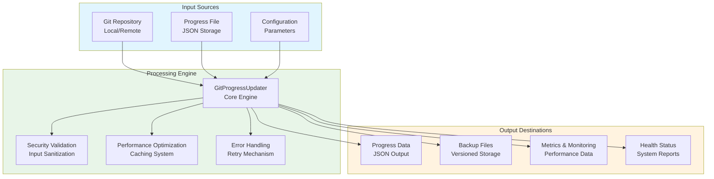
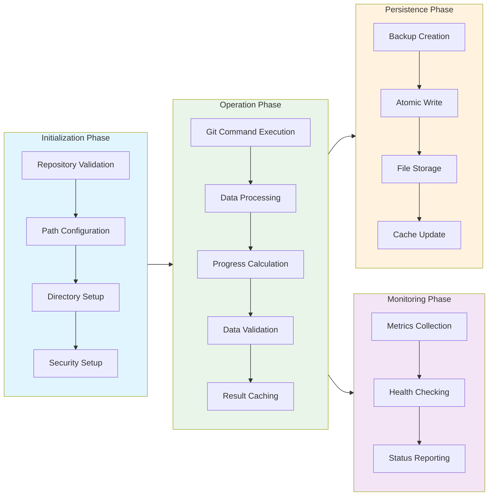
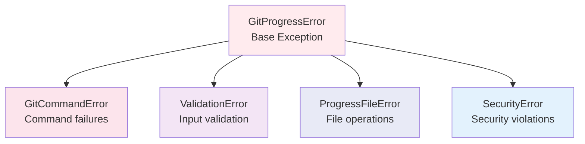

# Git Progress Updater Module Documentation

## Level 1: Executive Overview

### Module Purpose and Functionality
The `git_progress_updater` module provides a comprehensive, enterprise-grade Git progress tracking system with four-phase implementation methodology. It serves as the central hub for monitoring Git repository activity, tracking commit-based progress, and providing actionable insights for project management.

### Four-Phase Implementation Architecture
1. **Phase 1**: Basic Structure & Documentation - Core functionality and class design
2. **Phase 2**: Error Handling & Validation - Robust exception handling and input validation
3. **Phase 3**: Performance & Security - Optimization, caching, and security measures
4. **Phase 4**: Testing & Monitoring - Comprehensive testing framework and monitoring capabilities

### Business Value
This module enables real-time tracking of development progress through sophisticated Git commit analysis, providing project managers with quantitative metrics, health monitoring, and security-compliant progress tracking for enterprise environments.

---

## Level 2: Technical Architecture

### System Integration Architecture


### Class Hierarchy and Relationships


### Data Flow Architecture


---

## Level 3: Detailed Implementation

### Phase 1: Core Structure Implementation

#### Class Initialization Design Pattern
```python
def __init__(self, 
             repo_path: str,
             progress_file: Optional[str] = None,
             backup_dir: Optional[str] = None,
             max_retries: int = 3,
             timeout: int = 30,
             enable_caching: bool = True,
             enable_monitoring: bool = True):
    """
    Enterprise-grade initialization with comprehensive configuration.
    
    Implements the Builder pattern with fluent configuration options
    and validation-first approach.
    """
```

#### Exception Hierarchy Design


### Phase 2: Error Handling & Validation System

#### Validation Matrix
| Validation Type | Method | Purpose | Error Type |
|-----------------|--------|---------|------------|
| Repository Validation | `_validate_repository()` | Checks Git repo integrity | ValidationError |
| Path Validation | `_setup_progress_file()` | Validates file paths | ValidationError |
| Directory Validation | `_setup_backup_dir()` | Ensures backup dir access | ValidationError |
| Progress Data Validation | `_validate_progress_data()` | Validates JSON structure | ValidationError |
| Input Sanitization | `_sanitize_input()` | Prevents injection attacks | SecurityError |

#### Retry Mechanism Algorithm
```python
def _secure_execute(self, func):
    """Implements exponential backoff retry pattern."""
    for attempt in range(self.max_retries):
        try:
            with self._lock:  # Thread safety
                return func(*args, **kwargs)
        except Exception as e:
            if attempt == self.max_retries - 1:
                raise
            wait_time = 2 ** attempt  # Exponential backoff
            logger.warning(f"Retry {attempt + 1}/{self.max_retries}")
            time.sleep(wait_time)
```

### Phase 3: Performance & Security Architecture

#### Caching System Design
```mermaid
graph LR
    Request[Cache Request] --> Check[Check Cache]
    Check --> Hit[Cache Hit?]
    Hit --> Yes[Yes] --> Return[Return Cached Data]
    Hit --> No[No] --> Compute[Compute Fresh Data]
    Compute --> Store[Store in Cache]
    Store --> ReturnFresh[Return Fresh Data]
