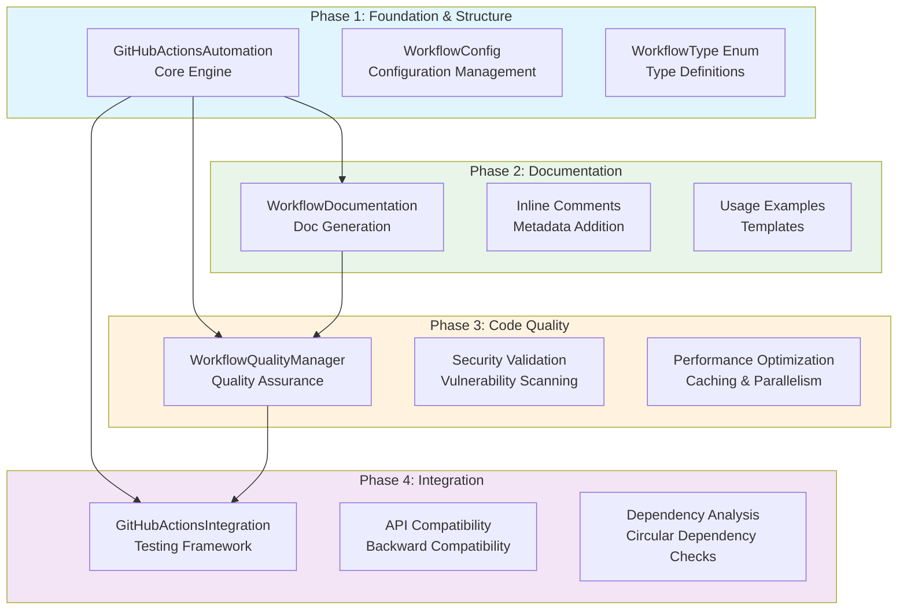
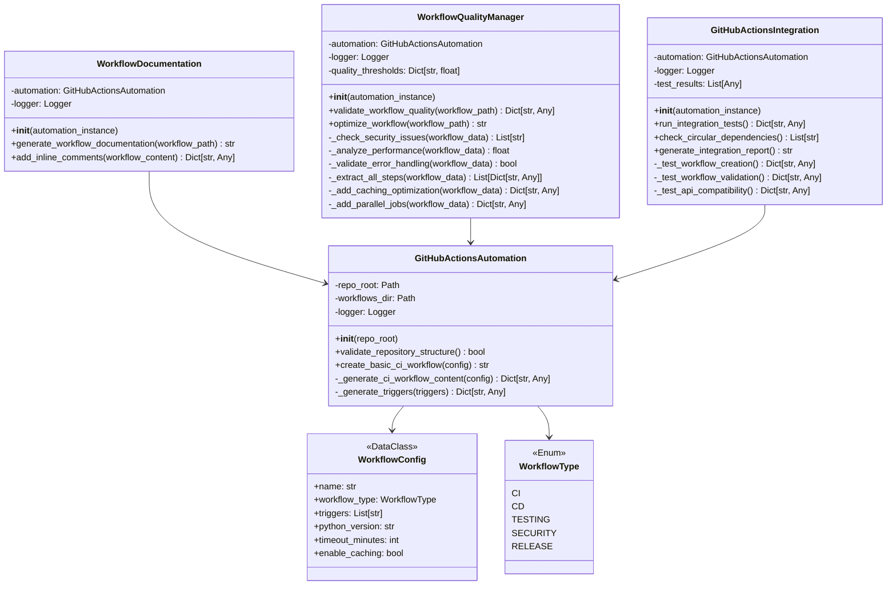
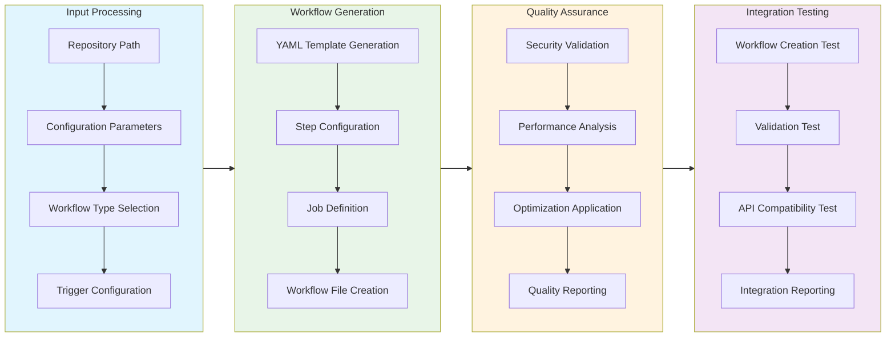
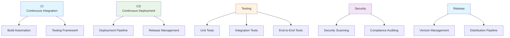

# GitHub Actions Automation Module Documentation

## Level 1: Executive Overview

### Module Purpose and Functionality
The `github_actions_automation` module provides a comprehensive, four-phase implementation of GitHub Actions workflow automation within the AutoProjectManagement system. It serves as an enterprise-grade solution for creating, validating, optimizing, and managing GitHub Actions workflows with a focus on code quality, security, and performance.

### Four-Phase Implementation Architecture
1. **Phase 1: Foundation & Structure** - Core automation framework and basic workflow creation
2. **Phase 2: Documentation** - Comprehensive documentation generation and inline commenting
3. **Phase 3: Code Quality** - Quality assurance, optimization, and security validation
4. **Phase 4: Integration** - Full integration testing, API compatibility, and dependency management

### Business Value
This module enables organizations to automate their CI/CD pipelines with enterprise-grade quality standards, providing consistent workflow generation, security compliance, performance optimization, and comprehensive documentation for DevOps teams.

---

## Level 2: Technical Architecture

### System Integration Architecture


### Class Hierarchy and Relationships


### Data Flow Architecture


---

## Level 3: Detailed Implementation

### Phase 1: Foundation & Structure Implementation

#### Core Configuration System
```python
class WorkflowConfig:
    """
    Enterprise-grade workflow configuration with type safety
    and validation built into the dataclass structure.
    """
    name: str                    # Workflow name identifier
    workflow_type: WorkflowType   # CI/CD workflow type
    triggers: List[str]          # GitHub event triggers
    python_version: str = "3.9"  # Default Python version
    timeout_minutes: int = 30    # Job timeout setting
    enable_caching: bool = True  # Caching optimization
```

#### Workflow Type Enumeration


### Phase 2: Documentation System Architecture

#### Documentation Generation Algorithm
```python
def generate_workflow_documentation(self, workflow_path: str) -> str:
    """
    Comprehensive documentation generator with:
    - Overview and purpose description
    - Trigger configuration details
    - Job breakdown and step explanations
    - Usage examples and configuration guidance
    - Best practices and recommendations
    """
```

#### Inline Commenting System
```python
def add_inline_comments(self, workflow_content: Dict[str, Any]) -> Dict[str, Any]:
    """
    Adds metadata comments for documentation purposes:
    - Purpose description
    - Maintainer information
    - Last updated timestamp
    - Version compatibility notes
    """
```

### Phase 3: Quality Assurance Framework

#### Quality Validation Matrix
| Validation Type | Method | Purpose | Threshold |
