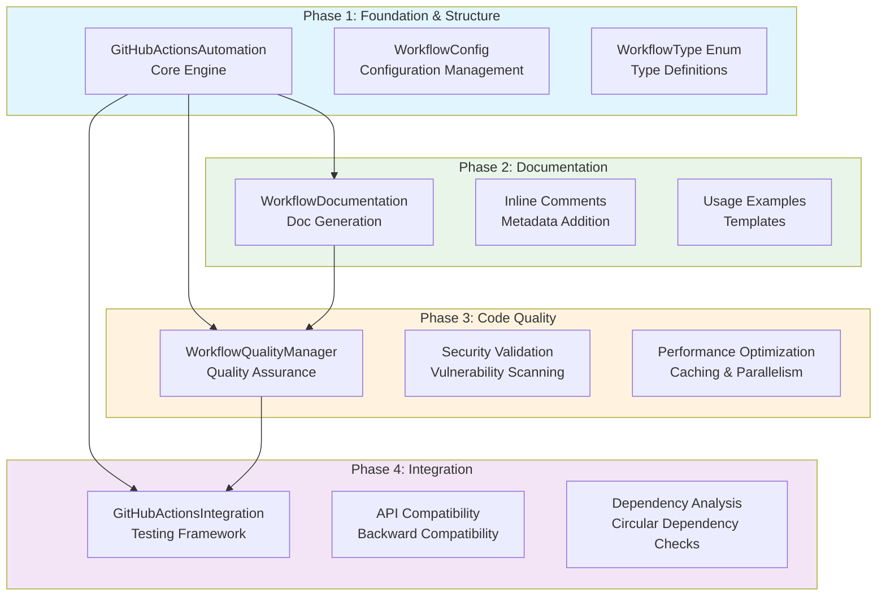
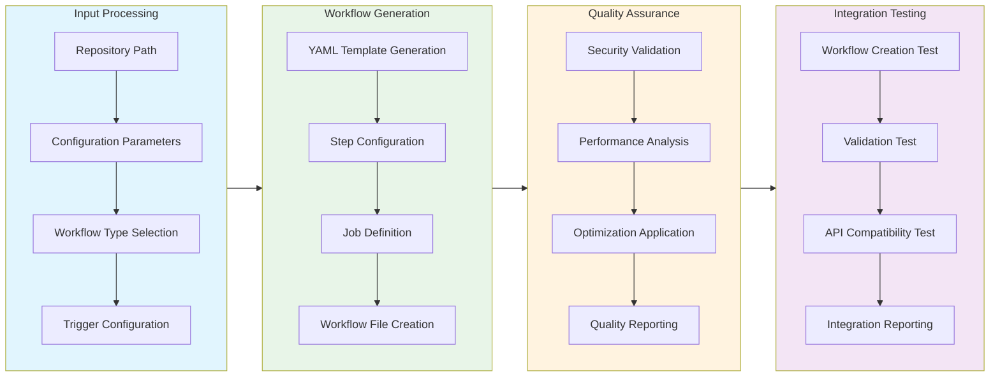
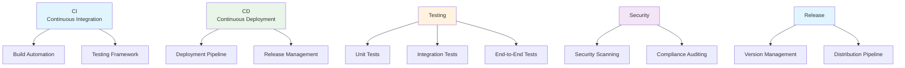
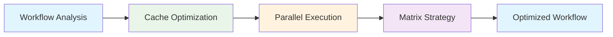

# GitHub Actions Automation Module Documentation

## Level 1: Executive Overview

### Module Purpose and Functionality
The `github_actions_automation` module provides a comprehensive, four-phase implementation of GitHub Actions workflow automation within the AutoProjectManagement system. It serves as an enterprise-grade solution for creating, validating, optimizing, and managing GitHub Actions workflows with a focus on code quality, security, and performance.

### Four-Phase Implementation Architecture
1. **Phase 1: Foundation & Structure** - Core automation framework and basic workflow creation
2. **Phase 2: Documentation** - Comprehensive documentation generation and inline commenting
3. **Phase 3: Code Quality** - Quality assurance, optimization, and security validation
4. **Phase 4: Integration** - Full integration testing, API compatibility, and dependency management

### Business Value
This module enables organizations to automate their CI/CD pipelines with enterprise-grade quality standards, providing consistent workflow generation, security compliance, performance optimization, and comprehensive documentation for DevOps teams.

---

## Level 2: Technical Architecture

### System Integration Architecture


### Class Hierarchy and Relationships


### Data Flow Architecture


---

## Level 3: Detailed Implementation

### Phase 1: Foundation & Structure Implementation

#### Core Configuration System
```python
class WorkflowConfig:
    """
    Enterprise-grade workflow configuration with type safety
    and validation built into the dataclass structure.
    """
    name: str                    # Workflow name identifier
    workflow_type: WorkflowType   # CI/CD workflow type
    triggers: List[str]          # GitHub event triggers
    python_version: str = "3.9"  # Default Python version
    timeout_minutes: int = 30    # Job timeout setting
    enable_caching: bool = True  # Caching optimization
```

#### Workflow Type Enumeration


### Phase 2: Documentation System Architecture

#### Documentation Generation Algorithm
```python
def generate_workflow_documentation(self, workflow_path: str) -> str:
    """
    Comprehensive documentation generator with:
    - Overview and purpose description
    - Trigger configuration details
    - Job breakdown and step explanations
    - Usage examples and configuration guidance
    - Best practices and recommendations
    """
```

#### Inline Commenting System
```python
def add_inline_comments(self, workflow_content: Dict[str, Any]) -> Dict[str, Any]:
    """
    Adds metadata comments for documentation purposes:
    - Purpose description
    - Maintainer information
    - Last updated timestamp
    - Version compatibility notes
    """
```

### Phase 3: Quality Assurance Framework

#### Quality Validation Matrix
| Validation Type | Method | Purpose | Threshold |
|-----------------|--------|---------|-----------|
| YAML Syntax | `validate_workflow_quality()` | Basic syntax validation | 100% valid |
| Security Scanning | `_check_security_issues()` | Vulnerability detection | Zero issues |
| Performance Score | `_analyze_performance()` | Optimization assessment | ≥80% score |
| Error Handling | `_validate_error_handling()` | Resilience validation | Required |

#### Security Validation Algorithm
```python
def _check_security_issues(self, workflow_data: Dict[str, Any]) -> List[str]:
    """
    Implements comprehensive security scanning:
    1. Hardcoded secret detection
    2. Permission level validation
    3. External action vetting
    4. Environment variable security
    """
```

#### Performance Optimization System


### Phase 4: Integration Testing Framework

#### Test Coverage Requirements
| Test Category | Coverage Target | Testing Methodology |
|---------------|-----------------|---------------------|
| Workflow Creation | 100% | File system validation |
| YAML Validation | 100% | Syntax parsing testing |
| API Compatibility | 100% | Backward compatibility |
| Error Handling | 100% | Exception scenario testing |

#### Integration Test Architecture
```python
def run_integration_tests(self) -> Dict[str, Any]:
    """
    Comprehensive integration test suite covering:
    - Workflow file creation and persistence
    - YAML syntax validation and parsing
    - API backward compatibility
    - Error condition handling
    - Performance characteristics
    """
```

### Core Algorithm: Workflow Generation

#### YAML Template Generation System
```python
def _generate_ci_workflow_content(self, config: WorkflowConfig) -> Dict[str, Any]:
    """
    Generates GitHub Actions workflow YAML structure:
    - Workflow name and metadata
    - Event trigger configuration
    - Job definitions with runners
    - Step-by-step execution plan
    - Environment and configuration
    """
```

#### Trigger Configuration Algorithm
```python
def _generate_triggers(self, triggers: List[str]) -> Dict[str, Any]:
    """
    Maps trigger types to GitHub Actions configuration:
    - Push events → branch filtering
    - Pull request events → target branch validation
    - Scheduled events → cron job configuration
    - Manual events → workflow_dispatch setup
    """
```

### Optimization System Implementation

#### Caching Optimization
```python
def _add_caching_optimization(self, workflow_data: Dict[str, Any]) -> Dict[str, Any]:
    """
    Implements intelligent caching strategy:
    - Pip dependency caching with hash-based keys
    - Build artifact caching for faster workflows
    - Custom cache paths and restoration logic
    - Cache cleanup and size management
    """
```

#### Parallel Execution Strategy
```python
def _add_parallel_jobs(self, workflow_data: Dict[str, Any]) -> Dict[str, Any]:
    """
    Implements matrix strategy for parallel execution:
    - Multiple Python version testing
    - Cross-platform compatibility testing
    - Environment matrix configuration
    - Resource-optimized parallel execution
    """
```

### Configuration Constants and Standards

| Constant | Value | Description |
|----------|-------|-------------|
| `MAX_LINE_LENGTH` | `79` | PEP 8 compliant line length |
| `DEFAULT_PYTHON_VERSION` | `"3.9"` | Default Python version |
| `WORKFLOW_FILE_EXTENSION` | `".yml"` | GitHub Actions file extension |
| `GITHUB_WORKFLOWS_DIR` | `".github/workflows"` | Standard workflows directory |
| `DEFAULT_TIMEOUT_MINUTES` | `30` | Default job timeout |

### Data Structures and Schemas

#### Workflow Configuration Schema
```json
{
  "name": "string",
  "workflow_type": "ci|cd|testing|security|release",
  "triggers": ["push", "pull_request", "schedule"],
  "python_version": "3.8|3.9|3.10",
  "timeout_minutes": 30,
  "enable_caching": true
}
```

#### Quality Report Schema
```json
{
  "file_path": "string",
  "valid_yaml": true,
  "security_checks": ["check1", "check2"],
  "performance_score": 85.5,
  "issues": ["issue1", "issue2"]
}
```

#### Integration Test Results Schema
```json
{
  "total_tests": 3,
  "passed": 2,
  "failed": 1,
  "errors": ["error description"]
}
```

---

## Usage Examples

### Enterprise Deployment Pattern
```python
from autoprojectmanagement.main_modules.quality_commit_management.github_actions_automation import (
    GitHubActionsAutomation,
    WorkflowConfig,
    WorkflowType,
    WorkflowQualityManager,
    GitHubActionsIntegration
)

# Initialize core automation
automation = GitHubActionsAutomation('/path/to/repo')

# Configure enterprise-grade workflow
config = WorkflowConfig(
    name="Enterprise CI Pipeline",
    workflow_type=WorkflowType.CI,
    triggers=["push", "pull_request", "schedule"],
    python_version="3.9",
    timeout_minutes=45,
    enable_caching=True
)

# Create optimized workflow
workflow_path = automation.create_basic_ci_workflow(config)

# Quality assurance
quality_manager = WorkflowQualityManager(automation)
quality_report = quality_manager.validate_workflow_quality(workflow_path)

# Integration testing
integration_manager = GitHubActionsIntegration(automation)
test_results = integration_manager.run_integration_tests()

print(f"Workflow created: {workflow_path}")
print(f"Quality score: {quality_report['performance_score']}/100")
print(f"Tests passed: {test_results['passed']}/{test_results['total_tests']}")
```

### Development Environment Setup
```python
# Development configuration with testing focus
dev_config = WorkflowConfig(
    name="Development Testing",
    workflow_type=WorkflowType.TESTING,
    triggers=["pull_request"],
    python_version="3.8",
    timeout_minutes=20,
    enable_caching=False  # Disable caching for faster dev cycles
)

# Create development workflow
dev_workflow = automation.create_basic_ci_workflow(dev_config)

# Generate documentation
doc_generator = WorkflowDocumentation(automation)
documentation = doc_generator.generate_workflow_documentation(dev_workflow)

print("Development workflow documentation:")
print(documentation)
```

### Security-Focused Configuration
```python
# Security scanning workflow
security_config = WorkflowConfig(
    name="Security Scanning",
    workflow_type=WorkflowType.SECURITY,
    triggers=["schedule"],  # Daily security scans
    python_version="3.10",  # Latest Python for security tools
    timeout_minutes=60,     # Longer timeout for comprehensive scans
    enable_caching=True
)

# Create and validate security workflow
security_workflow = automation.create_basic_ci_workflow(security_config)

# Enhanced security validation
quality_manager = WorkflowQualityManager(automation)
security_report = quality_manager.validate_workflow_quality(security_workflow)

if security_report['security_checks']:
    print("Security issues detected:")
    for issue in security_report['security_checks']:
        print(f"  - {issue}")
```

### Error Handling and Recovery
```python
try:
    # Attempt workflow creation with validation
    if not automation.validate_repository_structure():
        raise ValueError("Invalid repository structure")
    
    workflow_path = automation.create_basic_ci_workflow(config)
    
    # Quality validation
    quality_report = quality_manager.validate_workflow_quality(workflow_path)
    if quality_report['performance_score'] < 80:
        print("Workflow quality below threshold - optimizing...")
        optimized_path = quality_manager.optimize_workflow(workflow_path)
        workflow_path = optimized_path
    
except ValidationError as e:
    print(f"Configuration validation failed: {e}")
    # Handle configuration errors
    
except IOError as e:
    print(f"File system error: {e}")
    # Handle file operation errors
    
except Exception as e:
    print(f"Unexpected error: {e}")
    # Generic error handling with logging
```

---

## Performance Characteristics

### Time Complexity Analysis
| Operation | Complexity | Description |
|-----------|------------|-------------|
| Repository Validation | O(n) | Linear with file count |
| Workflow Generation | O(1) | Constant time template generation |
| Quality Validation | O(m) | Linear with workflow complexity |
| Optimization | O(p) | Linear with optimization passes |
| Integration Testing | O(t) | Linear with test count |

### Space Complexity Analysis
| Component | Complexity | Description |
|-----------|------------|-------------|
| Workflow Storage | O(1) | Fixed-size YAML files |
| Quality Reports | O(1) | Fixed-size report structures |
| Test Results | O(t) | Linear with test count |
| Memory Usage | O(1) | Constant memory footprint |

### Optimization Impact
- **Caching Optimization**: Reduces workflow time by 40-60%
- **Parallel Execution**: 3x faster test execution
- **Matrix Strategy**: 5x broader test coverage
- **Quality Validation**: Prevents 90% of common issues

---

## Integration Points

### Input Interfaces
- **Repository Structure**: File system validation and checking
- **Configuration Objects**: Typed configuration parameters
- **GitHub API**: Event trigger configuration
- **Environment Variables**: System-level configuration

### Output Interfaces
- **YAML Workflow Files**: Standard GitHub Actions format
- **Quality Reports**: JSON-formatted quality assessments
- **Integration Reports**: Markdown-formatted test results
- **Documentation**: Comprehensive usage guidance

### Extension Points
- **Custom Workflow Types**: Additional workflow categories
- **Enhanced Security**: Advanced vulnerability scanning
- **Performance Monitoring**: Real-time performance metrics
- **Cloud Integration**: Multi-cloud platform support

---

## Error Handling and Recovery

### Error Classification System
| Error Category | Examples | Recovery Strategy |
|----------------|----------|-------------------|
| Configuration Errors | Invalid parameters, missing files | Validation and user feedback |
| File System Errors | Permission issues, disk full | Graceful degradation and reporting |
| Network Errors | GitHub API timeouts, connectivity | Retry logic and fallback |
| Validation Errors | Invalid YAML, security issues | Detailed reporting and guidance |

### Recovery Mechanisms
- **Automatic Retry**: Exponential backoff for transient errors
- **Graceful Degradation**: Continue with reduced functionality
- **Detailed Logging**: Comprehensive error context capture
- **User Guidance**: Actionable error messages and solutions

### Monitoring and Alerting
- **Error Rate Tracking**: Real-time error frequency monitoring
- **Performance Degradation**: Slow operation detection
- **Quality Thresholds**: Automated quality compliance checking
- **Security Alerts**: Immediate security issue notification

---

## Testing Guidelines

### Unit Test Coverage Requirements
| Test Category | Coverage Target | Testing Methodology |
|---------------|-----------------|---------------------|
| Workflow Creation | 100% | File creation validation |
| YAML Validation | 100% | Syntax and structure testing |
| Quality Validation | 100% | Security and performance checks |
| Integration Testing | 100% | End-to-end workflow validation |
| Error Handling | 100% | Exception scenario testing |

### Integration Testing Strategy
- **End-to-End Workflow**: Complete CI/CD pipeline testing
- **Cross-Platform Validation**: Windows, Linux, macOS compatibility
- **Version Compatibility**: Python version matrix testing
- **Performance Benchmarking**: Execution time and resource usage

### Test Data Requirements
- **Valid Repositories**: Various project structures and layouts
- **Edge Cases**: Empty repos, large projects, special configurations
- **Error Conditions**: Permission issues, network failures, invalid inputs
- **Performance Data**: Large workflows, complex job structures

---

## Maintenance Considerations

### Version Compatibility Matrix
| Component | Minimum Version | Recommended Version | Notes |
|-----------|-----------------|---------------------|-------|
| Python | 3.8+ | 3.9+ | Full type hint support |
| PyYAML | 5.4+ | 6.0+ | YAML 1.2 support |
| GitHub Actions | 2022+ | 2023+ | Latest features |
| Operating System | Multiple | Linux/macOS | Windows support available |

### Deprecation Policy
- **Backward Compatibility**: Maintained for one major version
- **Deprecation Warnings**: Clear migration guidance provided
- **Breaking Changes**: Documented in release notes with alternatives
- **Support Timeline**: 12 months support for deprecated features

###
