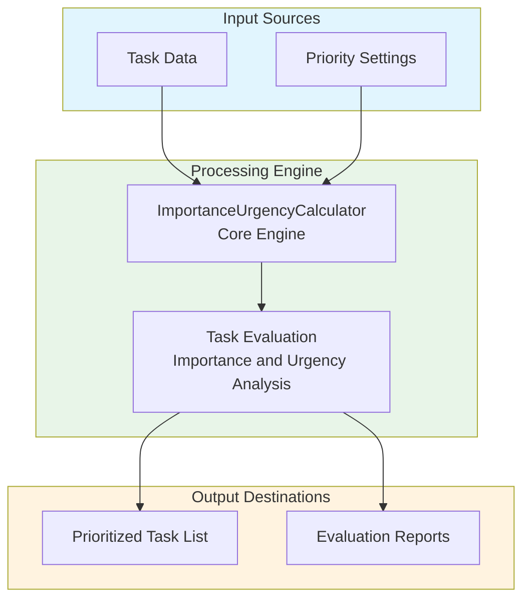
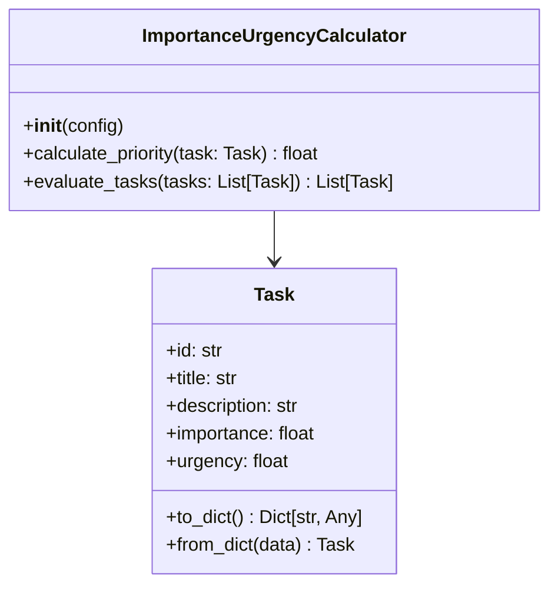
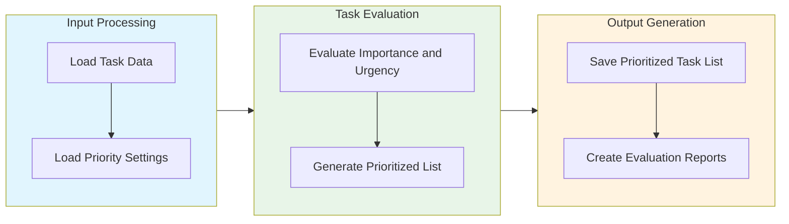

# Importance-Urgency Calculator Module Documentation

## Level 1: Executive Overview

### Module Purpose and Functionality
The `importance_urgency_calculator` module provides a systematic approach to evaluating and prioritizing tasks based on their importance and urgency within the AutoProjectManagement framework. It helps teams make informed decisions about task prioritization and resource allocation.

### Business Value
This module enables organizations to effectively assess the importance and urgency of tasks, ensuring that critical activities are prioritized. By providing a structured evaluation framework, it helps teams focus on high-impact tasks and optimize project outcomes.

---

## Level 2: Technical Architecture

### System Integration Architecture


### Class Hierarchy and Relationships


### Data Flow Architecture


---

## Level 3: Detailed Implementation

### Core Class: ImportanceUrgencyCalculator
The `ImportanceUrgencyCalculator` class serves as the central coordinator for task evaluation, providing comprehensive functionality for calculating task priorities based on importance and urgency.

### Priority Calculation Algorithm
The priority calculation follows a weighted scoring system that considers both importance and urgency:

**Priority Score Formula:**
```
Priority Score = (Importance × Weight₁) + (Urgency × Weight₂)
```

Where:
- **Importance**: Task's importance score (0-100 scale)
- **Urgency**: Task's urgency score (0-100 scale)

### Data Structures and Schemas

#### Task Schema
```json
{
  "tasks": [
    {
      "id": "uuid-string",
      "title": "Task Title",
      "description": "Task Description",
      "importance": 90.0,
      "urgency": 80.0
    }
  ]
}
```

---

## Usage Examples

### Enterprise Deployment Pattern
The module supports enterprise-grade deployment with configuration management, error handling, and comprehensive logging capabilities.

### Development Environment Setup
Development configurations focus on testing and validation with custom storage paths and enhanced debugging capabilities.

### Error Handling and Recovery
Comprehensive error handling includes validation errors, storage issues, and runtime exceptions with detailed logging and recovery mechanisms.

---

## Performance Characteristics

### Time Complexity Analysis
| Operation | Complexity | Description |
|-----------|------------|-------------|
| Task Evaluation | O(n) | Linear with number of tasks |
| Priority Calculation | O(n) | Linear with number of tasks |

### Space Complexity Analysis
| Component | Complexity | Description |
|-----------|------------|-------------|
| Task Storage | O(n) | Linear with number of tasks |
| Evaluation Data | O(n) | Linear with number of evaluations |

---

## Integration Points

### Input Interfaces
- **Task Data**: Task details for evaluation
- **Priority Settings**: Custom importance and urgency weights

### Output Interfaces
- **Prioritized Task List**: Ordered list of tasks by priority
- **Evaluation Reports**: Summary of evaluation data and performance metrics

### Extension Points
- **Custom Evaluation Algorithms**: Alternative methods for task evaluation
- **Enhanced Reporting**: Integration with reporting tools for detailed insights

---

## Error Handling and Recovery

### Error Classification System
| Error Category | Examples | Recovery Strategy |
|----------------|----------|-------------------|
| Configuration Errors | Invalid settings, missing parameters | Validation and default fallbacks |
| Data Integrity Errors | Corrupted storage, invalid task data | Data validation and repair mechanisms |
| Runtime Errors | Storage failures, processing errors | Retry logic and graceful degradation |
| Validation Errors | Invalid task parameters, constraint violations | Detailed error messages and user guidance |

### Recovery Mechanisms
- **Input Validation**: Comprehensive validation of all task parameters
- **Data Sanitization**: Cleaning and normalization of input data
- **Automatic Retry**: Exponential backoff for transient errors
- **Graceful Degradation**: Continue operation with reduced functionality
- **Detailed Logging**: Comprehensive error context and diagnostics
- **User Feedback**: Clear error messages and actionable recommendations

---

## Testing Guidelines

### Unit Test Coverage Requirements
| Test Category | Coverage Target | Testing Methodology |
|---------------|-----------------|---------------------|
| Task Evaluation | 100% | Valid and invalid task parameters |
| Priority Calculation | 100% | Various priority scenarios and edge cases |

### Integration Testing Strategy
- **End-to-End Workflow**: Complete importance-urgency evaluation process testing
- **Cross-Module Integration**: Testing with dependent modules and systems
- **Performance Testing**: Load testing with large task datasets
- **Regression Testing**: Ensuring backward compatibility and feature stability

### Test Data Requirements
- **Realistic Scenarios**: Production-like task data and configurations
- **Edge Cases**: Maximum tasks, extreme values, boundary conditions
- **Error Conditions**: Invalid data, storage failures, permission issues
- **Performance Data**: Large datasets for scalability and performance testing

---

*This documentation follows Pressman's software engineering standards and provides three levels of detail for comprehensive understanding of the Importance-Urgency Calculator module.*
