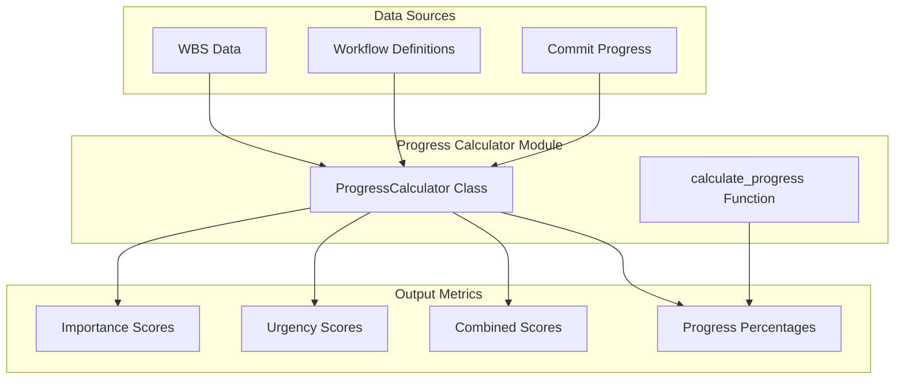
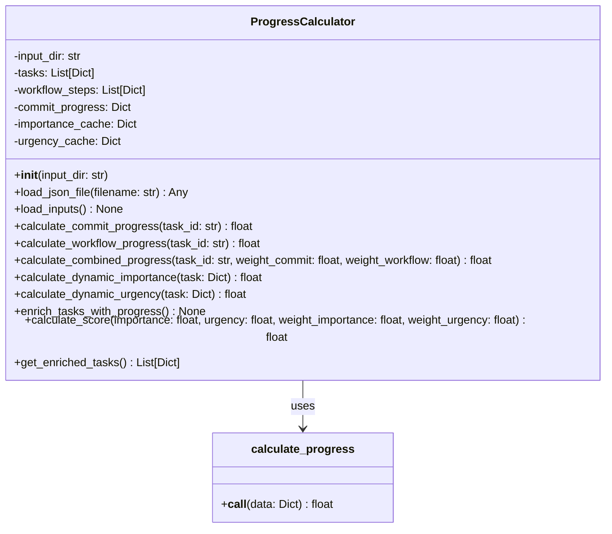
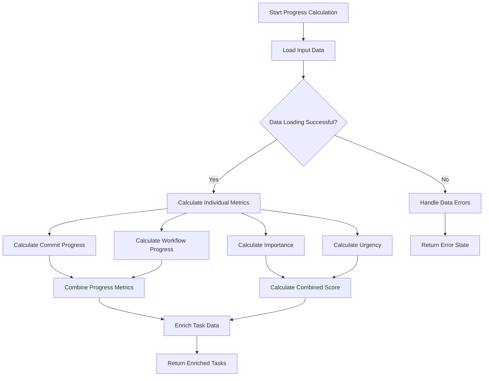

# Progress Calculator Module Documentation

## Level 1: Overview and Purpose

### Module Overview
The `progress_calculator.py` module is the computational engine for progress tracking and task prioritization within the AutoProjectManagement system. It provides sophisticated algorithms for calculating task progress, importance, urgency, and combined scores using multiple data sources and dynamic factors.

### Primary Purpose
This module serves as the mathematical foundation for project progress analysis, transforming raw task data into actionable metrics that drive decision-making, prioritization, and resource allocation throughout the project lifecycle.

### Key Responsibilities
- Calculate task progress based on commit history and workflow completion
- Compute dynamic importance scores considering time, dependencies, and priority
- Determine dynamic urgency scores based on deadlines, status, and resource availability
- Generate combined priority scores using weighted algorithms
- Enrich task data with calculated metrics for reporting and analysis
- Handle data validation and error conditions in progress calculations

## Level 2: Architecture and Design

### System Architecture Context



### Module Internal Architecture



### Data Flow Diagram



## Level 3: Detailed Implementation and Algorithms

### Core Classes and Methods

#### `ProgressCalculator` Class
**Purpose**: Main class for comprehensive progress and priority calculations.

**Key Attributes**:
- `input_dir`: Directory path for JSON input files
- `tasks`: List of task data from WBS
- `workflow_steps`: Workflow definition data
- `commit_progress`: Commit-based progress data
- `importance_cache`: Cache for importance calculations
- `urgency_cache`: Cache for urgency calculations

#### Mathematical Models and Algorithms

##### `calculate_commit_progress(task_id: str) → float`
**Purpose**: Calculate progress based on commit history.

**Algorithm**:
```
commit_progress = commit_progress_data.get(task_id, 0.0)
```

**Complexity**: O(1) constant time lookup

##### `calculate_workflow_progress(task_id: str) → float`
**Purpose**: Calculate progress based on workflow step completion.

**Algorithm**:
1. Filter workflow steps for the specific task
2. Count completed steps
3. Calculate ratio: completed_steps / total_steps

**Mathematical Model**:
```
workflow_progress = (completed_steps ÷ total_steps) × 100%
```

**Complexity**: O(n) where n is number of workflow steps

##### `calculate_combined_progress(task_id: str, weight_commit: float, weight_workflow: float) → float`
**Purpose**: Combine commit and workflow progress with status-based adjustments.

**Algorithm**:
1. Calculate individual progress metrics
2. Apply weighted combination:
   ```
   combined = (commit_progress × weight_commit) + (workflow_progress × weight_workflow)
   ```
3. Adjust based on task status:
   - If status is 'completed' and combined < 1.0 → set to 1.0
   - If status is not 'completed' and combined > 0.0 → cap at 0.5

**Mathematical Model**:
```
combined_progress = min(max(weighted_average, status_adjustment), 1.0)
```

##### `calculate_dynamic_importance(task: Dict) → float`
**Purpose**: Calculate dynamic importance score using multiple factors.

**Factors and Weights**:
- Time factor (0.5): Proximity to deadline (normalized over 7 days)
- Dependency factor (0.3): Number of dependencies (normalized over 10)
- Priority factor (0.2): Task priority (normalized over 10)

**Mathematical Model**:
```
importance = (0.5 × time_factor) + (0.3 × dependency_factor) + (0.2 × priority_factor)
```

**Time Factor Calculation**:
```
time_remaining = max(0, deadline - current_time)
normalized_time = min(1, time_remaining ÷ (7 × 24 × 3600))
time_factor = 1 - normalized_time
```

##### `calculate_dynamic_urgency(task: Dict) → float`
**Purpose**: Calculate dynamic urgency score using multiple factors.

**Factors and Weights**:
- Time factor (0.6): Proximity to deadline (normalized over 3 days)
- Status factor (0.3): 1 if pending/not started/in progress, else 0
- Resource availability factor (0.1): 1 if no resources assigned, else 0

**Mathematical Model**:
```
urgency = (0.6 × time_factor) + (0.3 × status_factor) + (0.1 × resource_availability_factor)
```

**Time Factor Calculation**:
```
time_remaining = max(0, deadline - current_time)
normalized_time = min(1, time_remaining ÷ (3 × 24 × 3600))
time_factor = 1 - normalized_time
```

##### `calculate_score(importance: float, urgency: float, weight_importance: float, weight_urgency: float) → float`
**Purpose**: Calculate combined priority score.

**Mathematical Model**:
```
score = (importance × weight_importance) + (urgency × weight_urgency)
```

Default weights: importance = 0.6, urgency = 0.4

##### `calculate_progress(data: Dict) → float`
**Purpose**: Standalone function for basic progress calculation.

**Algorithm**:
```
progress = (tasks_completed ÷ total_tasks) × 100
```

**Error Handling**:
- Validates input types and values
- Handles division by zero
- Ensures mathematical validity

### Configuration Parameters

| Parameter | Type | Default | Description |
|-----------|------|---------|-------------|
| Default input directory | str | 'project_inputs/PM_JSON/user_inputs' | Base directory for input files |
| Commit progress weight | float | 0.5 | Weight for commit-based progress |
| Workflow progress weight | float | 0.5 | Weight for workflow-based progress |
| Importance weights | tuple | (0.5, 0.3, 0.2) | Weights for time, dependency, priority factors |
| Urgency weights | tuple | (0.6, 0.3, 0.1) | Weights for time, status, resource factors |
| Score weights | tuple | (0.6, 0.4) | Weights for importance and urgency in scoring |

### Performance Characteristics

**Time Complexity**:
- Individual progress calculations: O(1) to O(n)
- Task enrichment: O(n × m) where n is tasks, m is workflow steps
- Memory usage: Linear with data size plus caching overhead

**Space Complexity**:
- Primary: O(n + m) for data storage
- Secondary: O(n) for caching calculated values

### Integration Points

**Dependencies**:
- Standard Python libraries: `os`, `json`, `datetime`, `logging`, `collections`
- Expected JSON file formats for input data

**Input Requirements**:
- `detailed_wbs.json`: Task definitions with IDs, deadlines, priorities
- `workflow_definition.json`: Workflow steps with task associations
- `commit_progress.json`: Commit-based progress percentages

### Usage Examples

**Basic Usage**:
```python
from autoprojectmanagement.main_modules.progress_reporting.progress_calculator import ProgressCalculator

# Initialize calculator
calculator = ProgressCalculator()

# Load input data
calculator.load_inputs()

# Calculate and enrich tasks
calculator.enrich_tasks_with_progress()

# Get enriched tasks with calculated metrics
enriched_tasks = calculator.get_enriched_tasks()
```

**Standalone Progress Calculation**:
```python
from autoprojectmanagement.main_modules.progress_reporting.progress_calculator import calculate_progress

data = {
    'tasks_completed': 25,
    'total_tasks': 100
}
progress = calculate_progress(data)  # Returns 25.0
```

### Error Scenarios and Handling

| Scenario | Detection Method | Recovery Strategy |
|----------|------------------|------------------|
| Missing input files | File loading errors | Continue with empty data, log warnings |
