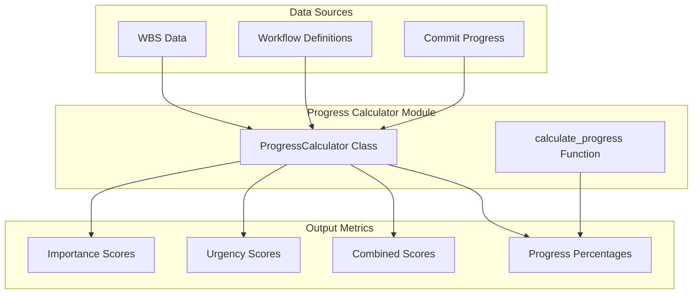

# Progress Calculator Module Documentation

## Level 1: Overview and Purpose

### Module Overview
The `progress_calculator.py` module is the computational engine for progress tracking and task prioritization within the AutoProjectManagement system. It provides sophisticated algorithms for calculating task progress, importance, urgency, and combined scores using multiple data sources and dynamic factors.

### Primary Purpose
This module serves as the mathematical foundation for project progress analysis, transforming raw task data into actionable metrics that drive decision-making, prioritization, and resource allocation throughout the project lifecycle.

### Key Responsibilities
- Calculate task progress based on commit history and workflow completion
- Compute dynamic importance scores considering time, dependencies, and priority
- Determine dynamic urgency scores based on deadlines, status, and resource availability
- Generate combined priority scores using weighted algorithms
- Enrich task data with calculated metrics for reporting and analysis
- Handle data validation and error conditions in progress calculations

## Level 2: Architecture and Design

### System Architecture Context



### Module Internal Architecture

```mermaid
classDiagram
    class ProgressCalculator {
        -input_dir: str
        -tasks: List[Dict]
        -workflow_steps: List[Dict]
        -commit_progress: Dict
        -importance_cache: Dict
        -urgency_cache: Dict
        
        +__init__(input_dir: str)
        +load_json_file(filename: str) Any
        +load_inputs() None
        +calculate_commit_progress(task_id: str) float
        +calculate_workflow_progress(task_id: str) float
        +calculate_combined_progress(task_id: str, weight_commit: float, weight_workflow: float) float
        +calculate_dynamic_importance(task: Dict) float
        +calculate_dynamic_urgency(task: Dict) float
        +enrich_tasks_with_progress() None
