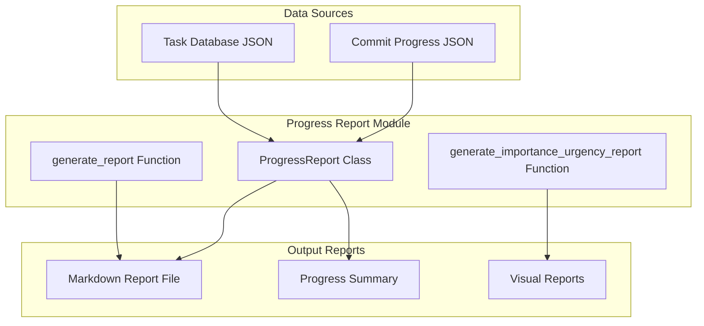
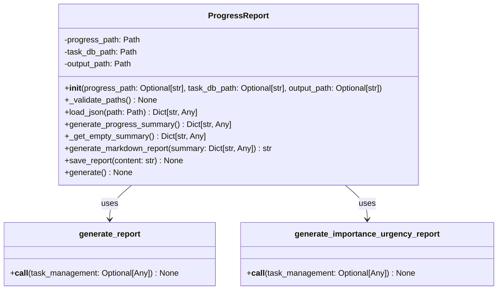
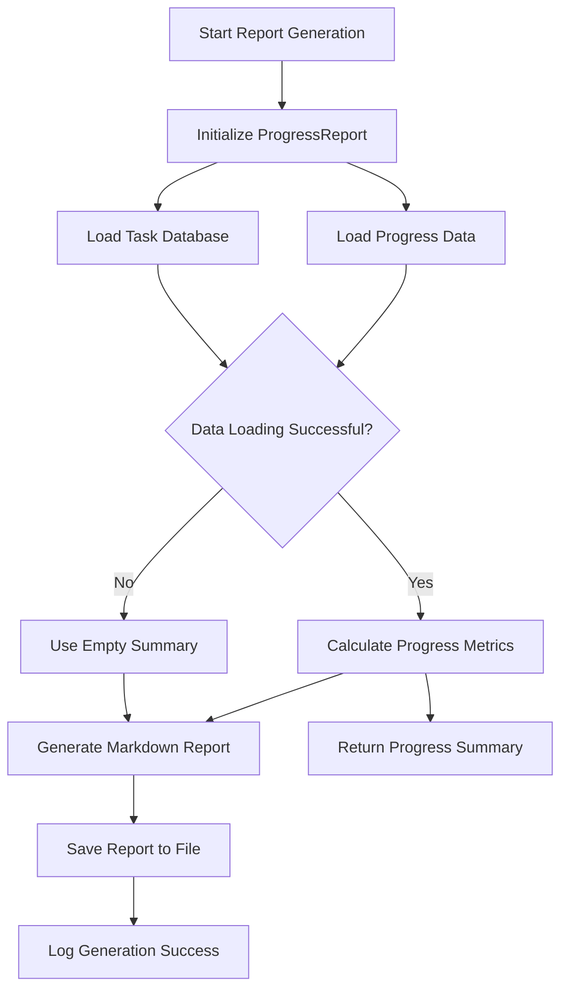

# Progress Report Module Documentation

## Level 1: Overview and Purpose

### Module Overview
The `progress_report.py` module is the primary report generation engine within the AutoProjectManagement system. It transforms raw project data into comprehensive, human-readable markdown reports that provide stakeholders with clear insights into project status, task completion, milestone achievements, and overall progress.

### Primary Purpose
This module serves as the bridge between data analysis and stakeholder communication, converting complex project metrics into actionable information through structured, formatted reports that can be used for dashboards, documentation, and decision-making processes.

### Key Responsibilities
- Load and validate project data from JSON files
- Calculate comprehensive progress metrics and statistics
- Generate formatted markdown reports with detailed project insights
- Track milestone achievements and task completion rates
- Handle data validation and error conditions gracefully
- Save reports to designated output locations

## Level 2: Architecture and Design

### System Architecture Context



### Module Internal Architecture



### Data Flow Diagram



## Level 3: Detailed Implementation and Algorithms

### Core Classes and Methods

#### `ProgressReport` Class
**Purpose**: Main class for comprehensive progress report generation and management.

**Key Attributes**:
- `progress_path`: Path to commit progress JSON file
- `task_db_path`: Path to task database JSON file  
- `output_path`: Path for output markdown report

#### Mathematical Models and Algorithms

##### `generate_progress_summary() → Dict[str, Any]`
**Purpose**: Generate comprehensive progress summary from loaded data.

**Metrics Calculated**:
- Total number of tasks
- Completed tasks count (progress ≥ 100%)
- In-progress tasks count (0% < progress < 100%)
- Pending tasks count (progress = 0% or no data)
- Overall completion rate percentage
- Milestones achieved count
- Detailed milestone task status

**Algorithm**:
1. Load progress data and task database
2. Calculate basic task counts:
   ```
   total_tasks = len(task_database)
   completed_tasks = count(progress ≥ 100)
   in_progress_tasks = count(0 < progress < 100)  
   pending_tasks = total_tasks - completed - in_progress
   ```
3. Calculate completion rate:
   ```
   completion_rate = (completed_tasks ÷ total_tasks) × 100
   ```
4. Process milestones:
   - Filter tasks with `is_milestone = True`
   - Check completion status for each milestone
   - Count achieved milestones

**Mathematical Model**:
```
completion_rate = max(0, min(100, (completed_tasks ÷ total_tasks) × 100))
```

##### `generate_markdown_report(summary: Dict[str, Any]) → str`
**Purpose**: Convert progress summary into formatted markdown report.

**Report Structure**:
1. Header with generation timestamp
2. Executive summary section
3. Task distribution statistics  
4. Completed activities overview
5. In-progress activities overview
6. Pending activities overview
7. Milestone status details
8. Next steps recommendations

**Formatting Standards**:
- Uses markdown headers (##, ###)
- Includes code blocks for data visualization
- Uses bold formatting for key metrics
- Maintains consistent spacing and structure

##### `load_json(path: Path) → Dict[str, Any]`
**Purpose**: Safe JSON file loading with comprehensive error handling.

**Error Handling Matrix**:
| Error Type | Handling Strategy | Log Level |
|------------|-------------------|-----------|
| FileNotFoundError | Raise exception | ERROR |
| JSONDecodeError | Raise exception | ERROR |
| Other Exceptions | Raise exception | ERROR |

### Configuration Parameters

| Parameter | Type | Default | Description |
|-----------|------|---------|-------------|
| DEFAULT_DASHBOARD_PATH | Path | JSonDataBase/OutPuts/progress_report.md | Default output report path |
| DEFAULT_PROGRESS_PATH | Path | JSonDataBase/OutPuts/commit_progress.json | Default progress data path |
| DEFAULT_TASK_DB_PATH | Path | JSonDataBase/OutPuts/commit_task_database.json | Default task database path |

### Performance Characteristics

**Time Complexity**:
- Data loading: O(n) where n is file size
- Summary generation: O(m) where m is number of tasks
- Report generation: O(1) constant time formatting
- Memory usage: Linear with data size

**Space Complexity**:
- Primary: O(n + m) for data storage and processing
- Secondary: O(k) for report generation buffers

### Integration Points

**Dependencies**:
- Standard Python libraries: `os`, `json`, `datetime`, `logging`, `pathlib`
- Expected JSON file formats for input data

**Input Requirements**:
- `commit_progress.json`: Task progress percentages
- `commit_task_database.json`: Task definitions and metadata
- Consistent data schema across input files

### Usage Examples

**Basic Usage**:
```python
from autoprojectmanagement.main_modules.progress_reporting.progress_report import ProgressReport

# Initialize with default paths
report = ProgressReport()

# Generate and save report
report.generate()
```

**Custom Paths**:
```python
report = ProgressReport(
    progress_path="custom_data/progress.json",
    task_db_path="custom_data/tasks.json", 
    output_path="reports/custom_report.md"
)
report.generate()
```

**Programmatic Usage**:
```python
from autoprojectmanagement.main_modules.progress_reporting.progress_report import generate_report

# Generate report using default function
generate_report()
```

### Error Scenarios and Handling

| Scenario | Detection Method | Recovery Strategy |
|----------|------------------|------------------|
| Missing input files | File existence check | Return empty summary, log error |
| Invalid JSON format | JSON parsing errors | Return empty summary, log error |
| Missing task data | Data validation | Use default values, continue processing |
| File write errors | Exception handling | Log error, abort operation |

### Testing Strategy

**Unit Tests Should Cover**:
- File loading under various conditions
- Data validation and error handling
- Progress calculation accuracy
- Report formatting consistency
- Edge cases (empty data, missing files)

**Integration Tests**:
- End-to-end report generation pipeline
- File system interaction testing
- Cross-module data consistency
- Output file validation

### Maintenance Considerations

**Report Customization**:
- Configurable output formats (HTML, PDF, etc.)
- Customizable report sections
- Template-based reporting
- Localization support

**Performance Optimization**:
- Caching mechanisms for frequent reports
- Incremental report generation
- Parallel data processing

### Security Considerations

- Validates file paths to prevent directory traversal
- Uses safe file handling practices
- Implements proper error handling to avoid information leakage
- Follows principle of least privilege for file operations

### Report Quality Standards

**Content Standards**:
- Clear, concise executive summary
- Accurate numerical data presentation
- Consistent formatting throughout
- Actionable insights and recommendations
- Timestamped generation information

**Visual Standards**:
- Proper markdown syntax usage
- Consistent header hierarchy
- Readable code blocks for data
- Appropriate use of emphasis (bold, italics)
- Clean spacing and organization

### Business Impact

The reports generated by this module serve multiple critical functions:

1. **Stakeholder Communication**: Provides transparent project status updates
2. **Decision Support**: Offers data-driven insights for project adjustments
3. **Progress Tracking**: Enables continuous monitoring of project health
4. **Milestone Management**: Tracks key achievement points
5. **Resource Allocation**: Informs resource planning based on progress

This module represents the communication backbone of the AutoProjectManagement system, transforming raw project data into meaningful, actionable information that supports effective project management and stakeholder engagement.
