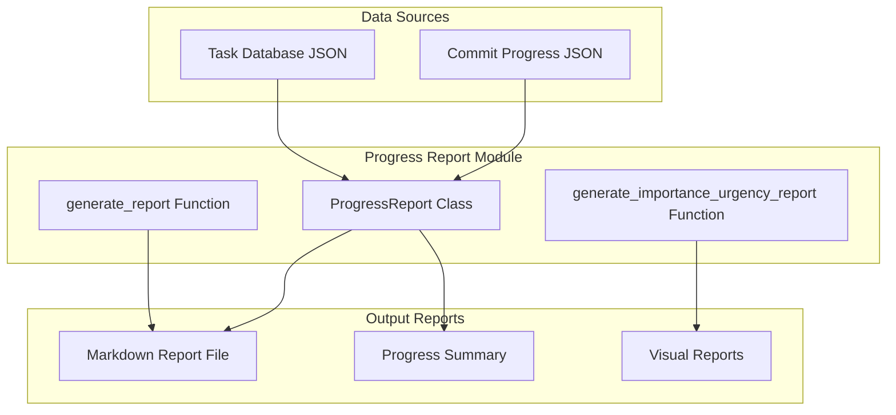
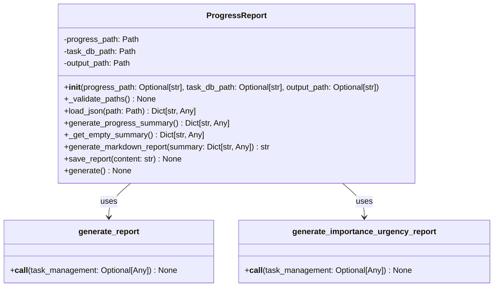

# Progress Report Module Documentation

## Level 1: Overview and Purpose

### Module Overview
The `progress_report.py` module is the primary report generation engine within the AutoProjectManagement system. It transforms raw project data into comprehensive, human-readable markdown reports that provide stakeholders with clear insights into project status, task completion, milestone achievements, and overall progress.

### Primary Purpose
This module serves as the bridge between data analysis and stakeholder communication, converting complex project metrics into actionable information through structured, formatted reports that can be used for dashboards, documentation, and decision-making processes.

### Key Responsibilities
- Load and validate project data from JSON files
- Calculate comprehensive progress metrics and statistics
- Generate formatted markdown reports with detailed project insights
- Track milestone achievements and task completion rates
- Handle data validation and error conditions gracefully
- Save reports to designated output locations

## Level 2: Architecture and Design

### System Architecture Context



### Module Internal Architecture



### Data Flow Diagram

```mermaid
flowchart TD
    A[Start Report Generation] --> B[Initialize ProgressReport]
    B --> C[Load Progress Data]
    B --> D[Load Task Database]
    
    C --> E{Data Loading Successful?}
    D --> E
    
    E -->|Yes| F[Calculate Progress Metrics]
    E -->|No| G[Use Empty Summary]
    
    F --> H[Generate Markdown Report]
    G --> H
    
