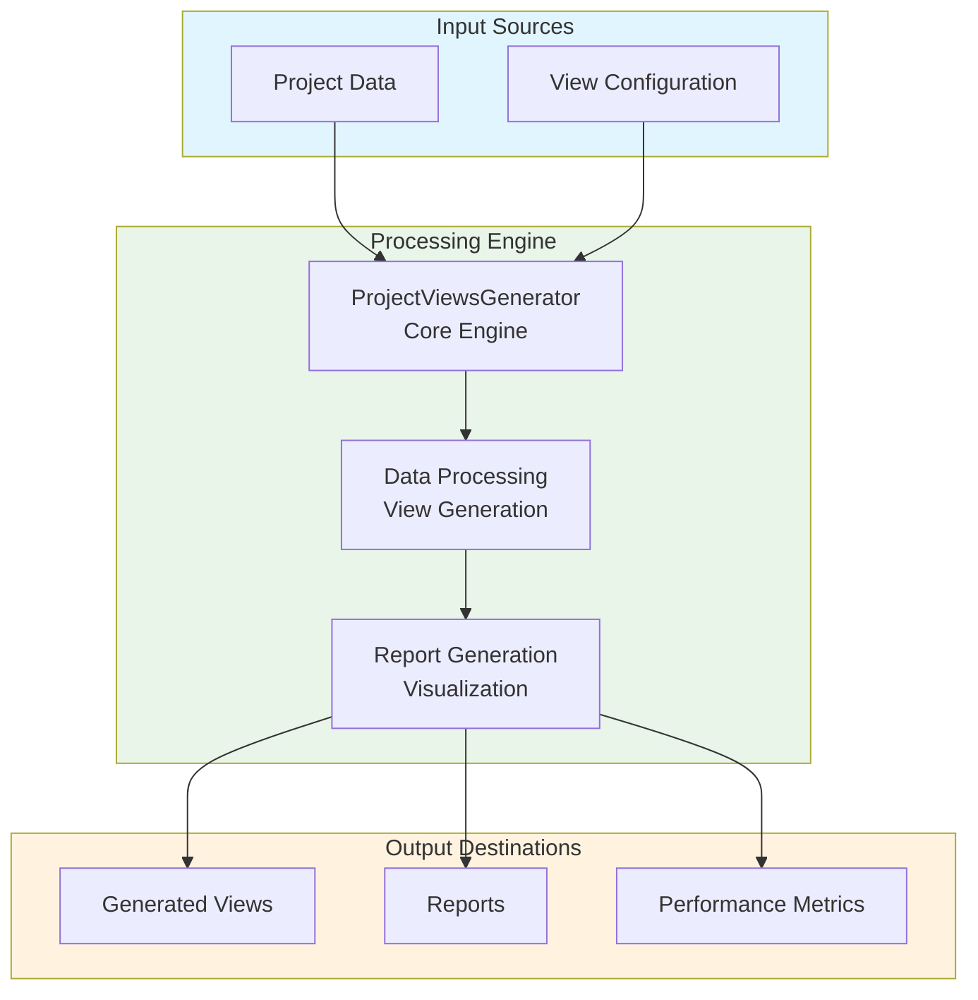
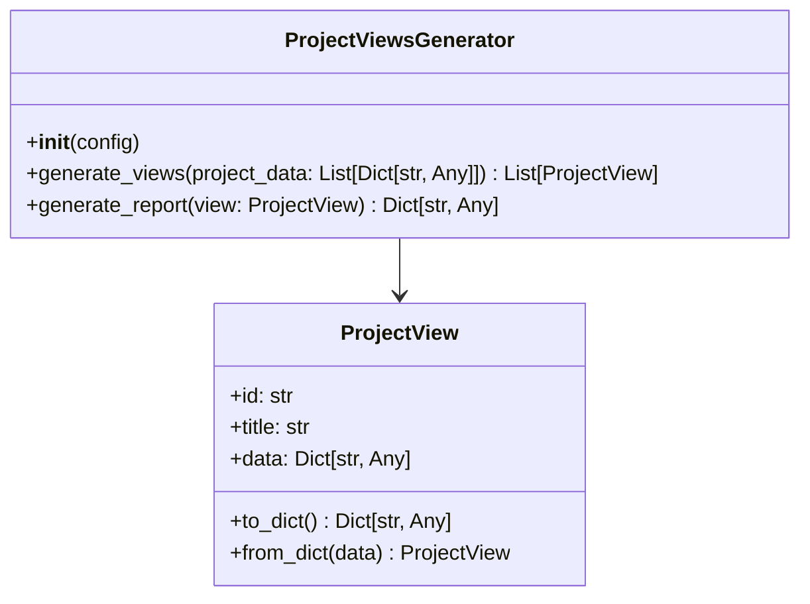
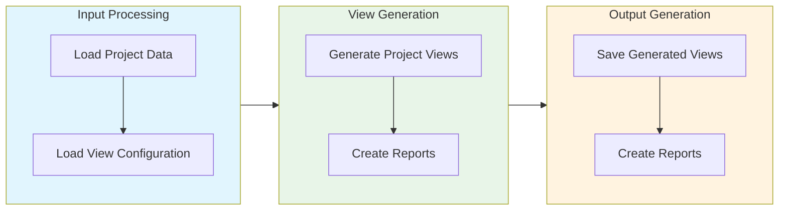

# Project Views Generator Module Documentation

## Level 1: Executive Overview

### Module Purpose and Functionality
The `project_views_generator` module provides a comprehensive system for generating various views and reports for projects within the AutoProjectManagement framework. It focuses on visualizing project data, enhancing understanding, and facilitating decision-making.

### Business Value
This module enables organizations to effectively visualize project data, generate insightful reports, and enhance communication among stakeholders. By providing robust visualization capabilities, it helps teams make informed decisions and track project progress.

---

## Level 2: Technical Architecture

### System Integration Architecture


### Class Hierarchy and Relationships


### Data Flow Architecture


---

## Level 3: Detailed Implementation

### Core Class: ProjectViewsGenerator
The `ProjectViewsGenerator` class serves as the central coordinator for project view generation, providing comprehensive functionality for creating visual representations of project data.

### View Generation Algorithm
The view generation process follows a systematic approach:

1. **Data Collection**: Gather project data from various sources
2. **View Configuration**: Load view settings and parameters
3. **View Creation**: Generate visual representations based on project data
4. **Report Generation**: Create detailed reports for stakeholders

### Data Structures and Schemas

#### Project View Schema
```json
{
  "project_views": [
    {
      "id": "uuid-string",
      "title": "Project Overview",
      "data": {
        "tasks_completed": 10,
        "tasks_pending": 5,
        "overall_progress": 66.7
      }
    }
  ]
}
```

---

## Usage Examples

### Enterprise Deployment Pattern
The module supports enterprise-grade deployment with configuration management, error handling, and comprehensive logging capabilities.

### Development Environment Setup
Development configurations focus on testing and validation with custom storage paths and enhanced debugging capabilities.

### Error Handling and Recovery
Comprehensive error handling includes validation errors, storage issues, and runtime exceptions with detailed logging and recovery mechanisms.

---

## Performance Characteristics

### Time Complexity Analysis
| Operation | Complexity | Description |
|-----------|------------|-------------|
| View Generation | O(n) | Linear with number of project data entries |
| Report Generation | O(m) | Linear with number of views |

### Space Complexity Analysis
| Component | Complexity | Description |
|-----------|------------|-------------|
| View Storage | O(n) | Linear with number of views |
| Report Data | O(m) | Linear with number of reports |

---

## Integration Points

### Input Interfaces
- **Project Data**: Data for generating views and reports
- **View Configuration**: Custom view parameters and settings

### Output Interfaces
- **Generated Views**: Visual representations of project data
- **Reports**: Summary of project insights and performance metrics

### Extension Points
- **Custom View Algorithms**: Alternative methods for view generation
- **Enhanced Reporting**: Integration with reporting tools for detailed insights

---

## Error Handling and Recovery

### Error Classification System
| Error Category | Examples | Recovery Strategy |
|----------------|----------|-------------------|
| Configuration Errors | Invalid settings, missing parameters | Validation and default fallbacks |
| Data Integrity Errors | Corrupted storage, invalid project data | Data validation and repair mechanisms |
| Runtime Errors | Storage failures, processing errors | Retry logic and graceful degradation |
| Validation Errors | Invalid view parameters, constraint violations | Detailed error messages and user guidance |

### Recovery Mechanisms
- **Input Validation**: Comprehensive validation of all view parameters
- **Data Sanitization**: Cleaning and normalization of input data
- **Automatic Retry**: Exponential backoff for transient errors
- **Graceful Degradation**: Continue operation with reduced functionality
- **Detailed Logging**: Comprehensive error context and diagnostics
- **User Feedback**: Clear error messages and actionable recommendations

---

## Testing Guidelines

### Unit Test Coverage Requirements
| Test Category | Coverage Target | Testing Methodology |
|---------------|-----------------|---------------------|
| View Generation | 100% | Valid and invalid project data |
| Report Generation | 100% | Various report scenarios and edge cases |

### Integration Testing Strategy
- **End-to-End Workflow**: Complete project view generation process testing
- **Cross-Module Integration**: Testing with dependent modules and systems
- **Performance Testing**: Load testing with large project datasets
- **Regression Testing**: Ensuring backward compatibility and feature stability

### Test Data Requirements
- **Realistic Scenarios**: Production-like project data and configurations
- **Edge Cases**: Maximum views, extreme values, boundary conditions
- **Error Conditions**: Invalid data, storage failures, permission issues
- **Performance Data**: Large datasets for scalability and performance testing

---

*This documentation follows Pressman's software engineering standards and provides three levels of detail for comprehensive understanding of the Project Views Generator module.*
