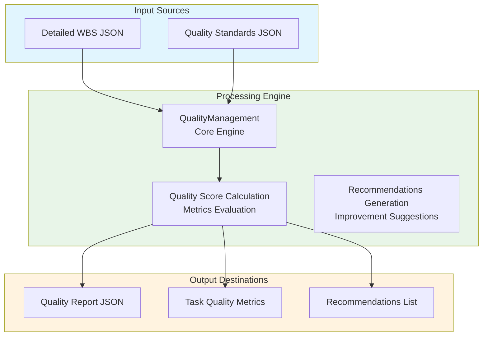
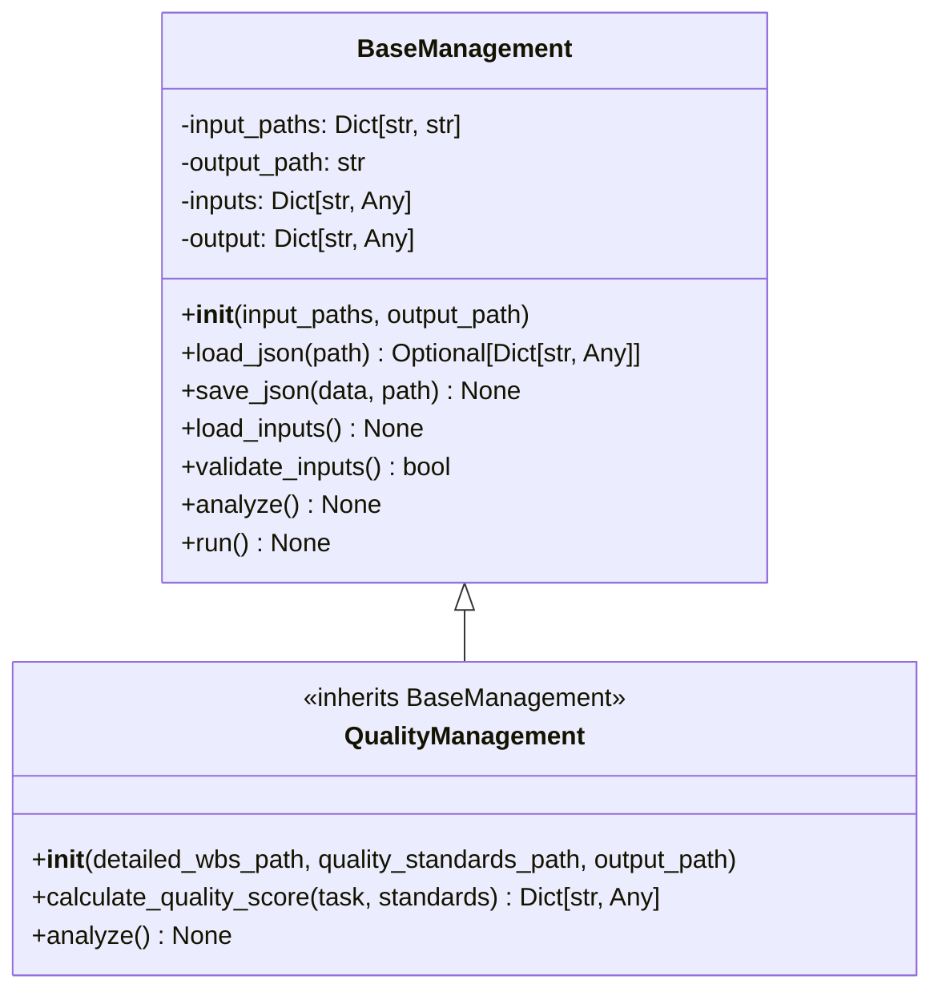
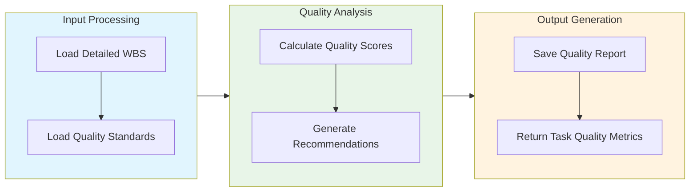

# Quality Management Module Documentation

## Level 1: Executive Overview

### Module Purpose and Functionality
The `quality_management` module provides a robust quality management system within the AutoProjectManagement framework. It evaluates and maintains code quality standards by analyzing tasks against defined quality metrics, ensuring that the project adheres to best practices and meets organizational quality benchmarks.

### Business Value
This module enables teams to systematically assess code quality, identify areas for improvement, and ensure compliance with quality standards. By providing actionable insights and recommendations, it helps maintain high-quality deliverables and fosters a culture of continuous improvement.

---

## Level 2: Technical Architecture

### System Integration Architecture


### Class Hierarchy and Relationships


### Data Flow Architecture


---

## Level 3: Detailed Implementation

### Core Class: QualityManagement
```python
class QualityManagement(BaseManagement):
    """
    Quality management system for evaluating and maintaining code quality standards.
    
    This class implements comprehensive quality evaluation based on detailed WBS
    and quality standards, providing metrics and recommendations for improvement.
    """
    
    def __init__(self,
                 detailed_wbs_path: str = 'JSonDataBase/Inputs/UserInputs/detailed_wbs.json',
                 quality_standards_path: str = 'JSonDataBase/Inputs/UserInputs/quality_standards.json',
                 output_path: str = 'JSonDataBase/OutPuts/quality_management.json') -> None:
        """
        Initialize the quality management system.
        
        Args:
            detailed_wbs_path: Path to detailed WBS JSON file
            quality_standards_path: Path to quality standards JSON file
            output_path: Path where quality results will be saved
        """
```

### Quality Score Calculation
```python
def calculate_quality_score(self, task: Dict[str, Any], 
                              standards: Dict[str, Any]) -> Dict[str, Any]:
    """
    Calculate quality score for a specific task based on standards.
    
    Args:
        task: Task dictionary containing task details
        standards: Quality standards dictionary
        
    Returns:
        Dictionary containing quality metrics and score
    """
```

### Recommendations Generation
```python
def _generate_recommendations(self, metrics: Dict[str, Any], 
                                quality_level: str) -> List[str]:
    """
    Generate quality improvement recommendations based on metrics.
    
    Args:
        metrics: Quality metrics dictionary
        quality_level: Overall quality level
        
    Returns:
        List of recommendation strings
    """
```

### Data Structures and Schemas

#### Quality Standards Schema
```json
{
  "code_coverage": {
    "target": 80,
    "weight": 1.0
  },
  "documentation_coverage": {
    "target": 90,
    "weight": 1.0
  },
  "pep8_compliance": {
    "target": 95,
    "weight": 1.0
  }
}
```

#### Quality Report Schema
```json
{
  "timestamp": "ISO8601 timestamp",
  "summary": {
    "total_tasks": 10,
    "overall_quality_score": 85.0,
    "quality_level": "HIGH",
    "high_quality_tasks": 5,
    "medium_quality_tasks": 3,
    "low_quality_tasks": 2,
    "poor_quality_tasks": 0
  },
  "task_quality": {
    "task_id": {
      "score": 90.0,
      "level": "HIGH",
      "metrics": {
        "code_coverage": {
          "actual": 85,
          "target": 80,
          "score": 100
        }
      },
      "recommendations": ["Improve documentation coverage"]
    }
  }
}
```

---

## Usage Examples

### Enterprise Deployment Pattern
```python
from autoprojectmanagement.main_modules.quality_commit_management.quality_management import QualityManagement

# Initialize quality management system
quality_mgr = QualityManagement()

# Run quality analysis
quality_mgr.run()

# Access quality report
quality_report = quality_mgr.output
print(f"Overall Quality Score: {quality_report['summary']['overall_quality_score']}")
```

### Development Environment Setup
```python
# Development configuration with testing focus
dev_quality_mgr = QualityManagement(
    detailed_wbs_path='./detailed_wbs.json',
    quality_standards_path='./quality_standards.json',
    output_path='./quality_management_report.json'
)

# Run quality analysis
dev_quality_mgr.run()
```

### Error Handling and Recovery
```python
try:
    quality_mgr = QualityManagement()
    quality_mgr.run()
    
except ValueError as e:
    print(f"Configuration error: {e}")
    # Handle configuration issues
    
except Exception as e:
    print(f"Unexpected error: {e}")
    # Generic error handling
```

---

## Performance Characteristics

### Time Complexity Analysis
| Operation | Complexity | Description |
|-----------|------------|-------------|
| Input Loading | O(n) | Linear with number of input files |
| Quality Calculation | O(m) | Linear with number of tasks |
| Recommendations Generation | O(k) | Linear with number of metrics |

### Space Complexity Analysis
| Component | Complexity | Description |
|-----------|------------|-------------|
| Task Storage | O(n) | Linear with number of tasks |
| Quality Metrics | O(m) | Linear with number of metrics |
| Recommendations | O(k) | Linear with number of recommendations |

---

## Integration Points

### Input Interfaces
- **Detailed WBS JSON**: Task breakdown and structure
- **Quality Standards JSON**: Quality metrics and thresholds

### Output Interfaces
- **Quality Report JSON**: Summary of quality analysis
- **Task Quality Metrics**: Detailed metrics for each task
- **Recommendations List**: Actionable insights for improvement

### Extension Points
- **Custom Quality Metrics**: Additional metrics for evaluation
- **Enhanced Reporting**: Integration with reporting tools
- **Monitoring Integration**: Real-time quality monitoring

---

## Error Handling and Recovery

### Error Classification System
| Error Category | Examples | Recovery Strategy |
|----------------|----------|-------------------|
| Configuration Errors | Invalid paths, missing files | Validation and user feedback |
| Data Errors | Corrupted JSON, missing keys | Graceful degradation and reporting |
| Runtime Errors | File access issues, processing errors | Retry logic and fallback |

### Recovery Mechanisms
- **Automatic Retry**: Exponential backoff for transient errors
- **Graceful Degradation**: Continue with reduced functionality
- **Detailed Logging**: Comprehensive error context capture
- **User Guidance**: Actionable error messages and solutions

---

## Testing Guidelines

### Unit Test Coverage Requirements
| Test Category | Coverage Target | Testing Methodology |
|---------------|-----------------|---------------------|
| Input Loading | 100% | Mock input files |
| Quality Calculation | 100% | Test various task scenarios |
| Recommendations | 100% | Validate generated recommendations |

### Integration Testing Strategy
- **End-to-End Workflow**: Complete quality management testing
- **Cross-Platform Validation**: Windows, Linux, macOS compatibility
- **Performance Benchmarking**: Execution time and resource usage

### Test Data Requirements
- **Valid WBS**: Various project structures and layouts
- **Edge Cases**: Empty WBS, large projects, special configurations
- **Error Conditions**: Permission issues, invalid inputs

---

## Maintenance Considerations

### Version Compatibility Matrix
| Component | Minimum Version | Recommended Version | Notes |
|-----------|-----------------|---------------------|-------|
| Python | 3.8+ | 3.9+ | Full type hint support |
| JSON | 2.0+ | 3.0+ | Latest features |
| Operating System | Multiple | Linux/macOS | Windows support available |

---

*This documentation follows Pressman's software engineering standards and provides three levels of detail for comprehensive understanding of the Quality Management module.*
