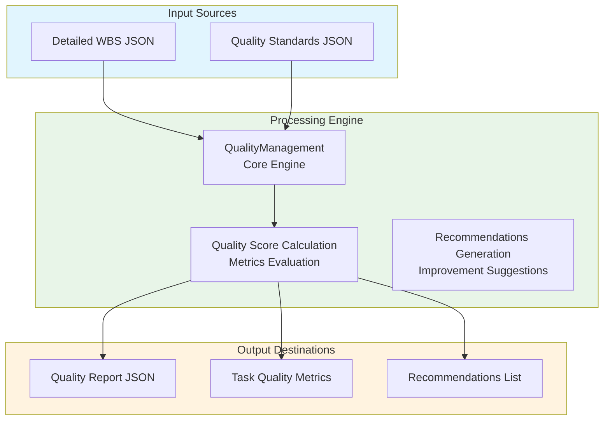
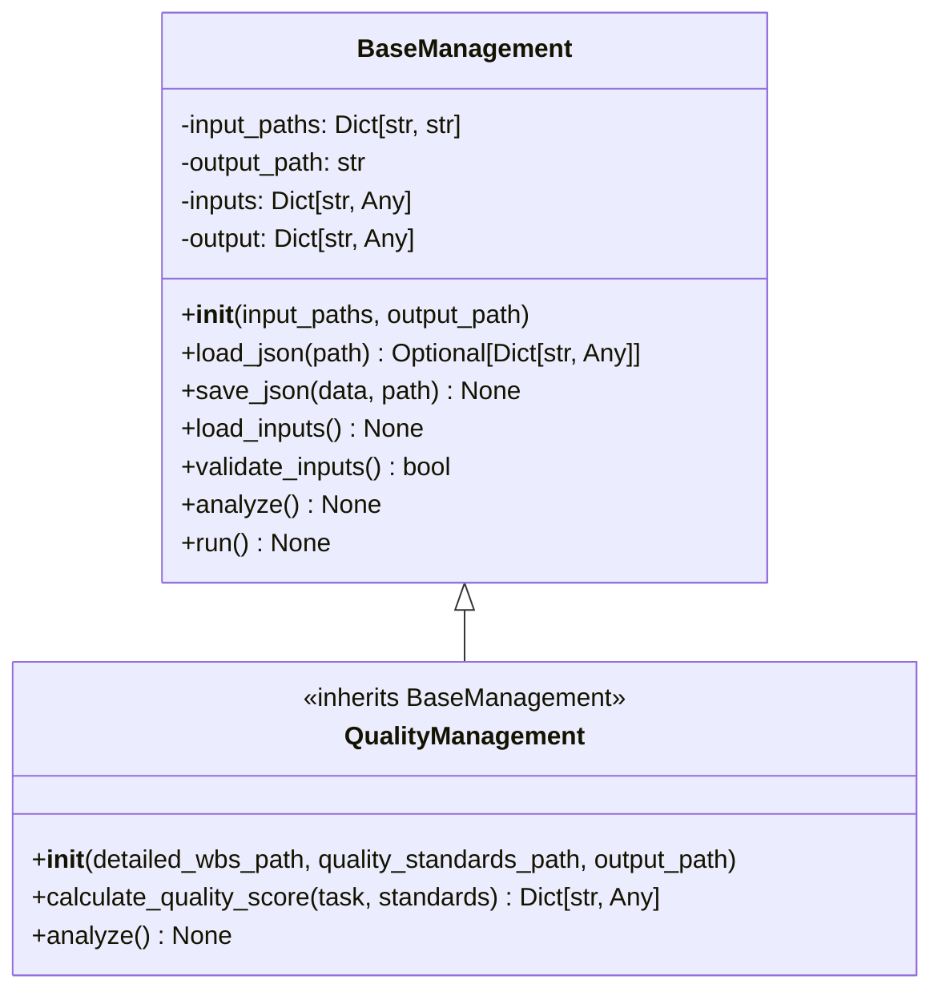
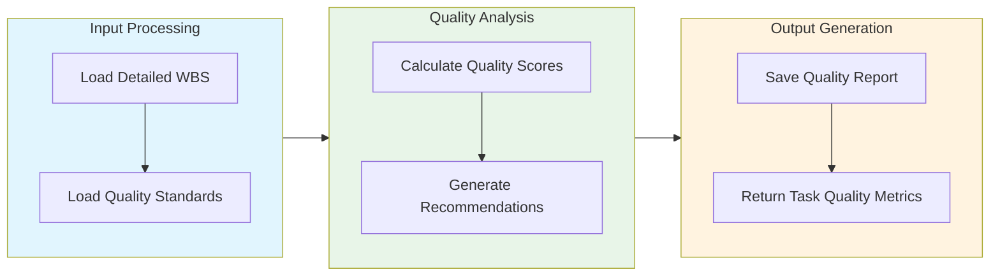

# Quality Management Module Documentation

## Level 1: Executive Overview

### Module Purpose and Functionality
The `quality_management` module provides a robust quality management system within the AutoProjectManagement framework. It evaluates and maintains code quality standards by analyzing tasks against defined quality metrics, ensuring that the project adheres to best practices and meets organizational quality benchmarks.

### Business Value
This module enables teams to systematically assess code quality, identify areas for improvement, and ensure compliance with quality standards. By providing actionable insights and recommendations, it helps maintain high-quality deliverables and fosters a culture of continuous improvement.

---

## Level 2: Technical Architecture

### System Integration Architecture


### Class Hierarchy and Relationships


### Data Flow Architecture


---

## Level 3: Detailed Implementation

### Core Class: QualityManagement
```python
class QualityManagement(BaseManagement):
    """
    Quality management system for evaluating and maintaining code quality standards.
    
    This class implements comprehensive quality evaluation based on detailed WBS
    and quality standards, providing metrics and recommendations for improvement.
    """
    
    def __init__(self,
                 detailed_wbs_path: str = 'JSonDataBase/Inputs/UserInputs/detailed_wbs.json',
                 quality_standards_path: str = 'JSonDataBase/Inputs/UserInputs/quality_standards.json',
                 output_path: str = 'JSonDataBase/OutPuts/quality_management.json') -> None:
        """
        Initialize the quality management system.
        
        Args:
            detailed_wbs_path: Path to detailed WBS JSON file
            quality_standards_path: Path to quality standards JSON file
            output_path: Path where quality results will be saved
        """
```

### Quality Score Calculation
```python
def calculate_quality_score(self, task: Dict[str, Any], 
                              standards: Dict[str, Any]) -> Dict[str, Any]:
    """
    Calculate quality score for a specific task based on standards.
    
    Args:
        task: Task dictionary containing task details
        standards: Quality standards dictionary
        
    Returns:
        Dictionary containing quality metrics and score
    """
```

### Recommendations Generation
```python
def _generate_recommendations(self, metrics: Dict[str, Any], 
                                quality_level: str) -> List[str]:
    """
    Generate quality improvement recommendations based on metrics.
    
    Args:
        metrics: Quality metrics dictionary
        quality_level: Overall quality level
        
    Returns:
        List of recommendation strings
