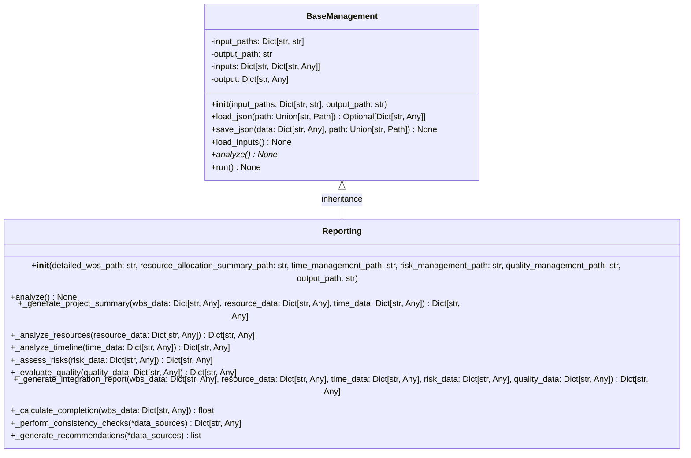
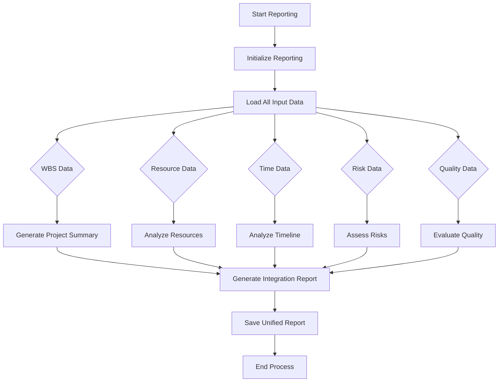

# Reporting Module Documentation

## Level 1: Overview and Purpose

### Module Overview
The `reporting.py` module is the comprehensive reporting framework within the AutoProjectManagement system. It provides a unified interface for generating integrated project management reports by combining data from multiple sources including WBS, resource allocation, time management, risk management, and quality management systems.

### Primary Purpose
This module serves as the central reporting hub that integrates disparate project data sources into cohesive, actionable reports. It enables stakeholders to gain holistic insights into project health, resource utilization, timeline adherence, risk exposure, and quality compliance through standardized reporting formats.

### Key Responsibilities
- Load and integrate data from multiple project management domains
- Generate comprehensive project summaries and analysis reports
- Perform cross-domain consistency checks and validations
- Provide actionable recommendations based on integrated analysis
- Handle data validation and error conditions across multiple sources
- Save unified reports in standardized JSON format

## Level 2: Architecture and Design

### System Architecture Context

```mermaid
graph TB
    subgraph "Data Sources"
        WBS[WBS Data]
        RA[Resource Allocation]
        TM[Time Management]
        RM[Risk Management]
        QM[Quality Management]
    end
    
    subgraph "Reporting Module"
        BM[BaseManagement Class]
        REP[Reporting Class]
    end
    
    subgraph "Output Reports"
        SUM[Project Summary]
        RES[Resource Analysis]
        TIME[Timeline Analysis]
        RISK[Risk Assessment]
        QUAL[Quality Metrics]
        INT[Integration Report]
    end
    
    WBS --> REP
    RA --> REP
    TM --> REP
    RM --> REP
    QM --> REP
    REP --> SUM
    REP --> RES
    REP --> TIME
    REP --> RISK
    REP --> QUAL
    REP --> INT
    BM --> REP : inherits
```

### Module Internal Architecture



### Data Flow Diagram



## Level 3: Detailed Implementation and Algorithms

### Core Classes and Methods

#### `BaseManagement` Class
**Purpose**: Abstract base class providing common JSON I/O operations and workflow management.

**Key Attributes**:
- `input_paths`: Dictionary mapping input names to file paths
- `output_path`: Output file path for saving results
- `inputs`: Dictionary storing loaded input data
- `output`: Dictionary storing processed output data

#### `Reporting` Class
**Purpose**: Comprehensive project management reporting system integrating multiple data domains.

**Key Analysis Methods**:

##### `analyze() → None`
**Purpose**: Main analysis method that orchestrates all reporting components.

**Integration Process**:
1. Extract data from all input sources
2. Generate domain-specific analyses
3. Create integrated cross-domain reports
4. Perform consistency checks
5. Generate actionable recommendations

##### Domain-Specific Analysis Methods

**`_generate_project_summary()`**:
- Calculates total tasks and completion percentage
- Integrates WBS, resource, and timeline data
- Provides high-level project status overview

**`_analyze_resources()`**:
- Analyzes resource utilization rates
- Tracks allocation status (allocated vs available)
- Provides resource management insights

**`_analyze_timeline()`**:
- Compares planned vs actual durations
- Tracks milestone achievements
- Identifies project delays

**`_assess_risks()`**:
- Quantifies risk exposure levels
- Tracks mitigation implementation status
- Provides risk management overview

**`_evaluate_quality()`**:
- Measures quality compliance rates
- Tracks quality issues and improvements
- Provides quality management insights

##### Integration Methods

**`_generate_integration_report()`**:
- Performs data completeness assessment
- Executes cross-domain consistency checks
- Generates unified recommendations

**Mathematical Models**:

**Completion Percentage Calculation**:
```
completion_percentage = (completed_tasks ÷ total_tasks) × 100
```

**Resource Utilization Analysis**:
```
utilization_rate = (allocated_resources ÷ total_resources) × 100
```

**Risk Exposure Assessment**:
```
high_risk_ratio = (high_priority_risks ÷ total_risks) × 100
```

### Configuration Parameters

| Parameter | Type | Default | Description |
|-----------|------|---------|-------------|
| DEFAULT_DETAILED_WBS_PATH | str | project_inputs/PM_JSON/user_inputs/detailed_wbs.json | WBS data path |
| DEFAULT_RESOURCE_ALLOCATION_PATH | str | project_inputs/PM_JSON/system_outputs/resource_allocation_summary.json | Resource data path |
| DEFAULT_TIME_MANAGEMENT_PATH | str | project_inputs/PM_JSON/system_outputs/time_management.json | Time data path |
| DEFAULT_RISK_MANAGEMENT_PATH | str | project_inputs/PM_JSON/system_outputs/risk_management.json | Risk data path |
| DEFAULT_QUALITY_MANAGEMENT_PATH | str | project_inputs/PM_JSON/system_outputs/quality_management.json | Quality data path |
| DEFAULT_OUTPUT_PATH | str | project_inputs/PM_JSON/system_outputs/project_reports.json | Output report path |
| JSON_INDENT | int | 2 | JSON formatting indentation |
| ENCODING | str | utf-8 | File encoding standard |

### Performance Characteristics

**Time Complexity**:
- Data loading: O(n) where n is total file size across all sources
- Analysis: O(m) where m is complexity of cross-domain integration
- Memory usage: Linear with combined data size

**Space Complexity**:
- Primary: O(n + m) for data storage and processing
- Secondary: O(k) for integration analysis buffers

### Integration Points

**Dependencies**:
- Standard Python libraries: `json`, `os`, `pathlib`
- Expected JSON schema compliance across all input sources
- Consistent data formats for cross-domain integration

**Input Requirements**:
- WBS data with task definitions and status
- Resource allocation data with utilization metrics
- Time management data with duration and milestone information
- Risk management data with risk assessments
- Quality management data with compliance metrics

### Usage Examples

**Basic Usage**:
```python
from autoprojectmanagement.main_modules.progress_reporting.reporting import Reporting

# Initialize with default paths
reporter = Reporting()

# Run complete reporting workflow
reporter.run()

# Access generated reports
reports = reporter.output
```

**Custom Configuration**:
```python
reporter = Reporting(
    detailed_wbs_path="custom/wbs_data.json",
    resource_allocation_summary_path="custom/resources.json",
    output_path="reports/custom_analysis.json"
)
reporter.run()
```

**Programmatic Analysis**:
```python
reporter = Reporting()
reporter.load_inputs()
reporter.analyze()
project_summary = reporter.output['project_summary']
resource_analysis = reporter.output['resource_analysis']
```

### Error Scenarios and Handling

| Scenario | Detection Method | Recovery Strategy |
|----------|------------------|------------------|
| Missing input files | File existence checks | Continue with available data, log warnings |
| Invalid JSON format | JSON parsing errors | Skip problematic files, include in error report |
| Data schema mismatches | Data validation | Use default values, flag inconsistencies |
| Cross-domain inconsistencies | Consistency checks | Generate warnings, provide recommendations |

### Testing Strategy

**Unit Tests Should Cover**:
- Individual analysis methods with various data scenarios
- Error handling across multiple data source failures
- Cross-domain consistency validation
- Recommendation generation logic
- Data completeness assessment

**Integration Tests**:
- End-to-end reporting workflow
- Multi-source data integration
- Output format validation
- Performance testing with large datasets

### Maintenance Considerations

**Extensibility**:
- Modular design for adding new data sources
- Configurable analysis components
- Customizable output formats
- Plugin architecture for additional analyses

**Performance Optimization**:
- Caching mechanisms for frequent reports
- Incremental data processing
- Parallel data loading and analysis
- Memory-efficient data handling

### Security Considerations

- Validates all file paths to prevent directory traversal
- Implements proper error handling to avoid information leakage
- Follows principle of least privilege for file operations
- Handles sensitive project data appropriately

### Business Impact

The integrated reporting provided by this module enables:

1. **Holistic Project Visibility**: Unified view across all project domains
2. **Data-Driven Decision Making**: Comprehensive analytics for informed choices
3. **Risk Mitigation**: Early identification of cross-domain issues
4. **Resource Optimization**: Integrated resource and timeline analysis
5. **Quality Assurance**: Comprehensive quality compliance tracking
6. **Stakeholder Communication**: Standardized reporting for all audiences

### Scientific Foundations

The reporting methodology is based on established project management frameworks:

1. **Earned Value Management (EVM)**: Integrated cost and schedule performance
2. **Risk Management Framework**: Systematic risk assessment and mitigation
3. **Quality Management Systems**: Continuous improvement and compliance
4. **Resource Optimization Theory**: Efficient resource allocation and utilization
5. **Integrated Project Management**: Holistic approach to project oversight

The module ensures that:
- All calculations are mathematically sound and bounded
- Cross-domain dependencies are properly accounted for
- Recommendations are actionable and evidence-based
- Reports are consistent and reproducible

This module represents the pinnacle of the AutoProjectManagement system's analytical capabilities, providing integrated insights that drive strategic project decisions and ensure successful project outcomes.
