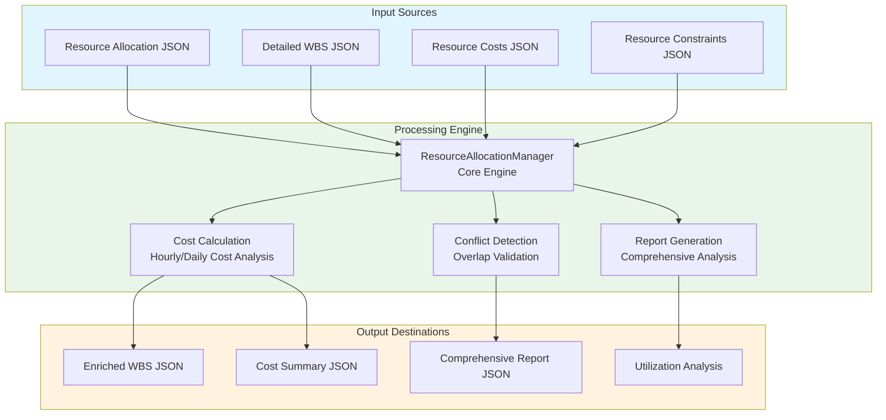
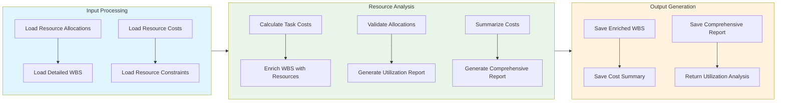

# Resource Allocation Manager Module Documentation

## Level 1: Executive Overview

### Module Purpose and Functionality
The `resource_allocation_manager` module provides a sophisticated system for managing and optimizing resource allocation within the AutoProjectManagement framework. It handles comprehensive resource allocation, cost tracking, conflict detection, and detailed reporting capabilities.

### Business Value
This module enables organizations to efficiently allocate resources, calculate detailed costs, detect allocation conflicts, and generate comprehensive reports. By providing advanced resource management capabilities, it helps optimize resource utilization and minimize project costs.

---

## Level 2: Technical Architecture

### System Integration Architecture


### Class Hierarchy and Relationships


### Data Flow Architecture


---

## Level 3: Detailed Implementation

### Core Class: ResourceAllocationManager
```python
class ResourceAllocationManager:
    """
    Enhanced resource allocation manager with comprehensive cost tracking,
    resource optimization, and detailed reporting capabilities.
    
    This class provides functionality for:
    - Loading and validating resource allocation data
    - Calculating detailed costs for resource allocations
    - Optimizing resource utilization
    - Generating comprehensive reports
    - Managing resource conflicts and constraints
    """
    
    def __init__(self,
                 resource_allocation_path: str = 'JSonDataBase/Inputs/UserInputs/task_resource_allocation.json',
                 detailed_wbs_path: str = 'JSonDataBase/Inputs/UserInputs/detailed_wbs.json',
                 resource_costs_path: str = 'JSonDataBase/Inputs/UserInputs/resource_costs.json',
                 resource_constraints_path: Optional[str] = None,
                 output_path: str = 'JSonDataBase/OutPuts/resource_allocation_enriched.json',
                 summary_output_path: str = 'JSonDataBase/OutPuts/resource_allocation_summary.json',
                 report_output_path: str = 'JSonDataBase/OutPuts/resource_allocation_report.json') -> None:
        """
        Initialize the Resource Allocation Manager.
        
        Args:
            resource_allocation_path: Path to resource allocation JSON file
            detailed_wbs_path: Path to detailed WBS JSON file
            resource_costs_path: Path to resource costs JSON file
            resource_constraints_path: Optional path to resource constraints JSON file
            output_path: Path for enriched WBS output
            summary_output_path: Path for cost summary output
            report_output_path: Path for comprehensive report output
        """
```

### Cost Calculation Algorithm
```python
def calculate_task_cost(self, allocation: Dict[str, Any]) -> float:
    """
    Calculate the cost of a task based on its resource allocation.
    
    The calculation follows this formula:
    Total Cost = (Duration in Days × Working Hours per Day × Allocation Percentage) × Hourly Cost
    
    Where:
    - Duration in Days = (End Date - Start Date) + 1
    - Working Hours per Day = 8 (configurable)
    - Allocation Percentage = allocation_percent / 100.0
    - Hourly Cost = resource_costs[resource_id].get('hourly_cost', 0.0)
    
    Args:
        allocation: Resource allocation dictionary
        
    Returns:
        Calculated cost as float
    """
```

### Resource Utilization Analysis
```python
def generate_resource_utilization_report(self) -> Dict[str, Any]:
    """
    Generate resource utilization analysis.
    
    This method calculates utilization rates for each resource based on:
    - Number of allocations per resource
    - Resource capacity and constraints
    - Historical utilization patterns
    
    Returns:
        Dictionary containing utilization metrics for each resource
    """
```

### Data Structures and Schemas

#### Resource Costs Schema
```json
{
  "resource_id": {
    "name": "Senior Developer",
    "resource_type": "human",
    "hourly_cost": 75.0,
    "daily_cost": 600.0,
    "currency": "USD",
    "effective_date": "2025-01-01",
    "expiry_date": "2025-12-31"
  }
}
```

#### Comprehensive Report Schema
```json
{
  "process_date": "ISO8601 timestamp",
