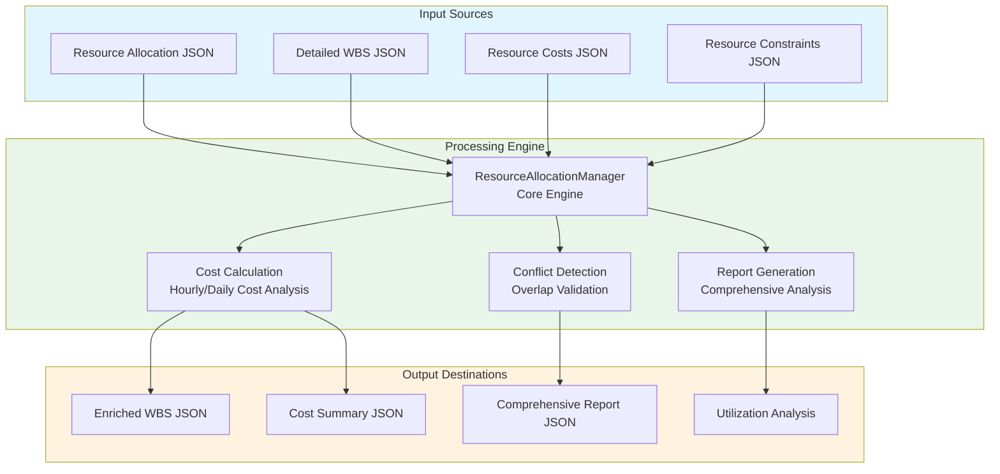
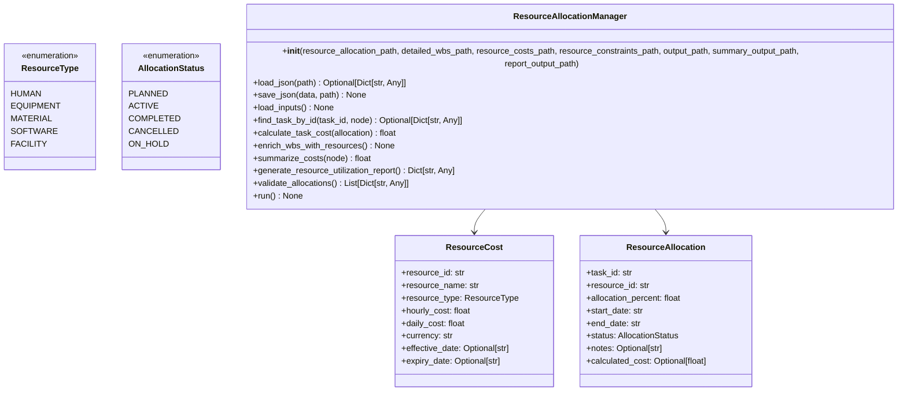
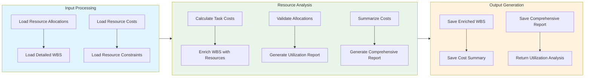

# Resource Allocation Manager Module Documentation

## Level 1: Executive Overview

### Module Purpose and Functionality
The `resource_allocation_manager` module provides a sophisticated system for managing and optimizing resource allocation within the AutoProjectManagement framework. It handles comprehensive resource allocation, cost tracking, conflict detection, and detailed reporting capabilities.

### Business Value
This module enables organizations to efficiently allocate resources, calculate detailed costs, detect allocation conflicts, and generate comprehensive reports. By providing advanced resource management capabilities, it helps optimize resource utilization and minimize project costs.

---

## Level 2: Technical Architecture

### System Integration Architecture


### Class Hierarchy and Relationships


### Data Flow Architecture


---

## Level 3: Detailed Implementation

### Core Class: ResourceAllocationManager
```python
class ResourceAllocationManager:
    """
    Enhanced resource allocation manager with comprehensive cost tracking,
    resource optimization, and detailed reporting capabilities.
    
    This class provides functionality for:
    - Loading and validating resource allocation data
    - Calculating detailed costs for resource allocations
    - Optimizing resource utilization
    - Generating comprehensive reports
    - Managing resource conflicts and constraints
    """
    
    def __init__(self,
                 resource_allocation_path: str = 'JSonDataBase/Inputs/UserInputs/task_resource_allocation.json',
                 detailed_wbs_path: str = 'JSonDataBase/Inputs/UserInputs/detailed_wbs.json',
                 resource_costs_path: str = 'JSonDataBase/Inputs/UserInputs/resource_costs.json',
                 resource_constraints_path: Optional[str] = None,
                 output_path: str = 'JSonDataBase/OutPuts/resource_allocation_enriched.json',
                 summary_output_path: str = 'JSonDataBase/OutPuts/resource_allocation_summary.json',
                 report_output_path: str = 'JSonDataBase/OutPuts/resource_allocation_report.json') -> None:
        """
        Initialize the Resource Allocation Manager.
        
        Args:
            resource_allocation_path: Path to resource allocation JSON file
            detailed_wbs_path: Path to detailed WBS JSON file
            resource_costs_path: Path to resource costs JSON file
            resource_constraints_path: Optional path to resource constraints JSON file
            output_path: Path for enriched WBS output
            summary_output_path: Path for cost summary output
            report_output_path: Path for comprehensive report output
        """
```

### Cost Calculation Algorithm
```python
def calculate_task_cost(self, allocation: Dict[str, Any]) -> float:
    """
    Calculate the cost of a task based on its resource allocation.
    
    The calculation follows this formula:
    Total Cost = (Duration in Days × Working Hours per Day × Allocation Percentage) × Hourly Cost
    
    Where:
    - Duration in Days = (End Date - Start Date) + 1
    - Working Hours per Day = 8 (configurable)
    - Allocation Percentage = allocation_percent / 100.0
    - Hourly Cost = resource_costs[resource_id].get('hourly_cost', 0.0)
    
    Args:
        allocation: Resource allocation dictionary
        
    Returns:
        Calculated cost as float
    """
```

### Resource Utilization Analysis
```python
def generate_resource_utilization_report(self) -> Dict[str, Any]:
    """
    Generate resource utilization analysis.
    
    This method calculates utilization rates for each resource based on:
    - Number of allocations per resource
    - Resource capacity and constraints
    - Historical utilization patterns
    
    Returns:
        Dictionary containing utilization metrics for each resource
    """
```

### Data Structures and Schemas

#### Resource Costs Schema
```json
{
  "resource_id": {
    "name": "Senior Developer",
    "resource_type": "human",
    "hourly_cost": 75.0,
    "daily_cost": 600.0,
    "currency": "USD",
    "effective_date": "2025-01-01",
    "expiry_date": "2025-12-31"
  }
}
```

#### Comprehensive Report Schema
```json
{
  "process_date": "ISO8601 timestamp",
  "total_cost": 15000.0,
  "resource_utilization": {
    "resource_id": {
      "resource_name": "Senior Developer",
      "allocation_count": 3,
      "utilization_rate": 0.75
    }
  },
  "allocation_conflicts": [
    {
      "type": "overlap",
      "resource_id": "resource_1",
      "message": "Resource has overlapping allocations"
    }
  ],
  "task_count": 25,
  "resource_count": 10
}
```

---

## Usage Examples

### Enterprise Deployment Pattern
```python
from autoprojectmanagement.main_modules.resource_management.resource_allocation_manager import ResourceAllocationManager

# Initialize resource allocation manager
allocation_mgr = ResourceAllocationManager()

# Run comprehensive resource allocation process
allocation_mgr.run()

# Access detailed reports
print(f"Total Project Cost: ${allocation_mgr.total_cost}")
print(f"Resource Utilization: {allocation_mgr.resource_utilization}")
```

### Advanced Configuration
```python
# Custom configuration with constraints
advanced_mgr = ResourceAllocationManager(
    resource_allocation_path='./custom_allocations.json',
    detailed_wbs_path='./detailed_wbs.json',
    resource_costs_path='./resource_costs.json',
    resource_constraints_path='./resource_constraints.json',
    output_path='./enriched_wbs.json',
    summary_output_path='./cost_summary.json',
    report_output_path='./comprehensive_report.json'
)

# Execute the process
advanced_mgr.run()
```

### Error Handling and Recovery
```python
try:
    manager = ResourceAllocationManager()
    manager.run()
    
except ResourceAllocationError as e:
    print(f"Resource allocation error: {e}")
    # Handle specific resource allocation errors
    
except Exception as e:
    print(f"Unexpected error: {e}")
    # Generic error handling with logging
```

---

## Performance Characteristics

### Time Complexity Analysis
| Operation | Complexity | Description |
|-----------|------------|-------------|
| Input Loading | O(n) | Linear with number of input files |
| Task Cost Calculation | O(m) | Linear with number of allocations |
| Conflict Detection | O(k²) | Quadratic with number of allocations (pairwise comparison) |
| Report Generation | O(p) | Linear with number of resources |

### Space Complexity Analysis
| Component | Complexity | Description |
|-----------|------------|-------------|
| Resource Storage | O(n) | Linear with number of resources |
| Allocation Storage | O(m) | Linear with number of allocations |
| Report Data | O(p) | Linear with number of report elements |

---

## Integration Points

### Input Interfaces
- **Resource Allocation JSON**: Task-resource mapping data
- **Detailed WBS JSON**: Work breakdown structure with task details
- **Resource Costs JSON**: Cost information for each resource
- **Resource Constraints JSON**: Optional constraints and limitations

### Output Interfaces
- **Enriched WBS JSON**: WBS with embedded resource allocation data
- **Cost Summary JSON**: Aggregated cost information
- **Comprehensive Report JSON**: Detailed analysis and insights
- **Utilization Metrics**: Resource utilization statistics

### Extension Points
- **Custom Cost Models**: Alternative cost calculation methods
- **Advanced Conflict Resolution**: Sophisticated conflict detection algorithms
- **Real-time Monitoring**: Integration with monitoring systems
- **Forecasting Capabilities**: Predictive resource allocation

---

## Error Handling and Recovery

### Error Classification System
| Error Category | Examples | Recovery Strategy |
|----------------|----------|-------------------|
| Configuration Errors | Invalid file paths, missing parameters | Validation and default fallbacks |
| Data Integrity Errors | Corrupted JSON, invalid date formats | Data sanitization and error reporting |
| Resource Conflicts | Overlapping allocations, constraint violations | Conflict resolution and user notification |
| System Errors | File permission issues, memory constraints | Graceful degradation and resource cleanup |

### Recovery Mechanisms
- **Input Validation**: Comprehensive validation of all input parameters
- **Data Sanitization**: Cleaning and normalization of input data
- **Fallback Strategies**: Default values and alternative processing paths
- **Detailed Error Logging**: Comprehensive error context and diagnostics
- **User Feedback**: Clear error messages and actionable recommendations

---

## Testing Guidelines

### Unit Test Coverage Requirements
| Test Category | Coverage Target | Testing Methodology |
|---------------|-----------------|---------------------|
| Cost Calculation | 100% | Various allocation scenarios and edge cases |
| Conflict Detection | 100% | Overlapping and non-overlapping allocations |
| Input Validation | 100% | Valid and invalid input data |
| Report Generation | 100% | Different report formats and content |

### Integration Testing Strategy
- **End-to-End Workflow**: Complete resource allocation process testing
- **Cross-Module Integration**: Testing with other resource management modules
- **Performance Testing**: Load testing with large datasets
- **Regression Testing**: Ensuring backward compatibility

### Test Data Requirements
- **Realistic Scenarios**: Production-like resource allocation data
- **Edge Cases**: Maximum allocations, zero costs, extreme values
- **Error Conditions**: Invalid JSON, missing files, permission issues
- **Performance Data**: Large datasets for scalability testing

---

## Maintenance Considerations

### Version Compatibility Matrix
| Component | Minimum Version | Recommended Version | Notes |
|-----------|-----------------|---------------------|-------|
