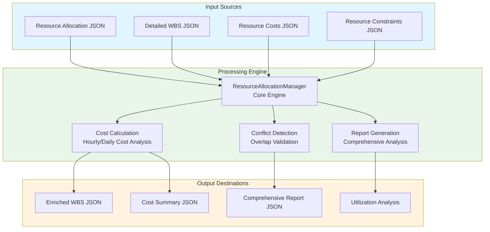

# Resource Allocation Manager Module Documentation

## Level 1: Executive Overview

### Module Purpose and Functionality
The `resource_allocation_manager` module provides a sophisticated system for managing and optimizing resource allocation within the AutoProjectManagement framework. It handles comprehensive resource allocation, cost tracking, conflict detection, and detailed reporting capabilities.

### Business Value
This module enables organizations to efficiently allocate resources, calculate detailed costs, detect allocation conflicts, and generate comprehensive reports. By providing advanced resource management capabilities, it helps optimize resource utilization and minimize project costs.

---

## Level 2: Technical Architecture

### System Integration Architecture


### Class Hierarchy and Relationships
```mermaid
classDiagram
    class ResourceType {
        <<enumeration>>
        HUMAN
        EQUIPMENT
        MATERIAL
        SOFTWARE
        FACILITY
    }
    
    class AllocationStatus {
        <<enumeration>>
        PLANNED
        ACTIVE
        COMPLETED
        CANCELLED
        ON_HOLD
    }
    
    class ResourceCost {
        +resource_id: str
        +resource_name: str
        +resource_type: ResourceType
        +hourly_cost: float
        +daily_cost: float
        +currency: str
        +effective_date: Optional[str]
        +expiry_date: Optional[str]
    }
    
    class ResourceAllocation {
        +task_id: str
        +resource_id: str
        +allocation_percent: float
        +start_date: str
        +end_date: str
        +status: AllocationStatus
        +notes: Optional[str]
        +calculated_cost: Optional[float]
    }
    
    class ResourceAllocationManager {
