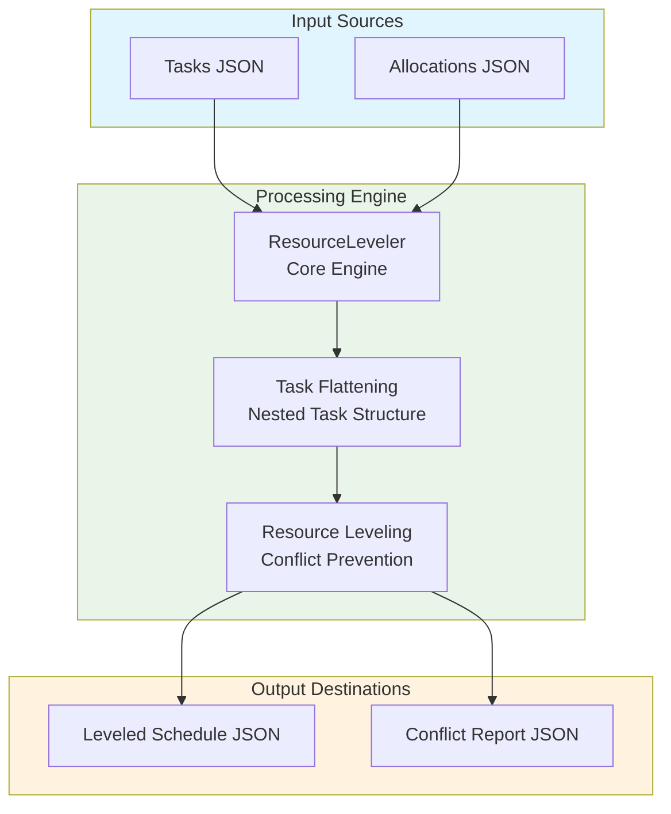
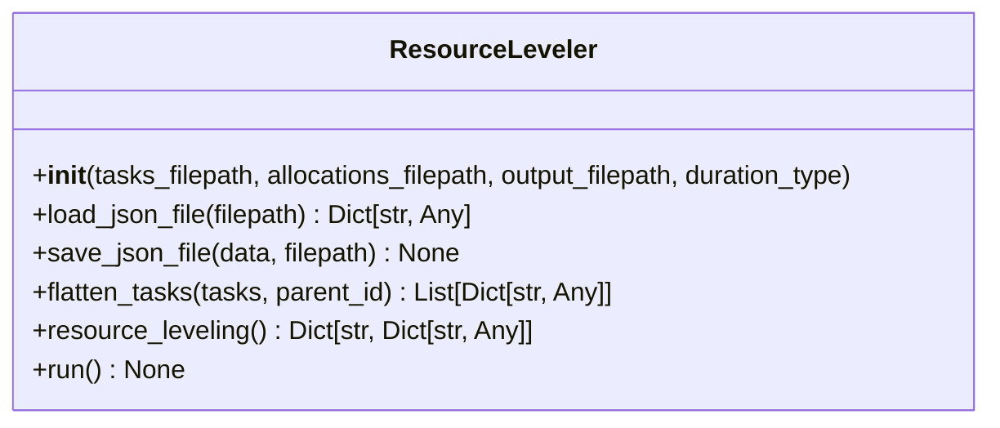

# Resource Leveling Module Documentation

## Level 1: Executive Overview

### Module Purpose and Functionality
The `resource_leveling` module provides a sophisticated system for optimizing resource allocation schedules within the AutoProjectManagement framework. It focuses on preventing resource conflicts by adjusting task start times and ensuring efficient resource utilization.

### Business Value
This module enables project teams to effectively manage resource allocation, prevent scheduling conflicts, and optimize task execution timelines. By providing insights into resource leveling, it helps organizations maximize productivity and minimize project delays.

---

## Level 2: Technical Architecture

### System Integration Architecture

### Class Hierarchy and Relationships

