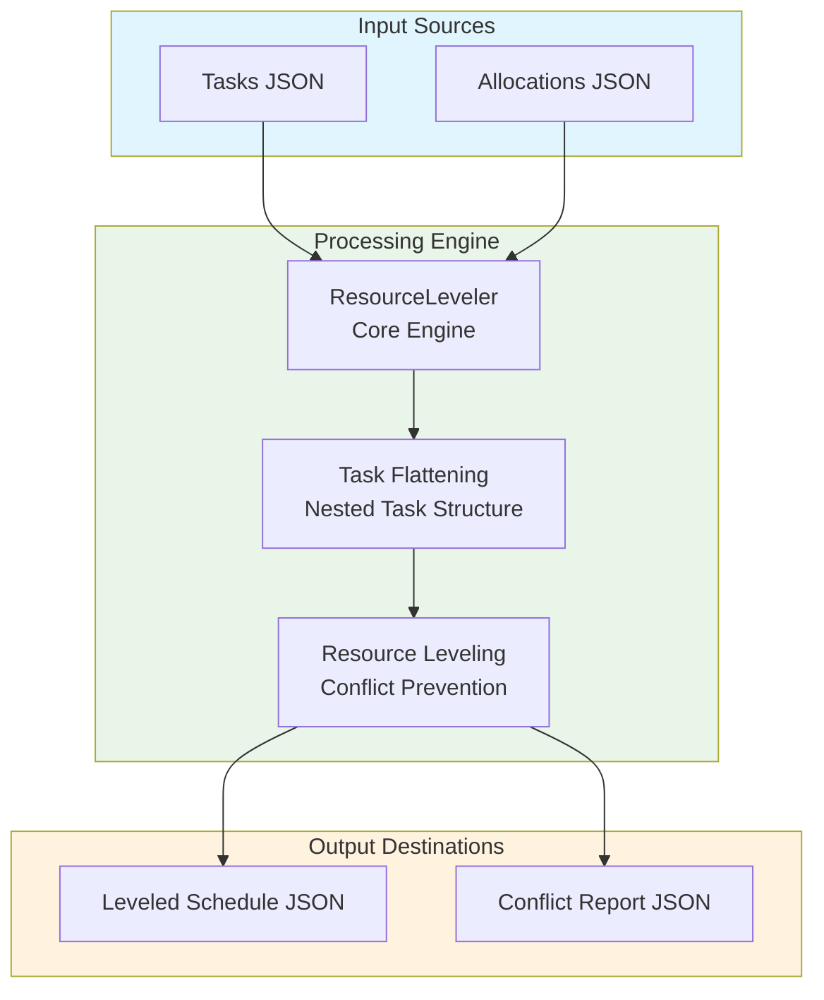
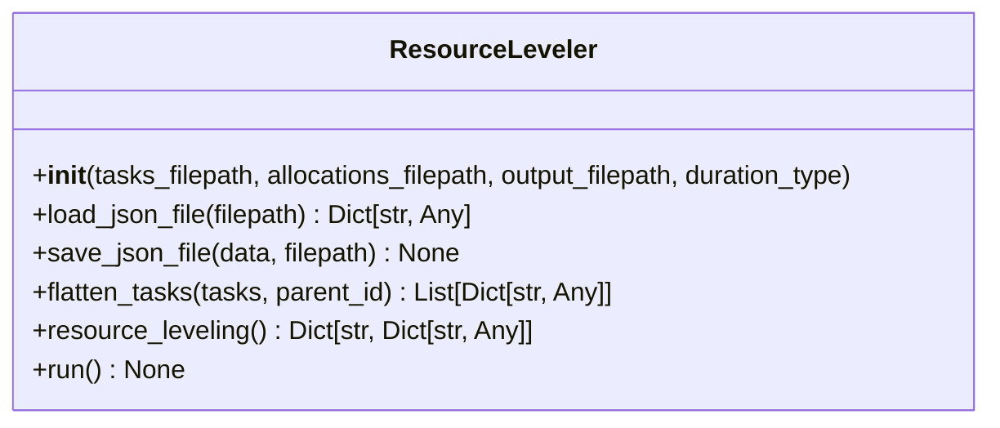
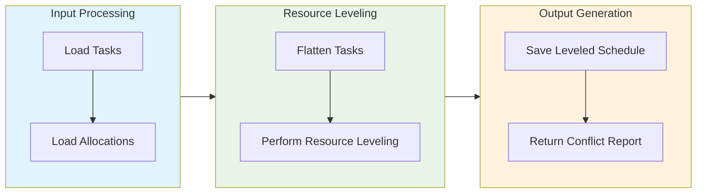

# Resource Leveling Module Documentation

## Level 1: Executive Overview

### Module Purpose and Functionality
The `resource_leveling` module provides a sophisticated system for optimizing resource allocation schedules within the AutoProjectManagement framework. It focuses on preventing resource conflicts by adjusting task start times and ensuring efficient resource utilization.

### Business Value
This module enables project teams to effectively manage resource allocation, prevent scheduling conflicts, and optimize task execution timelines. By providing insights into resource leveling, it helps organizations maximize productivity and minimize project delays.

---

## Level 2: Technical Architecture

### System Integration Architecture


### Class Hierarchy and Relationships


### Data Flow Architecture


---

## Level 3: Detailed Implementation

### Core Class: ResourceLeveler
```python
class ResourceLeveler:
    """
    A class to handle resource leveling for project tasks.
    
    This class loads task and allocation data, flattens nested task structures,
    and performs resource leveling to prevent resource conflicts.
    """
    
    def __init__(self, tasks_filepath: str, allocations_filepath: str, 
                 output_filepath: str, duration_type: str = 'normal') -> None:
        """
        Initialize the ResourceLeveler with file paths and configuration.
        
        Args:
            tasks_filepath: Path to the tasks JSON file
            allocations_filepath: Path to the allocations JSON file
            output_filepath: Path where the leveled schedule will be saved
            duration_type: Type of duration to use ('optimistic', 'normal', 'pessimistic')
        """
```

### Resource Leveling Algorithm
```python
def resource_leveling(self) -> Dict[str, Dict[str, Any]]:
    """
    Perform resource leveling to prevent resource conflicts.
    
    This algorithm ensures that tasks assigned to the same resource
