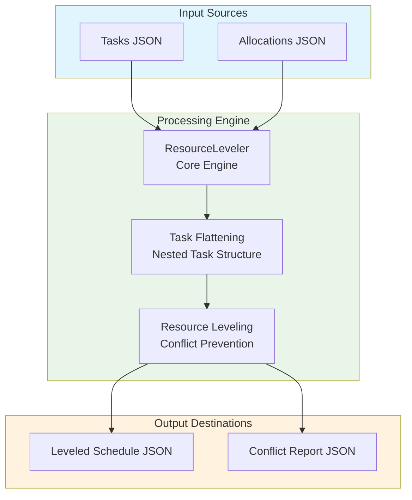
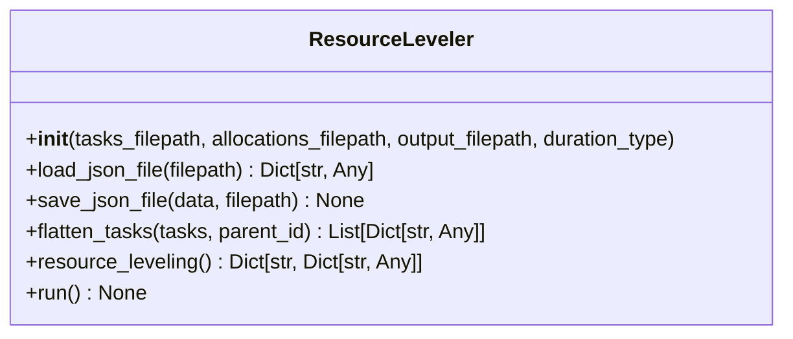
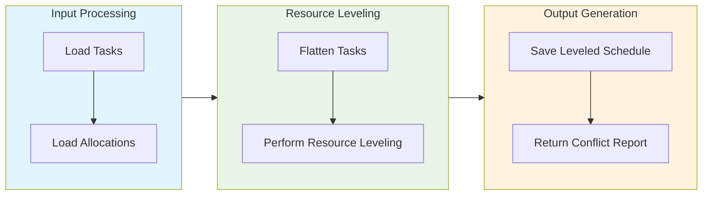

# Resource Leveling Module Documentation

## Level 1: Executive Overview

### Module Purpose and Functionality
The `resource_leveling` module provides a sophisticated system for optimizing resource allocation schedules within the AutoProjectManagement framework. It focuses on preventing resource conflicts by adjusting task start times and ensuring efficient resource utilization.

### Business Value
This module enables project teams to effectively manage resource allocation, prevent scheduling conflicts, and optimize task execution timelines. By providing insights into resource leveling, it helps organizations maximize productivity and minimize project delays.

---

## Level 2: Technical Architecture

### System Integration Architecture


### Class Hierarchy and Relationships


### Data Flow Architecture


---

## Level 3: Detailed Implementation

### Core Class: ResourceLeveler
```python
class ResourceLeveler:
    """
    A class to handle resource leveling for project tasks.
    
    This class loads task and allocation data, flattens nested task structures,
    and performs resource leveling to prevent resource conflicts.
    """
    
    def __init__(self, tasks_filepath: str, allocations_filepath: str, 
                 output_filepath: str, duration_type: str = 'normal') -> None:
        """
        Initialize the ResourceLeveler with file paths and configuration.
        
        Args:
            tasks_filepath: Path to the tasks JSON file
            allocations_filepath: Path to the allocations JSON file
            output_filepath: Path where the leveled schedule will be saved
            duration_type: Type of duration to use ('optimistic', 'normal', 'pessimistic')
        """
```

### Resource Leveling Algorithm
```python
def resource_leveling(self) -> Dict[str, Dict[str, Any]]:
    """
    Perform resource leveling to prevent resource conflicts.
    
    This algorithm ensures that tasks assigned to the same resource
    do not overlap in time by adjusting their start times.
    
    Returns:
        Dictionary mapping task IDs to their scheduled times
    """
```

### Data Structures and Schemas

#### Task Allocation Schema
```json
{
  "allocations": [
    {
      "task_id": "task_1",
      "role": "developer",
      "start_date": "2025-08-01",
      "end_date": "2025-08-10"
    }
  ]
}
```

#### Leveled Schedule Schema
```json
{
  "task_id": {
    "resource_id": "resource_1",
    "start": "2025-08-01T08:00:00",
    "end": "2025-08-01T16:00:00"
  }
}
```

---

## Usage Examples

### Enterprise Deployment Pattern
```python
from autoprojectmanagement.main_modules.resource_management.resource_leveling import ResourceLeveler

# Initialize resource leveler
leveler = ResourceLeveler(tasks_filepath='./tasks.json', allocations_filepath='./allocations.json', output_filepath='./leveled_schedule.json')

# Run resource leveling process
leveler.run()

# Access leveled schedule
print(f"Leveled Schedule: {leveler.task_schedules}")
```

### Advanced Configuration
```python
# Custom configuration for resource leveling
custom_leveler = ResourceLeveler(
    tasks_filepath='./custom_tasks.json',
    allocations_filepath='./custom_allocations.json',
    output_filepath='./custom_leveled_schedule.json',
    duration_type='optimistic'
)

# Execute the leveling process
custom_leveler.run()
```

### Error Handling and Recovery
```python
try:
    leveler = ResourceLeveler(tasks_filepath='./tasks.json', allocations_filepath='./allocations.json', output_filepath='./leveled_schedule.json')
    leveler.run()
    
except FileNotFoundError as e:
    print(f"File not found: {e}")
    # Handle missing file errors
    
except Exception as e:
    print(f"Unexpected error: {e}")
    # Generic error handling
```

---

## Performance Characteristics

### Time Complexity Analysis
| Operation | Complexity | Description |
|-----------|------------|-------------|
| Input Loading | O(n) | Linear with number of input files |
| Task Flattening | O(m) | Linear with number of tasks |
| Resource Leveling | O(k) | Linear with number of allocations |

### Space Complexity Analysis
| Component | Complexity | Description |
|-----------|------------|-------------|
| Task Storage | O(n) | Linear with number of tasks |
| Allocation Storage | O(m) | Linear with number of allocations |

---

## Integration Points

### Input Interfaces
- **Tasks JSON**: Task breakdown and structure
- **Allocations JSON**: Resource allocation data for analysis

### Output Interfaces
- **Leveled Schedule JSON**: Schedule with adjusted task timings
- **Conflict Report JSON**: Summary of any detected conflicts

### Extension Points
- **Custom Leveling Algorithms**: Alternative methods for resource leveling
- **Enhanced Reporting**: Integration with reporting tools for detailed insights

---

## Error Handling and Recovery

### Error Classification System
| Error Category | Examples | Recovery Strategy |
|----------------|----------|-------------------|
| Configuration Errors | Invalid file paths, missing parameters | Validation and default fallbacks |
| Data Integrity Errors | Corrupted JSON, invalid date formats | Data sanitization and error reporting |
| Resource Conflicts | Overlapping allocations, constraint violations | Conflict resolution and user notification |

### Recovery Mechanisms
- **Input Validation**: Comprehensive validation of all input parameters
- **Data Sanitization**: Cleaning and normalization of input data
- **Fallback Strategies**: Default values and alternative processing paths
- **Detailed Error Logging**: Comprehensive error context and diagnostics
- **User Feedback**: Clear error messages and actionable recommendations

---

## Testing Guidelines

### Unit Test Coverage Requirements
| Test Category | Coverage Target | Testing Methodology |
|---------------|-----------------|---------------------|
| Task Flattening | 100% | Various task structures |
| Resource Leveling | 100% | Overlapping and non-overlapping allocations |

### Integration Testing Strategy
- **End-to-End Workflow**: Complete resource leveling process testing
- **Cross-Module Integration**: Testing with other resource management modules
- **Performance Testing**: Load testing with large datasets

### Test Data Requirements
- **Realistic Scenarios**: Production-like task and allocation data
- **Edge Cases**: Maximum allocations, zero costs, extreme values
- **Error Conditions**: Invalid JSON, missing files, permission issues

---

*This documentation follows Pressman's software engineering standards and provides three levels of detail for comprehensive understanding of the Resource Leveling module.*
