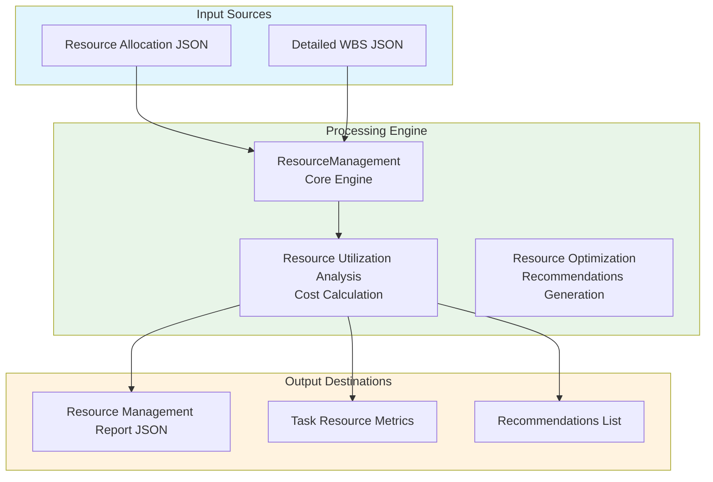
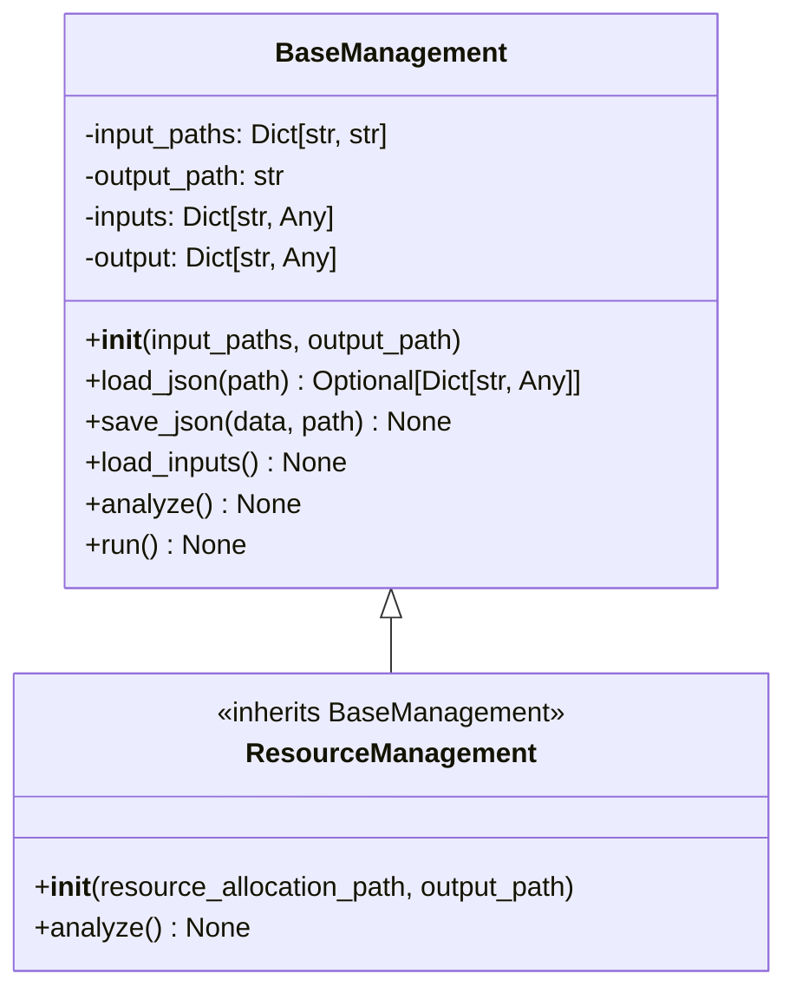
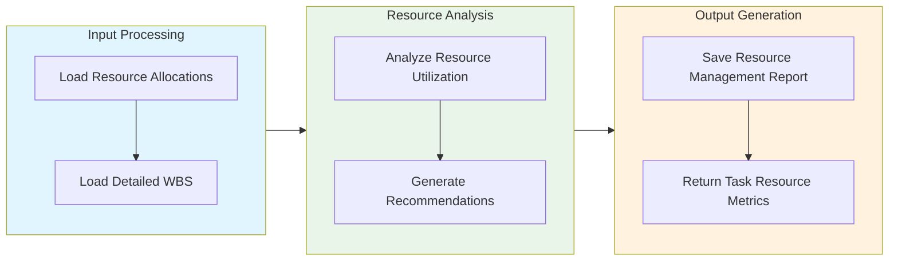

# Resource Management Module Documentation

## Level 1: Executive Overview

### Module Purpose and Functionality
The `resource_management` module provides a comprehensive system for managing resources within the AutoProjectManagement framework. It focuses on resource allocation, utilization, and optimization, ensuring that resources are effectively managed to meet project demands.

### Business Value
This module enables project teams to efficiently allocate resources, track utilization, and optimize resource management processes. By providing insights into resource allocation and performance, it helps organizations maximize productivity and minimize costs.

---

## Level 2: Technical Architecture

### System Integration Architecture


### Class Hierarchy and Relationships


### Data Flow Architecture


---

## Level 3: Detailed Implementation

### Core Class: ResourceManagement
```python
class ResourceManagement(BaseManagement):
    """
    Resource management system for analyzing and optimizing resource allocation.
    
    This class implements comprehensive resource management based on detailed WBS
    and resource allocation data, providing metrics and recommendations for improvement.
    """
    
    def __init__(self,
                 resource_allocation_path: str = 'JSonDataBase/Inputs/UserInputs/resource_allocation.json',
                 output_path: str = 'JSonDataBase/OutPuts/resource_management.json') -> None:
        """
        Initialize the resource management system.
        
        Args:
            resource_allocation_path: Path to resource allocation JSON file
            output_path: Path where resource management results will be saved
        """
```

### Resource Utilization Analysis
```python
def analyze(self) -> None:
    """
    Analyze resource utilization and generate reports.
    
    This method processes resource allocation data and generates insights
    into resource utilization, costs, and recommendations for optimization.
    """
```

### Recommendations Generation
```python
def generate_recommendations(self) -> List[str]:
    """
