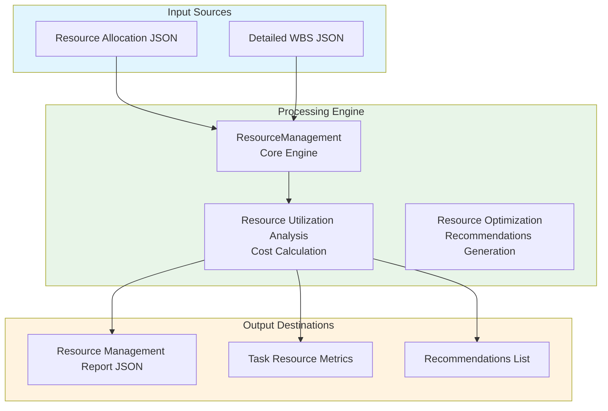

# Resource Management Module Documentation

## Level 1: Executive Overview

### Module Purpose and Functionality
The `resource_management` module provides a comprehensive system for managing resources within the AutoProjectManagement framework. It focuses on resource allocation, utilization, and optimization, ensuring that resources are effectively managed to meet project demands.

### Business Value
This module enables project teams to efficiently allocate resources, track utilization, and optimize resource management processes. By providing insights into resource allocation and performance, it helps organizations maximize productivity and minimize costs.

---

## Level 2: Technical Architecture

### System Integration Architecture


### Class Hierarchy and Relationships
```mermaid
classDiagram
    class BaseManagement {
        -input_paths: Dict[str, str]
        -output_path: str
