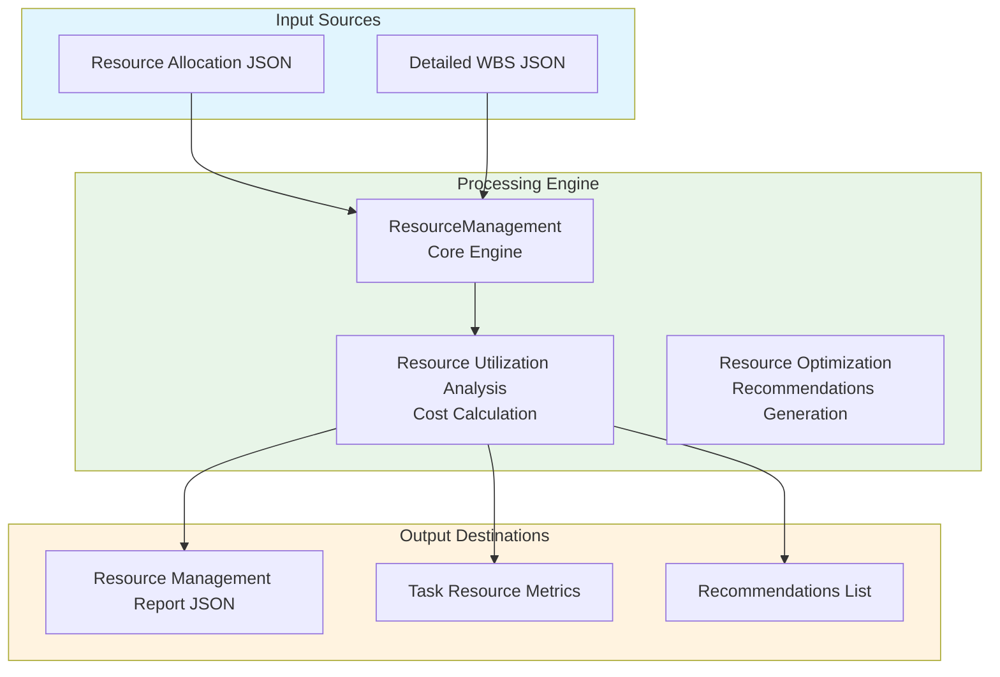
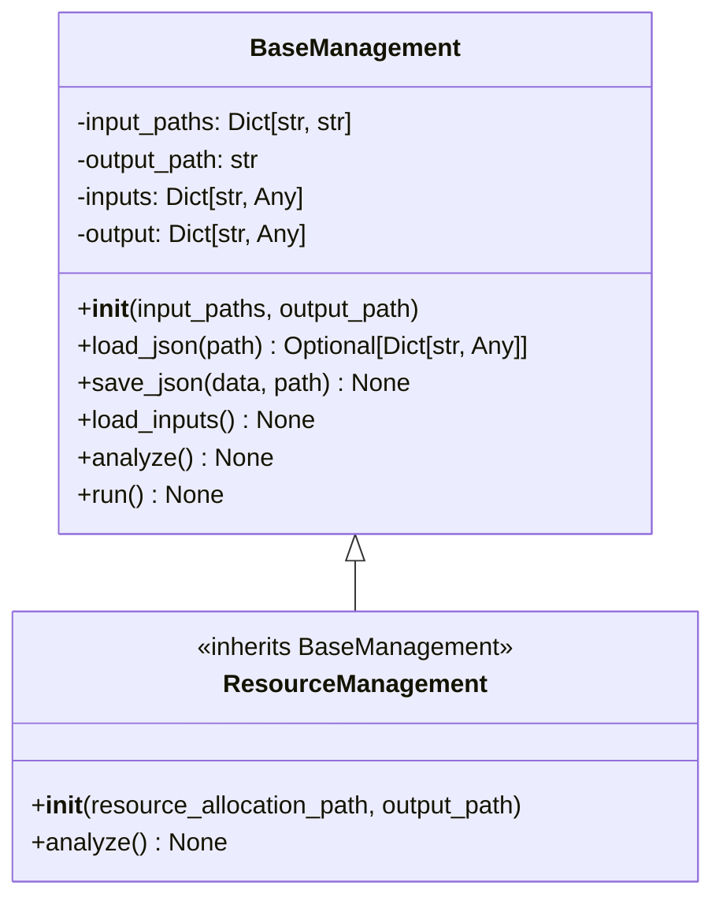
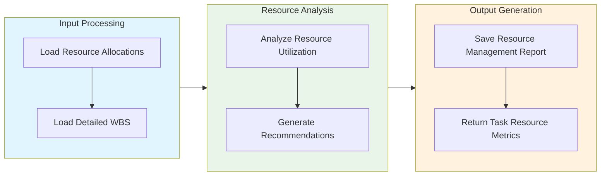

# Resource Management Module Documentation

## Level 1: Executive Overview

### Module Purpose and Functionality
The `resource_management` module provides a comprehensive system for managing resources within the AutoProjectManagement framework. It focuses on resource allocation, utilization, and optimization, ensuring that resources are effectively managed to meet project demands.

### Business Value
This module enables project teams to efficiently allocate resources, track utilization, and optimize resource management processes. By providing insights into resource allocation and performance, it helps organizations maximize productivity and minimize costs.

---

## Level 2: Technical Architecture

### System Integration Architecture


### Class Hierarchy and Relationships


### Data Flow Architecture


---

## Level 3: Detailed Implementation

### Core Class: ResourceManagement
```python
class ResourceManagement(BaseManagement):
    """
    Resource management system for analyzing and optimizing resource allocation.
    
    This class implements comprehensive resource management based on detailed WBS
    and resource allocation data, providing metrics and recommendations for improvement.
    """
    
    def __init__(self,
                 resource_allocation_path: str = 'JSonDataBase/Inputs/UserInputs/resource_allocation.json',
                 output_path: str = 'JSonDataBase/OutPuts/resource_management.json') -> None:
        """
        Initialize the resource management system.
        
        Args:
            resource_allocation_path: Path to resource allocation JSON file
            output_path: Path where resource management results will be saved
        """
```

### Resource Utilization Analysis
```python
def analyze(self) -> None:
    """
    Analyze resource utilization and generate reports.
    
    This method processes resource allocation data and generates insights
    into resource utilization, costs, and recommendations for optimization.
    """
```

### Recommendations Generation
```python
def generate_recommendations(self) -> List[str]:
    """
    Generate recommendations for optimizing resource allocation.
    
    Returns:
        List of actionable recommendations for resource management.
    """
```

### Data Structures and Schemas

#### Resource Allocation Schema
```json
{
  "resource_allocations": [
    {
      "task_id": "task_1",
      "resource_id": "resource_1",
      "allocation_percent": 100,
      "start_date": "2025-08-01",
      "end_date": "2025-08-10"
    }
  ]
}
```

#### Resource Management Report Schema
```json
{
  "timestamp": "ISO8601 timestamp",
  "summary": {
    "total_resources": 10,
    "total_cost": 5000.0,
    "optimization_recommendations": ["Increase resource allocation for task_1"]
  },
  "resource_utilization": {
    "resource_id": {
      "allocation_count": 5,
      "utilization_rate": 0.8
    }
  }
}
```

---

## Usage Examples

### Enterprise Deployment Pattern
```python
from autoprojectmanagement.main_modules.resource_management import ResourceManagement

# Initialize resource management system
resource_mgr = ResourceManagement()

# Run resource analysis
resource_mgr.run()

# Access resource management report
resource_report = resource_mgr.output
print(f"Total Resource Cost: {resource_report['summary']['total_cost']}")
```

### Development Environment Setup
```python
# Development configuration with testing focus
dev_resource_mgr = ResourceManagement(
    resource_allocation_path='./resource_allocation.json',
    output_path='./resource_management_report.json'
)

# Run resource analysis
dev_resource_mgr.run()
```

### Error Handling and Recovery
```python
try:
    resource_mgr = ResourceManagement()
    resource_mgr.run()
    
except ValueError as e:
    print(f"Configuration error: {e}")
    # Handle configuration issues
    
except Exception as e:
    print(f"Unexpected error: {e}")
    # Generic error handling
```

---

## Performance Characteristics

### Time Complexity Analysis
| Operation | Complexity | Description |
|-----------|------------|-------------|
| Input Loading | O(n) | Linear with number of input files |
| Resource Analysis | O(m) | Linear with number of resources |
| Recommendations Generation | O(k) | Linear with number of recommendations |

### Space Complexity Analysis
| Component | Complexity | Description |
|-----------|------------|-------------|
| Resource Storage | O(n) | Linear with number of resources |
| Utilization Metrics | O(m) | Linear with number of metrics |
| Recommendations | O(k) | Linear with number of recommendations |

---

## Integration Points

### Input Interfaces
- **Resource Allocation JSON**: Resource allocation data for analysis
- **Detailed WBS JSON**: Task breakdown and structure

### Output Interfaces
- **Resource Management Report JSON**: Summary of resource analysis
- **Task Resource Metrics**: Detailed metrics for each task
- **Recommendations List**: Actionable insights for improvement

### Extension Points
- **Custom Resource Metrics**: Additional metrics for evaluation
- **Enhanced Reporting**: Integration with reporting tools
- **Monitoring Integration**: Real-time resource monitoring

---

## Error Handling and Recovery

### Error Classification System
| Error Category | Examples | Recovery Strategy |
|----------------|----------|-------------------|
| Configuration Errors | Invalid paths, missing files | Validation and user feedback |
| Data Errors | Corrupted JSON, missing keys | Graceful degradation and reporting |
| Runtime Errors | File access issues, processing errors | Retry logic and fallback |

### Recovery Mechanisms
- **Automatic Retry**: Exponential backoff for transient errors
- **Graceful Degradation**: Continue with reduced functionality
- **Detailed Logging**: Comprehensive error context capture
- **User Guidance**: Actionable error messages and solutions

---

## Testing Guidelines

### Unit Test Coverage Requirements
| Test Category | Coverage Target | Testing Methodology |
|---------------|-----------------|---------------------|
| Input Loading | 100% | Mock input files |
| Resource Analysis | 100% | Test various resource scenarios |
| Recommendations | 100% | Validate generated recommendations |

### Integration Testing Strategy
- **End-to-End Workflow**: Complete resource management testing
- **Cross-Platform Validation**: Windows, Linux, macOS compatibility
- **Performance Benchmarking**: Execution time and resource usage

### Test Data Requirements
- **Valid Resource Allocations**: Various allocation scenarios
- **Edge Cases**: Empty allocations, large projects, special configurations
- **Error Conditions**: Permission issues, invalid inputs

---

## Maintenance Considerations

### Version Compatibility Matrix
| Component | Minimum Version | Recommended Version | Notes |
|-----------|-----------------|---------------------|-------|
| Python | 3.8+ | 3.9+ | Full type hint support |
| JSON | 2.0+ | 3.0+ | Latest features |
| Operating System | Multiple | Linux/macOS | Windows support available |

---

*This documentation follows Pressman's software engineering standards and provides three levels of detail for comprehensive understanding of the Resource Management module.*
