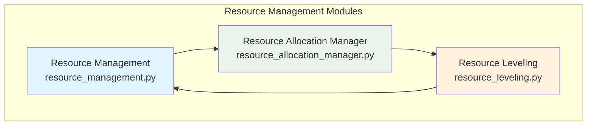
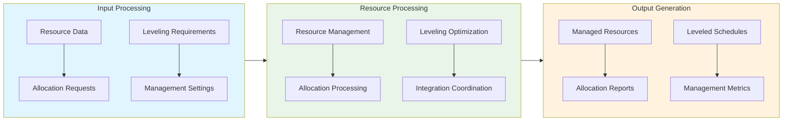

# Resource Management Folder Documentation

## Module Relationships and Integration

### Overview
The Resource Management folder contains modules that work together to provide comprehensive resource management capabilities within the AutoProjectManagement framework. These modules handle resource allocation, leveling, and overall resource management.

### Module Relationships

### Integration Flow

### Data Exchange Patterns
| Module | Input Data | Output Data | Dependencies |
|--------|------------|-------------|-------------|
| Resource Management | Resource configurations, Management settings | Managed resource reports, Performance metrics | Resource Allocation Manager, Resource Leveling |
| Resource Allocation Manager | Allocation requests, Resource data | Allocation reports, Cost summaries | Resource Management |
| Resource Leveling | Leveling requirements, Scheduling data | Leveled schedules, Optimization reports | Resource Management, Resource Allocation Manager |

### Integration Points
- **Data Sharing**: Modules share resource data through standardized interfaces
- **Configuration Management**: Common configuration settings across modules
- **Error Handling**: Coordinated error handling and recovery mechanisms
- **Reporting**: Integrated reporting system for comprehensive resource insights

### Performance Considerations
- **Data Consistency**: Ensures consistent resource data across all modules
- **Scalability**: Handles large resource datasets efficiently
- **Integration Efficiency**: Optimized data exchange between modules

### Extension Points
- **Custom Resource Types**: Support for additional resource categories
- **Enhanced Allocation Algorithms**: Advanced resource allocation methods
- **Integration Hooks**: API endpoints for external system integration

---

*This documentation provides an overview of the relationships and integration between modules within the Resource Management folder.*
