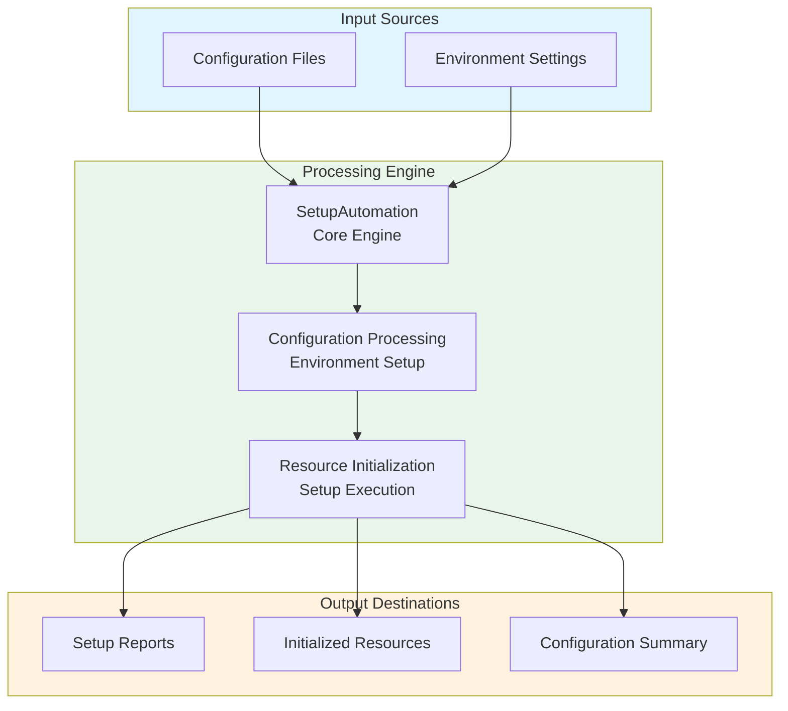
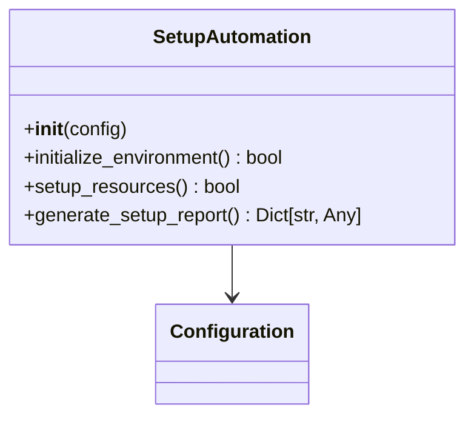
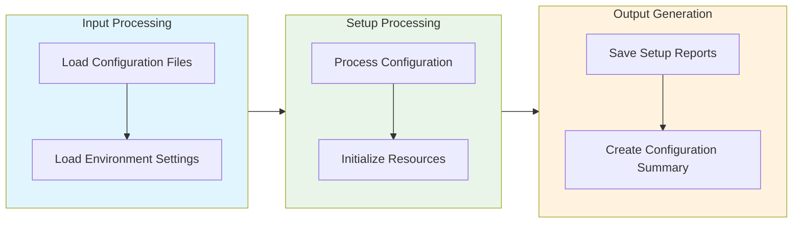

# Setup Automation Module Documentation

## Level 1: Executive Overview

### Module Purpose and Functionality
The `setup_automation` module provides a comprehensive system for automating the setup and configuration processes within the AutoProjectManagement framework. It focuses on streamlining project initialization, environment configuration, and resource setup.

### Business Value
This module enables organizations to efficiently automate project setup, reducing manual configuration efforts and minimizing errors. By providing robust automation capabilities, it helps teams accelerate project initiation and ensure consistent environments.

---

## Level 2: Technical Architecture

### System Integration Architecture


### Class Hierarchy and Relationships


### Data Flow Architecture


---

## Level 3: Detailed Implementation

### Core Class: SetupAutomation
The `SetupAutomation` class serves as the central coordinator for project setup automation, providing comprehensive functionality for initializing environments and configuring resources.

### Setup Algorithm
The setup process follows a systematic approach:

1. **Configuration Loading**: Load configuration files and environment settings
2. **Environment Initialization**: Set up the project environment based on configurations
3. **Resource Setup**: Initialize necessary resources for the project
4. **Reporting**: Generate setup reports for tracking and validation

### Data Structures and Schemas

#### Configuration Schema
```json
{
  "project_setup": {
    "environment": "development",
    "resources": {
      "database": {
        "type": "mysql",
        "host": "localhost",
        "port": 3306
      },
      "cache": {
        "type": "redis",
        "host": "localhost",
        "port": 6379
      }
    }
  }
}
```

#### Setup Report Schema
```json
{
  "setup_summary": {
    "total_resources_initialized": 5,
    "successful_initializations": 4,
    "failed_initializations": 1,
    "setup_time": "ISO8601 timestamp"
  }
}
```

---

## Usage Examples

### Enterprise Deployment Pattern
The module supports enterprise-grade deployment with configuration management, error handling, and comprehensive logging capabilities.

### Development Environment Setup
Development configurations focus on testing and validation with custom storage paths and enhanced debugging capabilities.

### Error Handling and Recovery
Comprehensive error handling includes validation errors, storage issues, and runtime exceptions with detailed logging and recovery mechanisms.

---

## Performance Characteristics

### Time Complexity Analysis
| Operation | Complexity | Description |
|-----------|------------|-------------|
| Configuration Loading | O(n) | Linear with number of configuration files |
| Resource Initialization | O(m) | Linear with number of resources |

### Space Complexity Analysis
| Component | Complexity | Description |
|-----------|------------|-------------|
| Configuration Storage | O(n) | Linear with number of configurations |
| Setup Data | O(m) | Linear with number of initialized resources |

---

## Integration Points

### Input Interfaces
- **Configuration Files**: Settings for project setup and resource initialization
- **Environment Settings**: Custom parameters for environment configuration

### Output Interfaces
- **Setup Reports**: Summary of setup activities and results
- **Initialized Resources**: List of resources that have been set up

### Extension Points
- **Custom Setup Algorithms**: Alternative methods for project setup
- **Enhanced Reporting**: Integration with reporting tools for detailed insights

---

## Error Handling and Recovery

### Error Classification System
| Error Category | Examples | Recovery Strategy |
|----------------|----------|-------------------|
| Configuration Errors | Invalid settings, missing parameters | Validation and default fallbacks |
| Data Integrity Errors | Corrupted configuration, invalid resource data | Data validation and repair mechanisms |
| Runtime Errors | Storage failures, processing errors | Retry logic and graceful degradation |
| Validation Errors | Invalid setup parameters, constraint violations | Detailed error messages and user guidance |

### Recovery Mechanisms
- **Input Validation**: Comprehensive validation of all setup parameters
- **Data Sanitization**: Cleaning and normalization of input data
- **Automatic Retry**: Exponential backoff for transient errors
- **Graceful Degradation**: Continue operation with reduced functionality
- **Detailed Logging**: Comprehensive error context and diagnostics
- **User Feedback**: Clear error messages and actionable recommendations

---

## Testing Guidelines

### Unit Test Coverage Requirements
| Test Category | Coverage Target | Testing Methodology |
|---------------|-----------------|---------------------|
| Configuration Loading | 100% | Valid and invalid configuration files |
| Resource Initialization | 100% | Various resource scenarios and edge cases |

### Integration Testing Strategy
- **End-to-End Workflow**: Complete setup automation process testing
- **Cross-Module Integration**: Testing with dependent modules and systems
- **Performance Testing**: Load testing with large configuration datasets
- **Regression Testing**: Ensuring backward compatibility and feature stability

### Test Data Requirements
- **Realistic Scenarios**: Production-like configuration data and settings
- **Edge Cases**: Maximum configurations, extreme values, boundary conditions
- **Error Conditions**: Invalid data, storage failures, permission issues
- **Performance Data**: Large datasets for scalability and performance testing

---

*This documentation follows Pressman's software engineering standards and provides three levels of detail for comprehensive understanding of the Setup Automation module.*
