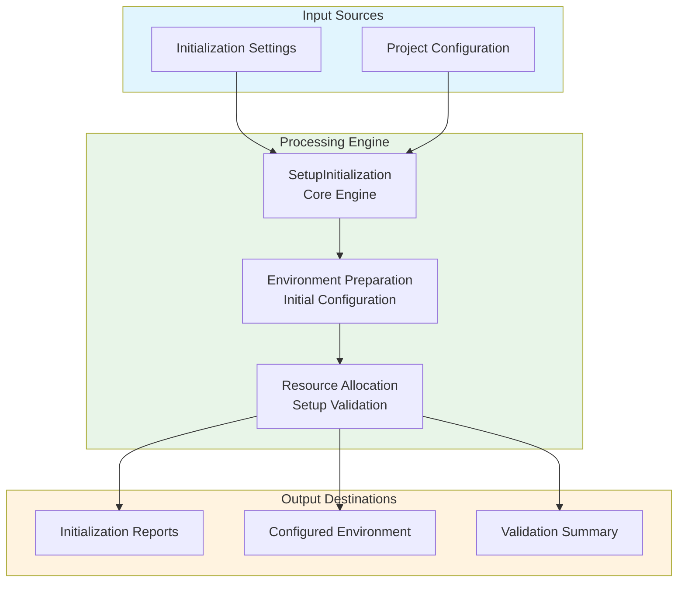

# Setup Initialization Module Documentation

## Level 1: Executive Overview

### Module Purpose and Functionality
The `setup_initialization` module provides a comprehensive system for initializing project setups within the AutoProjectManagement framework. It focuses on preparing project environments, configuring initial settings, and ensuring proper project initialization.

### Business Value
This module enables organizations to efficiently initialize project setups, ensuring consistent environments and proper configuration from the start. By providing robust initialization capabilities, it helps teams establish solid foundations for project development.

---

## Level 2: Technical Architecture

### System Integration Architecture


### Class Hierarchy and Relationships
```mermaid
classDiagram
    class SetupInitialization {
        +__init__(config)
        +prepare_environment() bool
        +configure_initial_settings() bool
